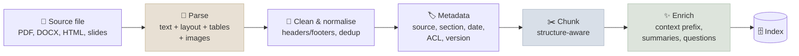

# Document Processing & Chunking

Before anything can be retrieved, documents must be parsed into clean text with structure and metadata, and split into chunks small enough to retrieve precisely yet complete enough to answer from - decisions that set the ceiling on retrieval quality.

```objectives
time: 55 min
outcomes:
  - Choose a parsing approach for PDFs, scanned documents, HTML, tables and slides, and explain what layout-aware parsing preserves
  - Compare fixed, recursive, structure-aware and semantic chunking, and pick a starting chunk size to tune on an eval
  - Implement parent-child retrieval and contextual retrieval, and explain the problem each solves
  - Explain late chunking and when it helps
  - Design the metadata captured at ingest for filtering, citation and access control
prerequisites:
  - "[Embeddings & Vector Search](02-Embeddings-and-Vector-Search.mdx)"
```



## Parsing: Garbage In, Garbage Retrieved

Many "retrieval failures" are parsing failures: a table flattened into a word salad, two-column text interleaved line by line, headers and footers repeated in every chunk, a scanned page with no text at all.

| Content | Approach |
|---|---|
| Digital PDFs with simple layout | Text extraction (PyMuPDF / `pymupdf4llm` to Markdown) |
| Complex layouts, multi-column, tables | Layout-aware parsers: Docling, Unstructured, Marker, or cloud services (Google Document AI layout parser, Amazon Textract, Azure Document Intelligence) |
| Scanned documents | OCR - increasingly with vision-language models that output Markdown directly |
| Tables | Keep them whole; serialise as Markdown or HTML with headers; for large tables, store rows in a database and let the model query it |
| Figures and charts | Caption them with a vision model and index the caption, or retrieve page images directly (ColPali, see [Advanced RAG Patterns](07-Advanced-RAG-Patterns.mdx)) |
| HTML | Extract the main content (e.g. Trafilatura), keep heading structure |
| Code | Parse by syntax (functions, classes) rather than characters |

Output **Markdown with headings preserved** where you can: it keeps the document's structure available for chunking and for the model. Spot-check parsed output for every new document type before indexing it - a five-minute look catches most problems.

---

## Chunking Strategies

| Strategy | How | Good for | Watch out for |
|---|---|---|---|
| **Fixed-size (tokens)** | Every N tokens with overlap | Baselines; uniform text | Splits mid-sentence and mid-table |
| **Recursive** | Split on paragraphs, then lines, then sentences, then words until chunks fit | A strong general default | Ignores document semantics beyond separators |
| **Structure-aware** | Split on headings, sections, list items, code units; carry the heading path as metadata | Docs, manuals, policies, code | Very long sections need a secondary split |
| **Semantic** | Embed sentences and split where similarity between neighbours drops | Long unstructured prose | Extra cost; studies find no consistent gain over simpler methods |
| **Document-level** | Whole short documents (FAQ entries, tickets) | Naturally small units | Long documents exceed embedding limits |

```python
from langchain_text_splitters import MarkdownHeaderTextSplitter, RecursiveCharacterTextSplitter

# 1. Split on structure, keeping the heading path as metadata
by_section = MarkdownHeaderTextSplitter(
    headers_to_split_on=[("#", "h1"), ("##", "h2"), ("###", "h3")]
).split_text(markdown_doc)

# 2. Split long sections by tokens (measured with a real tokenizer)
by_size = RecursiveCharacterTextSplitter.from_tiktoken_encoder(
    encoding_name="o200k_base", chunk_size=400, chunk_overlap=60
).split_documents(by_section)

for chunk in by_size:   # prepend the heading path so the chunk is self-describing
    path = " > ".join(v for k, v in chunk.metadata.items() if k.startswith("h"))
    chunk.page_content = f"{path}\n\n{chunk.page_content}"
```

**Starting point:** structure-aware splitting, then 256-512-token chunks with 10-20% overlap, and the section path prepended to each chunk. Then tune chunk size and overlap on your retrieval eval - optimal sizes differ between FAQ-style and narrative corpora. Evaluations by Chroma (2024) and Qu et al. (2024) found that semantic chunking does not reliably beat well-tuned recursive chunking, so don't pay for it by default.

---

## Decoupling Retrieval Units from Context Units

Small chunks retrieve precisely; large chunks give the model enough context. You can have both.

| Pattern | Index | Return to the model |
|---|---|---|
| **Parent-child (small-to-big)** | Small child chunks (~100-200 tokens) | Their parent section (~1,000-2,000 tokens) |
| **Sentence window** | Single sentences | The sentence ± a few neighbours |
| **Neighbour expansion** | Normal chunks | The hit plus its adjacent chunks (`chunk_id ± 1`) |
| **Multi-vector** | Several vectors per chunk: summary, hypothetical questions, full text | The full chunk |

```python
from langchain_classic.retrievers import ParentDocumentRetriever
from langchain_core.stores import InMemoryStore          # use Redis, a database or object storage in production
from langchain_text_splitters import RecursiveCharacterTextSplitter

retriever = ParentDocumentRetriever(
    vectorstore=vectorstore,                              # holds child-chunk embeddings
    docstore=InMemoryStore(),                             # holds parent text by id
    child_splitter=RecursiveCharacterTextSplitter(chunk_size=400),
    parent_splitter=RecursiveCharacterTextSplitter(chunk_size=4000),
)
retriever.add_documents(docs)
parents = retriever.invoke("What is the notice period for termination?")
```

---

## Contextual Retrieval

A chunk like *"The company's revenue grew by 3% over the previous quarter"* is unretrievable for "ACME Q2 2025 revenue growth" - the chunk never says which company or quarter. **Contextual retrieval** (Anthropic, 2024) uses an LLM to write a short context for every chunk, drawn from the whole document, and prepends it before embedding *and* before BM25 indexing.

```python
CONTEXT_PROMPT = """<document>
{document}
</document>
Here is a chunk from the document:
<chunk>
{chunk}
</chunk>
Write a short (50-100 token) context that situates this chunk within the document,
to improve search retrieval of the chunk. Answer with the context only."""

def contextualize(document: str, chunks: list[str]) -> list[str]:
    # The document is the same for every chunk: put it first and cache it
    return [llm(CONTEXT_PROMPT.format(document=document, chunk=c)) + "\n\n" + c for c in chunks]
```

Reported results on Anthropic's evaluation (failure rate = 1 − recall@20):

| Configuration | Retrieval failure rate | Reduction |
|---|---|---|
| Embeddings only (baseline) | 5.7% | - |
| Contextual embeddings | 3.7% | 35% |
| Contextual embeddings + contextual BM25 | 2.9% | 49% |
| + reranking | 1.9% | 67% |

With prompt caching of the document, generating the contexts cost about $1 per million document tokens in their setup. It is an indexing-time cost, paid once per document version.

---

## Late Chunking

Standard chunking embeds each chunk in isolation, so pronouns and references to earlier text lose their antecedents. **Late chunking** (Günther et al., 2024) runs a long-context embedding model over the whole document (or a large window) first, then pools the token embeddings *within each chunk's span*, so every chunk vector is conditioned on the surrounding document. It needs a long-context embedding model and access to token-level outputs, costs no LLM calls, and helps most where chunks depend on earlier context. Contextual retrieval achieves a similar effect with an LLM; late chunking does it inside the embedding model.

---

## Metadata, Deduplication and Versions

Capture metadata at ingest - it is far harder to add later:

| Field | Used for |
|---|---|
| `source`, `url`, `page`, `section_path` | Citations and deep links |
| `doc_id`, `version`, `content_hash` | Updates, deletes, deduplication, reproducing old answers |
| `created_at`, `effective_date` | Freshness filters and conflict resolution ("latest policy wins") |
| `acl` / `allowed_groups`, `tenant_id` | Access control enforced at retrieval ([RAG in Production](11-RAG-in-Production.mdx)) |
| `doc_type`, `language`, `product` | Routing and filters |

Deduplicate exact copies by hash and near-duplicates (the same policy in five slide decks) with MinHash or embedding similarity - duplicates crowd out diverse evidence in the top-k. When a document changes, delete its old chunks by `doc_id` before inserting the new ones.

---

## Check Yourself

```quiz
- q: "A chunk reads 'Revenue grew 3% versus the prior quarter.' Queries about 'ACME Q2 revenue' never retrieve it. Which technique targets exactly this problem?"
  options:
    - "Contextual retrieval: prepend an LLM-written context naming the company and period before embedding and BM25 indexing"
    - "Increasing chunk overlap"
    - "Switching from cosine to dot product"
    - "Lowering the temperature"
  answer: 1
- q: "What does parent-child retrieval decouple?"
  options:
    - "The unit you search over (small chunks) from the unit you give the model (larger parents)"
    - "Dense from sparse retrieval"
    - "The embedding model from the LLM"
    - "Metadata from text"
  answer: 1
- q: "What is the best evidence-based default when choosing between semantic and recursive chunking?"
  options:
    - "Start with structure-aware recursive chunking and tune size on an eval; semantic chunking has not shown consistent gains"
    - "Always use semantic chunking - it is state of the art"
    - "Always use 1,000-character fixed chunks"
    - "Never overlap chunks"
  answer: 1
- q: "Why prepend the section heading path to each chunk?"
  answer: "It makes each chunk self-describing: the heading carries context (product, policy, section) that the chunk's own text may omit, which improves both embedding and keyword retrieval and gives the model context when the chunk is read in isolation."
```

## Exercises

```exercise
- title: Chunk-size sweep
  task: |
    Take 50-100 documents from your domain and 50 questions with labelled answer passages. Index with recursive chunking at 128, 256, 512 and 1,024 tokens (15% overlap) and measure recall@5 and nDCG@10. Then add the heading path to each chunk and repeat the best size.
  solution: |
    Expect an interior optimum (often 256-512 tokens) that depends on how your questions are phrased, and a measurable gain from heading paths on structured documents. Report the numbers with intervals - differences between neighbouring sizes are often small.
- title: Contextual retrieval, cheaply
  task: |
    Implement contextual retrieval for 20 long documents using a small, cheap model with prompt caching. Compare recall@20 for plain chunks vs contextualized chunks, for dense retrieval and for BM25. What did it cost per 1,000 chunks?
  hints: ["Place the document first in the prompt and mark it for caching so each chunk only pays for its own tokens."]
  solution: |
    Expect gains for both dense and BM25, larger for chunks that depend on document-level context (financial reports, contracts). With caching, cost is dominated by the per-chunk output tokens - a few cents per thousand chunks with a small model. Record the numbers; they justify (or don't) the indexing cost for your corpus.
```

## Study Notes

**Must-know:**
- Parsing quality bounds retrieval quality; use layout-aware parsers for complex PDFs, keep tables whole, caption or retrieve images
- Defaults: structure-aware split + 256-512-token recursive chunks, 10-20% overlap, heading path prepended; tune on an eval
- Semantic chunking isn't consistently better; don't pay for it by default
- Parent-child / sentence window / neighbour expansion decouple retrieval and context units
- Contextual retrieval: LLM-written chunk context before embedding and BM25; 35-67% fewer retrieval failures in Anthropic's tests
- Late chunking: embed the whole document, pool per chunk
- Capture metadata (source, version, dates, ACLs) at ingest; deduplicate; delete-then-insert on updates

## References

- Anthropic, [Introducing Contextual Retrieval](https://www.anthropic.com/news/contextual-retrieval) (2024)
- Günther et al., [Late Chunking: Contextual Chunk Embeddings Using Long-Context Embedding Models](https://arxiv.org/abs/2409.04701) (2024)
- Qu, Tu & Bao, [Is Semantic Chunking Worth the Computational Cost?](https://arxiv.org/abs/2410.13070) (2024)
- Smith & Troynikov, [Evaluating Chunking Strategies for Retrieval](https://research.trychroma.com/evaluating-chunking) (Chroma, 2024)
- Auer et al., [Docling Technical Report](https://arxiv.org/abs/2408.09869) (2024)
- LangChain, [Text splitters](https://python.langchain.com/docs/concepts/text_splitters/)

*Last reviewed: 2026-09*
