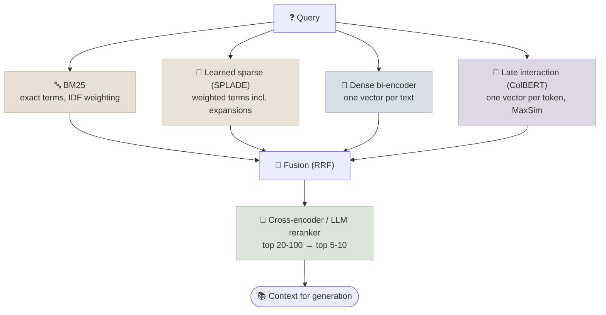

# Retrieval & Reranking

Retrieval finds candidate passages for a query - lexically (BM25), with learned sparse vectors (SPLADE), with dense embeddings, with token-level late interaction (ColBERT), or a fusion of these - and reranking re-scores the shortlist with a more expensive model that reads query and passage together.

```objectives
time: 60 min
outcomes:
  - Compute BM25 and explain term-frequency saturation and length normalisation
  - Compare sparse, learned-sparse, dense and late-interaction retrieval by what they match and what they cost
  - Fuse ranked lists with Reciprocal Rank Fusion and explain why it avoids score normalisation
  - Design a two-stage retrieve-then-rerank pipeline and decide when a reranker is worth its latency
  - Apply query rewriting, decomposition, HyDE and MMR where they help
prerequisites:
  - "[Embeddings & Vector Search](02-Embeddings-and-Vector-Search.mdx)"
```

## The Retriever Families



| Family | Matches | Index | Strengths | Weaknesses |
|---|---|---|---|---|
| **BM25** | Exact terms | Inverted index | IDs, codes, names, rare terms; no training; cheap | Synonyms and paraphrase |
| **Learned sparse** (SPLADE) | Terms *and* model-predicted related terms, with learned weights | Inverted index | Keyword precision with some semantic expansion; interpretable | Heavier encoding; larger index than BM25 |
| **Dense** (bi-encoder) | Meaning, paraphrase, cross-lingual | ANN vector index | Semantic matching; multilingual | Rare terms, exact identifiers, negation |
| **Late interaction** (ColBERT, ColPali) | Token-to-token similarity (MaxSim) | Many vectors per document | Near cross-encoder quality at retrieval time; strong out of domain | Storage (a vector per token, compressed in ColBERTv2/PLAID) |

---

## BM25

```text
BM25(q, d) = Σ over query terms t:  IDF(t) · f(t,d)·(k1 + 1) / ( f(t,d) + k1·(1 − b + b·|d|/avgdl) )

f(t,d)   term frequency of t in d          |d|, avgdl   document length, average length
k1       saturation (typically 1.2-2.0)     b            length normalisation (typically 0.75)
IDF(t) = ln( (N − n(t) + 0.5) / (n(t) + 0.5) + 1 )    N documents, n(t) containing t
```

- **Saturation**: as f(t,d) grows, the term's contribution approaches IDF(t)·(k1 + 1) - the tenth occurrence of "refund" adds far less than the first. The curve is hyperbolic (f / (f + k)), not logarithmic.
- **Length normalisation**: with b > 0, the same term count scores lower in a longer document, so long documents don't win just by containing more words.
- **IDF**: rare terms carry more weight than common ones.

BM25 is a strong baseline that is hard to beat out of domain: in the [code lab](../CodeLabs/01-Retrieval-Evaluation.mdx), BM25 (nDCG@10 0.662) beat a small dense model (0.648) on scientific claims. Libraries: `bm25s` (fast, in-memory), Elasticsearch/OpenSearch, Postgres full-text search (`ts_rank` is not BM25, but extensions such as ParadeDB add it).

---

## Learned Sparse and Late Interaction

**SPLADE** (Formal et al., 2021) runs a masked-language-model head over the text and keeps a sparse weight for every vocabulary term - including terms that don't appear but are strongly implied ("car" → "vehicle"). It is served from an ordinary inverted index. In the code lab, an off-the-shelf SPLADE model scored the best single-retriever result (0.710 nDCG@10), at the cost of the slowest indexing.

**ColBERT** (Khattab & Zaharia, 2020) keeps one vector per token. A query-document score is the sum, over query tokens, of the maximum similarity to any document token (MaxSim). This captures fine-grained matches a single vector loses, and generalises well across domains. ColBERTv2 and the PLAID engine compress token vectors to make storage and latency practical; ColPali applies the same idea to page images (see [Advanced RAG Patterns](07-Advanced-RAG-Patterns.mdx)). BGE-M3 produces dense, sparse and multi-vector outputs from one model.

---

## Hybrid Retrieval and Reciprocal Rank Fusion

Different retrievers fail on different queries, so combining them raises recall. Their scores are on incompatible scales (BM25 is unbounded, cosine is in [-1, 1]), so fuse **ranks**, not scores:

```text
RRF(d) = Σ over retrievers r:  1 / (k + rank_r(d))        k = 60 by convention
```

A document ranked 1st by one retriever and absent from the other scores 1/61 ≈ 0.0164; one ranked 3rd and 5th scores 1/63 + 1/65 ≈ 0.0313 - agreement across retrievers wins. The constant k damps the dominance of top ranks.

```python
from collections import defaultdict

def rrf(ranked_lists: list[list[str]], k: int = 60, depth: int = 100) -> list[str]:
    scores = defaultdict(float)
    for ranking in ranked_lists:
        for rank, doc_id in enumerate(ranking, start=1):
            scores[doc_id] += 1.0 / (k + rank)
    return sorted(scores, key=scores.get, reverse=True)[:depth]
```

Weighted score fusion (`α·dense + (1−α)·bm25` after min-max normalisation) can beat RRF when tuned on labelled data, but it is sensitive to score distributions; RRF is the robust default. Most engines implement hybrid search natively (Elasticsearch/OpenSearch, Weaviate, Qdrant, Azure AI Search, Vertex/Agent Platform Vector Search). LangChain's `EnsembleRetriever` (now in `langchain_classic.retrievers`) applies weighted RRF.

In the code lab, hybrid RRF of BM25 and a small dense model lifted nDCG@10 from 0.662/0.648 to 0.690 and Recall@100 to 0.955 - above either input. With a stronger dense model (`bge-small-en-v1.5`, 0.721), equal-weight RRF scored 0.715 at the top while still raising Recall@100: fusion reliably helps recall, but when one retriever is much better, weight toward it or let a reranker order the fused candidates.

---

## Reranking

A **cross-encoder** reads the query and a passage together in one forward pass and outputs a relevance score. Full attention between query and passage tokens captures negation, conditions and exact relationships that independent embeddings blur - but nothing can be precomputed, so it only runs on a shortlist.

| Reranker type | Examples | Notes |
|---|---|---|
| Small cross-encoders | `cross-encoder/ms-marco-MiniLM-L6-v2` | Fast on CPU; trained on web search (MS MARCO) |
| Multilingual / larger cross-encoders | `BAAI/bge-reranker-v2-m3`, mixedbread, Jina rerankers | Better quality, need a GPU for low latency |
| LLM-based rerankers | Qwen3-Reranker, listwise prompting of a general LLM | Strongest, most expensive; can reason about relevance |
| Hosted APIs | Cohere Rerank, Voyage rerank, Google's ranking API, Amazon Rerank | No hosting; per-query cost |

```python
from sentence_transformers import CrossEncoder
import numpy as np

reranker = CrossEncoder("cross-encoder/ms-marco-MiniLM-L6-v2")

def rerank(query: str, candidates: list[str], top_n: int = 5) -> list[str]:
    scores = reranker.predict([(query, c) for c in candidates], batch_size=32)
    return [candidates[i] for i in np.argsort(-scores)[:top_n]]
```

Guidelines:

- **Retrieve wide, rerank narrow**: 20-100 candidates in, 5-10 out. A reranker can only reorder what first-stage retrieval found, so first-stage *recall@k* at the candidate depth is the number to watch.
- **Rerankers are domain-sensitive.** In the code lab, the MS MARCO-trained MiniLM reranker did *not* improve hybrid results on scientific claims (0.690 → 0.686). A reranker is a model with a training distribution - evaluate it on your data, and prefer larger multilingual or LLM rerankers, or a fine-tuned one, out of domain.
- **Latency**: a small cross-encoder over 50 passages takes tens of milliseconds on a GPU and noticeably longer on CPU; LLM rerankers take hundreds of milliseconds or more. Budget it (see [RAG System Design](10-RAG-System-Design.mdx)).
- **Score thresholds** from a calibrated reranker are a good way to drop irrelevant passages entirely rather than always sending k.

---

## Query Transformation

| Technique | What it does | When it helps | Risk |
|---|---|---|---|
| **Rewriting / conversational condensation** | Turn "what about for enterprise?" into a standalone query using chat history | Multi-turn chat | Rewriter drops constraints |
| **Multi-query** | Generate several paraphrases, retrieve for each, fuse with RRF | Ambiguous or underspecified queries | N× retrieval cost |
| **Decomposition** | Split a multi-part question into sub-questions | Comparative and multi-hop questions | Sub-questions miss the join; see [agentic RAG](08-Agentic-and-Deep-Research-RAG.mdx) |
| **HyDE** | Have the LLM write a hypothetical answer; embed that instead of the query | Short queries vs long, technical documents | A wrong hypothesis retrieves the wrong documents |
| **Step-back** | Retrieve for a more general version of the question too | Questions needing background principles | Extra noise |
| **Metadata extraction** | Pull filters (dates, product, region) out of the query | Structured constraints in natural language | Wrong filter hides the answer - log and fall back |

**MMR** (maximal marginal relevance) is a post-retrieval diversification: pick results one at a time, maximising λ·sim(query, d) − (1 − λ)·max sim(d, already selected). Use it when top results are near-duplicates.

Every transformation adds latency and a model call; add them in response to measured failure categories, not by default.

---

## Check Yourself

```quiz
- q: "A document is ranked 1st by BM25 and not retrieved by dense search; another is ranked 4th by both. With RRF (k=60), which scores higher?"
  options:
    - "The one ranked 4th by both (2/64 ≈ 0.031 vs 1/61 ≈ 0.016)"
    - "The one ranked 1st by BM25"
    - "They tie"
    - "It depends on the BM25 score"
  answer: 1
- q: "Why are cross-encoders used for reranking rather than first-stage retrieval?"
  options:
    - "They score each (query, passage) pair jointly, so nothing can be precomputed - too slow to run over a whole corpus"
    - "They have lower accuracy than bi-encoders"
    - "They can't handle long passages"
    - "They only support English"
  answer: 1
- q: "Adding an off-the-shelf reranker to your pipeline slightly lowers nDCG@10 on your domain. What is the most likely explanation?"
  options:
    - "The reranker's training data (e.g. web search) doesn't match your domain"
    - "Rerankers always hurt precision"
    - "RRF is incompatible with rerankers"
    - "The candidate depth was too large"
  answer: 1
- q: "Which query does BM25 handle better than a dense retriever, and why?"
  answer: "Queries with exact identifiers or rare terms - error codes, SKUs, CVE numbers, names. BM25 matches the exact token with high IDF weight, whereas dense embeddings may map the identifier close to related but different ones."
```

## Exercises

```exercise
- title: Compute BM25 by hand
  task: |
    Corpus of N = 1,000 documents, avgdl = 100. The term "refund" appears in 10 documents. Document A (50 terms) contains it 3 times; document B (400 terms) contains it 6 times. With k1 = 1.2 and b = 0.75, compute the BM25 contribution of "refund" to each document. Which ranks higher?
  solution: |
    IDF = ln((1000 − 10 + 0.5)/(10 + 0.5) + 1) = ln(95.33) ≈ 4.557.
    A: norm = 1 − 0.75 + 0.75 × 0.5 = 0.625; TF part = 3 × 2.2 / (3 + 1.2 × 0.625) = 6.6 / 3.75 = 1.76; score ≈ 8.02.
    B: norm = 0.25 + 0.75 × 4 = 3.25; TF part = 6 × 2.2 / (6 + 3.9) = 13.2 / 9.9 = 1.333; score ≈ 6.08.
    A ranks higher: twice the occurrences in a document eight times longer is weaker evidence.
- title: Extend the lab
  task: |
    Add a fusion of BM25 + SPLADE + dense to the code lab, and a stronger reranker (e.g. `BAAI/bge-reranker-v2-m3`, GPU recommended). Report nDCG@10 and Recall@100 for each system with the number of queries, and decide which pipeline you would ship given indexing and query latency.
  solution: |
    Three-way fusion typically matches or beats the best single retriever on recall; a stronger, more general reranker usually recovers the gain the MS MARCO MiniLM reranker failed to deliver on scientific text. The shipping decision weighs quality gains against SPLADE's indexing cost and the reranker's per-query latency.
```

## Study Notes

**Must-know:**
- BM25: IDF × saturating TF with length normalisation (k1, b); a strong out-of-domain baseline
- Learned sparse (SPLADE) adds expansion terms on an inverted index; late interaction (ColBERT) scores token-to-token with MaxSim
- Hybrid + RRF: fuse ranks, not scores, k = 60; agreement across retrievers wins
- Two-stage: retrieve 20-100 for recall, rerank to 5-10 for precision; rerankers are domain-sensitive - evaluate them
- Query transformations (rewrite, multi-query, decomposition, HyDE, step-back, filter extraction) add cost; use them against measured failures
- MMR diversifies near-duplicate results

## References

- Robertson & Zaragoza, [The Probabilistic Relevance Framework: BM25 and Beyond](https://www.staff.city.ac.uk/~sbrp622/papers/foundations_bm25_review.pdf) (2009)
- Thakur et al., [BEIR: A Heterogeneous Benchmark for Zero-shot Evaluation of Information Retrieval Models](https://arxiv.org/abs/2104.08663) (NeurIPS 2021)
- Formal et al., [SPLADE: Sparse Lexical and Expansion Model for First Stage Ranking](https://arxiv.org/abs/2107.05720) (SIGIR 2021)
- Khattab & Zaharia, [ColBERT: Efficient and Effective Passage Search via Contextualized Late Interaction over BERT](https://arxiv.org/abs/2004.12832) (SIGIR 2020); Santhanam et al., [ColBERTv2](https://arxiv.org/abs/2112.01488) (NAACL 2022)
- Chen et al., [BGE M3-Embedding](https://arxiv.org/abs/2402.03216) (2024)
- Cormack, Clarke & Büttcher, [Reciprocal Rank Fusion outperforms Condorcet and individual rank learning methods](https://dl.acm.org/doi/10.1145/1571941.1572114) (SIGIR 2009)
- Nogueira & Cho, [Passage Re-ranking with BERT](https://arxiv.org/abs/1901.04085) (2019)
- Gao et al., [Precise Zero-Shot Dense Retrieval without Relevance Labels (HyDE)](https://arxiv.org/abs/2212.10496) (ACL 2023)
- Carbonell & Goldstein, [The Use of MMR, Diversity-Based Reranking](https://dl.acm.org/doi/10.1145/290941.291025) (SIGIR 1998)

*Last reviewed: 2026-09*
