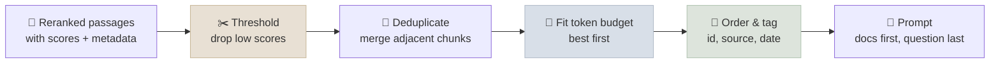

# Grounded Generation & Citations

Grounded generation is the last step of RAG: arranging the retrieved passages in the prompt so the model answers from them, cites them, handles conflicts, and says "I don't know" when they don't contain the answer.

```objectives
time: 45 min
outcomes:
  - Classify RAG hallucinations by cause and name the mitigation for each
  - Assemble context within a token budget with ordering, tags and identifiers that support citation
  - Use API-native citations and verify citations after generation
  - Design abstention and conflict-resolution behaviour
prerequisites:
  - "[Retrieval & Reranking](04-Retrieval-and-Reranking.mdx)"
  - "[Context Engineering](../../10-Prompt-Engineering/Notes/06-Context-Engineering.mdx)"
```

## How RAG Answers Go Wrong

Retrieval can succeed and the answer still fail. The failure modes after retrieval:

| Failure | What happens | Mitigation |
|---|---|---|
| **Context ignored** | The model answers from parametric memory despite relevant passages | Explicit grounding instruction; quote-then-answer; stronger model |
| **Misled by bad context** | A retrieved passage is wrong or outdated and the model repeats it | Source quality, recency metadata, conflict handling |
| **Embellished** | Correct core answer plus invented details | Claim-level groundedness checks; "only what the documents state" |
| **Distracted** | Irrelevant passages pull the answer off course | Rerank and threshold; fewer, better passages |
| **Wrong abstention** | Answers when the documents don't cover the question, or refuses when they do | Explicit abstain rule; retrieval-confidence thresholds; eval both directions |
| **Bad citation** | The citation points to a passage that doesn't support the claim | API-native citations; post-hoc citation verification |
| **Conflicts blended** | Two passages disagree and the answer mixes them | Show dates/sources; instruct to prefer newer or to report the conflict |

Research on knowledge conflicts shows models are easily swayed by retrieved text: ClashEval (Wu et al., 2024) found models adopted *incorrect* retrieved content over their own correct prior knowledge more than 60% of the time, and Shi et al. (2023) showed irrelevant context measurably degrades reasoning. Retrieval precision and source quality are generation problems too.

---

## Assembling the Context



```python
def assemble_context(passages, max_tokens: int, count_tokens, min_score: float = 0.2) -> str:
    """passages: list of dicts with text, score, source, date - already reranked, best first."""
    kept, used, seen = [], 0, set()
    for p in passages:
        if p["score"] < min_score or p["text"] in seen:
            continue
        cost = count_tokens(p["text"])
        if used + cost > max_tokens:
            break
        kept.append(p); used += cost; seen.add(p["text"])
    return "\n".join(
        f'<document id="{i}" source="{p["source"]}" date="{p["date"]}">\n{p["text"]}\n</document>'
        for i, p in enumerate(kept, 1)
    )
```

Guidelines, most of them from [Context Engineering](../../10-Prompt-Engineering/Notes/06-Context-Engineering.mdx):

- **Fewer, better passages.** A reranker threshold that sends 3 strong passages usually beats a fixed k of 10.
- **Order matters** for weaker models (lost in the middle): put the strongest evidence first. Some systems put the second-best last; measure on your model before adopting it.
- **Tag each passage** with an id, source and date so the model can cite and resolve conflicts.
- **Documents first, question last**, and keep stable instructions at the top for prompt caching.

### The generation prompt

```text
You answer questions using only the documents provided.
- Every factual sentence must end with citations like [2] or [1][3].
- If the documents don't contain the answer, say so and state what is missing. Do not use outside knowledge.
- If documents disagree, prefer the most recent one and mention the disagreement.
- First extract the relevant quotes inside <quotes> tags, then write the answer inside <answer> tags.

<documents>
...
</documents>

Question: {question}
```

The quote-then-answer step makes the model commit to evidence before writing and makes the answer checkable. For reasoning models, the extraction can happen in the thinking; keep the requirement for citations in the output.

---

## Citations

### API-native citations

Several APIs ground and cite at the platform level, which is more reliable than asking for `[n]` markers in text:

| Provider | Feature | What you get |
|---|---|---|
| Anthropic | Citations on document content blocks | Answer text split into blocks, each with the exact cited character/page ranges of the source documents |
| Google Gemini | Grounding (Google Search, or your own data stores via the Agent Platform) | Grounding metadata mapping answer segments to source chunks |
| OpenAI | File search tool | Annotations linking answer spans to files |

Native citations quote real spans from the supplied documents, so they cannot point at text that doesn't exist - but they can still cite a span that doesn't fully support the claim.

### Verifying citations

Measure citation quality the way ALCE (Gao et al., 2023) does:

- **Citation recall**: is each generated statement fully supported by the passages it cites?
- **Citation precision**: is each cited passage actually needed (does it support the statement)?

Both are computed with an entailment check - a natural-language-inference (NLI) model or an LLM judge asked "does this passage support this statement?". Run it offline on eval sets, and online on a sample of traffic or on high-stakes answers before they are shown. See [RAG Evaluation](06-RAG-Evaluation.mdx) for groundedness metrics.

---

## Abstention

A RAG system must be able to say "the documents don't cover this". Two complementary controls:

1. **Retrieval-side**: if the best reranker score is below a calibrated threshold, don't generate from weak context - return a "not found" response, fall back to search, or ask a clarifying question.
2. **Generation-side**: an explicit instruction to abstain, plus eval items where the answer is *not* in the corpus, so you measure false answers as well as false refusals.

Track both error types; tightening one loosens the other.

---

## Check Yourself

```quiz
- q: "The retrieved passage says a drug's dose is 1200 mg (a typo; the correct dose is 120 mg), and the answer repeats 1200 mg with a citation. How is this failure classified?"
  options:
    - "Faithful to a bad source - a source-quality problem, not an unfaithful generation"
    - "Context ignored"
    - "Embellishment"
    - "A retrieval failure"
  answer: 1
  explain: "Groundedness metrics would score this answer as faithful. Source quality, versioning and conflict detection are what prevent it."
- q: "What does citation precision measure?"
  options:
    - "Whether each cited passage actually supports the statement it's attached to"
    - "Whether every statement has a citation"
    - "How many passages were retrieved"
    - "Whether citations are formatted correctly"
  answer: 1
- q: "Why can sending 10 passages instead of 3 lower answer accuracy even when the right passage is among them?"
  options:
    - "Irrelevant passages distract the model and push evidence toward the middle of the context"
    - "The model can only read 3 documents"
    - "Citations stop working above 5 documents"
    - "The prompt cache is invalidated"
  answer: 1
- q: "How do you evaluate abstention properly?"
  answer: "Include unanswerable questions (answer not in the corpus) as well as answerable ones, and measure both false answers (answering when it should abstain) and false refusals (abstaining when the answer is present). Tune retrieval thresholds and instructions against both."
```

## Exercises

```exercise
- title: Build and test a citation checker
  task: |
    Generate answers with [n] citations for 30 questions over your corpus. Split each answer into sentences, and for each sentence check with an NLI model (e.g. a DeBERTa MNLI cross-encoder) or an LLM judge whether its cited passages entail it. Report citation recall and precision, and read the 5 worst cases.
  solution: |
    Typical findings: most failures are partial support (the passage supports part of a sentence), citations attached to the wrong neighbouring passage, and sentences that combine two passages but cite one. Quote-then-answer prompting and API-native citations usually raise both metrics.
- title: Tune an abstention threshold
  task: |
    Create 40 answerable and 20 unanswerable questions. Log the top reranker score for each. Plot false-answer rate and false-refusal rate as the threshold varies, and pick a threshold for (a) a legal assistant and (b) a casual help bot.
  solution: |
    The legal assistant should accept more false refusals to cut false answers (higher threshold); the help bot can tolerate occasional unsupported answers to avoid frustrating refusals (lower threshold, with clear wording). The plot makes the trade-off explicit for stakeholders.
```

## Study Notes

**Must-know:**
- Post-retrieval failures: context ignored, misled by bad context, embellished, distracted, wrong abstention, bad citations, blended conflicts
- Models readily adopt retrieved content - even wrong content - so source quality and precision matter
- Assemble context: threshold, dedupe, budget, best first, tag with id/source/date, documents before question
- Quote-then-answer and explicit citation rules make answers checkable
- Prefer API-native citations; verify with NLI or judges (citation recall and precision)
- Abstention needs retrieval thresholds, instructions and unanswerable eval items

## References

- Shi et al., [Large Language Models Can Be Easily Distracted by Irrelevant Context](https://arxiv.org/abs/2302.00093) (ICML 2023)
- Wu, Wu & Zou, [ClashEval: Quantifying the tug-of-war between an LLM's internal prior and external evidence](https://arxiv.org/abs/2404.10198) (NeurIPS 2024 Datasets and Benchmarks)
- Xie et al., [Adaptive Chameleon or Stubborn Sloth: Revealing the Behavior of LLMs in Knowledge Conflicts](https://arxiv.org/abs/2305.13300) (ICLR 2024)
- Gao et al., [Enabling Large Language Models to Generate Text with Citations (ALCE)](https://arxiv.org/abs/2305.14627) (EMNLP 2023)
- Liu et al., [Lost in the Middle](https://arxiv.org/abs/2307.03172) (TACL 2024)
- Anthropic, [Citations](https://platform.claude.com/docs/en/build-with-claude/citations)

*Last reviewed: 2026-09*
