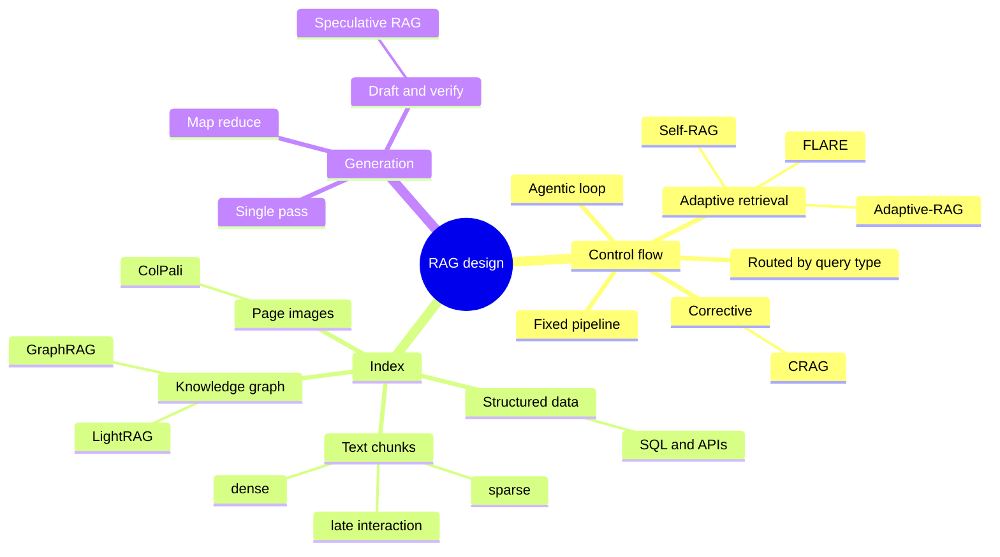
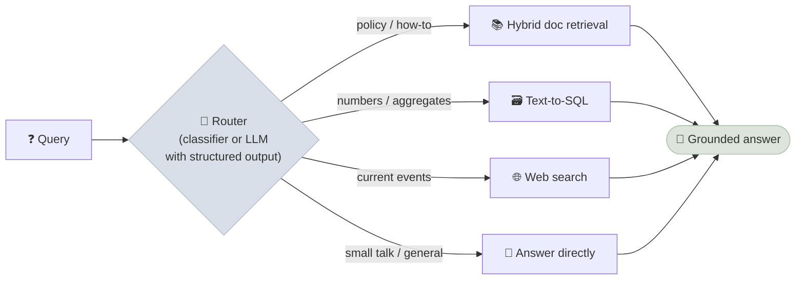
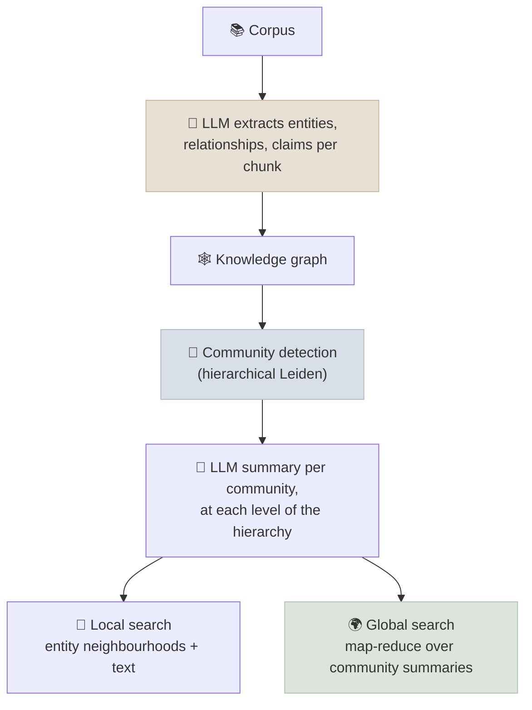

# Advanced RAG Patterns

Advanced RAG patterns change *when* retrieval happens (adaptive and corrective RAG), *what* is indexed (knowledge graphs, page images, tables) and *how* the pipeline is composed (routing across modules) - each targeting a failure that single-shot vector retrieval can't fix.

```objectives
time: 60 min
outcomes:
  - Place a RAG design on the axes of control flow (fixed vs adaptive) and index type (text, graph, multimodal, structured)
  - Explain Self-RAG, CRAG, FLARE, Adaptive-RAG and Speculative RAG and what each needs to work
  - Describe GraphRAG's indexing pipeline and local/global search, and compare it with LightRAG and LazyGraphRAG on cost
  - Choose between caption-based, CLIP-style and ColPali-style retrieval for visually rich documents
prerequisites:
  - "[Retrieval & Reranking](04-Retrieval-and-Reranking.mdx)"
  - "[RAG Evaluation](06-RAG-Evaluation.mdx)"
```

## A Map, Not a Ladder

Surveys describe an evolution from *naive* to *advanced* (pre- and post-retrieval improvements) to *modular* RAG (swappable, routed components). In practice these are independent design choices you combine:



| Axis | Choice | Solves | Cost |
|---|---|---|---|
| Pre-/post-retrieval | Query rewriting, hybrid, reranking, compression | Recall and precision of single-shot retrieval | Low - the "advanced RAG" baseline ([04](04-Retrieval-and-Reranking.mdx)) |
| Routing | Pick a retriever or source per query | Mixed query types (docs, SQL, web) | A router to build and evaluate |
| Adaptive / corrective | Decide whether, when and how often to retrieve | Unnecessary retrieval; bad retrieval | Extra model calls; variable latency |
| Agentic | The model plans and issues searches in a loop | Multi-hop, research tasks | Highest latency and cost ([08](08-Agentic-and-Deep-Research-RAG.mdx)) |
| Graph index | Entities and relations extracted into a graph | Relationship and whole-corpus questions | Expensive indexing |
| Multimodal index | Page images or image embeddings | Charts, tables, scans, slides | Storage, vision models |

---

## Routing (Modular RAG)

A router classifies each query and sends it to the right module: vector search over docs, SQL over a warehouse, a web search, a graph query, or no retrieval at all.



Implement the router with structured output (an enum of routes) or a small classifier, and evaluate it like any classifier - a mis-route is a guaranteed wrong answer. With tool-calling models, routing is often expressed as tools the model chooses between, which is the bridge to [agentic RAG](08-Agentic-and-Deep-Research-RAG.mdx).

---

## Adaptive and Corrective Retrieval

| Pattern | Mechanism | Requirements | Use when |
|---|---|---|---|
| **Self-RAG** (Asai et al., 2023) | A fine-tuned model emits reflection tokens: *Retrieve* (yes / no / continue), *IsRel* (is a passage relevant), *IsSup* (fully / partially / not supported), *IsUse* (usefulness 1-5); decoding uses them to decide when to retrieve and which output to keep | A model trained to emit the tokens; open-source checkpoints exist | Research and open-model stacks; the *idea* (critique retrieval and support) is widely reused with prompted judges |
| **CRAG** (Yan et al., 2024) | A lightweight retrieval evaluator grades results *Correct*, *Incorrect* or *Ambiguous*; correct results are refined (decomposed, irrelevant strips filtered), incorrect ones replaced by web search, ambiguous ones combined | A retrieval grader (the paper fine-tunes a small T5; an LLM judge also works) and a fallback source | Corpora with coverage gaps where a fallback source is acceptable |
| **FLARE** (Jiang et al., 2023) | Generate a tentative next sentence; if it contains low-probability tokens, use it as a query, retrieve, and regenerate | Token probabilities from the generator | Long-form generation where information needs emerge while writing |
| **Adaptive-RAG** (Jeong et al., 2024) | A small classifier predicts query complexity and routes to no retrieval, single-step or multi-step retrieval | A labelled complexity classifier | Mixed traffic where most queries are simple |
| **Speculative RAG** (Wang et al., 2024) | A small specialist model writes several answer drafts in parallel, each from a different subset of retrieved documents; a larger generalist model verifies and picks the best | Two models; parallel inference | Many retrieved documents, latency-sensitive quality gains |

A corrective loop is simple to build with any model and a graph library:

```python
from typing import Literal, TypedDict
from langgraph.graph import StateGraph, START, END

class State(TypedDict):
    question: str
    docs: list[str]
    grade: str
    answer: str

def retrieve(s: State):   return {"docs": search_docs(s["question"], k=8)}
def grade(s: State):      return {"grade": grade_retrieval(s["question"], s["docs"])}   # "correct" | "ambiguous" | "incorrect", via structured output
def web(s: State):        return {"docs": (s["docs"] if s["grade"] == "ambiguous" else []) + web_search(s["question"], k=5)}
def generate(s: State):   return {"answer": grounded_answer(s["question"], s["docs"])}

def route(s: State) -> Literal["web", "generate"]:
    return "generate" if s["grade"] == "correct" else "web"

g = StateGraph(State)
for name, fn in [("retrieve", retrieve), ("grade", grade), ("web", web), ("generate", generate)]:
    g.add_node(name, fn)
g.add_edge(START, "retrieve"); g.add_edge("retrieve", "grade")
g.add_conditional_edges("grade", route)
g.add_edge("web", "generate"); g.add_edge("generate", END)
crag = g.compile()
```

Every extra judge call adds latency and a failure mode of its own; evaluate the grader's precision and recall on labelled retrievals before trusting it.

---

## Graph-Based RAG

Vector retrieval answers "find passages like this question". It struggles with **relationship questions** ("which suppliers are shared by our two largest customers?") and **global questions** ("what are the main risk themes across 5,000 incident reports?"), because the answer is not in any single chunk.

### GraphRAG

Microsoft's GraphRAG (Edge et al., 2024) builds a knowledge graph and a hierarchy of summaries at index time:



- **Local search** starts from entities mentioned in the question and gathers their relationships, community reports and source text - for entity-centric questions.
- **Global search** maps the question over community summaries at a chosen level and reduces the partial answers - for corpus-wide "sensemaking" questions, where the paper reports large gains in comprehensiveness and diversity over vector RAG.
- **DRIFT search** combines the two, starting global and refining locally.

```bash
pip install graphrag
graphrag init --root ./project          # writes settings.yaml; put documents in ./project/input
graphrag index --root ./project         # LLM extraction + communities + summaries (the expensive step)
graphrag query --root ./project --method global "What are the main themes in these reports?"
graphrag query --root ./project --method local  "Who works with the procurement team?"
```

**Cost is the catch**: indexing runs LLM calls over every chunk and every community, typically costing many times the corpus's token count, and re-indexing on changes is expensive. Cheaper variants:

| Variant | Idea | Trade-off |
|---|---|---|
| **LazyGraphRAG** (Microsoft, 2024) | Defers summarisation to query time; indexes with NLP noun-phrase extraction and co-occurrence | Microsoft reports indexing cost equal to vector RAG and 0.1% of full GraphRAG, with comparable global-query quality |
| **LightRAG** (Guo et al., 2024) | Graph plus vector index with dual-level (entity and theme) retrieval; supports incremental updates | Simpler and cheaper; less thorough than full community summaries |
| **HippoRAG** (Gutiérrez et al., 2024) | Personalised PageRank over an entity graph seeded by query entities | Strong multi-hop recall at low cost |

Managed options exist too - e.g. Amazon Bedrock Knowledge Bases supports GraphRAG backed by Neptune Analytics. If your data is *already* a graph or relational (a CRM, a product catalogue), query it directly (Cypher, GQL, SQL) as a tool rather than extracting a graph from text.

---

## Multimodal and Visually Rich Documents

| Approach | How | Best for | Limits |
|---|---|---|---|
| **Caption / transcribe** | A vision-language model describes images and converts tables to Markdown at ingest; index the text | Most pipelines; reuses text retrieval | Loses detail the caption omits; ingest cost |
| **Joint image-text embeddings** (CLIP-style) | Embed images and text into one space | Photos, product images, "find a picture of..." | Weak on text-heavy pages and charts |
| **Late interaction over page images** (ColPali, Faysse et al., 2024) | A vision-language model embeds each page image as ~1,000 patch vectors; queries are scored with MaxSim against patches - no OCR | Slides, reports, forms, charts - pages where layout carries meaning | Storage per page; a VLM is needed to answer from the retrieved page images |

ColPali-style models set the state of the art on the ViDoRe visual document retrieval benchmark and remove the fragile parse-OCR-chunk pipeline for visually rich documents. The generator then receives the retrieved page *images*, so it must be a multimodal model.

---

## Choosing

| Question shape | Pattern |
|---|---|
| Single-hop factual, mixed phrasing | Hybrid + rerank (advanced RAG) |
| Several distinct source types | Routing |
| Many queries need no retrieval | Adaptive-RAG-style classifier |
| Corpus has gaps; web fallback acceptable | CRAG |
| Relationships between entities across documents | GraphRAG (local) / HippoRAG, or query an existing graph |
| "Summarise themes across the whole corpus" | GraphRAG global / LazyGraphRAG, or map-reduce |
| Multi-step research, comparisons | Agentic RAG ([08](08-Agentic-and-Deep-Research-RAG.mdx)) |
| Slides, scans, charts | ColPali-style page retrieval or VLM captioning |

Add complexity only when your eval shows the simpler pipeline failing on that question shape.

---

## Check Yourself

```quiz
- q: "What do Self-RAG's reflection tokens require that CRAG does not?"
  options:
    - "A generator fine-tuned to emit them"
    - "A web search API"
    - "A knowledge graph"
    - "Token probabilities"
  answer: 1
- q: "What does Speculative RAG do?"
  options:
    - "A small model drafts several answers from different document subsets in parallel; a large model verifies and selects one"
    - "It pre-fetches documents the user might ask about next"
    - "It speculatively decodes tokens with a draft model"
    - "It caches retrieval results"
  answer: 1
- q: "Which question most clearly calls for GraphRAG global search rather than vector RAG?"
  options:
    - "What are the recurring root causes across 3,000 incident post-mortems?"
    - "What is the SLA for the Enterprise plan?"
    - "How do I reset my password?"
    - "What is error code E4013?"
  answer: 1
- q: "Why does ColPali not need OCR?"
  answer: "It embeds the page image directly: a vision-language model produces a vector per image patch, and queries are matched to patches with late-interaction MaxSim. Text, layout and figures are all captured visually, so no text extraction step is required."
```

## Exercises

```exercise
- title: Cost out GraphRAG
  task: |
    Your corpus is 20 million tokens. Assume GraphRAG indexing processes about 3× the corpus in input tokens and 0.5× in output tokens across extraction and summarisation, with a model priced at $0.50/M input and $2/M output. Estimate the indexing cost, and the cost of re-indexing 10% of the corpus monthly if incremental updates are not available.
  solution: |
    Input: 60M × $0.50/M = $30; output: 10M × $2/M = $20; about $50 per full index with a small, cheap model (several times more with a frontier model). Without incremental updates, a monthly change forces a full re-index: $50/month here - small in dollars, but hours of wall-clock time and quota. The ratios, not these example prices, are the point: indexing cost scales with corpus size and model price, and query-time approaches (LazyGraphRAG) or incremental ones (LightRAG) change the economics.
- title: Build a router
  task: |
    Define three routes for a company assistant (docs, sql, direct). Write 60 labelled queries (20 per route, including ambiguous ones) and implement the router with a structured-output enum. Report per-route precision and recall, and decide what should happen on low-confidence routes.
  solution: |
    Typical confusions are numeric questions about policies ("how many days of leave?" - docs, not SQL) and vague requests. A safe default for low confidence is to query docs and SQL in parallel and let the generator use whichever returns evidence, or to ask a clarifying question.
```

## Study Notes

**Must-know:**
- RAG patterns are composable choices: control flow (fixed, routed, adaptive, corrective, agentic) × index (text, graph, images, structured)
- Self-RAG: fine-tuned reflection tokens (Retrieve, IsRel, IsSup, IsUse); CRAG: retrieval grader + refine / web fallback; FLARE: retrieve when a draft sentence is low-confidence; Adaptive-RAG: route by complexity; Speculative RAG: small drafters + large verifier
- GraphRAG: LLM-extracted graph, Leiden communities, hierarchical summaries; local, global and DRIFT search; expensive indexing
- LazyGraphRAG (query-time summarisation, ~vector-RAG indexing cost), LightRAG (dual-level, incremental), HippoRAG (PageRank)
- ColPali: patch-level late interaction over page images, no OCR; needs a multimodal generator
- Add a pattern only when evals show the simpler pipeline failing on that question shape

## References

- Gao et al., [Retrieval-Augmented Generation for Large Language Models: A Survey](https://arxiv.org/abs/2312.10997) (2023); Gao et al., [Modular RAG](https://arxiv.org/abs/2407.21059) (2024)
- Asai et al., [Self-RAG: Learning to Retrieve, Generate, and Critique through Self-Reflection](https://arxiv.org/abs/2310.11511) (ICLR 2024)
- Yan et al., [Corrective Retrieval Augmented Generation](https://arxiv.org/abs/2401.15884) (2024)
- Jiang et al., [Active Retrieval Augmented Generation (FLARE)](https://arxiv.org/abs/2305.06983) (EMNLP 2023)
- Jeong et al., [Adaptive-RAG: Learning to Adapt Retrieval-Augmented LLMs through Question Complexity](https://arxiv.org/abs/2403.14403) (NAACL 2024)
- Wang et al., [Speculative RAG: Enhancing Retrieval Augmented Generation through Drafting](https://arxiv.org/abs/2407.08223) (ICLR 2025)
- Edge et al., [From Local to Global: A Graph RAG Approach to Query-Focused Summarization](https://arxiv.org/abs/2404.16130) (2024); [GraphRAG documentation](https://microsoft.github.io/graphrag/)
- Microsoft Research, [LazyGraphRAG: Setting a new standard for quality and cost](https://www.microsoft.com/en-us/research/blog/lazygraphrag-setting-a-new-standard-for-quality-and-cost/) (2024)
- Guo et al., [LightRAG: Simple and Fast Retrieval-Augmented Generation](https://arxiv.org/abs/2410.05779) (2024)
- Gutiérrez et al., [HippoRAG: Neurobiologically Inspired Long-Term Memory for LLMs](https://arxiv.org/abs/2405.14831) (NeurIPS 2024)
- Faysse et al., [ColPali: Efficient Document Retrieval with Vision Language Models](https://arxiv.org/abs/2407.01449) (ICLR 2025)

*Last reviewed: 2026-09*
