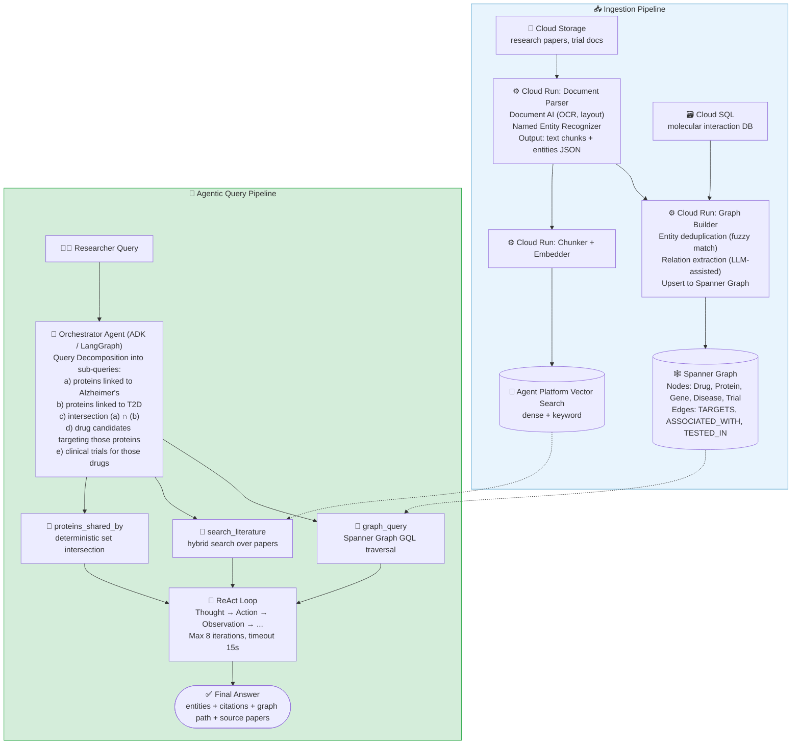

# System Design: Agentic RAG with Hybrid Data (Vector + Graph)

> **Domain:** Life Sciences / Enterprise Knowledge Graph · **Pattern:** Agentic RAG + Graph Traversal + Multi-hop Reasoning
>
> ← [Back to RAG Concepts](../Notes/07-Advanced-RAG-Patterns.mdx) | [Simple RAG Design ←](01-simple-rag.mdx)

---

## Interview Problem Statement

> **"Design an AI system for a pharmaceutical company that enables researchers to answer complex multi-hop questions like: 'Which of our drug candidates interact with proteins implicated in both Alzheimer's and Type 2 Diabetes, and what clinical trials have investigated those targets?' The knowledge base includes 2M research papers, internal trial documents, and a curated molecular interaction database."**

---

## Why Simple RAG Fails Here

| Limitation | Why It Breaks This Use Case |
|---|---|
| Single-hop retrieval | Question requires: Drug → Protein → Disease (×2) → Trial - 4 hops across entity types |
| No entity relationships | Vector search returns similar text, not connected facts |
| No structured reasoning | "Both Alzheimer's AND Type 2 Diabetes" requires set intersection, not similarity |
| Context window bottleneck | 2M papers → top-5 chunks rarely co-contain all hops |
| No iterative refinement | Answer to hop 1 should inform retrieval for hop 2 |

**The solution:** Hybrid Data - pair a Vector Index (semantic document retrieval) with a Knowledge Graph (structured entity relationships). An agent orchestrates multi-hop traversal across both stores.

---

## Clarifying Questions

| Question | Why It Matters |
|---|---|
| What entity types exist in the domain? (drugs, proteins, genes, diseases, trials?) | Defines graph schema - nodes and edge types |
| Is the molecular database structured (SQL/graph) or unstructured (papers only)? | Structured → import directly to graph; unstructured → NER extraction pipeline |
| How often is data updated? (daily trial updates? weekly paper ingestion?) | Incremental graph update strategy vs. full rebuild |
| What is the maximum acceptable latency? (research tool: 10s OK; clinical decision: 3s max) | Determines whether multi-hop can be synchronous or needs streaming |
| Does the agent need to take actions (flag a trial, create a report) or only answer? | Read-only vs. read-write agent design |
| Are there compliance requirements? (FDA, HIPAA - PII in trial documents?) | Drives data masking and audit logging depth |

---

## System Architecture Overview



---

## Knowledge Graph Schema

### Node Types

The examples below use real identifier systems (UniProt, MeSH, ICD-10) but **illustrative data** - drug candidates and trials are the company's internal records, shown here with made-up codes.

| Node Label | Key Properties | Example |
|---|---|---|
| `Drug` | name, candidate_id, mechanism, phase | CAND-0142 (internal candidate), Phase 2 |
| `Protein` | name, uniprot_id, function | APOE (UniProt P02649), insulin-degrading enzyme IDE (P14735) |
| `Gene` | symbol, entrez_id, chromosome | APOE, TREM2, IDE |
| `Disease` | name, icd10, mesh_id | Alzheimer's (ICD-10 G30, MeSH D000544), type 2 diabetes (E11) |
| `ClinicalTrial` | trial_id, phase, status, sponsor, start_date | TRIAL-2024-017 (internal) or a public NCT number |
| `Paper` | doi, title, authors, year, journal | - |

### Edge Types

| Edge | From → To | Properties |
|---|---|---|
| `TARGETS` | Drug → Protein | mechanism, affinity_nM, confidence |
| `ENCODES` | Gene → Protein | - |
| `ASSOCIATED_WITH` | Protein → Disease | evidence_type, score, source_ids |
| `IMPLICATED_IN` | Gene → Disease | gwas_p_value, effect_size |
| `TESTED_IN` | Drug → ClinicalTrial | primary_endpoint, result |
| `MENTIONS` | Paper → Drug/Protein/Disease | context, section |
| `INTERACTS_WITH` | Protein → Protein | interaction_type, experimental_evidence |

### Example Multi-hop Query in GQL (Spanner Graph)

```sql
GRAPH PharmaGraph
-- Proteins associated with BOTH Alzheimer's and type 2 diabetes
MATCH (ad:Disease {mesh_id: 'D000544'})<-[a1:ASSOCIATED_WITH]-(p:Protein)
      -[a2:ASSOCIATED_WITH]->(t2d:Disease {icd10: 'E11'})
WHERE a1.score > 0.7 AND a2.score > 0.7
-- ...and the drug candidates (phase 2+) that target them
MATCH (d:Drug)-[t:TARGETS]->(p)
WHERE d.phase >= 2
RETURN p.name AS protein, d.name AS drug, d.phase, t.mechanism,
       a1.score AS ad_score, a2.score AS t2d_score
ORDER BY d.phase DESC, ad_score DESC
LIMIT 100
```

The intersection that vector search can't express is a single pattern here: one protein node connected to both disease nodes.

---

## Agent Tool Definitions

Plain, typed functions - any agent framework (ADK, LangGraph, the OpenAI or Claude Agent SDKs) can expose them as tools. The docstrings are the tool descriptions the model reads.

```python
def graph_query(start_entity: str, entity_type: str, edge_type: str,
                min_score: float = 0.7, max_hops: int = 2, limit: int = 100) -> list[dict]:
    """Traverse the knowledge graph from a named entity (Drug, Protein, Disease, ClinicalTrial)
    along one edge type (TARGETS, ASSOCIATED_WITH, TESTED_IN, ...). Returns connected entities
    with edge properties and source ids. Results are capped at `limit` per hop, highest score first."""

def proteins_shared_by(disease_a: str, disease_b: str, min_score: float = 0.7) -> list[dict]:
    """Proteins associated with BOTH diseases above min_score - runs the GQL intersection pattern."""

def search_literature(query: str, top_k: int = 5, year_from: int | None = None,
                      source: str | None = None) -> list[dict]:
    """Hybrid search over papers and internal trial documents.
    Returns passages with doc id, title, year and relevance score."""
```

**Why bounded hops and limits?** High-degree nodes (a well-studied protein linked to thousands of papers) make unbounded traversals explode. Cap hops at 2-3 and results per hop, sort by evidence score, and let the agent decompose deeper questions into several bounded queries.

**Why a dedicated intersection tool?** Asking the LLM to intersect two long lists in its head is error-prone; a deterministic tool (or query) does set operations exactly.

---

## Agent Trace (Illustrative)

**Query:** "Which of our drug candidates target proteins implicated in both Alzheimer's and type 2 diabetes, and which trials tested them?"

```text
Thought 1: Find proteins associated with both diseases - a set intersection.
Action 1: proteins_shared_by("Alzheimer's disease", "Type 2 diabetes", min_score=0.7)
Observation 1: [APOE (ad 0.93, t2d 0.74), IDE (ad 0.78, t2d 0.81)]

Thought 2: Find candidates targeting each protein. The two lookups are independent - call both.
Action 2a: graph_query("APOE", "Protein", edge_type="TARGETS")
Action 2b: graph_query("IDE", "Protein", edge_type="TARGETS")
Observation 2: [CAND-0142 → APOE (Phase 2)], [CAND-0317 → IDE (Phase 1)]

Thought 3: Only CAND-0142 meets phase 2+. Find its trials.
Action 3: graph_query("CAND-0142", "Drug", edge_type="TESTED_IN")
Observation 3: [TRIAL-2024-017 (Phase 2, recruiting)]

Thought 4: Get supporting literature for the APOE link to both diseases.
Action 4: search_literature("APOE metabolic dysfunction Alzheimer's type 2 diabetes", top_k=3, year_from=2020)
Observation 4: [3 passages with doc ids]

Thought 5: Enough evidence. Answer with graph edge ids and document citations.
```

The final answer cites graph facts by edge id and literature by document id; a post-check verifies every relationship claim against the graph (see Q4 below).

---

## GCP Services Map

| Component | GCP Service | Why |
|---|---|---|
| Raw document storage | Cloud Storage | Source of truth; Eventarc triggers ingestion |
| Structured DB import | Cloud SQL → Dataflow | Bulk import molecular DB into graph format |
| Document parsing | Document AI (Form Parser + OCR) | Layout-aware parsing of research PDFs |
| Named Entity Recognition | Biomedical NER model (e.g. scispaCy) + LLM batch extraction | Extract Drug/Protein/Disease entities |
| Relation extraction | Gemini via batch prediction, structured output | "Paper says Drug X targets Protein Y" → edge |
| Knowledge graph store | Spanner Graph | Managed, ACID, GQL support, multi-region |
| Entity deduplication | Dataflow + Fuzzy matching (jaro-winkler) | "Aβ" and "amyloid-beta" are the same node |
| Graph update queue | Pub/Sub + Dataflow | Streaming graph updates from new papers |
| Vector index | Agent Platform Vector Search | ANN + keyword over 2M papers |
| Sparse index | AlloyDB pgvector + tsvector | BM25 for exact term matching |
| Embedding model | Agent Platform embeddings, or a biomedical embedding model | Unified embedding space for papers |
| Agent orchestration | ADK on Agent Runtime (formerly Agent Engine) | Managed agent runtime, session state |
| LLM (reasoning + synthesis) | A frontier Gemini model | Tool use, long context, grounding |
| LLM (relation extraction) | A small Gemini model (batch) | Cost-efficient batch extraction |
| Semantic cache | Memorystore for Redis | Cache frequent research queries |
| Session state | Firestore | Per-researcher agent session context |
| Auth | Identity-Aware Proxy + VPC Service Controls | Internal research tool, strict perimeter |
| Audit logging | Cloud Logging + BigQuery | Compliance audit trail per query |
| Monitoring | Cloud Monitoring + Cloud Trace | Latency per agent step, error rates |
| Offline eval | Agent Platform evaluation + BigQuery | Groundedness, graph recall, trajectory metrics |
| CI/CD | Cloud Build + Artifact Registry | Graph pipeline + agent deployment |

---

## Scalability Considerations

### Graph Scalability

| Scale | Spanner Config | Query Latency | Strategy |
|---|---|---|---|
| <10M nodes | Single region, 3 nodes | <100ms | Default config |
| 10M–100M nodes | Multi-region, 10 nodes | 100–500ms | Partition by entity type |
| 100M+ nodes | Multi-region, 30+ nodes | 500ms–2s | Sub-graph caching + materialized views |

**Key insight:** Graph traversal latency grows with degree (number of edges per node), not graph size. High-degree nodes (e.g., APOE protein connected to thousands of papers) need degree-bounded queries and result truncation. Always specify `LIMIT` in graph queries.

### Agent Scalability

**Problem:** ReAct loops are inherently sequential - each action depends on the prior observation.

**Mitigations:**
1. **Parallel tool calls within a step** - when sub-queries are independent (e.g., "proteins in AD" and "proteins in T2D"), execute both graph queries concurrently. ADK supports parallel tool dispatch.
2. **Materialized sub-graph caching** - pre-compute and cache common sub-graphs (e.g., "all proteins implicated in Alzheimer's") in Redis. Graph traversal for common starting nodes takes 1ms (cache hit) vs. 300ms (live query).
3. **Iteration cap** - hard limit of 8 ReAct iterations with timeout of 15s. If exceeded, return partial answer with "further research needed" flag.
4. **Query complexity classifier** - simple single-hop queries (entity lookup) bypass the agent loop entirely and go directly to vector search + graph_query.

### Ingestion Scalability: 2M Papers

| Stage | Throughput | GCP Config |
|---|---|---|
| PDF parsing | 500 docs/min | Cloud Run 50 instances × 10 RPS |
| Entity extraction (NER) | 300 docs/min | Self-hosted NER on Cloud Run / GKE |
| Relation extraction (small model, batch) | 1000 docs/min | Batch prediction, async |
| Graph upsert (Spanner) | 10k mutations/sec | Spanner 10-node cluster |
| Vector embed + index | 20k chunks/min | Cloud Tasks + Vector Search online updates |

Full initial load of 2M papers: ~3–4 days. Incremental updates (100 papers/day): <30 minutes.

### Cost Optimization at Scale

| Lever | Saving |
|---|---|
| Small model + batch pricing for extraction | Several times cheaper than a frontier model |
| Materialized sub-graph cache for top-100 disease entities | 60% reduction in Spanner queries |
| Semantic cache for agent responses | 20–30% LLM cost reduction |
| Committed use discounts on Spanner + Cloud Run | 25–57% savings |
| Offline batch embedding vs. real-time | 40% cheaper with batch API |

---

## Failure Modes and Mitigations

| Failure | Symptom | Mitigation |
|---|---|---|
| Graph entity not found | Agent gets empty traversal result | Fall back to vector search; flag "not in graph yet" |
| Entity disambiguation failure | "insulin" maps to wrong protein | Canonical entity disambiguation using UniProt/MeSH IDs |
| Agent infinite loop | ReAct exceeds iteration cap | Hard 8-iteration + 15s timeout; return partial answer |
| Stale graph data | Drug candidate phase changed | Graph edges have `last_updated` timestamp; warn if >30 days |
| High-degree node explosion | Query returns 50k edges | Degree-bounded traversal (LIMIT 100 per hop) |
| Hallucinated graph paths | Agent invents relationships | Synthesis tool only uses `graph_facts` actually returned - no interpolation |
| NER extraction errors | Wrong entity extracted | Human-in-the-loop review queue for low-confidence extractions; threshold 0.85 |

---

## Simple RAG vs. Agentic RAG Hybrid - Decision Matrix

| Criterion | Simple RAG | Agentic RAG Hybrid |
|---|---|---|
| Query type | Single-hop factual | Multi-hop relational |
| Data structure | Unstructured text only | Text + structured relationships |
| Latency requirement | <3s | 5–15s acceptable |
| Entity relationships critical? | No | Yes |
| Set operations needed? | No | Yes (intersection, union) |
| Agent complexity | Low | High (ReAct loop) |
| Operational cost | Low | High (graph infra + agent) |
| Use Simple RAG when... | Q&A, summarization, policy lookup | - |
| Use Hybrid when... | - | Drug discovery, compliance tracing, financial fraud chains |

---

## Q&A Review Bank

**Q1: Why can't a standard RAG pipeline answer multi-hop questions like "proteins implicated in both Disease A and Disease B"? What specifically breaks?** `[Medium]`

A: Three structural failures: (1) **No set operations** - vector similarity returns the most similar chunks, not the intersection of entity sets. A query for "both Alzheimer's AND T2D" may retrieve chunks about each disease separately but has no mechanism to compute the protein overlap. (2) **No entity relationship traversal** - the relationship `Drug TARGETS Protein` is implicit in text but not navigable. A chunk that says "CAND-0142 binds APOE" and a chunk that says "APOE is associated with T2D" exist in different embedding neighborhoods - the system has no way to connect them without explicitly traversing an edge. (3) **Context window bottleneck** - even if you retrieved all relevant chunks (hundreds), the LLM would struggle to compute a precise intersection from unstructured prose across a 100k-token context window. Knowledge graphs make these relationships explicit and queryable.

---

**Q2: What is the risk of an unbounded graph traversal in the agent's `graph_query` tool, and how do you design against it?** `[Hard]`

A: Unbounded traversal from a high-degree node (e.g., "APOE", which may connect to 50,000 papers and 10,000 proteins in a large biomedical graph) can return millions of nodes, consuming all available memory and timing out the agent within seconds. Three defenses: (1) **Hard `LIMIT` per hop** - cap results at 100–500 edges per traversal level; the agent sees the most relevant (by confidence score) rather than all. (2) **Hop depth limit** - cap at 2–3 hops; queries requiring 4+ hops should be decomposed by the agent into chained 2-hop queries. (3) **Degree pruning** - edges are sorted by `confidence` or `evidence_count` before applying the limit, ensuring high-quality edges are retained. The agent must be designed to recognize "too many results" as a signal to add more filters, not to use all results.

---

**Q3: Describe the role of Spanner Graph specifically - why not use Neo4j, or just use AlloyDB with a graph extension?** `[Hard]`

A: Spanner Graph is the right choice for this use case for three reasons: (1) **ACID + global scale** - Spanner provides externally consistent transactions across regions. For a pharmaceutical knowledge graph where an incorrect drug-protein edge could affect drug safety decisions, transactional consistency matters - you cannot have partial edge inserts. Neo4j Community provides ACID locally but not across multi-region deployments without enterprise licensing. (2) **GQL (Graph Query Language) ISO standard** - Spanner Graph supports the ISO/IEC GQL standard, making queries portable and the team's skills transferable. (3) **GCP-native integration** - Spanner integrates natively with Dataflow (ingestion), IAM (access control), VPC Service Controls (compliance perimeter), and Cloud Monitoring - all required for enterprise pharma. PostgreSQL with the Apache AGE extension provides graph queries but is better suited for small graphs (<10M nodes) where SQL-first modeling is more natural; at 100M+ node scale, native graph storage with graph-optimized query execution (like Spanner Graph) significantly outperforms.

---

**Q4: The agent is hallucinating graph paths - claiming Drug X targets Protein Y when that edge doesn't exist. How do you prevent this?** `[Hard]`

A: This happens when the synthesis step extrapolates from implicit context rather than explicit graph facts. Three-layer fix: (1) **Structural grounding constraint** - the synthesis tool prompt explicitly prohibits generating relationship claims not present in the `graph_facts` parameter: "Only state relationships that appear verbatim in the provided graph facts. Do not infer or extrapolate." (2) **Citation enforcement** - every relationship claim in the answer must be tagged with its source: either a graph edge ID (e.g., `[Graph: Drug-Protein edge #4521, confidence=0.92]`) or a document citation. Any uncited relational claim is flagged as unverified. (3) **Post-generation fact check** - after generation, extract all relational claims from the answer and verify each against the knowledge graph with `graph_query`. Any claim not found in the graph is either removed or flagged with "not confirmed in knowledge base." This adds ~200ms but eliminates hallucinated relationships.

---

**Q5: How do you handle the cold-start problem when the knowledge graph is first populated from 2M unstructured research papers?** `[Hard]`

A: Cold-start is a 3–4 day batch pipeline, not an online process. (1) **Entity extraction at scale** - use batch prediction with a small, cheap model to run extraction across all 2M papers in parallel. Each paper produces a JSON of extracted entities: `{drugs: [], proteins: [], diseases: [], relations: []}`. With a small model and batch discounts this is typically hundreds of dollars - estimate from tokens per paper × papers × price before running. (2) **Deduplication** - entities must be canonicalized before graph insertion. "amyloid-beta", "Aβ", "A-beta" must map to the same node (amyloid-beta is a peptide cleaved from amyloid precursor protein, UniProt P05067). Use fuzzy string matching (Jaro-Winkler > 0.92) + lookup against MeSH, UniProt, and ChEMBL canonical name dictionaries. Run in Dataflow. (3) **Confidence scoring** - each extracted edge gets a confidence score based on: extraction model confidence + number of papers supporting the claim + whether the paper is a review article (higher weight) vs. a single study. Only edges with confidence > 0.7 are inserted at cold-start; lower-confidence edges are stored in a review queue. (4) **Incremental updates** - after cold-start, new papers trigger streaming Pub/Sub messages → Dataflow → NER → graph upsert, keeping the graph current within hours of new publications.

---

**Q6: A researcher reports that the agent gives inconsistent answers to the same question on different days. What are the likely causes and how do you build reproducibility?** `[Hard]`

A: Three sources of non-determinism: (1) **Graph data changes** - new papers added edges between old cold-start queries. The answer was correct both times given the graph state at that moment. Fix: log the graph state snapshot (edge version IDs) used for each query in BigQuery. Reproducibility means replaying a query against the same graph version. (2) **Model sampling and agent trajectories** - the agent may take a different search path or phrase the answer differently on each run (and many reasoning models don't expose temperature at all). Fix: make the facts deterministic - relationship claims come only from graph query results, which are logged - and accept variation in phrasing; pin the model version. (3) **Semantic cache invalidation race** - cached response from Day 1 returned on Day 2, but graph was updated in between; then cache expired and live query returned different (more current) answer. Fix: cache keys include `graph_version_hash` so cache entries are invalidated when the underlying graph changes. Include the query timestamp and graph version in the response so researchers know which data generation answered their question.

---

**Q7: Design the observability stack for this system. What metrics do you track at each layer?** `[Medium]`

A: Four layers: (1) **Infrastructure** (Cloud Monitoring): Cloud Run CPU/memory per service, Spanner read/write latency P50/P99, Vector Search query latency, Redis cache hit rate. Alert on: Spanner P99 > 500ms, cache hit rate < 10%, Cloud Run error rate > 1%. (2) **Agent** (Cloud Trace + custom spans): total ReAct loop duration, iterations per query, tool call latency per tool type (graph_query vs. search_literature), timeout rate. Track `mean_iterations_per_query` - if it rises, queries are getting more complex or the agent is getting confused. (3) **Retrieval quality** (BigQuery + offline eval): graph traversal recall (did the graph path exist?), vector search MRR@5, entity extraction precision/recall on a labeled test set. Run RAGAS weekly on a sample of queries. (4) **Answer quality** (human feedback + LLM-as-judge): thumbs up/down from researchers, LLM-as-judge faithfulness score (are answer claims grounded in graph facts?), hallucination rate on labeled golden set. Dashboard in Looker Studio.
