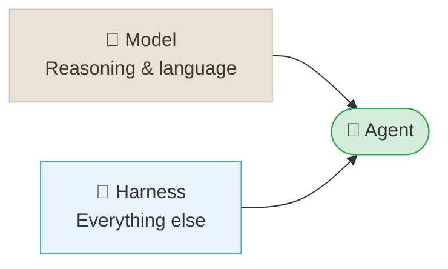
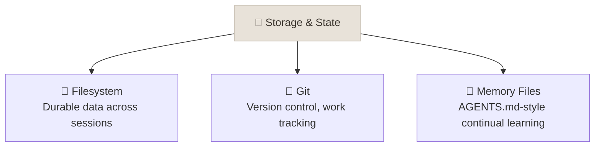
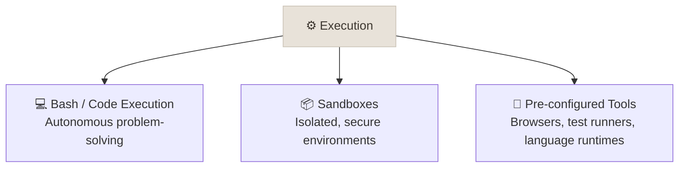
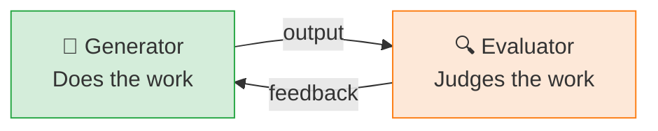

# Harness Engineering

← **Back to Overview:** [Agent Engineering](../INDEX.mdx)

---

## Agent = Model + Harness

Two companies can use the exact same underlying model and get wildly different results. The difference isn't the model - it's everything built around it: how it remembers things, what tools it can reach for, how it recovers when something goes wrong. That surrounding system is the "harness." A brilliant model in a weak harness behaves like a brilliant employee with no filing cabinet, no email access, and no manager - capable, but unable to get much done.

A **harness** is every piece of code, configuration, and execution logic that isn't the model itself: the storage layer, the sandbox, the context-management strategy, the planning and verification loops wrapped around the raw LLM calls. The model supplies intelligence; the harness makes that intelligence functional and durable. Model training increasingly happens "in the loop" with harness design - useful harness primitives (structured tool use, long-context handling) get absorbed into later model generations - but harness optimization for a specific task remains valuable regardless of how capable the base model is.

This note is about the four things a harness is responsible for, and how to know when it's carrying its weight. It's distinct from the [Evaluation Harness](../../06-Agentic-AI/Notes/11-Evaluation-and-Observability.mdx) covered in Agentic AI - that's the CI/grading infrastructure that scores an agent's outputs. This harness is the execution scaffolding the agent runs *inside*.

---

## Component 1 - Storage & State

Models don't remember anything on their own - each call starts fresh. Storage is how an agent keeps a record of what it's done, what it's learned, and what's still in progress, the same way a human worker keeps notes and a filing system instead of re-learning the job every morning.

A filesystem gives an agent durable state that survives a context reset. Git turns that filesystem into a reviewable audit trail - commits become checkpoints an agent (or a human) can diff, revert, or branch from. Memory files (an `AGENTS.md`-style convention) let an agent write down project-specific facts it discovers, so the next session doesn't re-derive them from scratch.

---

## Component 2 - Execution

Execution is what lets an agent actually do things instead of just describing what it would do - run a script, click through a form, execute a test. Sandboxes are the safety boundary: a contained space where the agent can act freely without risking the systems around it.

Bash and code execution give the model a general-purpose escape hatch - instead of requiring a human to pre-build a bespoke tool for every possible action, the agent can write and run code to solve novel problems. Sandboxes (container isolation, syscall filtering, network egress rules) contain the blast radius of that freedom. Pre-configured tools (browsers, test runners, language runtimes) shortcut common tasks the agent would otherwise have to bootstrap from bash primitives.

---

## Component 3 - Context Management

An agent's working memory - its context window - is limited and fills up fast on long tasks. Context management is the discipline of keeping that window full of what matters and empty of what doesn't, so the agent doesn't lose the thread halfway through a task.

Three techniques, in increasing order of aggressiveness:

- **Compaction** - summarizing older turns to reclaim tokens, trading detail for continuity
- **Tool call offloading** - writing large tool outputs to the filesystem instead of the context window, and passing the agent a file path instead of the raw content
- **Progressive disclosure via skills** - packaging domain knowledge as an on-demand reference the agent loads only when relevant, instead of front-loading everything into the system prompt

| Technique | Cost | When to Use |
|-----------|------|-------------|
| Compaction | Lossy - detail is discarded | Context is filling up mid-task |
| Tool call offloading | Cheap - full fidelity preserved | Tool output is large but rarely re-read in full |
| Progressive disclosure | Requires upfront packaging | Domain knowledge is broad but any one task only needs a slice |

---

## Component 4 - Long-Horizon Support

Long-running tasks need more than one continuous conversation - they need checkpoints, handoffs, and someone (or something) double-checking the work. Two ideas do most of the work here: separating the "doer" from the "checker," and resetting context cleanly between phases instead of letting one giant conversation degrade over time.

**Generator-evaluator separation.** Don't rely on an agent to grade its own output - generators exhibit self-bias, rating their own work more favorably than an independent judge would. A dedicated evaluator agent, calibrated for skepticism and given explicit grading criteria, catches what self-review misses. This is the same principle behind [Design Patterns: Reflexion](../../06-Agentic-AI/Notes/07-Design-Patterns.mdx) in Agentic AI, applied at the harness level rather than the prompt level.

**Context resets with structured handoffs.** Rather than letting one session run until it degrades, clear the context window entirely at a phase boundary and start a fresh agent - passing state through a structured handoff (a file, a summary, a task ledger) instead of raw conversation history. This addresses the coherence loss that comes from a context window stretched too thin.

**Sprint contracts.** Agree on a concrete definition of "done" before implementation starts - explicit acceptance criteria the evaluator checks against, not a vague sense of completeness the generator negotiates with itself.

---

## Reassessing Harness Complexity

A harness built for last year's model might be carrying dead weight today. Scaffolding that compensated for a weaker model can become unnecessary overhead once the model improves - and every extra moving part is something that can break or slow things down.

Continuously reassess which harness components are load-bearing. A component built to work around a model limitation (e.g. an elaborate retry-and-validate loop for unreliable tool-call formatting) may become redundant when a newer model handles that case natively. Removing dead scaffolding isn't just cleanup - it reduces latency, cost, and surface area for bugs.

---

## Study Notes

- **Agent = Model + Harness.** The model provides intelligence; the harness is everything that turns that intelligence into durable, safe, effective action.
- **Storage, execution, context management, and long-horizon support** are the four responsibilities a harness carries - miss one and the agent degrades in a predictable way (forgets everything, can't act, loses the thread, or can't sustain multi-phase work).
- **Generators shouldn't grade themselves.** Separating the agent that does the work from the agent that judges it is one of the highest-leverage harness design choices.
- **This is not the same "harness" as an evaluation harness.** One is execution scaffolding around the agent; the other is CI/grading infrastructure that scores the agent's outputs after the fact. See [Evaluation & Observability](../../06-Agentic-AI/Notes/11-Evaluation-and-Observability.mdx).
- **Harnesses should shrink as models improve.** Periodically remove scaffolding that a newer model no longer needs.
