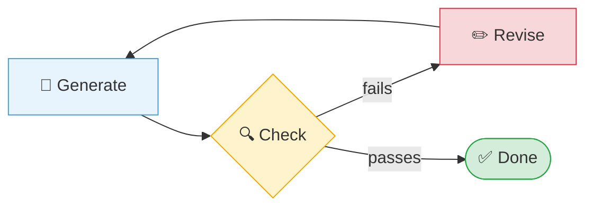

# Loop Engineering

← **Back to Overview:** [Agent Engineering](../INDEX.mdx)

---

## Design Loops, Not Prompts

<div class="audience-biz" markdown="1">

There's a big difference between telling someone "do this one thing" and telling them "keep doing this class of work until it's done, remember what you learned along the way, and only come back to me when you need a real decision." The first is a prompt. The second is a loop. Loop engineering is the shift from being the person who issues instructions to being the person who designs the system that keeps working without you re-issuing them.

</div>

<div class="audience-tech" markdown="1">

A prompt says "do this." A loop says "keep doing this class of work until this condition is true, remember what happened, and stop when judgment is required." This is a distinct concept from [The Agent Loop](../../06-Agentic-AI/Notes/02-The-Agent-Loop.mdx) covered in Agentic AI - that note explains the *mechanics* of a single agent loop (LLM, tool executor, loop controller, termination conditions). This note is about the *design practice* of deciding when and how to build a loop at all, and what makes one trustworthy.

</div>

---

## The Verification Surface

<div class="audience-biz" markdown="1">

A single request has one place it can go wrong. A loop that runs many steps has many places it can go wrong - and worse, a bad step early on can quietly poison every step after it. The more a system iterates, the more it depends on having a reliable way to check its own work.

</div>

<div class="audience-tech" markdown="1">

**A loop is only as trustworthy as the thing it verifies against.** Multi-step loops multiply the verification surface - the number of points where an error can be introduced - relative to a single call. This makes the verifier, not the model, the actual bottleneck on loop quality.

Two verification strategies, with very different reliability profiles:

- **Self-critique** - the model checks its own output. It fails more often than expected: models reward fluent-sounding answers over truthful ones, since they share the same generative process that produced the error in the first place.
- **Source-anchored verification** - a deterministic check that measures whether an answer is actually grounded in real, external source material (geometric similarity measures, logical consistency checks, schema validation) rather than the model's own opinion of itself.

In one measured comparison, self-critique reduced hallucination only marginally (43.3% vs. a 40% single-attempt baseline - no real improvement), while source-anchored verification roughly halved it (19.2%). The lesson generalizes: **loops amplify whatever signal guides them.** A loop wrapped around a weak verifier just repeats the same mistake more confidently.

</div>



---

## The Practice: Six Components

<div class="audience-biz" markdown="1">

Turning "keep working on this" into something that actually runs safely takes more than a clever prompt - it takes real infrastructure: schedules that kick things off, isolated workspaces so parallel work doesn't collide, reusable knowledge instead of re-explaining context every time, connections to real tools, a second pair of eyes checking the output, and a place outside the model's memory where progress is tracked.

</div>

<div class="audience-tech" markdown="1">

| Component | Role |
|-----------|------|
| **Automations** | Scheduled discovery/triage tasks that run on timers, surfacing work without a human kicking it off |
| **Worktrees** | Isolated parallel environments that prevent file collisions between concurrent agent runs |
| **Skills** | Codified, reusable project knowledge - eliminates re-explaining context on every run |
| **Plugins / Connectors** | Integrations (often via MCP) that let the loop act on real external systems, not just talk about them |
| **Sub-agents** | A separate agent for verification, preventing the generator from grading its own work |
| **External state tracking** | Markdown files, issue trackers, or boards that persist progress outside the model - the repository remembers what the model forgets between runs |

</div>

---

## The Economics of a Loop

<div class="audience-biz" markdown="1">

Building a loop takes upfront effort, so it's only worth it when that effort pays off over time. A loop for a one-off task is usually wasted work - just do the task. A loop for something you'll repeat dozens of times, where mistakes are costly, is where the investment earns its keep.

</div>

<div class="audience-tech" markdown="1">

A loop justifies its setup cost when:

```
P * N * (S + R)  >  F
```

Where **P** is the probability the loop succeeds, **N** is the number of future occurrences of the task, **S** is attention saved per occurrence, **R** is risk avoided per occurrence, and **F** is the one-time setup cost.

This kills two common failure modes of loop-first thinking: "automate everything" collapses when N is small (a one-off task never earns back F), and "I'm just faster doing it myself" collapses when it ignores the long-run attention cost across many future occurrences of N.

</div>

---

## Loops Don't Need to Be Code

<div class="audience-biz" markdown="1">

A loop isn't necessarily a piece of software - a repeatable checklist, a standing process, or a CI check that runs the same way every time all count. The goal isn't automation for its own sake; it's eliminating the need to manually re-steer the same class of work every time it comes up.

</div>

<div class="audience-tech" markdown="1">

Loops can take the shape of CI checks, reusable skills, goal cards with explicit stop conditions, or documented processes - the common trait is that they eliminate manual re-steering. The best loops don't just repeat a task; **a great loop improves the environment so the next run is cheaper** - by leaving behind better tests, clearer instructions, or a new automated check. This is the "plant saplings by your base" pattern: rather than fully automating a hard problem in one shot, make the next attempt at it obviously easier, closer at hand, and less dependent on remembering the whole ritual from scratch.

</div>

---

## The Danger: Cognitive Surrender

<div class="audience-biz" markdown="1">

Loop engineering doesn't remove the need for human judgment - it changes where that judgment applies. The risk isn't that loops are unreliable; it's that once something runs on its own, it's tempting to stop paying attention to it entirely. A loop that runs unsupervised doesn't get smarter about its own mistakes - it just makes them faster and at greater scale.

</div>

<div class="audience-tech" markdown="1">

Verification, comprehension, and critical judgment remain the human's job even after a loop is running. Good loop design preserves engineering judgment while gaining speed; poor loop design just automates mistakes at scale, faster than a human would have caught them manually. This is why the [Verification Surface](#the-verification-surface) matters more than the loop's cleverness - a well-verified loop is safe to leave running; a self-graded one is not.

</div>

---

## Study Notes

- **A prompt does a task; a loop keeps doing a class of task until a condition is met, remembering state, and stopping when judgment is required.**
- **The verifier is the bottleneck, not the model.** Self-critique barely improves on a single attempt; source-anchored, deterministic checks roughly halve error rates.
- **A loop needs six supporting pieces to be trustworthy at scale**: automations, worktrees, skills, connectors, sub-agents, and external state tracking.
- **Loops justify their setup cost through repetition** - `P * N * (S + R) > F`. Don't build a loop for a one-off task.
- **A great loop leaves the environment better for the next run** - better tests, clearer instructions, an automated check - not just a repeated action.
- **This note is design philosophy; [The Agent Loop](../../06-Agentic-AI/Notes/02-The-Agent-Loop.mdx) is mechanics.** Read that note for how a loop actually executes (LLM, tool executor, loop controller, termination conditions).
