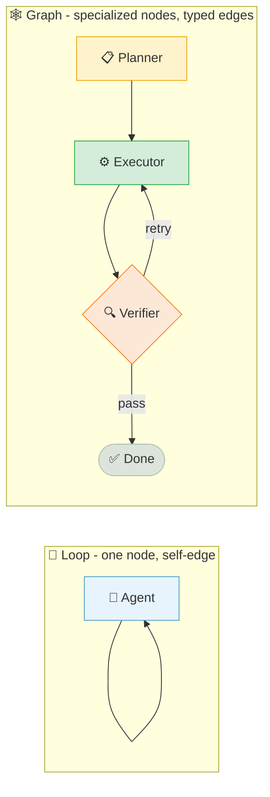
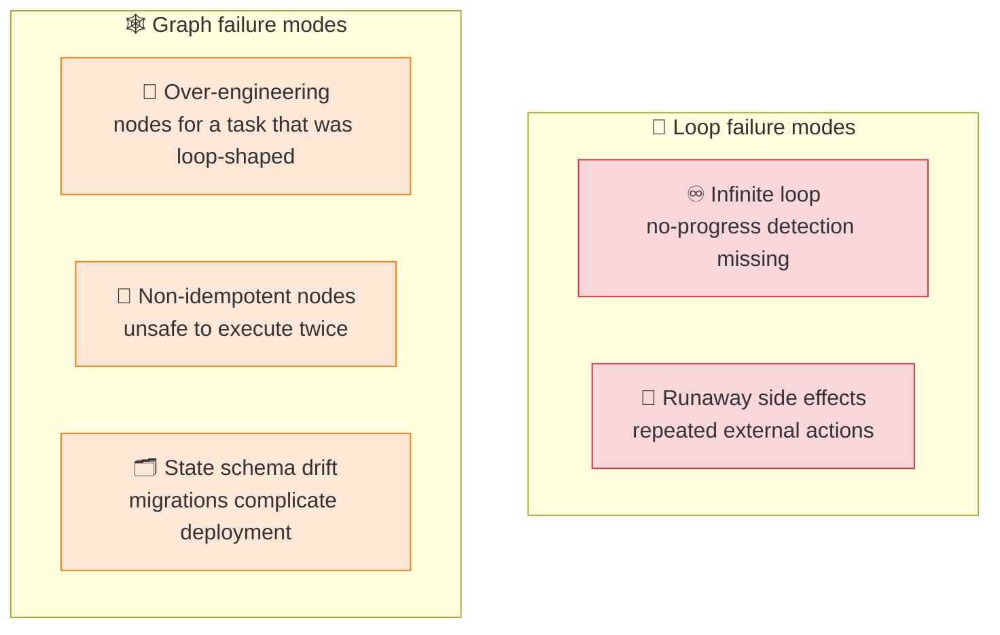

# Graph Engineering

← **Back to Overview:** [Agent Engineering](../INDEX.mdx)

---

## A Loop Is a Graph With One Node

Sometimes one person can handle a whole task end to end, looping through the same steps until it's done. Other times the work genuinely needs to be split across specialists, run in parallel, or checked at specific handoff points before moving forward. A graph is what you build when a single loop can't honestly represent the shape of the work anymore.

A **loop** is a single repeating cycle: an LLM thinks, acts, and observes continuously within one growing context window until a stop condition is met. A **graph** represents a workflow as explicit nodes (units of work) connected by edges, with typed state passed between them. The relationship between the two: **"a loop is a graph with one node and an edge back to itself."** A graph is the more general structure; a loop is its simplest case.

---

## Default to a Loop

Start simple. Most tasks are one well-scoped job with a clear finish line, and a loop handles that fine - it's cheaper to build, easier to debug, and has fewer moving parts than a graph. Reach for a graph only when you can point to a specific reason a single loop won't cut it.

Loops are cheaper to build, debug, and maintain: minimal code, fast prototyping, one context window to reason about. Graphs add real overhead - multiple prompts, coordination latency, more failure points, and nodes that must be idempotent since they may execute more than once. Most agent tasks decompose into one well-scoped job with a clear completion condition, and the actual bottleneck is usually the verifier (the completion check), not the model's ability to plan across steps. Strengthening the verifier often eliminates the perceived need for a graph entirely.

---

## Five Signals That Justify a Graph

| Signal | Why a Single Loop Falls Short |
|--------|-------------------------------|
| **Distinct specialties** | Different phases need separate instructions, context, or expertise that would dilute a single system prompt |
| **Parallelism** | Independent sub-tasks can fan out and join, which a strictly sequential loop can't express |
| **Different models/tools per step** | A cheap model for triage, an expensive one for synthesis - a loop locks you into one model per call |
| **Auditable, branching control flow** | Regulated or high-stakes work needs visible decision points, not an opaque single-context trace |
| **Overloaded verification** | The completion check has grown complex enough to deserve its own dedicated reviewer node |

Name the specific signal forcing additional nodes before adding them. If none apply, the task is still loop-shaped and probably needs a stronger verifier, not more architecture.

In plain terms: split into a graph when different steps genuinely need different skills or tools, when work can happen in parallel instead of one-at-a-time, or when the process needs to be auditable - visible checkpoints a person (or a regulator) can inspect. If none of those apply, a graph is usually just added complexity without added value.

---

## The Sharper Question: What Happens If This Dies Halfway?

Rather than debating architecture in the abstract, ask what happens if the process gets interrupted partway through. If restarting from scratch costs nothing - a few seconds, no side effects - a loop is fine. If picking back up depends on exactly what already happened, or a human needs to sign off before continuing, that's a job for a graph.

**Use a loop if:** the task is bounded and idempotent, restarting costs only seconds, and one decision point repeatedly guides tool selection with no mid-flight human approval needed.

**Use a graph if:** state must survive a restart, genuine branching paths exist, humans approve intermediate outputs, or multiple agents need isolated context boundaries from each other.

This reframes the decision away from topology complexity and toward failure semantics - which tends to produce sharper, less debatable answers than "does this feel complicated enough to need a graph."

---

## Failure Modes on Both Sides

**Loop hazard: infinite loops.** The gravest risk isn't wasted compute - it's repeated external side effects (duplicate emails, duplicate charges) from a loop that never terminates. Four stopping conditions prevent this: maximum iterations, budget caps, wall-clock timeouts, and no-progress detection (the same tool call repeating with identical arguments). This mirrors the [Termination Conditions](../../06-Agentic-AI/Notes/02-The-Agent-Loop.mdx#termination-conditions) already covered for the base agent loop - a graph doesn't remove the need for these, it just adds them per node instead of once.

**Graph hazard: node idempotency and state drift.** A node may execute more than once (retries, restarts from a checkpoint), so it must be safe to run twice with the same input. State schema changes across graph versions complicate deployment - a node written against an old state shape can silently misbehave against a newer one.

**Infrastructure enforcement beats prompt-based rules.** Isolating risky work on separate hardware or in a constrained sandbox protects the surrounding system better than relying on the model to police itself - the isolation boundary decides failure scope, not the topology choice.

---

## The Hybrid Reality

Most real systems aren't purely one or the other. A typical setup uses a graph for the parts that need visibility and checkpoints - the overall shape of the process - while individual steps within that graph run their own small, bounded loop to get their specific job done.

Production systems commonly combine both: a deterministic outer graph manages durable state and inspection points, while bounded loops inside individual nodes handle genuinely uncertain work within defined constraints. This mirrors the "procedural vs. declarative" framing - a loop asks "what's next?" at each step, while a graph asks "what's the system shape?" up front. Neither fully replaces the other; they operate at different architectural zoom levels, and most production agent systems are graphs composed of loop-based nodes.

---

## Study Notes

- **A loop is a graph with one node and a self-edge.** A graph is the general case; reach for it only when a loop genuinely can't represent the work.
- **Default to a loop.** It's cheaper to build, debug, and maintain - most tasks decompose into one well-scoped job with a clear completion condition.
- **Five signals justify a graph:** distinct specialties, parallelism, different models/tools per step, auditable branching, or an overloaded verifier. Name the specific signal before adding nodes.
- **Ask "what happens if this dies halfway?"** instead of debating topology in the abstract - idempotent/bounded work stays a loop; state-dependent/branching/human-gated work needs a graph.
- **Loops risk infinite/runaway execution; graphs risk over-engineering and non-idempotent nodes.** Both need explicit stopping conditions and, for graphs, idempotency guarantees per node.
- **Most production systems are hybrids** - a deterministic outer graph with bounded loops inside individual nodes.
