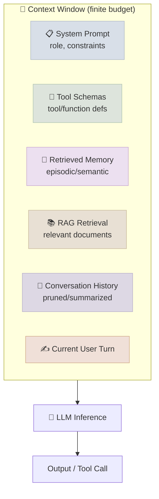
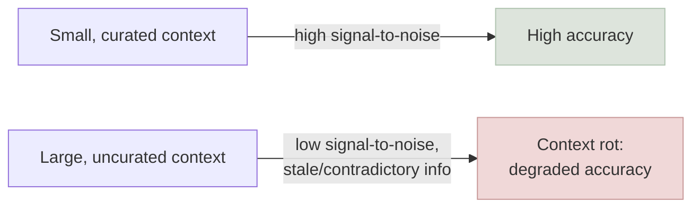

# Context Engineering

← **Back to Overview:** [Agent Engineering](../INDEX.mdx)

---

## Beyond the Prompt: Engineering the Whole Window

If prompt engineering is choosing your words carefully, context engineering is deciding what's in the room when you say them. Every piece of information the model has access to at the moment it answers - documents, chat history, tool descriptions, memory - competes for the same limited space and the same limited attention. Getting that mix right is now its own discipline, and it's the layer [Harness Engineering](01-Harness-Engineering.mdx) sits on top of: a harness with excellent storage and execution can still fail if the context fed into each model call is bloated or stale.

Context engineering is the practice of deliberately constructing the full input to each inference call, not just the instruction text. Production agent failures are disproportionately context failures - stale history, irrelevant retrieval, missing tool results - not wording failures. The context window is a scarce, engineered resource with an explicit budget, not an unbounded scratchpad.

---

## Context Rot: The Core Failure Mode

"Context rot" describes something counter-intuitive: giving a model *more* information doesn't reliably make it smarter - past a point, it makes it worse. Long, cluttered context causes the model to lose track of what actually matters, similar to how a person given a 40-page briefing document may retain the summary less well than if given a focused 2-page memo.

Empirically, model accuracy on needle-in-a-haystack and multi-hop retrieval tasks degrades as irrelevant token count grows, even well within the advertised context window limit. Causes include attention dilution across many low-relevance tokens, contradictory or stale information from earlier in a long session, and instruction-following degradation when the system prompt is far from the generation point. This is why "just use a bigger context window" is not a substitute for context engineering - a bigger window increases the *capacity* for rot, it doesn't prevent it.

---

## Core Techniques

- **Retrieval as curation.** RAG is the most mature context-engineering technique: instead of stuffing every potentially relevant document into context, retrieve only the top-k most relevant chunks at query time.
- **Structured tool/memory schemas.** Verbose or redundant tool descriptions are an avoidable source of context bloat - expose a small, well-described set of capabilities rather than dumping every possible tool up front.
- **Compaction.** When a conversation runs long, periodically compress older turns into a shorter summary or, more robustly, extract structured state (a task ledger of goal/completed-steps/open-items) rather than a rolling narrative summary that can silently drop the original goal.
- **Active pruning.** Remove low-value content as soon as it's identified as low-value - a tool result superseded by a later corrected call, a retrieved document that scored below a relevance threshold after re-ranking.
- **Context isolation.** Give a sub-agent its own clean, narrow context for a sub-task and return only its distilled result to the parent's context, instead of letting the parent's context absorb the sub-task's full working detail.

| Technique | Trades Off | Best For |
|---|---|---|
| Retrieval / RAG | Recall vs. precision | Grounding in large external knowledge bases |
| Structured schemas | Upfront design effort vs. per-call token cost | Tool-heavy agents with many capabilities |
| Compaction | Detail vs. token budget | Long-running single-agent conversations |
| Active pruning | Bookkeeping overhead vs. staying current | Tasks with frequent superseded/corrected results |
| Context isolation | Coordination overhead vs. clean context | Multi-agent / orchestrator-subagent architectures |

---

## Context Engineering vs. Prompt Engineering

| | Prompt Engineering | Context Engineering |
|---|---|---|
| Unit optimized | Wording of one instruction | Full set of tokens across one call |
| Typical fix | Rephrase, add examples, change format | Change what's retrieved, pruned, or included |
| Fails silently as | Vague/inconsistent output | Context rot - degraded accuracy with *more* input |
| Owned by | Whoever writes the prompt | A pipeline: retriever, memory store, tool registry, history manager |

---

## Study Notes

- **Context is a finite, engineered resource**, not a passively-filling scratchpad - treat what enters and what gets evicted as a deliberate design decision.
- **Context rot is real and counter-intuitive**: more tokens can mean worse accuracy, because signal-to-noise ratio degrades, not because the model "runs out of room."
- **A bigger context window is not a fix for poor curation** - it only raises the ceiling on how much noise can accumulate before quality collapses.
- **Retrieval, compaction, active pruning, and context isolation** are the four core techniques - each trades a different resource (recall, detail, bookkeeping, coordination overhead) for a cleaner context.
- **Context engineering is the layer below the harness**: a well-built harness with poorly-curated context still wastes tool calls re-deriving information that should have been visible to the model in the first place.
