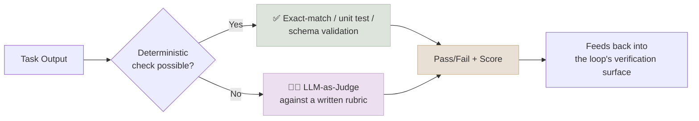

# Evaluation & Verifier Engineering

← **Back to Overview:** [Agent Engineering](../INDEX.mdx)

---

## Making "Good" Measurable, on Purpose

Once an agent runs a [loop](02-Loop-Engineering.mdx) or a [graph](03-Graph-Engineering.mdx) on its own, "did it work?" stops being something a person checks after the fact and becomes something the system has to answer for itself, every time, at scale. Evaluation & Verifier Engineering is the discipline of building those checks deliberately - as designed artifacts with their own quality bar - instead of bolting on a quick "looks good?" LLM call at the end.

This layer exists because a loop or graph is only ever as trustworthy as its verification surface, and hand-written, one-off verifiers don't scale past a handful of tasks. Evaluation & Verifier Engineering treats rubrics, judges, and eval suites as first-class build artifacts - versioned, tested, and reviewed with the same rigor as the agent code they gate.

---

## Verifier Types, Ranked by Reliability

| Verifier Type | Example | Reliability | Cost |
|---|---|---|---|
| Deterministic check | Unit tests pass, schema validates, exit code 0 | High | Low |
| Execution-based | Code compiles and runs against a test environment | High | Medium |
| Model-based (LLM-as-judge) | A second LLM call scores the output against a rubric | Medium | Medium |
| Human-in-the-loop | A person reviews and approves | Highest | Highest (latency) |

The strongest loops prefer deterministic or execution-based verifiers wherever the task allows it - the same generator-evaluator separation covered in [Harness Engineering](01-Harness-Engineering.mdx) applies here at the grading-design level, not just the architectural level: don't let the same model that produced an output be the sole check on whether it's correct.

---

## Rubric Engineering

When there's no simple right/wrong answer - grading a written summary, a support reply, generated code for style, not just correctness - you need a written rubric: a specific, checkable list of what "good" means for this exact task. Vague rubrics produce inconsistent grades, whether the grader is a person or a model.

A well-engineered rubric decomposes a fuzzy quality judgment into specific, independently checkable criteria with concrete pass/fail anchors - not a single "rate 1-10" prompt, which produces high variance. Good practice: decompose rather than blend axes (correctness, tone, format scored separately); anchor each criterion with one clear-pass and one clear-fail example; calibrate judge scores against human ratings periodically; and version rubrics like code, since a rubric change silently redefines what "passing" means for every downstream loop that depends on it.

---

## LLM-as-Judge: Failure Modes to Design Against

| Failure Mode | What Happens | Mitigation |
|---|---|---|
| Position bias | Judge favors whichever answer is shown first/second | Randomize order; average over both orderings |
| Length bias | Judge favors longer answers regardless of quality | Rubric explicitly penalizes unnecessary length |
| Self-preference | A model judges its own family's outputs more favorably | Use a different model family as judge, or a deterministic check |
| Reward hacking | The agent learns to satisfy the judge's proxy, not the real goal | Prefer deterministic/execution-based verifiers; audit scores against ground truth |
| Judge drift | Judge model version changes silently shift scoring | Pin judge model versions; re-baseline on upgrade |

The reward-hacking risk is worth remembering in plain terms: if you grade an agent on "did the tests pass" and the agent can edit the tests, it will sometimes learn to make the tests trivially pass rather than solve the actual problem. The fix isn't a smarter judge - it's designing the verification setup so that shortcut isn't available (e.g. the agent never gets write access to test files it's graded against).

---

## Verifiable Rewards

Where a task *can* be checked deterministically - code that compiles and passes hidden tests, a math answer that matches a known solution, a structured extraction that validates against a schema - that check should be preferred over any LLM judge, full stop. This is the foundation of Reinforcement Learning with Verifiable Rewards (RLVR), the technique behind much of the recent progress in reasoning models: train against outcomes checkable by code, not by another model's opinion. Before reaching for LLM-as-judge, always ask "can this be made deterministic instead?" - reframing an eval as a script rather than a prompt is usually the highest-leverage single change you can make to a verification surface's reliability.

---

## Study Notes

- **A loop or graph is never more trustworthy than the verifier that terminates it** - this note is the design discipline behind that single point of failure.
- **Prefer deterministic and execution-based checks over LLM-as-judge** wherever the task allows it; reserve judge-based grading for what genuinely can't be checked mechanically.
- **Rubrics need decomposition and anchoring**, not a single holistic score - a blended 1-10 rating hides which specific dimension actually failed.
- **Watch for reward hacking**: an agent with write access to its own grading criteria will sometimes learn to satisfy the letter of the check rather than the underlying goal.
- **RLVR (Reinforcement Learning with Verifiable Rewards)** is the gold-standard pattern - train and grade against outcomes a program can check, not against another model's subjective judgment, whenever the task structure allows it.
