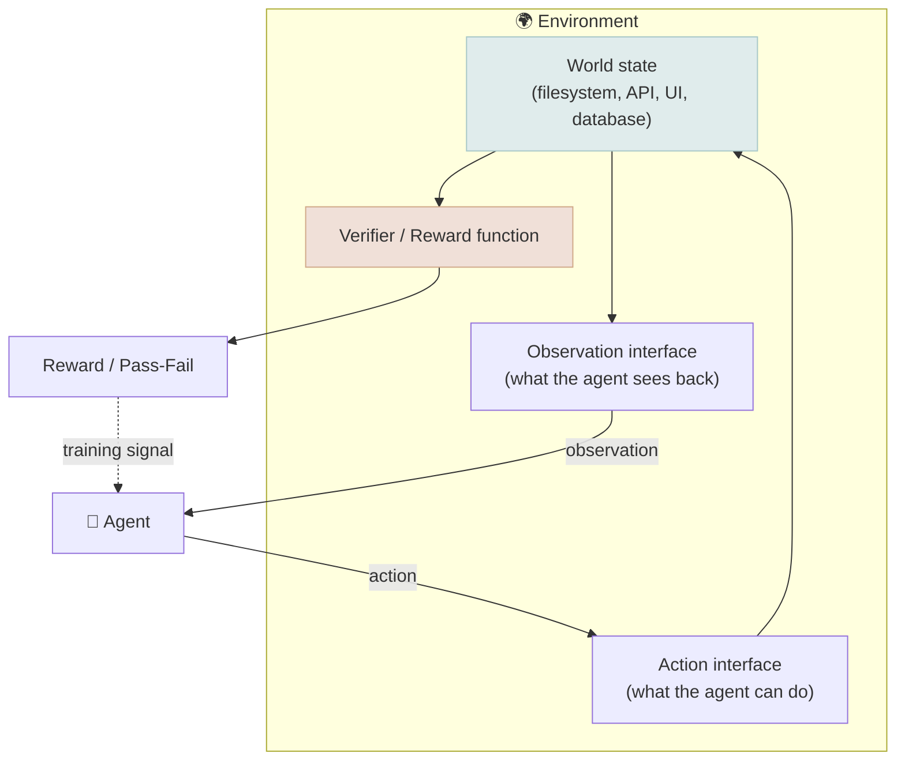

# Environment Engineering

← **Back to Overview:** [Agent Engineering](../INDEX.mdx)

---

## Building the World, Not Just the Agent

Every skill an agent has - writing code, browsing the web, using a spreadsheet - was practiced or tested somewhere: a realistic, safe, repeatable stand-in for the real task. Environment Engineering is the work of building those practice worlds well. As agent capabilities have advanced, teams have found the bottleneck isn't the model anymore - it's how good and how numerous these training/testing worlds are.

An "environment" here means a sandboxed, interactive, gradeable setting an agent acts within: a mock filesystem and shell for a coding task, a simulated browser and website for a web-agent task, a fake customer-support ticket queue for a support-agent task. Environment engineering is the discipline of building these at scale - realistic enough to transfer to production, cheap enough to run thousands of times, and paired with a verifier ([Evaluation & Verifier Engineering](05-Evaluation-and-Verifier-Engineering.mdx)) that produces a reliable reward or pass/fail signal. It's been summarized industry-wide as: "data engineering was the bottleneck for pretraining; environment engineering is the bottleneck for agent post-training."

---

## Anatomy of an Environment

| Component | Responsibility | Design Risk If Done Poorly |
|---|---|---|
| World state | The thing the agent acts on (files, mock DB, simulated site) | Unrealistic state - skills don't transfer to production |
| Action interface | What the agent can do at each step | Too narrow doesn't exercise real capability; too broad isn't gradeable |
| Observation interface | What the agent perceives after acting | Leaks information the real world wouldn't give - inflated eval scores |
| Reward / verifier | Scores the outcome | Gameable - reward hacking (see [Evaluation & Verifier Engineering](05-Evaluation-and-Verifier-Engineering.mdx)) |
| Reset / determinism | Ability to replay from a known state | Non-deterministic environments make results impossible to reproduce or debug |

The "leaks information" risk deserves a concrete example: if a coding environment's observation includes a stack trace that names the exact bug on line 42, the agent didn't practice debugging - it practiced reading stack traces. A well-engineered environment mirrors exactly what a real developer, support agent, or analyst would actually see.

---

## Environment Engineering vs. Harness Engineering

These are easy to conflate because both involve sandboxing and tool interfaces - the distinction is *purpose*, not mechanism:

| | Harness Engineering | Environment Engineering |
|---|---|---|
| Purpose | Let a real agent act safely in production | Let an agent practice/be graded in a controlled proxy of production |
| Optimizes for | Reliability, security, low latency | Realism, reward correctness, reproducibility, diversity of scenarios |
| Consumer | The production agent and its users | Trainers (RL) and evaluators (test suites) |
| Reused across | One product's runtime | Many tasks/models, often shared or sold |

In practice, a good environment and a good harness often share code - a sandbox built to safely run an agent's code in production can often be repurposed, with a reward function bolted on, as a training environment. But the design goals pull in different directions: production optimizes for never crashing; a training environment optimizes for cheaply generating thousands of *varied* failure and success scenarios.

---

## Environment-as-Product

A notable industry shift: environments are increasingly built, sold, and shared as standalone products rather than one-off internal harnesses - specialized providers and open marketplaces now offer pre-built, verified environments (coding sandboxes, browser-agent simulators, enterprise-software mocks) the way labeled datasets were sold for supervised learning a decade earlier. This mirrors the data-engineering-to-MLOps trajectory: a capability starts as an ad hoc internal practice, then becomes tooling, then becomes a market.

---

## Study Notes

- **The bottleneck has shifted**: pretraining was gated by raw data, RLHF-era post-training was gated by labeled preference data, and agent post-training/evaluation is now gated by the breadth and quality of interactive, verifiable environments.
- **An environment and a harness are not the same thing** even though they share sandboxing mechanics - a harness serves production reliability; an environment serves training/eval realism and reproducibility.
- **Observation leakage is a subtle but common design flaw**: an environment that reveals more than the real world would produces inflated scores and skills that don't transfer.
- **Determinism and replayability are non-negotiable** for a usable training/eval environment - a non-reproducible environment makes results impossible to debug or compare across runs.
- **Environments are becoming a market**, not just an internal artifact - expect to increasingly buy or share them rather than build every one from scratch.
