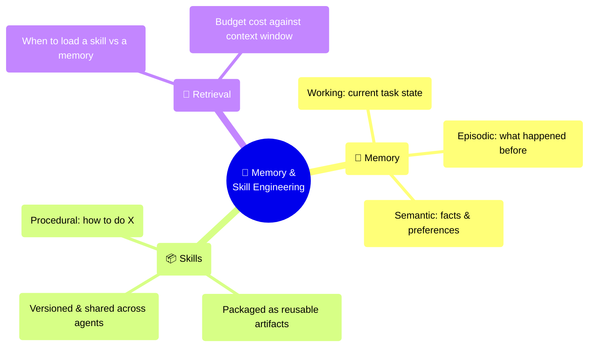
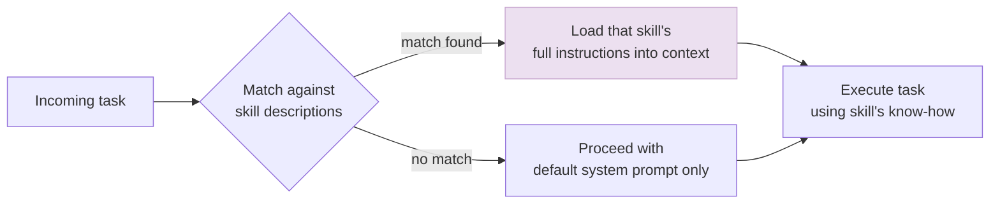

# Memory & Skill Engineering

← **Back to Overview:** [Agent Engineering](../INDEX.mdx)

---

## Packaging Know-How So It Doesn't Get Relearned

Without deliberate design, an agent re-derives the same procedure from scratch every time it faces a familiar task - the same way a new employee would keep re-reading the manual instead of eventually just knowing the process. Memory & Skill Engineering is about capturing what an agent has already figured out and packaging it so it can be reused directly, instead of being silently re-earned at the cost of tokens, time, and the risk of a different (possibly worse) approach next time.

This note separates two related but distinct problems bundled under "memory" in [Harness Engineering](01-Harness-Engineering.mdx)'s storage component: **memory** (facts, preferences, and history an agent should recall) and **skills** (packaged procedural knowledge - how to do something - that an agent should reuse). This treats procedural knowledge specifically as an engineering artifact with its own packaging format, versioning, and distribution concerns - the design behind Claude's Agent Skills and similar "skill library" patterns.

---

## Memory Engineering: Treating Recall as a Subsystem

Memory engineering makes memory an explicit, queryable subsystem - a store with a write path, a read/retrieval path, and an eviction policy - rather than letting "whatever's still in the context window" serve as the agent's only memory. Concretely:

- **Explicit write policy** - what gets persisted after a session (a summary, a structured fact, a corrected mistake) versus discarded as noise.
- **Retrieval strategy** - semantic search over a vector store, structured key-value lookup, or a hybrid, chosen per memory type.
- **Conflict resolution** - what happens when a new memory contradicts an old one: overwrite, version, or flag for review.
- **Budget-aware injection** - memory retrieval competes for the same context budget as everything else in [Context Engineering](04-Context-Engineering.mdx); a memory system that always injects everything it has defeats the purpose.

---

## Skill Engineering: Procedural Knowledge as a Shippable Artifact

A "skill" here is a packaged how-to - written instructions, example code, or a checklist for doing one specific kind of task well - that an agent can pull in only when it's relevant, rather than needing that entire body of knowledge stuffed into every conversation by default.

Skill engineering formalizes procedural memory as a discoverable, on-demand artifact: a self-contained bundle (instructions, optionally scripts/templates) with metadata describing when it applies, loaded into context only when the agent's current task matches that description. This is exactly the progressive-disclosure technique named in [Harness Engineering](01-Harness-Engineering.mdx)'s context-management component, elevated here into its own discipline: instead of one enormous system prompt trying to cover every possible task, expose a directory of narrow, well-scoped skills and let the model (or a router) select which one to load.

| Property | Why It Matters |
|---|---|
| Discoverable | Agent (or router) can find the right skill without every skill being loaded upfront |
| Scoped | One skill = one well-defined capability, not a grab-bag |
| Versioned | Skills improve over time; a bad update to a widely-used skill has broad blast radius |
| Composable | Skills can reference or call other skills/tools rather than duplicating logic |
| Context-cheap by default | Only the *description* costs context until the skill is actually selected |

---

## Memory vs. Skills vs. Context

| | Context (this call) | Memory | Skill |
|---|---|---|---|
| Answers | "What do I know right now, for this turn?" | "What have I learned about this user/task over time?" | "How do I competently perform this class of task?" |
| Lifespan | One inference call | Persists across sessions | Persists across agents/tasks, often team-wide |
| Engineered by | Context-assembly pipeline | Memory read/write/retrieval policy | Skill authoring, packaging, and routing |

---

## Study Notes

- **Memory and skills are distinct engineering problems** even though both live under "long-term knowledge" - memory answers what happened; skills answer how to do something.
- **A memory system needs an explicit write/retrieval/conflict policy**, not implicit reliance on the context window holding everything.
- **Skills should be discoverable, scoped, versioned, composable, and context-cheap by default** - the same progressive-disclosure principle from [Harness Engineering](01-Harness-Engineering.mdx), formalized into a packaging format.
- **A skill-aware, memory-aware agent stops re-deriving procedure from first principles** on every task, converging faster in its loop because it reuses a known-good approach instead of reasoning one out fresh each time.
