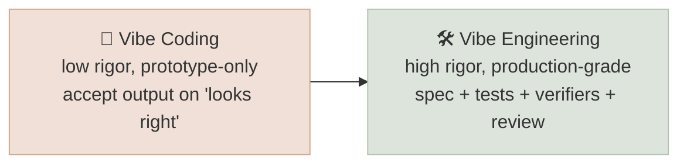
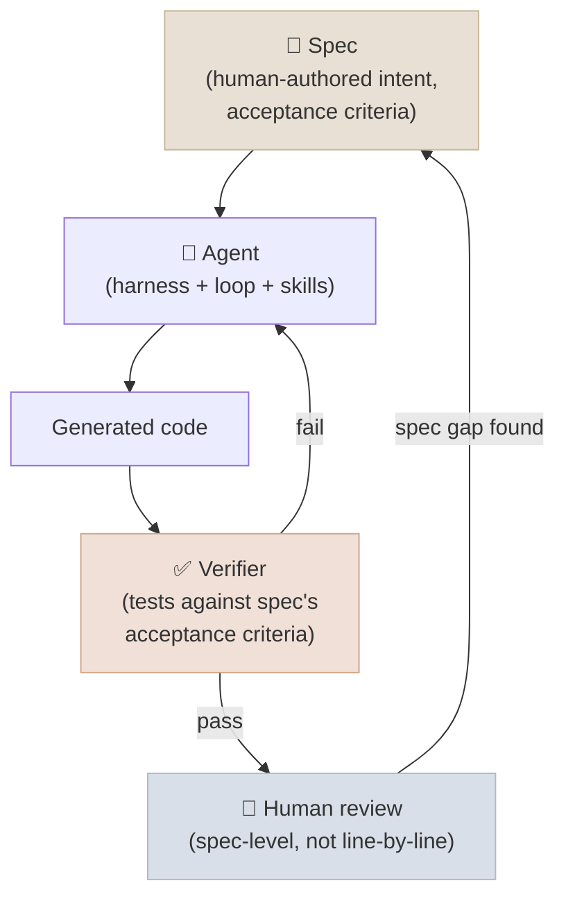

# Spec & Vibe Engineering

← **Back to Overview:** [Agent Engineering](../INDEX.mdx)

---

## Where the Stack Points for Everyday Software Delivery

Everything else in this chapter is infrastructure - harness, loop, graph, context, verifiers, environments, skills. This note is about what changes in the day-to-day work of *building software* once all of that infrastructure is in place: increasingly, the human's job shifts from writing code line-by-line to writing clear specifications and steering agents that write, test, and revise the code themselves.

"Vibe coding" originally described a casual, low-rigor mode of building with an AI coding assistant - accepting generated code on the strength of "it looks right" without close review, suited to prototypes and throwaway scripts. "Vibe engineering" names the *disciplined* evolution of that practice for production work: still driven by natural-language intent rather than hand-typed code, but wrapped in the rigor the rest of this chapter provides - specs, tests, verifiers, and review - so speed doesn't come at the cost of correctness.

---

## Spec-Driven Development

A spec is a written, unambiguous description of what needs to be built - inputs, outputs, edge cases, acceptance criteria - written *before* any code, by the human or in close collaboration with an agent. The discipline is treating the spec, not the eventual code, as the primary source of truth for what "correct" means.

Spec-driven development flips the traditional relationship between spec and code: instead of a spec as documentation that quickly goes stale once code diverges, the spec is the artifact humans review and edit, and code becomes a compiled-from-spec output agents can regenerate or extend. This only became practical once the earlier notes in this chapter existed to close the loop - a spec is only as trustworthy as the harness executing it, the loop or graph deciding when it's satisfied, and the verifier confirming the generated code actually meets it.

---

## What Changes About the Human's Role

| | Traditional Development | Vibe Engineering |
|---|---|---|
| Primary human output | Code | Spec + review criteria + verifiers |
| Review unit | Line-by-line diff | Does the behavior satisfy the spec? |
| Where rigor lives | Code review, style guides | Spec clarity, test/verifier coverage, harness permissions |
| Bottleneck | Typing and debugging speed | Spec precision and verification coverage |
| Risk if done poorly | Slow, correct code | Fast, confidently-wrong code ("vibe coding" without the engineering) |

The risk column is the entire argument for the "engineering" half of the term: an agent operating from a vague spec, with a weak verifier, and no harness-level guardrails, produces plausible-looking code quickly and confidently - and that combination is more dangerous than slow, correct code, because the failure isn't visible until later. Every earlier note in this chapter exists to prevent exactly that outcome: a good harness limits blast radius, a good verifier catches wrong-but-plausible output, and a good spec removes the ambiguity a model would otherwise have to guess at.

---

## Practical Guardrails

1. **Write acceptance criteria as tests, not prose.** "Handle errors gracefully" is unverifiable; "given malformed input X, return error code Y" is a test case waiting to be run - tying directly back to [Evaluation & Verifier Engineering](05-Evaluation-and-Verifier-Engineering.mdx).
2. **Review at the spec level, not just the diff.** A correct-looking diff against an ambiguous spec is not evidence of correctness.
3. **Scope the harness to the task.** An agent implementing a feature spec shouldn't have unscoped production database access - least-privilege from [Harness Engineering](01-Harness-Engineering.mdx) applies directly here.
4. **Keep a human in the loop at spec-approval and final-review gates**, not every intermediate step - oversight at the decision points that matter, not micromanagement of every token generated.
5. **Version specs like code.** A spec that changes without the corresponding tests/verifiers being updated silently invalidates the guarantees the review process assumed.

---

## This Is the Frontier, Not the Finish Line

Unlike harness, loop, and graph engineering - which have matured into fairly settled disciplines - spec and vibe engineering conventions and even terminology are still actively being defined and contested industry-wide. Treat this note as a snapshot of where the field is now, not a settled discipline.

---

## Study Notes

- **Vibe coding and vibe engineering are not the same thing** - one is casual/prototype-only, the other wraps the same natural-language-driven workflow in production rigor (specs, tests, verifiers, review).
- **In spec-driven development, the spec - not the code - is the primary source of truth**, made viable only because harness/loop/graph/verifier engineering close the gap between "spec says X" and "code does X."
- **Review shifts from line-by-line diffs to spec conformance** - does the observed behavior satisfy the acceptance criteria, and was the spec itself right?
- **This is the least settled note in the chapter** - expect vocabulary and best practices here to keep changing faster than harness/loop/graph engineering have.
