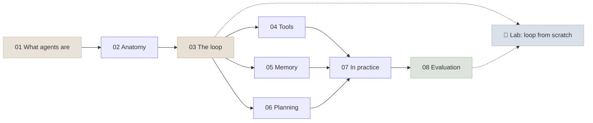

# 12 - Agent Foundations

An AI agent is a model that directs its own process: it reads its context, decides on an action (usually a tool call), observes the result, and repeats until the goal is met. This module builds that idea from first principles - the definition, the components, the loop, tools, memory, planning, where agents work and how to evaluate one - before later modules add protocols (13), multi-agent patterns (14), frameworks (15), production concerns (16) and harness engineering (17).

```objectives
scope: module
time: 9-11 hours (notes + lab)
outcomes:
  - Decide whether a task needs a single call, a workflow or an agent, and at what autonomy level
  - Write a correct tool-use loop against the Claude and OpenAI APIs and against any OpenAI-compatible server, with bounds and error handling
  - Design tools, schemas and error messages a model uses reliably, and scale to large tool sets
  - Design working memory, task state and long-term memory (semantic, episodic, procedural) with their risks
  - Choose a planning strategy and know when reflection helps
  - Evaluate an agent on environment state with pass^k over repeated trials
prerequisites:
  - "[LLM Foundations](../01-LLM-Foundations/INDEX.mdx) - tokens, context windows, sampling"
  - "[Prompt & Context Engineering](../10-Prompt-Engineering/INDEX.mdx) - system prompts, structured outputs, context engineering"
  - "[RAG](../11-RAG/INDEX.mdx) - retrieval, which agents use as a tool"
```

## Where This Module Fits



## Chapter Map

| # | Chapter | You will learn | Time |
|---|---|---|---|
| 1 | [What Are AI Agents](Notes/01-What-Are-AI-Agents.mdx) | Agents vs workflows, the autonomy spectrum, why now, the decision test | 40 min |
| 2 | [Anatomy of an AI Agent](Notes/02-Anatomy-of-an-AI-Agent.mdx) | Model + harness: instructions, tools, memory, orchestration, guardrails, environment | 35 min |
| 3 | [The Agent Loop](Notes/03-The-Agent-Loop.mdx) | Correct loops for Claude and OpenAI APIs, invariants, stop reasons, bounds, failures | 60 min |
| 4 | [Tool Use & Function Calling](Notes/04-Tool-Use-and-Function-Calling.mdx) | Strict schemas, tool_choice, tool design, errors, idempotency, tool search | 60 min |
| 5 | [Agent Memory](Notes/05-Agent-Memory.mdx) | One taxonomy; context management; checkpoints; Letta, Mem0, Zep, LangMem; poisoning | 60 min |
| 6 | [Planning & Reasoning](Notes/06-Planning-and-Reasoning.mdx) | Reasoning models, ReAct, plan-and-execute, ReWOO, LLMCompiler, reflection, todo lists | 50 min |
| 7 | [Agents in Practice](Notes/07-Agents-in-Practice.mdx) | Good use cases, personal vs enterprise, human-in-the-loop, build or buy | 40 min |
| 8 | [Agent Evaluation Basics](Notes/08-Agent-Evaluation-Basics.mdx) | State-based grading, pass@k vs pass^k, first test sets, failure taxonomies | 45 min |
| 9 | [Q&A Review Bank](Notes/09-Interview-QA-Bank.mdx) | 46 questions across the module | 60 min |

## Code Lab

| Lab | What you build | Runs on |
|---|---|---|
| [Agent Loop from Scratch](CodeLabs/01-Agent-Loop-from-Scratch.mdx) | A tool-use loop with validation and bounds over a small retail environment, graded on database state with pass^k across prompt and tool-description variants | Any OpenAI-compatible endpoint: a local Qwen3 on a laptop (mlx-lm, Ollama, vLLM) or a hosted API |

## Mini-Project

Build and evaluate a **single agent for a domain you know** (an internal help desk, a lab-inventory assistant, a personal finance helper):

1. An environment with 4-8 tools, at least two of them write tools with preconditions enforced in code, and a reset function.
2. A test set of 40 tasks across the six categories in [Agent Evaluation Basics](Notes/08-Agent-Evaluation-Basics.mdx), each with an expected end state.
3. The loop from the lab (or a framework), with bounds, argument validation and informative errors.
4. Results: pass@1 with a confidence interval, pass^4, per-task counts, tokens and seconds per episode.
5. A failure taxonomy from the traces, one targeted fix, and before/after numbers.

## Review

- [Q&A Review Bank](Notes/09-Interview-QA-Bank.mdx) - consolidated questions for this module
- [Knowledge Check: Agents](../Interview-Questions/09-Agents.mdx) - short-form review

---

Previous: [11 - RAG](../11-RAG/INDEX.mdx) · Next: [13 - MCP & A2A](../13-MCP-and-A2A/INDEX.mdx)
