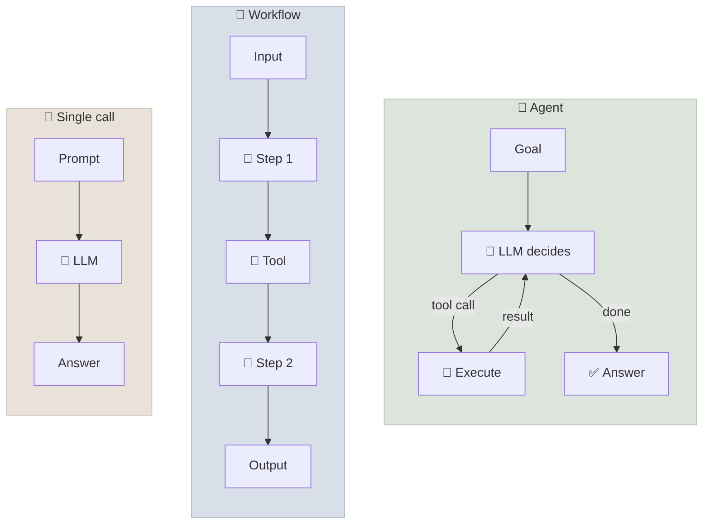
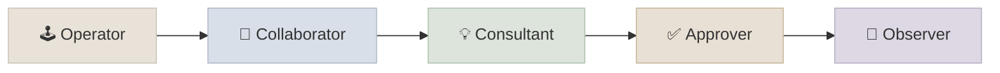
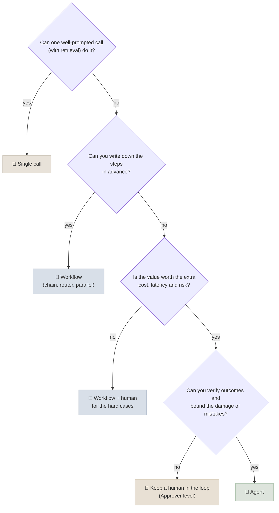

# What Are AI Agents

An AI agent is a system in which a language model **directs its own process** - choosing which tools to call, reading the results and deciding what to do next - in a loop, until a goal is met or it stops. This chapter pins down that definition, places agents on the spectrum from a single model call to fully autonomous systems, and gives a test for when an agent is the right design and when it isn't.

```objectives
time: 40 min
outcomes:
  - Define an agent and distinguish it from a single LLM call, a chain and a workflow by who controls the sequence of steps
  - Place a product on the autonomy spectrum and name the human's role at each level
  - Explain why agents became practical in 2025-26, citing measured trends rather than anecdotes
  - Decide, with reasons, whether a given task should be built as a workflow or an agent
prerequisites:
  - "[Prompt & Context Engineering](../../10-Prompt-Engineering/INDEX.mdx) - how models use context"
  - "[RAG Fundamentals](../../11-RAG/Notes/01-RAG-Fundamentals.mdx) - retrieval as a building block"
```

## The Definition That Matters: Who Controls the Next Step?

Anthropic's widely used framing (*Building Effective Agents*, 2024) draws the line at control flow:

- **Workflows** are systems where LLMs and tools are orchestrated through **predefined code paths**.
- **Agents** are systems where LLMs **dynamically direct their own processes and tool usage**.

Both are *agentic systems*; the difference is whether your code or the model decides the next step. OpenAI's guide says the same thing from the user's side: an agent is a system that independently accomplishes a task on your behalf, using a model to manage the workflow, choose tools and recognise when it is done.

<div class="audience-biz" markdown="1">

A chatbot answers a question. A workflow runs the same steps every time, like a recipe. An agent is given a goal and works out the steps itself - looking things up, taking actions, checking results and changing course - which makes it far more flexible and also harder to predict, test and govern.

</div>

<div class="audience-tech" markdown="1">

Mechanically, an agent is **a model using tools in a loop**: call the model, execute any tool calls it emits, append the results to the context, call it again. The loop ends when the model answers without calling a tool, or when a bound (steps, tokens, time, cost) stops it. Everything else - memory, planning, multi-agent orchestration - is built on that loop ([The Agent Loop](03-The-Agent-Loop.mdx)).

</div>



| | Single LLM call | Workflow (chain / pipeline) | Agent |
|---|---|---|---|
| **Who picks the next step** | Nobody - one step | Your code, fixed in advance | The model, at run time |
| **Number of steps** | 1 | Fixed (possibly branching) | Variable, unknown in advance |
| **Handles surprises** | No | Only the branches you wrote | Yes - it can re-plan |
| **Cost and latency** | Lowest, predictable | Predictable | Higher, variable |
| **Testability** | Easy | Easy - each step testable | Hard - many possible trajectories |
| **Example** | "Classify this ticket" | "Extract fields → validate → write to CRM" | "Resolve this customer's billing problem" |

### Vocabulary used throughout the agents track

| Term | Meaning |
|---|---|
| **Tool** | A function the model can ask your code to run, described by a name, description and JSON Schema |
| **Harness** (or scaffold) | The code around the model: the loop, tool execution, context management, bounds, guardrails |
| **Trajectory** | The full sequence of model outputs, tool calls and results in one run |
| **Episode** | One run of an agent on one task, from goal to termination |
| **Environment** | Everything the agent acts on through tools - APIs, files, a browser, a database |
| **Augmented LLM** | A model with retrieval, tools and memory available - the building block of both workflows and agents |
| **Compound AI system** | Any system combining several model calls, retrievers and tools (Zaharia et al., BAIR 2024) |

---

## The Autonomy Spectrum

Autonomy is a design decision, separate from capability: a highly capable agent can still be deployed with a human approving every action. Feng, McDonald and Zhang (2025) define five levels by **the role the user plays**:

| Level | User role | What the agent does | Example |
|---|---|---|---|
| 1 | **Operator** | Acts only when the user directs each step | Inline code completion |
| 2 | **Collaborator** | Works alongside the user; either can take the lead | Pair-programming in an IDE chat |
| 3 | **Consultant** | Leads the work and asks the user for input and preferences | A research agent that checks scope with you |
| 4 | **Approver** | Works independently; the user approves high-risk actions | A support agent that needs sign-off before issuing refunds |
| 5 | **Observer** | Acts fully autonomously; the user can monitor and stop it | A nightly dependency-upgrade agent opening pull requests |



Most production agents that take consequential actions sit at **Approver**: they do the work, and a person confirms the irreversible steps (payments, deletions, external messages). Move right only as your evaluation evidence and guardrails justify it ([Agents in Practice](07-Agents-in-Practice.mdx)).

---

## Why Agents Became Practical

Agents built on 2023 models (AutoGPT, BabyAGI) were famous for looping, losing the goal and hallucinating actions. Three things changed:

1. **Models trained for tool use and long horizons.** Frontier models are now post-trained with reinforcement learning on multi-step agentic tasks (coding, browsing, tool use), not just on single responses - see [Post-training & Reasoning](../../04-Post-Training/INDEX.mdx).
2. **Reasoning between actions.** Reasoning models think before each tool call and can interleave thinking with tool results, which makes planning and error recovery native rather than prompted ([Planning & Reasoning](06-Planning-and-Reasoning.mdx)).
3. **Measured, steady progress on long tasks.** METR measured the length of software tasks (in human time) that models complete with 50% reliability: it has doubled roughly every seven months since 2019, reaching about 50 minutes for early-2025 frontier models (Kwa et al., 2025).

Two cautions follow from the same evidence. The 50% horizon is a *coin-flip* reliability level - production needs far higher. And reliability over repeated attempts is much lower than single-attempt success: on τ-bench, agents that solved a task once often failed it on a rerun ([Agent Evaluation Basics](08-Agent-Evaluation-Basics.mdx)).

---

## Workflow or Agent? A Decision Test

The best first design is usually the simplest one that works. Anthropic's advice: start with a single well-prompted call with retrieval; add a workflow when the steps are known; use an agent only when the steps genuinely can't be predicted.



| Signal | Points to a workflow | Points to an agent |
|---|---|---|
| Path through the task | Same every time | Depends on what you find along the way |
| Inputs | Structured, well-defined | Open-ended requests |
| Cost of a wrong step | High and irreversible | Recoverable, or gated by approval |
| Volume and latency needs | High volume, tight latency | Lower volume, minutes are acceptable |
| How you know it worked | Per-step checks | An outcome check (tests pass, ticket resolved) |

Coding is the canonical agent use case for exactly these reasons: the path is unpredictable, but the outcome is verifiable (tests, type checks) and changes are reversible (version control). The workflow patterns themselves - chaining, routing, parallelization, orchestrator-workers, evaluator-optimizer - are covered in [Agent Patterns](../../14-Agent-Patterns/INDEX.mdx).

---

## Check Yourself

```quiz
- q: "What distinguishes an agent from a workflow in Anthropic's definition?"
  options:
    - "In an agent the model decides the next step at run time; in a workflow the code path is predefined"
    - "Agents use tools and workflows don't"
    - "Agents use larger models"
    - "Workflows can't call more than one model"
  answer: 1
  explain: "Both can call tools and several models. The difference is control flow: predefined code paths versus the model directing its own process."
- q: "A support agent drafts refunds and a human must confirm each one before it is issued. Which autonomy level is this?"
  options: ["Operator", "Consultant", "Approver", "Observer"]
  answer: 3
  explain: "The agent works independently and the user approves high-risk actions."
- q: "METR's time-horizon measure reports the task length models complete with what reliability?"
  options: ["50%", "80%", "95%", "99%"]
  answer: 1
  explain: "It is the 50% horizon - a useful trend line, but well below production reliability."
- q: "A team wants an 'agent' that extracts five fields from invoices and writes them to an ERP. What would you build first, and why?"
  answer: "A workflow: the steps are known and identical every time (extract with structured output → validate → write). It is cheaper, faster and testable per step. Add an agentic fallback, or a human, only for invoices that fail validation."
```

## Exercises

```exercise
- title: Classify five systems
  task: |
    For each system, say whether it is a single call, a workflow or an agent, and give its autonomy level: (a) a spam filter; (b) a pipeline that transcribes a call, summarises it and files the summary in the CRM; (c) an IDE assistant that edits several files to fix a failing test and asks before running shell commands; (d) a bot that answers HR questions from a policy index; (e) a nightly job where a model reads error logs, decides which service to investigate and opens a ticket with its findings.
  solution: |
    (a) Single call, no user role in the loop. (b) Workflow - fixed three steps. (c) Agent; Approver level for shell commands, Collaborator overall. (d) Single call with retrieval (RAG), or a small workflow; not an agent unless it decides among tools. (e) Agent - it chooses what to investigate - at Observer level, which is acceptable because its only side effect is opening a ticket.
- title: Argue the design
  task: |
    Pick a task from your own work that someone has proposed "building an agent" for. Walk it through the decision test in this chapter and write half a page recommending single call, workflow or agent, including the autonomy level and what would have to be true to move one level to the right.
  solution: |
    A good answer names the steps (or explains why they can't be named), estimates the cost of a wrong action, identifies an outcome check, and states the evidence needed to raise autonomy - for example "pass^4 above 95% on 200 representative tasks and no policy violations in a four-week shadow deployment".
```

## Study Notes

- Agent = a model directing its own process: tools in a loop, deciding the next step itself
- Workflow = predefined code paths around model calls; both are "agentic systems"
- The difference is who controls the sequence of steps - not whether tools or multiple models are used
- Autonomy levels by user role: operator, collaborator, consultant, approver, observer; consequential agents usually start at approver
- Agents became practical through RL post-training on agentic tasks, reasoning between actions, and a steady rise in task horizon (≈7-month doubling, METR)
- Start with the simplest design; use an agent when steps can't be predicted, outcomes can be verified, and mistakes can be bounded

## References

- Anthropic, [Building Effective Agents](https://www.anthropic.com/engineering/building-effective-agents) (Dec 2024)
- OpenAI, [A Practical Guide to Building Agents](https://cdn.openai.com/business-guides-and-resources/a-practical-guide-to-building-agents.pdf) (2025)
- Zaharia et al., [The Shift from Models to Compound AI Systems](https://bair.berkeley.edu/blog/2024/02/18/compound-ai-systems/) (BAIR, 2024)
- Feng, McDonald and Zhang, [Levels of Autonomy for AI Agents](https://arxiv.org/abs/2506.12469) (2025)
- Kwa et al., [Measuring AI Ability to Complete Long Software Tasks](https://arxiv.org/abs/2503.14499) (METR, 2025)
- Yao et al., [τ-bench: A Benchmark for Tool-Agent-User Interaction in Real-World Domains](https://arxiv.org/abs/2406.12045) (2024)

*Last reviewed: 2026-09*
