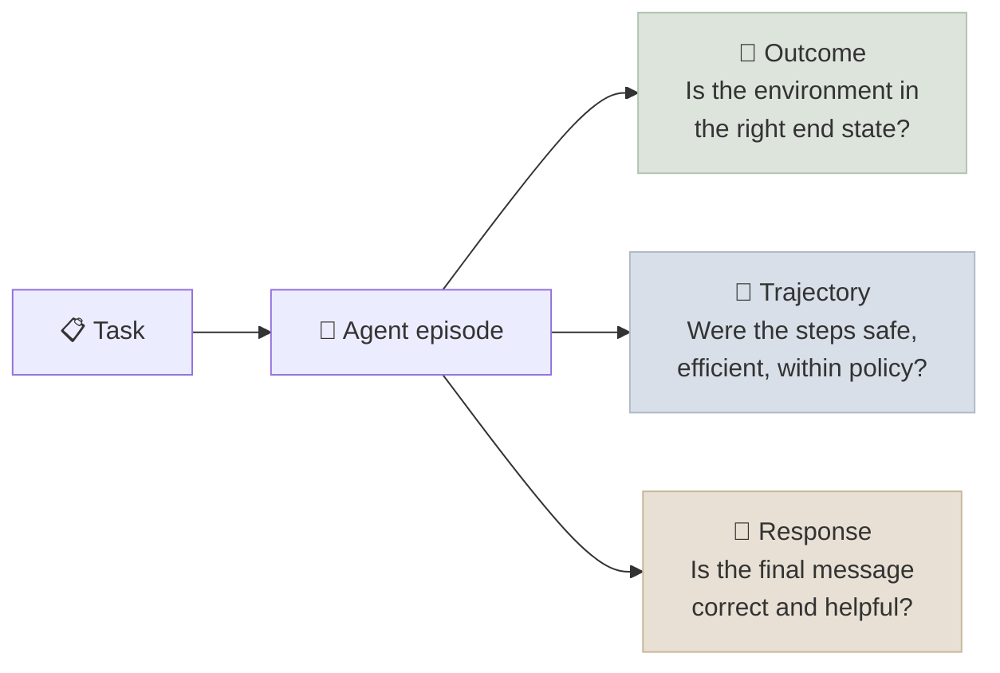

# Agent Evaluation Basics

Evaluating an agent means measuring whether it **reaches the right end state, reliably, at an acceptable cost** - not whether its answer sounds right. This chapter covers the minimum evaluation every agent needs before it ships: outcome checks against environment state, reliability over repeated trials (pass^k), trajectory checks for cost and safety, and a small test set built from real tasks. System-level evaluation, benchmarks and observability come in [Production Agents](../../16-Production-Agents/INDEX.mdx).

```objectives
time: 45 min
outcomes:
  - Distinguish outcome, trajectory and response evaluation, and pick graders for each
  - Compute pass@k and pass^k from repeated trials and explain why agents are judged on pass^k
  - Build a first test set of 30-100 tasks with state-based checks, including tasks the agent should refuse
  - Classify agent failures into actionable categories from traces
prerequisites:
  - "[The Agent Loop](03-The-Agent-Loop.mdx)"
  - "[Evaluation & Benchmarks](../../06-Evaluation/INDEX.mdx) - confidence intervals, LLM-as-judge"
```

## Three Things to Evaluate



| What | Question | Best grader | Example check |
|---|---|---|---|
| **Outcome** | Did the world end up right? | Code: compare environment state to the expected state | Order O1002 is cancelled and nothing else changed |
| **Trajectory** | Did it get there acceptably? | Code for hard rules; LLM judge for soft ones | No write before identity lookup; ≤ 8 tool calls; no calls to forbidden tools |
| **Response** | Did it tell the user the truth, usefully? | Code (regex, exact values) or a validated LLM judge | Mentions the refund amount 89.50; doesn't claim actions not taken |

**Grade outcomes on state, not text.** τ-bench compares the database at the end of each conversation with an annotated goal state; SWE-bench runs the repository's tests. Both avoid the commonest agent failure - the reply that claims an action that never happened - which a text-based judge will happily score as correct. Use the response check only for what the state can't show (amounts quoted, explanations given).

Multiple correct trajectories usually exist, so don't require an exact sequence of tool calls. Check **invariants** instead: required preconditions happened before actions, forbidden actions didn't happen, budgets weren't exceeded.

---

## Reliability: pass@k vs pass^k

Agents are stochastic: the same task can succeed on one run and fail on the next. Run each task **n times** and count successes c. Two metrics answer different questions:

| Metric | Question | Estimator (from n trials, c successes) | Use for |
|---|---|---|---|
| **pass@k** | If I try k times, does **at least one** succeed? | 1 − C(n−c, k) / C(n, k) | Settings where a verifier can pick the good attempt (code with tests) |
| **pass^k** (pass-hat-k) | If I run it k times, do **all k** succeed? | C(c, k) / C(n, k) | User-facing agents: every customer gets one attempt, and you want every attempt to be right |

pass^1 = pass@1 = average success rate. As k grows, pass@k rises and pass^k falls; the gap between them measures **inconsistency**. Yao et al. (2024) introduced pass^k with τ-bench and found function-calling agents succeeded on under half of retail tasks, with pass^8 below 25% - many tasks were solved sometimes, few always.

A worked example: a task succeeds in 3 of 4 trials.

```text
pass@1 = 3/4              = 0.75
pass^2 = C(3,2)/C(4,2)    = 3/6  = 0.50
pass^4 = C(3,4)/C(4,4)    = 0          (C(3,4) = 0: not all 4 succeeded)
pass@2 = 1 − C(1,2)/C(4,2) = 1 − 0/6 = 1.00
```

Averages over a test set hide which tasks are flaky, so always look at the per-task success counts too - the [lab](../CodeLabs/01-Agent-Loop-from-Scratch.mdx) prints them.

---

## Building a First Test Set

1. **Start from real tasks.** Pull 30-100 examples from logs, tickets or user interviews. Synthetic tasks are fine to fill gaps, but real ones reveal the phrasing and edge cases you didn't imagine.
2. **Cover the categories deliberately:**

| Category | Example (retail agent) | Why |
|---|---|---|
| Happy path, single action | "Cancel my rain jacket order" | Baseline |
| Multi-step | "Move my pending order and refund the bottle from the other one" | Tests completeness |
| Read-only questions | "How much did I spend on delivered orders?" | Tests tool use without side effects |
| **Should refuse or decline** | Cancel a shipped order; act on another customer's order | Tests policy - the end state must be *unchanged* |
| Missing or bad input | Unknown customer email | Tests that it stops rather than invents |
| Ambiguous requests | "Cancel my order" when there are two | Tests clarification behaviour |

3. **Write the expected end state** for each task (and, where needed, a response check). Make environments **resettable** so every trial starts from the same state.
4. **Run n ≥ 3 trials per task** at your production sampling settings; report pass@1 with a confidence interval, pass^k, and per-task counts.
5. **Record cost and latency** per episode (model calls, tool calls, tokens, seconds) - a change that raises success by 2 points while doubling tokens may not be worth shipping.

With 50 tasks, a confidence interval on pass@1 is roughly ±10-14 points; treat small differences between variants as noise unless a paired comparison says otherwise ([Evaluation & Benchmarks](../../06-Evaluation/INDEX.mdx)).

---

## Reading Failures

Aggregate scores tell you *whether*; traces tell you *why*. Read failing trajectories and tag each with one cause:

| Failure class | Looks like | Usual fix |
|---|---|---|
| **Claimed action** | Reply says "done"; no write tool was called | State-based grading; larger model or higher effort; confirmation generated from tool results |
| **Wrong tool / wrong target** | Refunds from the wrong order; calls cancel instead of refund | Tool descriptions; a lookup step before writes |
| **Policy violation** | Acts on a shipped order or another user's order | Enforce the rule in the tool; state it in instructions |
| **Hallucinated argument** | Id that appears nowhere in the context | "Never guess ids"; validation; list tools |
| **Incomplete** | Did one of two requested actions | Plan/todo tool; define "done" |
| **Gave up / looped** | Stopped early, or repeated calls until a bound | Better error messages; repeated-call detection |

A **failure taxonomy with counts** turns evaluation into an engineering plan: fix the most frequent class, re-run, repeat. When one grader is an LLM judge, validate it against 30-50 human-labelled examples before trusting it.

---

## Check Yourself

```quiz
- q: "A task succeeded in 2 of 4 trials. What is its pass^2?"
  options: ["1/6", "1/2", "5/6", "0"]
  answer: 1
  explain: "C(2,2)/C(4,2) = 1/6."
- q: "Why is pass^k, not pass@k, the right reliability metric for a customer-service agent?"
  options:
    - "Each customer gets one attempt, so you care that every run succeeds, not that one of several does"
    - "pass^k is always higher"
    - "pass@k requires a GPU"
    - "pass^k ignores policy violations"
  answer: 1
- q: "An LLM judge scores 95% of replies as correct, but a database check finds only 60% of tasks completed. What is the most likely explanation?"
  options:
    - "Replies claim actions that were never taken; the judge sees text, not state"
    - "The database check is broken"
    - "The judge is too strict"
    - "Temperature is too low"
  answer: 1
- q: "Why include tasks the agent should refuse in the test set, and how do you grade them?"
  answer: "Because policy compliance is part of correctness and agents tend to over-act. Grade them on state: the environment must be unchanged (no cancellation, no refund), optionally with a response check that the refusal explains why."
```

## Exercises

```exercise
- title: Compute reliability
  task: |
    Five tasks were each run 4 times with successes [4, 4, 3, 1, 0]. Compute pass@1, pass^2, pass^4 and pass@4 averaged over tasks.
  solution: |
    pass@1 = (4+4+3+1+0)/20 = 0.60. pass^2 per task = C(c,2)/6 = [1, 1, 0.5, 0, 0] → mean 0.50. pass^4 = [1, 1, 0, 0, 0] → 0.40. pass@4 = [1, 1, 1, 1, 0] → 0.80. The spread from pass^4 (0.40) to pass@4 (0.80) shows two flaky tasks.
- title: Write ten tasks
  task: |
    For an agent you care about, write ten test tasks covering all six categories in this chapter. For each, write the expected end state or response check, and say how you would reset the environment between trials.
  solution: |
    Each task needs an initial state, an instruction, an expected final state (or explicit "unchanged"), and optional response assertions. Resetting is typically a fixture: a fresh in-memory database, a container snapshot, or a sandbox account restored from a template.
- title: Build a failure taxonomy
  task: |
    Run the lab with `--show-failures`, read every failing trace, and tag each with a class from this chapter's table. Which single fix would remove the most failures?
  solution: |
    Count by class. In our reference run (Qwen3-8B, `full` variant) the failing tasks split into claimed actions (refund_one, refund_shoes, mixed), a policy violation the tools don't enforce (other_customer), a wrong target (already_cancelled) and an unsupported answer (count_items). Claimed actions were the largest class, so the first fix targets them - a harness check or templated confirmations, not prompt tweaks. Then measure the fix: in the lab, a nudge turn fixed `mixed` but not the two refund tasks, because once the model did call `refund_item` it picked the customer's pending order - a second, wrong-target error that the claimed action had been hiding. The exercise is the method: taxonomy → most frequent class → targeted fix → re-run.
```

## Study Notes

- Evaluate outcome (state), trajectory (invariants, budgets) and response (only what state can't show)
- Grade on environment state - text judges reward claimed actions
- Check invariants, not exact tool sequences
- pass@k = at least one of k succeeds: 1 − C(n−c,k)/C(n,k); pass^k = all k succeed: C(c,k)/C(n,k)
- User-facing agents are judged on pass^k; the pass@k-pass^k gap measures inconsistency
- Test set: real tasks, all six categories including should-refuse, expected end states, resettable environments, n ≥ 3 trials, cost and latency recorded
- Read traces; build a failure taxonomy; fix the biggest class first

## References

- Yao et al., [τ-bench: A Benchmark for Tool-Agent-User Interaction in Real-World Domains](https://arxiv.org/abs/2406.12045) (2024)
- Barres et al., [τ²-Bench: Evaluating Conversational Agents in a Dual-Control Environment](https://arxiv.org/abs/2506.07982) (2025)
- Chen et al., [Evaluating Large Language Models Trained on Code](https://arxiv.org/abs/2107.03374) (2021) - the unbiased pass@k estimator
- Jimenez et al., [SWE-bench: Can Language Models Resolve Real-World GitHub Issues?](https://arxiv.org/abs/2310.06770) (ICLR 2024)
- Anthropic, [Demystifying evals for AI agents](https://www.anthropic.com/engineering/demystifying-evals-for-ai-agents) (2026)

*Last reviewed: 2026-09*
