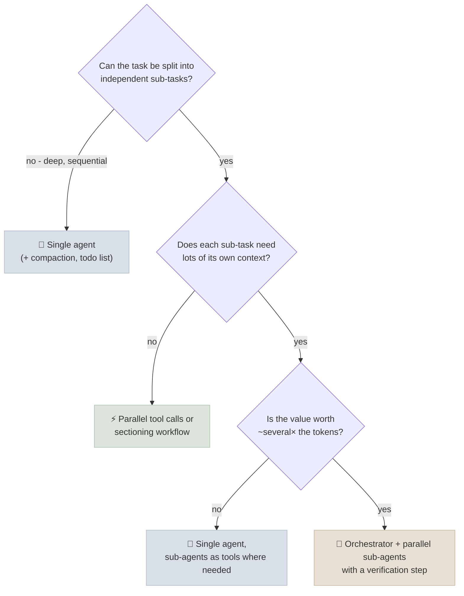
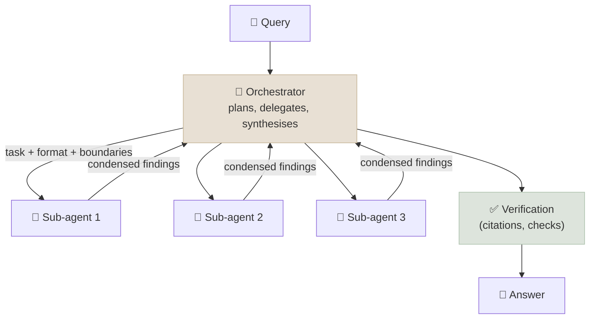
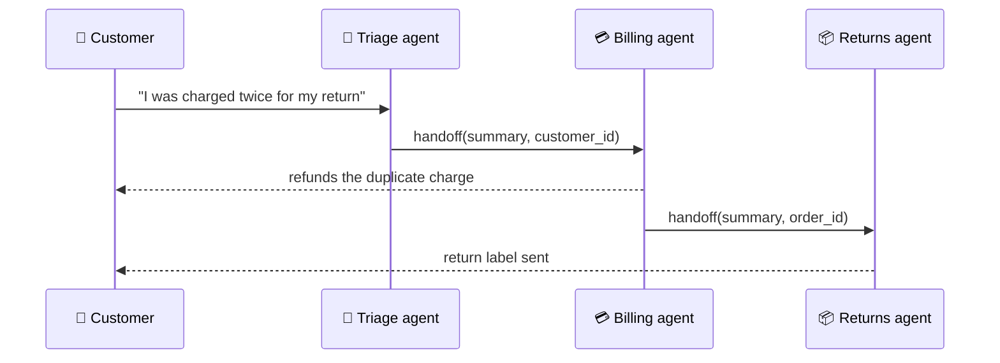

# Multi-Agent Architectures

A multi-agent system splits work across several model-driven agents, each with its own context, instructions and tools, coordinated by a topology: an orchestrator with sub-agents, a hierarchy, handoffs, a network of peers, a shared blackboard, or a debate. This chapter sets out what the evidence says about when that helps - and when a single agent is better - and then describes each topology with its failure modes.

```objectives
time: 55 min
outcomes:
  - Summarise the evidence for and against multi-agent systems, and predict from a task's structure whether they will help
  - Describe the main topologies - orchestrator-subagents, hierarchical, handoffs, network, blackboard, debate - and their trade-offs
  - Name the common multi-agent failure modes (the MAST taxonomy) and a mitigation for each category
  - Choose an architecture for a scenario and justify its token cost
prerequisites:
  - "[Workflow Patterns](01-Workflow-Patterns.mdx)"
  - "[Single-Agent Patterns](02-Single-Agent-Patterns.mdx)"
```

## When Do Multiple Agents Help?

| Evidence | Finding |
|---|---|
| Anthropic, multi-agent research system (2025) | An orchestrator (Claude Opus 4) with parallel sub-agents (Claude Sonnet 4) beat a single Opus 4 agent by **90.2%** on an internal breadth-first research evaluation. On BrowseComp, **token usage alone explained 80% of performance variance**. Multi-agent runs used about **15× the tokens** of a chat (single agents about 4×). They report poor fit for tasks where agents must share one context or have many dependencies - including most coding |
| Cognition, *Don't Build Multi-Agents* (2025) | Parallel sub-agents working from partial context make conflicting implicit decisions; prefer a single-threaded agent with full context, plus compression for long tasks |
| Kim et al., *Towards a Science of Scaling Agent Systems* (2025) | Multi-agent gains depend on task structure: up to **+80.8%** on decomposable financial reasoning, down to **−70%** on sequential planning; diminishing returns once the single-agent baseline is strong; architectures without centralised verification amplify errors more |
| Cemri et al., *Why Do Multi-Agent LLM Systems Fail?* (MAST, 2025) | 14 failure modes from 1,600+ traces across 7 frameworks, in three categories: system design issues, inter-agent misalignment, task verification |
| Multi-agent debate: Du et al. (2023) vs Wang et al. (2024), Smit et al. (2024) | Debate improved factuality and reasoning in early studies, but a single agent with a strong prompt matched multi-agent discussion in later controlled comparisons, and debate was not reliably better than self-consistency at equal cost |

The consistent reading: multiple agents pay off when a task is **wide** - many independent lines of work that each need their own context (researching ten companies, exploring several hypotheses) - and when the value justifies spending several times the tokens. They hurt when the work is **deep and sequential**, when agents need the same full context, or when the single-agent baseline is already strong. Much of the benefit is simply **spending more tokens in parallel with isolated contexts**, which is also why it costs more.



---

## Topologies

| Topology | Control | Communication | Good for | Main risk |
|---|---|---|---|---|
| **Orchestrator-subagents** (supervisor) | Central | Orchestrator ↔ each sub-agent | Parallel research, fan-out analysis | Vague delegation; synthesis loses detail |
| **Hierarchical** | Central, layered | Down the tree and back up | Very large tasks with natural sub-teams | Token cost and latency multiply per level |
| **Handoffs** (swarm) | Transferred | The active agent passes control and context to another | Customer journeys across specialised domains | Lost context at handoff; ping-pong between agents |
| **Network** (peer-to-peer) | Decentralised | Any agent can message any other | Simulations, negotiation research | Hard to bound, debug and terminate |
| **Blackboard** (shared state) | Decentralised or central | Agents read and write a shared store | Incremental assembly of a shared artefact | Conflicting writes; unclear ownership |
| **Debate / critic** | Central (a judge) | Agents argue, a judge decides | High-stakes judgements with checkable arguments | Cost; groupthink; judge bias |

### Orchestrator-subagents



The most successful production topology. The orchestrator writes **precise delegations** - objective, output format, tools to use, boundaries and effort budget - because sub-agents given vague tasks duplicate work or wander. Sub-agents return condensed results (or write artefacts to storage and return references). A verification step before the answer counters error amplification. Anthropic's research system and Magentic-One (Fourney et al., 2024) - an orchestrator keeping task and progress ledgers over specialised web, file and coding agents - both follow this shape.

### Hierarchical

Orchestrators of orchestrators. Justified only when sub-problems are themselves large enough to need their own orchestration; each level adds latency, tokens and another place for instructions to be lost.

### Handoffs



One agent is active at a time and transfers control, with context, to a specialist - the pattern behind the OpenAI Agents SDK's handoffs and LangGraph's swarm. It keeps each agent's instructions and tools small. Pass a **structured handoff summary** rather than the whole transcript, and prevent loops (a maximum number of handoffs; no immediate hand-back).

### Network, blackboard and debate

Peer-to-peer networks (every agent can message every other) are common in research and simulation (Generative Agents, negotiation studies) but rare in production because termination, cost and debugging are hard. Blackboards - agents contributing to a shared artefact - need clear ownership of each section and a controller that decides when it's done. Debate and critic set-ups should be compared against self-consistency at the same token budget before you adopt them.

### Role-based pipelines

Frameworks like MetaGPT and ChatDev assign human-like roles (product manager, architect, engineer, tester) along a standard operating procedure. In practice this is a **chained workflow of agents**; its value comes from the structured intermediate artefacts (specs, designs, test plans) and the checks between stages, more than from the personas.

---

## Failure Modes (MAST) and Mitigations

| MAST category | Examples | Mitigations |
|---|---|---|
| **System design issues** | Agents disobey their role or task spec; steps repeated; conversation history lost; unaware of stopping conditions | Precise, testable role and task specs; explicit termination criteria; state kept in structured artefacts, not only in chat |
| **Inter-agent misalignment** | Information withheld; other agents' input ignored; derailment from the task; reasoning and actions mismatch | Structured message schemas; handoff summaries with required fields; shared task ledger; small number of agents |
| **Task verification** | Premature termination; no or incomplete verification; incorrect verification | A dedicated verification step with external checks (tests, citations, validators); the orchestrator doesn't accept unverified results |

Add the operational failure modes: runaway cost (bound turns, tokens and fan-out per level), cascading errors (validate sub-agent output before use), and non-reproducibility (log every agent's full trace with a shared trace id - see [Multi-Agent Engineering](04-Multi-Agent-Engineering.mdx)).

---

## Check Yourself

```quiz
- q: "According to Anthropic's analysis on BrowseComp, what explained most of the performance variance?"
  options: ["Token usage", "The number of agents", "Model temperature", "Prompt length"]
  answer: 1
- q: "Which task is the worst fit for parallel sub-agents?"
  options:
    - "A sequential refactoring where each step depends on the previous change"
    - "Researching the pricing of ten competitors"
    - "Summarising twenty independent documents"
    - "Checking five hypotheses against different data sources"
  answer: 1
- q: "What is the main difference between handoffs and orchestrator-subagents?"
  options:
    - "Handoffs transfer control to one active agent at a time; an orchestrator keeps control and delegates sub-tasks"
    - "Handoffs need more tokens"
    - "Orchestrators can't run agents in parallel"
    - "Handoffs require A2A"
  answer: 1
- q: "Which MAST category does 'the system stopped before verifying the result' belong to, and what mitigates it?"
  answer: "Task verification (premature termination / no verification). Mitigate with an explicit verification step using external checks and a rule that the orchestrator doesn't return unverified results."
- q: "Why might a multi-agent debate beat a single agent in a paper yet not in your system?"
  answer: "It may be spending more tokens rather than being smarter; at equal budget, self-consistency or a better single-agent prompt often matches it. Always compare against strong single-agent baselines at the same cost."
```

## Exercises

```exercise
- title: Choose an architecture
  task: |
    For each, choose single agent, workflow, orchestrator-subagents or handoffs, and justify with the evidence in this chapter: (a) due diligence on an acquisition target across financials, legal, market and technology; (b) fixing a bug that spans three files; (c) a bank's customer assistant covering cards, loans and fraud; (d) nightly triage of 500 support tickets.
  solution: |
    (a) Orchestrator-subagents: four wide, independent research lines each needing its own context, high value; add citation verification. (b) Single agent: deep, sequential, shared context - the case Cognition and Anthropic both flag. (c) Handoffs (triage → specialists) with strict per-agent tools, or routing to specialised agents; fraud handoffs escalate to humans. (d) A workflow: routing + parallel classification with a small model; no agent needed.
- title: Budget a research system
  task: |
    A single research agent uses 60K tokens per query and scores 55% on your eval. An orchestrator with 5 sub-agents uses about 15× chat-level tokens - estimate 400K per query - and scores 72%. At $3/M input and $15/M output (assume 85% input), what is the cost per query of each, and what is the cost per additional correct answer?
  solution: |
    Single: 60K × (0.85 × 3 + 0.15 × 15)/1M = 60K × 4.8/1M ≈ $0.29. Multi: 400K × 4.8/1M ≈ $1.92. Extra cost $1.63 buys 0.17 more correct answers per query → ≈ $9.60 per additional correct answer. Worth it if a correct research answer is worth more than that - and prompt caching lowers both figures.
```

## Study Notes

- Multi-agent helps on wide, parallelisable tasks with context-hungry sub-tasks; hurts on deep, sequential or shared-context tasks
- Anthropic: +90.2% on breadth-first research; tokens explain 80% of variance; ~15× chat tokens
- Kim et al.: +80.8% decomposable vs −70% sequential; centralised verification limits error amplification
- Cognition: share full context; conflicting implicit decisions break parallel agents
- Topologies: orchestrator-subagents (best default), hierarchical, handoffs, network, blackboard, debate, role pipelines
- MAST: system design, inter-agent misalignment, task verification - 14 modes
- Compare against strong single-agent baselines at equal token budgets

## References

- Anthropic, [How we built our multi-agent research system](https://www.anthropic.com/engineering/multi-agent-research-system) (Jun 2025)
- Walden Yan (Cognition), [Don't Build Multi-Agents](https://cognition.com/blog/dont-build-multi-agents) (Jun 2025)
- Kim et al., [Towards a Science of Scaling Agent Systems](https://arxiv.org/abs/2512.08296) (2025)
- Cemri et al., [Why Do Multi-Agent LLM Systems Fail?](https://arxiv.org/abs/2503.13657) (2025)
- Du et al., [Improving Factuality and Reasoning in Language Models through Multiagent Debate](https://arxiv.org/abs/2305.14325) (ICML 2024)
- Wang et al., [Rethinking the Bounds of LLM Reasoning: Are Multi-Agent Discussions the Key?](https://arxiv.org/abs/2402.18272) (ACL 2024)
- Smit et al., [Should we be going MAD? A Look at Multi-Agent Debate Strategies for LLMs](https://arxiv.org/abs/2311.17371) (ICML 2024)
- Fourney et al., [Magentic-One: A Generalist Multi-Agent System for Solving Complex Tasks](https://arxiv.org/abs/2411.04468) (2024)
- Hong et al., [MetaGPT](https://arxiv.org/abs/2308.00352) (ICLR 2024); Qian et al., [ChatDev](https://arxiv.org/abs/2307.07924) (ACL 2024)

*Last reviewed: 2026-09*
