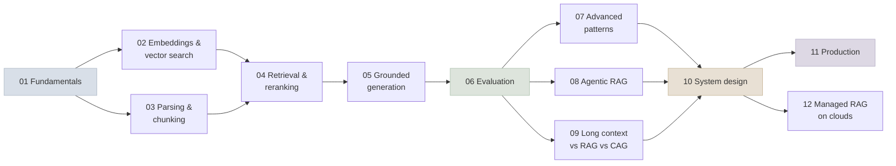

# 12 - RAG (Retrieval-Augmented Generation)

How to ground a model's answers in your own documents: parsing and chunking, embeddings and vector search, hybrid retrieval and reranking, grounded generation with citations, evaluation, advanced and agentic patterns, when to skip retrieval for long context, and how to design, run and secure RAG in production.

```objectives
scope: module
time: 14-16 hours (notes + lab)
outcomes:
  - Build a RAG pipeline end to end and justify each design choice with measurements
  - Evaluate retrieval (recall@k, nDCG, MRR) and generation (groundedness, correctness, citations) separately, and diagnose failures from the numbers
  - Choose between hybrid, learned-sparse, dense and late-interaction retrieval, rerankers, graph-based and agentic patterns for a given question shape
  - Decide between RAG, long-context prompting and cache-augmented generation on quality and cost
  - Integrate enterprise sources with fresh, permission-aware indexing - connectors, delta sync, ACLs, deletes and sensitive data
  - Design, deploy and secure a multi-tenant RAG system, on your own infrastructure or a cloud's managed service
prerequisites:
  - "[Prompt & Context Engineering](../11-Prompt-Engineering/INDEX.mdx) - context engineering and structured outputs"
  - "[Evaluation & Benchmarks](../07-Evaluation/INDEX.mdx) - metrics and confidence intervals"
```

## Where This Module Fits

RAG is [context engineering](../11-Prompt-Engineering/Notes/06-Context-Engineering.mdx) for knowledge: selecting the right evidence for each call. It builds on how models use context (Module 11) and on [serving](../08-Serving-and-Inference/INDEX.mdx) (KV caches explain the cost of long context). It leads into [agents](../13-Agent-Foundations/INDEX.mdx), where retrieval becomes one tool among many and the model decides when to use it.



## Chapter Map

| # | Chapter | You will learn | Time |
|---|---|---|---|
| 1 | [RAG Fundamentals](Notes/01-RAG-Fundamentals.mdx) | The two pipelines, what RAG solves, RAG vs fine-tuning, why naive RAG fails | 45 min |
| 2 | [Embeddings & Vector Search](Notes/02-Embeddings-and-Vector-Search.mdx) | Embedding models, choosing one, HNSW/IVF/PQ/ScaNN/DiskANN, quantization, vector stores | 55 min |
| 3 | [Document Processing & Chunking](Notes/03-Document-Processing-and-Chunking.mdx) | Parsing, chunking strategies, parent-child, contextual retrieval, late chunking, metadata | 55 min |
| 4 | [Retrieval & Reranking](Notes/04-Retrieval-and-Reranking.mdx) | BM25, SPLADE, ColBERT, hybrid + RRF, rerankers, query transformation | 60 min |
| 5 | [Grounded Generation & Citations](Notes/05-Grounded-Generation-and-Citations.mdx) | Post-retrieval failures, context assembly, citations, abstention | 45 min |
| 6 | [RAG Evaluation](Notes/06-RAG-Evaluation.mdx) | Retrieval and generation metrics, test sets, diagnosis, CI | 60 min |
| 7 | [Advanced RAG Patterns](Notes/07-Advanced-RAG-Patterns.mdx) | Routing, Self-RAG, CRAG, FLARE, Speculative RAG, GraphRAG, LightRAG, ColPali | 60 min |
| 8 | [Agentic & Deep-Research RAG](Notes/08-Agentic-and-Deep-Research-RAG.mdx) | Retrieval as a tool, budgets, deep-research architectures, RL-trained search agents | 50 min |
| 9 | [Long Context vs RAG vs CAG](Notes/09-Long-Context-RAG-and-CAG.mdx) | Evidence, cost arithmetic, KV memory, decision guide | 40 min |
| 10 | [Enterprise Data Integration](Notes/10-Enterprise-Data-Integration.mdx) | Connectors, delta sync and CDC, deletes and freshness SLOs, permission-aware retrieval and ACL lag, oversharing, PII, lineage and erasure | 55 min |
| 11 | [RAG System Design](Notes/11-RAG-System-Design.mdx) | Latency budgets, index scaling, multi-tenancy, caching, degradation, a worked design | 60 min |
| 12 | [RAG in Production](Notes/12-RAG-in-Production.mdx) | Deployment, change management, observability, drift, security | 55 min |
| 13 | [Managed RAG on Cloud Platforms](Notes/13-Managed-RAG-on-Cloud-Platforms.mdx) | Google Agent Platform, Amazon Bedrock, Azure AI Search / Foundry IQ | 50 min |
| 14 | [Q&A Review Bank](Notes/14-Interview-QA-Bank.mdx) | 64 questions across the module | 75 min |

## Code Lab

| Lab | What you build | Runs on |
|---|---|---|
| [Retrieval Evaluation](CodeLabs/01-Retrieval-Evaluation.mdx) | BM25, dense, hybrid, reranked, SPLADE and quantized retrieval on BEIR SciFact, with nDCG/Recall/MRR implemented by hand | Laptop CPU, 3-8 min |

## System Designs

| Design | Pattern |
|---|---|
| [Simple RAG Pipeline](SystemDesigns/01-simple-rag.mdx) | Hybrid retrieval, reranking, grounding checks, semantic cache - an enterprise knowledge base on Google Cloud |
| [Agentic RAG - Hybrid Vector + Graph](SystemDesigns/02-agentic-rag-hybrid.mdx) | Agent over a knowledge graph and a document index for multi-hop biomedical questions |

## Mini-Project

Build a **cited Q&A assistant** over a corpus of at least 500 documents from a domain you know:

1. A labelled eval set: 100 questions with relevant chunk ids and reference answers, including 15 unanswerable, 15 multi-hop and 15 identifier questions.
2. A retrieval comparison (BM25, dense, hybrid, + reranker) with nDCG@10 and Recall@20, using the code lab as a starting point.
3. Grounded generation with citations and abstention; report groundedness, correctness and citation precision, with a judge validated on 30 hand-labelled answers.
4. One improvement chosen from your error analysis (contextual chunks, a better reranker, parent-child retrieval or an agentic loop), with before/after numbers and confidence intervals.
5. A one-page design note: latency budget, cost per 1,000 questions, access-control approach and how you'd monitor it.

## Review

- [Q&A Review Bank](Notes/14-Interview-QA-Bank.mdx) - consolidated questions for this module
- [Module quiz](/quiz/rag) - every *Check Yourself* question in this module, in course order

---

Previous: [11 - Prompt & Context Engineering](../11-Prompt-Engineering/INDEX.mdx) · Next: [13 - Agent Foundations](../13-Agent-Foundations/INDEX.mdx)
