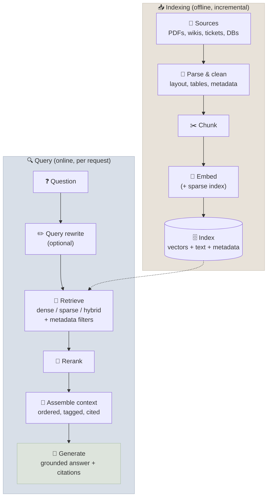

# RAG Fundamentals

Retrieval-augmented generation (RAG) answers a question by first retrieving relevant passages from a corpus you control and then having a language model generate an answer grounded in, and citing, those passages.

```objectives
time: 45 min
outcomes:
  - Draw the indexing and query pipelines of a RAG system and name the design decision at each stage
  - Explain which LLM limitations RAG addresses and which it does not
  - Choose between RAG, fine-tuning and long-context prompting for a knowledge problem
  - Map the classic failure modes of naive RAG to the chapters that fix them
prerequisites:
  - "[Context Engineering](../../11-Prompt-Engineering/Notes/06-Context-Engineering.mdx)"
  - "[LLM Fundamentals](../../01-LLM-Foundations/Notes/01-LLM-Fundamentals.mdx)"
```

## The Idea

Lewis et al. (2020) combined a **parametric memory** - knowledge stored in model weights - with a **non-parametric memory**: a dense index over Wikipedia that the model could retrieve from at generation time. The idea became the dominant way to put private, fresh or verifiable knowledge in front of a model: keep facts in a store you can update and audit, and put the relevant ones in the context window when needed.



| Stage | Key decision | Chapter |
|---|---|---|
| Parse and chunk | How documents become retrievable units | [Document Processing & Chunking](03-Document-Processing-and-Chunking.mdx) |
| Embed and index | Which embedding model, which index, how much compression | [Embeddings & Vector Search](02-Embeddings-and-Vector-Search.mdx) |
| Retrieve and rerank | Dense, sparse or hybrid; which reranker; how many candidates | [Retrieval & Reranking](04-Retrieval-and-Reranking.mdx) |
| Generate | How context is arranged, how the model cites and abstains | [Grounded Generation & Citations](05-Grounded-Generation-and-Citations.mdx) |
| Evaluate | Retrieval metrics, groundedness, answer quality | [RAG Evaluation](06-RAG-Evaluation.mdx) |

**One invariant to remember:** the query must be embedded with the same model (and version) as the corpus. Vectors from different models live in different spaces; mixing them returns plausible-looking but meaningless results with no error. Changing the embedding model means re-embedding the whole corpus.

---

## A Minimal Pipeline

Frameworks such as LangChain, LlamaIndex and Haystack package these steps, but the core fits in a few lines:

```python
import numpy as np
from sentence_transformers import SentenceTransformer
from langchain_text_splitters import RecursiveCharacterTextSplitter

documents = {"refund-policy.md": "...", "sla.md": "..."}

# Index (offline)
splitter = RecursiveCharacterTextSplitter(chunk_size=800, chunk_overlap=100)
chunks = [(src, text) for src, doc in documents.items() for text in splitter.split_text(doc)]
embedder = SentenceTransformer("sentence-transformers/all-MiniLM-L6-v2")
chunk_vecs = embedder.encode([t for _, t in chunks], normalize_embeddings=True)

# Query (online)
def retrieve(question: str, k: int = 5):
    q = embedder.encode([question], normalize_embeddings=True)[0]
    scores = chunk_vecs @ q                       # cosine similarity: vectors are normalised
    return [(chunks[i][0], chunks[i][1]) for i in np.argsort(-scores)[:k]]

def build_prompt(question: str, hits) -> str:
    context = "\n".join(f'<doc id="{i}" source="{src}">{text}</doc>' for i, (src, text) in enumerate(hits, 1))
    return ("Answer using only the documents below and cite them as [id]. "
            "If they don't contain the answer, say you don't know.\n\n"
            f"{context}\n\nQuestion: {question}")

answer = llm(build_prompt(question, retrieve(question)))   # any chat model
```

A production system adds document parsing, metadata and access filters, hybrid retrieval, a reranker, citation checking, caching, evaluation and monitoring - the rest of this module. The [code lab](../CodeLabs/01-Retrieval-Evaluation.mdx) measures how much each retrieval choice actually matters.

---

## What RAG Solves - and What It Doesn't

| LLM limitation | How RAG helps | Remaining risk |
|---|---|---|
| **Knowledge cutoff** | The index can be updated minutes after a document changes | Stale index if ingestion lags or fails |
| **Private knowledge** | Your documents are retrieved at query time; nothing is trained into weights | Access control must be enforced at retrieval |
| **Hallucination** | The answer can be grounded in retrieved text | The model can still ignore, misread or embellish the context |
| **Verifiability** | Answers cite sources a user can check | Citations can point to passages that don't support the claim |

RAG is the wrong tool - or needs help - for:

- **Aggregations and exact lookups over structured data** ("total revenue by region last quarter"): use SQL or an API as a tool.
- **Computation**: use code execution.
- **Questions needing synthesis across a whole corpus** ("what are the main themes in 10,000 reports?"): top-k retrieval sees a few chunks; graph-based or map-reduce approaches (see [Advanced RAG Patterns](07-Advanced-RAG-Patterns.mdx)) or agentic research (see [Agentic & Deep-Research RAG](08-Agentic-and-Deep-Research-RAG.mdx)) fit better.
- **Small, stable corpora that fit in the context window**: just put them in the prompt and cache it (see [Long Context vs RAG vs CAG](09-Long-Context-RAG-and-CAG.mdx)).

---

## RAG, Fine-Tuning or Long Context?

| Need | RAG | Fine-tuning | Long context (+ caching) |
|---|---|---|---|
| Facts that change weekly | ✅ Update the index | ❌ Retrain each time | ✅ If the corpus fits |
| Citations and audit trail | ✅ Source per chunk | ❌ | ✅ With quote extraction |
| Corpus of millions of documents | ✅ | ❌ | ❌ |
| New output style, format or domain behaviour | ❌ | ✅ | ⚠️ Via examples |
| Per-user access control | ✅ Filter at retrieval | ❌ | ⚠️ Per-user prompts |
| Lowest latency per query | ⚠️ Retrieval adds ~50-300 ms | ✅ | ❌ Long prefill unless cached |

Fine-tuning changes **behaviour** reliably and injects **facts** unreliably - fine-tuned models still hallucinate about their training data, and updating facts means retraining. The common production combination is a fine-tuned or well-prompted model for behaviour plus RAG for knowledge. The decision between RAG and long-context prompting is covered in [Long Context vs RAG vs CAG](09-Long-Context-RAG-and-CAG.mdx).

---

## Why Naive RAG Fails

"Naive RAG" - fixed-size chunks, one embedding model, top-k, stuff the prompt - is a fine prototype and a poor product. Its failure modes, and where each is fixed:

| Symptom | Root cause | Fix (chapter) |
|---|---|---|
| Right document exists but isn't retrieved | Vocabulary mismatch, rare terms, poor chunks | Hybrid retrieval, contextual chunks, query rewriting ([03](03-Document-Processing-and-Chunking.mdx), [04](04-Retrieval-and-Reranking.mdx)) |
| Retrieved but ranked below noise | Bi-encoder imprecision | Reranking ([04](04-Retrieval-and-Reranking.mdx)) |
| Answer spans two chunks | Chunk boundaries | Structure-aware chunking, parent-child retrieval ([03](03-Document-Processing-and-Chunking.mdx)) |
| Tables and figures missing | Parsing loses layout | Layout-aware parsing, multimodal retrieval ([03](03-Document-Processing-and-Chunking.mdx), [07](07-Advanced-RAG-Patterns.mdx)) |
| Context present but answer wrong or embellished | Generation ignores or misuses context | Context ordering, quote-then-answer, citation checks ([05](05-Grounded-Generation-and-Citations.mdx)) |
| Multi-hop questions fail | One retrieval can't gather all hops | Iterative or agentic retrieval ([08](08-Agentic-and-Deep-Research-RAG.mdx)) |
| Silent quality drift | No measurement | Retrieval and groundedness evals in CI and production ([06](06-RAG-Evaluation.mdx), [11](12-RAG-in-Production.mdx)) |

---

## Check Yourself

```quiz
- q: "After upgrading the embedding model used for queries, every answer becomes irrelevant but no errors appear. What happened?"
  options:
    - "The corpus was embedded with the old model, so query and document vectors are in different spaces"
    - "The LLM changed"
    - "The chunk size was too small"
    - "The reranker is misconfigured"
  answer: 1
- q: "Which question is RAG over documents least suited to?"
  options:
    - "What was total revenue by region last quarter?"
    - "What does our refund policy say about annual plans?"
    - "Which runbook covers database failover?"
    - "What did the 2025 security audit recommend?"
  answer: 1
  explain: "Aggregations over structured data belong in SQL or an analytics tool exposed to the model, not in top-k text retrieval."
- q: "A 40-page product manual changes monthly and every answer must cite the page. Which approach is simplest?"
  options:
    - "Put the whole manual in a cached prompt and ask for quoted citations"
    - "Fine-tune a model on the manual each month"
    - "Build a GraphRAG index"
    - "Train a custom embedding model"
  answer: 1
  explain: "A corpus that fits comfortably in the context window can be sent whole and cached; RAG earns its complexity at larger scale."
- q: "Why does fine-tuning not replace RAG for fast-changing facts?"
  answer: "Fine-tuning reliably changes behaviour and style but injects facts unreliably - models still hallucinate about their training data - and every fact change requires retraining and re-evaluation. RAG updates knowledge by updating the index and gives citations."
```

## Exercises

```exercise
- title: Run and break the minimal pipeline
  task: |
    Run the minimal pipeline above on 20 documents of your choice (e.g. a product's docs pages). Write 10 questions with known answers. Record how many retrieve the right chunk in the top 3. Then deliberately break it three ways - embed queries with a different model, set chunk_size to 50, set k to 1 - and record the effect of each.
  solution: |
    A different query model collapses retrieval to near random with no error; tiny chunks lose context and hurt answerability even when retrieval "hits"; k=1 loses recall on questions whose answer is spread across chunks. The exercise shows why each parameter needs measurement.
- title: Choose an approach
  task: |
    For each case choose RAG, fine-tuning, long context, a tool (SQL/API) or a combination, and justify it in one sentence: (a) a support bot over 50,000 help-centre articles; (b) a model that must write discharge summaries in a hospital's house style; (c) "how many open P1 incidents do we have?"; (d) Q&A over a single 80-page contract.
  solution: |
    (a) RAG - large, changing corpus with citations. (b) Fine-tuning (or strong examples) for style, plus RAG for patient-specific facts. (c) A tool calling the incident system's API - an exact, live count. (d) Long context with caching and quote-then-answer - it fits in the window and needs whole-document reasoning.
```

## Study Notes

**Must-know:**
- RAG = retrieve relevant passages from your corpus, then generate a cited answer grounded in them (Lewis et al., 2020)
- Two pipelines: indexing (parse, chunk, embed, index) and query (rewrite, retrieve, rerank, assemble, generate)
- Same embedding model for queries and corpus - mismatches fail silently
- RAG helps with freshness, private data, grounding and citations; not with aggregations, computation or whole-corpus synthesis
- Fine-tune for behaviour, retrieve for knowledge; small stable corpora can simply go in a cached prompt
- Naive RAG's failures map to chunking, hybrid retrieval, reranking, grounded generation, agentic retrieval and evaluation

## References

- Lewis et al., [Retrieval-Augmented Generation for Knowledge-Intensive NLP Tasks](https://arxiv.org/abs/2005.11401) (NeurIPS 2020)
- Gao et al., [Retrieval-Augmented Generation for Large Language Models: A Survey](https://arxiv.org/abs/2312.10997) (2023)
- Ovadia et al., [Fine-Tuning or Retrieval? Comparing Knowledge Injection in LLMs](https://arxiv.org/abs/2312.05934) (EMNLP 2024)
- Gekhman et al., [Does Fine-Tuning LLMs on New Knowledge Encourage Hallucinations?](https://arxiv.org/abs/2405.05904) (EMNLP 2024)

*Last reviewed: 2026-09*
