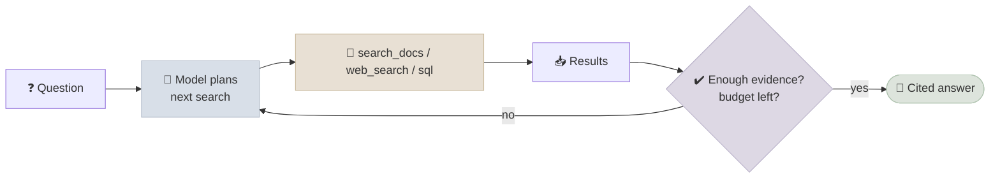
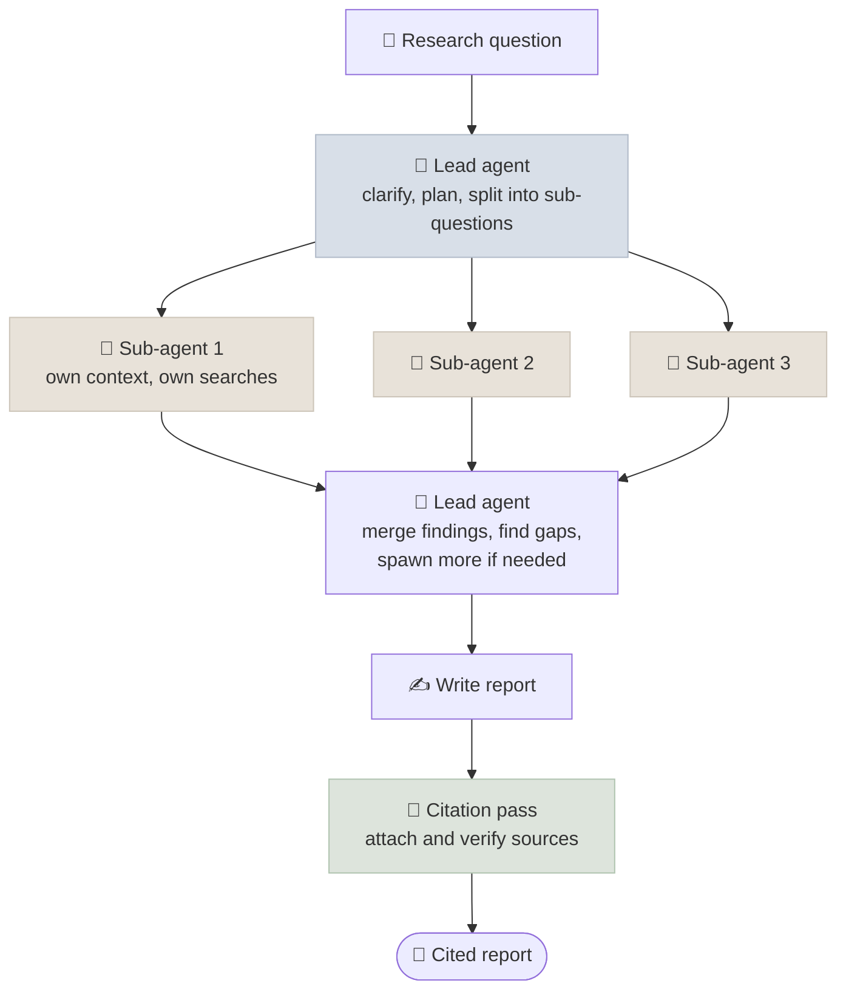

# Agentic & Deep-Research RAG

Agentic RAG turns retrieval into a tool that a model calls in a loop - deciding what to search for, reading results, and searching again until it can answer - and deep-research systems scale that loop to dozens or hundreds of searches, often across several parallel agents, to produce cited reports.

```objectives
time: 50 min
outcomes:
  - Contrast pipeline RAG with agentic RAG on control flow, latency, cost and failure modes
  - Build an agentic RAG loop with retrieval exposed as a tool, with budgets and stop conditions
  - Describe how deep-research systems are structured (planning, parallel sub-agents, synthesis, citation) and how search agents are trained with RL
  - Evaluate agentic retrieval with trajectory-level metrics and multi-hop benchmarks
prerequisites:
  - "[Advanced RAG Patterns](07-Advanced-RAG-Patterns.mdx)"
  - "[Tool Use & Function Calling](../../13-Agent-Foundations/Notes/04-Tool-Use-and-Function-Calling.mdx)"
```

## From Pipeline to Loop

A pipeline retrieves once with the user's words. Many questions can't be answered that way: *"Which of our suppliers were affected by the regulation that came into force after last year's audit?"* needs the audit date, then the regulation, then the suppliers - each search depends on the last.



| | Pipeline RAG | Agentic RAG |
|---|---|---|
| Control flow | Fixed: retrieve → generate | Model decides what, when and how often to retrieve |
| Queries | The user's (possibly rewritten) | Model-written, one per information need |
| Multi-hop | Weak | Natural |
| Latency | Predictable, ~1-3 s | Variable, seconds to minutes |
| Cost | One retrieval, one generation | Several to hundreds of calls |
| Testing | Deterministic stages | Trajectories vary run to run |

The ideas behind it: interleaving retrieval with chain-of-thought (IRCoT, Trivedi et al., 2023), ReAct's thought-action-observation loop, and self-ask decomposition. Modern tool-calling models do this natively.

---

## Building It

Expose retrieval as a tool with a precise description, and let the agent loop run:

```python
from langchain.agents import create_agent
from langchain_core.tools import tool

@tool
def search_docs(query: str, k: int = 5) -> str:
    """Search the internal knowledge base (policies, runbooks, contracts).
    Use specific keywords and names; call again with a refined query if results are off-topic.
    Returns passages as [id] source: text."""
    hits = hybrid_search(query, k=k)                     # your retriever + reranker
    return "\n".join(f"[{h.id}] {h.source}: {h.text}" for h in hits)

agent = create_agent(
    model="anthropic:<model>",                           # any tool-calling chat model
    tools=[search_docs, run_sql],
    system_prompt=(
        "Answer questions about the company using the tools. Search as many times as you need, "
        "one information need per query. Cite passage ids like [id] for every factual claim. "
        "Stop when you have enough evidence or after 8 searches; say what you couldn't find."
    ),
)
result = agent.invoke({"messages": [{"role": "user", "content": question}]})
```

Design points that decide whether it works:

- **Tool descriptions are prompts.** Say what the corpus contains, how to phrase queries, and what comes back. Return passage ids and sources so the final answer can cite.
- **Budgets and stop conditions.** Cap searches, tokens and wall-clock time; tell the model the cap. Without them, agents over-search on hard questions and loop on unanswerable ones.
- **Parallel calls.** Independent sub-questions can be searched in one turn with parallel tool calls.
- **Context growth.** Each tool result stays in the context. Return concise passages, and clear or summarise old results for long sessions (see [Context Engineering](../../11-Prompt-Engineering/Notes/06-Context-Engineering.mdx)).
- **Untrusted content.** Web pages and documents can carry prompt injections that now steer an agent with tools - see [Prompts in Production](../../11-Prompt-Engineering/Notes/08-Prompts-in-Production.mdx).
- **Hybrid routing.** Send simple questions down a fast pipeline and only escalate to the agent when the question is multi-part or the pipeline's retrieval confidence is low.

The agent loop itself - message handling, tool-result formatting, error handling - is covered in [The Agent Loop](../../13-Agent-Foundations/Notes/03-The-Agent-Loop.mdx).

---

## Deep Research Systems

Deep-research products (Google's Gemini Deep Research, OpenAI's deep research, Anthropic's Research feature, Perplexity and open-source equivalents) run long agentic retrieval sessions - many searches over the web and internal sources, reading full pages, and writing a report with citations.



Anthropic's description of its multi-agent research system gives useful numbers:

- An orchestrator with parallel sub-agents outperformed a single agent by 90.2% on their internal research evaluation.
- Token usage alone explained about 80% of the variance in performance on the BrowseComp benchmark. Multi-agent research works largely by spending more tokens in parallel, isolated contexts.
- Agents used about 4× the tokens of a chat interaction, and multi-agent systems about 15×. That is only worth it for valuable, broad, parallelisable questions.
- Their lessons: teach the orchestrator how to delegate (clear objectives and boundaries for each sub-agent), scale effort to query complexity, start searches broad and then narrow, and evaluate end states rather than exact paths.

### Training search agents

Reasoning models are now trained to search *inside* their reasoning with reinforcement learning. Search-R1 (Jin et al., 2025) trains a model to interleave `<search>` calls with reasoning, rewarded only on the final answer, and improves multi-hop QA substantially over prompting-based RAG. Frontier reasoning models are trained with tool use in the loop in similar ways, which is why they search more deliberately than prompted pipelines. The RL machinery is covered in [RL for LLMs](../../05-Post-Training/Notes/03-RL-for-LLMs.mdx).

---

## Evaluating Agentic Retrieval

| Level | Metrics |
|---|---|
| **Final answer** | Correctness vs reference; groundedness; citation recall and precision |
| **Trajectory** | Number of searches and tokens; redundant queries; whether the needed documents were ever retrieved (retrieval recall over the whole trajectory) |
| **Efficiency** | Latency, cost per question, success at a fixed budget |
| **Robustness** | Behaviour on unanswerable questions (does it stop?), injected content, tool errors |

Benchmarks: multi-hop QA (HotpotQA, MuSiQue, 2WikiMultiHopQA), FRAMES (multi-document reasoning with retrieval), BrowseComp (1,266 hard-to-find facts on the open web), and GAIA (general assistant tasks with tools). Because trajectories vary, run each item several times and report mean and variance. Agent-level evaluation is developed further in [Production Agents](../../17-Production-Agents/INDEX.mdx).

---

## Check Yourself

```quiz
- q: "Which question most justifies agentic RAG over a pipeline?"
  options:
    - "Which of our vendors were affected by regulations that took effect after our last audit?"
    - "What is the refund window for Enterprise plans?"
    - "Where is the VPN setup guide?"
    - "What does error E4013 mean?"
  answer: 1
  explain: "Each step depends on the previous answer (audit date → regulations → vendors), which a single retrieval can't plan."
- q: "According to Anthropic's analysis of its research system, what explained most of the variance in BrowseComp performance?"
  options:
    - "Token usage"
    - "The embedding model"
    - "Number of tools available"
    - "Temperature"
  answer: 1
- q: "Your agent sometimes performs 40 searches on unanswerable questions. What are the two most direct fixes?"
  options:
    - "An explicit search budget told to the model, and an instruction (plus eval items) for stopping and reporting what's missing"
    - "A larger context window and higher temperature"
    - "Removing the search tool"
    - "Switching to BM25"
  answer: 1
- q: "Why do deep-research systems use sub-agents with separate contexts rather than one long-running agent?"
  answer: "Isolation: each sub-agent explores one thread in a clean context and returns a condensed result, so the lead agent's context stays small and relevant; sub-agents also run in parallel, cutting wall-clock time. The cost is many more total tokens and coordination overhead."
```

## Exercises

```exercise
- title: Pipeline vs agent on multi-hop questions
  task: |
    Build 30 two-hop questions over a corpus you control (e.g. "Who manages the team that owns service X?" where ownership and management are in different documents). Compare a hybrid pipeline (retrieve 8, answer) with an agent that has the same retriever as a tool and a budget of 6 searches. Report accuracy, mean searches, tokens and p50 latency.
  solution: |
    Expect the agent to win clearly on two-hop questions (the pipeline rarely retrieves both hops with one query) at several times the tokens and latency. On single-hop questions added as a control, the pipeline should match the agent at a fraction of the cost - the argument for routing.
- title: Design a research agent's budget
  task: |
    Specify the budgets, stop conditions, sub-agent instructions and citation checks for an internal "competitive analysis" research agent that must finish within 5 minutes and $2 per report.
  solution: |
    Example: lead agent plans at most 5 sub-questions; each sub-agent gets 10 searches and 40K tokens, must return findings with source URLs and a confidence note; lead agent may spawn one follow-up round for gaps; a final citation pass checks every claim against its source and drops unsupported ones; hard stop at 4.5 minutes with a partial-report fallback. Budget checks use token counts from each call.
```

## Study Notes

**Must-know:**
- Agentic RAG: retrieval as a tool in a model-driven loop; natural multi-hop; variable latency and cost
- Tool descriptions, budgets, stop conditions, parallel calls, context hygiene and injection defence decide success
- Route easy questions to a pipeline, hard ones to the agent
- Deep research: lead agent + parallel sub-agents in isolated contexts + synthesis + citation pass; performance tracks tokens spent
- Search agents are increasingly trained with RL (Search-R1) rather than only prompted
- Evaluate final answers, trajectories, efficiency and robustness; run items multiple times

## References

- Trivedi et al., [Interleaving Retrieval with Chain-of-Thought Reasoning for Knowledge-Intensive Multi-Step Questions (IRCoT)](https://arxiv.org/abs/2212.10509) (ACL 2023)
- Press et al., [Measuring and Narrowing the Compositionality Gap in Language Models (self-ask)](https://arxiv.org/abs/2210.03350) (Findings of EMNLP 2023)
- Singh et al., [Agentic Retrieval-Augmented Generation: A Survey on Agentic RAG](https://arxiv.org/abs/2501.09136) (2025)
- Jin et al., [Search-R1: Training LLMs to Reason and Leverage Search Engines with Reinforcement Learning](https://arxiv.org/abs/2503.09516) (2025)
- Anthropic, [How we built our multi-agent research system](https://www.anthropic.com/engineering/multi-agent-research-system) (2025)
- Wei et al., [BrowseComp: A Simple Yet Challenging Benchmark for Browsing Agents](https://arxiv.org/abs/2504.12516) (2025)
- Mialon et al., [GAIA: A Benchmark for General AI Assistants](https://arxiv.org/abs/2311.12983) (ICLR 2024)

*Last reviewed: 2026-09*
