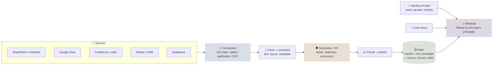

# Enterprise Data Integration

Enterprise RAG and agents are only as good as the data pipeline behind them: connectors that pull content from SharePoint, Drive, Confluence, ticketing systems and databases; synchronization that keeps the index fresh and propagates deletes; permissions that follow every chunk so users only retrieve what they may see; and governance for sensitive data, lineage and erasure. This note covers that pipeline - the part that most demos skip and most production incidents come from.

```objectives
time: 55 min
outcomes:
  - Design ingestion from common enterprise sources using full crawls, delta APIs, webhooks and change data capture
  - Keep an index fresh with idempotent upserts, deletes and periodic reconciliation, and state a freshness SLO
  - Implement permission-aware retrieval - mirrored ACLs, group expansion, early vs late binding - and fail closed
  - Handle the oversharing problem, sensitivity labels, PII and right-to-erasure across the index, caches and logs
  - Decide between building connectors, buying a managed knowledge service, and querying structured systems live
prerequisites:
  - "[Document Processing & Chunking](03-Document-Processing-and-Chunking.mdx)"
  - "[Embeddings & Vector Search](02-Embeddings-and-Vector-Search.mdx) - metadata filtering"
```

## The Ingestion Pipeline



Every chunk should carry, at minimum: a stable `doc_id` and `chunk_id`, the source system and URL (for citations), the source version or modified time, the **ACL principals** allowed to read it, its sensitivity label, and the ingest timestamp.

---

## Connectors and Change Detection

| Source | Initial load | Ongoing changes |
|---|---|---|
| SharePoint, OneDrive, Outlook (Microsoft 365) | Microsoft Graph listing | Graph **delta queries** (a token returns only what changed since last time), plus change notifications |
| Google Drive | Drive API listing | Drive **changes** API with a saved page token, plus push notifications |
| Confluence, Jira, wikis | REST API crawl | Webhooks and "modified since" queries |
| Ticketing and CRM (ServiceNow, Zendesk, Salesforce) | API export | Webhooks or incremental export by updated timestamp |
| Relational databases | Snapshot | **Change data capture** from the transaction log (e.g. Debezium into a stream) |
| Object storage (S3, GCS, Blob) | Bucket listing | Event notifications on create, update and delete |

Practical rules:

- **Treat notifications as hints, not truth.** Webhooks get dropped. Combine them with periodic delta syncs and a slower full **reconciliation** (compare source listings with the index) that catches anything missed.
- **Respect source rate limits.** Microsoft Graph and other SaaS APIs throttle with 429 and `Retry-After`; a full re-crawl of a large tenant can take days. Design connectors to resume from a checkpoint ([Python for AI Engineering](../../02-Prog-Langs/Python-and-Systems/Notes/01-Python-for-AI-Engineering.mdx)).
- **Skip unchanged content** with content hashes, so re-embedding happens only when text actually changes.
- **Run connectors with their own scoped identity** - read-only, limited to the sites or spaces in scope - never an administrator's account ([Cloud Networking & IAM for AI](../../09-Production-Engineering/Notes/07-Cloud-Networking-and-IAM-for-AI.mdx)).

---

## Freshness and Deletes

An index that keeps serving deleted or outdated documents is a correctness and compliance problem, not just a quality one.

- **Upserts keyed by `doc_id`**: on change, delete the document's old chunks and insert the new ones in one idempotent operation, so retries never leave duplicates ([RAG System Design](11-RAG-System-Design.mdx)).
- **Propagate deletes** as first-class events (tombstones). A document deleted or moved out of scope at the source must leave the index, and every cache derived from it, within a stated time.
- **State a freshness SLO** - for example, "99% of source changes searchable within 15 minutes; deletes and permission removals within 5 minutes" - and measure it by writing canary documents and timing how long they take to become searchable (or to disappear).
- **Version the index.** Large re-processing jobs (a new chunker or embedding model) build a new index version alongside the old one and switch over after evaluation ([RAG in Production](12-RAG-in-Production.mdx)).

---

## Permission-Aware Retrieval

The rule is simple: **a user must never receive a chunk from a document they couldn't open in the source system.** Getting it right takes three parts:

1. **Mirror ACLs at ingest.** Store the principals allowed to read each document - users, groups, "everyone in the organization", external guests - on every chunk.
2. **Resolve the user at query time.** Expand the signed-in user into all their principals, including **nested group** membership, from the identity provider (Entra ID, Okta, Google Workspace), and cache the result briefly.
3. **Filter inside the search**, not after it. Pass the principals as a filter to the vector and keyword queries (early binding); post-filtering top-k results returns too few results and risks leaks through scores, counts or caches.

**Permissions change faster than content.** When someone restricts a document, the index still holds the old ACL until the next sync - the ACL lag. For highly sensitive sources, add **late binding**: re-check candidate documents against the source (or a fresh permissions cache) before using them. A runnable sketch of both:

```python
from dataclasses import dataclass

# Identity provider view: user -> direct groups, group -> parent groups (nested membership).
USER_GROUPS = {"maria": {"finance-emea"}, "tom": {"engineering"}}
GROUP_PARENTS = {"finance-emea": {"finance"}, "finance": {"all-staff"}, "engineering": {"all-staff"}}


def principals_for(user: str) -> frozenset[str]:
    """Everything a user can be matched on: the user id plus all groups, following nesting."""
    if user not in USER_GROUPS:
        raise PermissionError(f"cannot resolve identity for {user!r}")   # fail closed
    seen, stack = set(), list(USER_GROUPS[user])
    while stack:
        g = stack.pop()
        if g not in seen:
            seen.add(g)
            stack.extend(GROUP_PARENTS.get(g, ()))
    return frozenset({f"user:{user}"} | {f"group:{g}" for g in seen})


@dataclass(frozen=True)
class Chunk:
    doc_id: str
    text: str
    allowed: frozenset[str]          # ACL principals mirrored from the source at ingest
    acl_version: int


INDEX = [
    Chunk("budget-2027", "EMEA travel budget is 1.2M", frozenset({"group:finance"}), 7),
    Chunk("handbook", "Expense claims are due within 30 days", frozenset({"group:all-staff"}), 3),
    Chunk("salaries", "Salary bands for 2027", frozenset({"user:cfo"}), 2),
]


def source_still_allows(doc_id: str, principals: frozenset[str]) -> bool:
    """Late-binding check against the system of record (stubbed): the budget doc was just restricted."""
    if doc_id == "budget-2027":
        return "group:finance-leads" in principals
    return True


def retrieve(user: str, query: str, recheck: bool = True) -> list[str]:
    principals = principals_for(user)
    # Early binding: the filter goes INTO the vector/keyword query, so unauthorized chunks never come back.
    hits = [c for c in INDEX if c.allowed & principals]          # stands in for search(query, filter=...)
    # Optional late binding for sensitive sources: confirm with the source before use.
    if recheck:
        hits = [c for c in hits if source_still_allows(c.doc_id, principals)]
    return [c.doc_id for c in hits]


print("maria principals:", sorted(principals_for("maria")))
print("maria, index ACLs only:", retrieve("maria", "travel budget", recheck=False))
print("maria, with source re-check:", retrieve("maria", "travel budget"))
print("tom:", retrieve("tom", "travel budget"))
try:
    retrieve("unknown-user", "anything")
except PermissionError as e:
    print("unknown user:", e)
```

Output:

```
maria principals: ['group:all-staff', 'group:finance', 'group:finance-emea', 'user:maria']
maria, index ACLs only: ['budget-2027', 'handbook']
maria, with source re-check: ['handbook']
tom: ['handbook']
unknown user: cannot resolve identity for 'unknown-user'
```

Maria reaches the finance budget through nested groups (`finance-emea` → `finance`), but the document was restricted after the last ACL sync: the index alone would still return it, and only the late-binding check removes it. And when identity can't be resolved, the system returns nothing - it **fails closed**.

Sync permission changes on a faster path than content changes, and make ACL removal - like deletion - a high-priority event.

---

## The Oversharing Problem

Permission-aware retrieval faithfully enforces source permissions - including the bad ones. Organizations are full of files shared with "everyone" by accident, and search-based assistants make them findable in seconds. Microsoft's documentation for Microsoft 365 Copilot puts it plainly: Copilot only surfaces data a user has at least view permission for - so overshared data is surfaced too, which is why Microsoft offers controls such as **Restricted Content Discovery** to keep specific SharePoint sites out of Copilot and organization-wide search while their permissions are reviewed.

Before connecting a source:

- **Audit sharing** on the highest-risk content (HR, finance, legal, M&A) and fix permissions at the source.
- **Exclude** sites, spaces or folders that shouldn't be in scope, even if permissions are technically correct.
- **Honour sensitivity labels** (for example Microsoft Purview labels) - exclude or restrict "Highly Confidential" content from the index.
- **Pilot with a small group** and red-team retrieval with accounts from different departments ([Safety Evaluation & Red-Teaming](../../07-Evaluation/Notes/05-Safety-Evaluation-and-Red-Teaming.mdx)).

---

## Sensitive Data, Lineage and Erasure

- **PII detection and redaction.** Tools such as Microsoft Presidio detect names, emails, phone numbers and identifiers. Decide per source whether to redact at ingest (the index never holds it), mask at output, or exclude the source - and remember redaction is imperfect, so it complements access control rather than replacing it.
- **Embeddings are data.** Research has shown text can be substantially reconstructed from embeddings (vec2text), and OWASP's 2025 LLM Top 10 lists vector and embedding weaknesses - including cross-tenant leakage - as a risk category. Protect vector stores like the source documents.
- **Lineage.** Each chunk carries its source URI and version; answers cite them; ingestion runs record what was processed (OpenLineage-style metadata). When a source is found to be wrong or out of scope, lineage tells you exactly which chunks and cached answers to purge.
- **Erasure.** A right-to-erasure request (GDPR Article 17) or a legal deletion must reach every copy: the index, chunk stores, semantic and answer caches, evaluation sets built from real queries, and logs and traces with retrieved content. Design deletion by `doc_id` and by subject identifier from the start; retrofitting it is painful.
- **Audit logging.** Record who retrieved which documents for which question - essential for investigating a leak and for regulated industries.

---

## Structured Data and Live Systems

Not everything should be copied into a vector index. Numbers that change by the minute, records with row-level security, and transactional systems are often better **queried live**:

| Approach | Use when | Watch for |
|---|---|---|
| **Index text** (RAG) | Documents, knowledge articles, policies | Freshness and ACL lag |
| **Text-to-SQL** over a curated, read-only view | Analytical questions over well-modelled data | Wrong joins, ambiguity; enforce row-level security in the database, not the prompt |
| **Tools / APIs** (often exposed as MCP servers) | Operational records - orders, tickets, accounts | The user's identity must flow into the call; least-privilege scopes ([Authorization](../../14-MCP-and-A2A/Notes/04-Authorization.mdx)) |

Live queries carry the user's own permissions and are always fresh, at the cost of latency and dependence on the source system's availability.

---

## Build or Buy

Managed knowledge services - Amazon Bedrock Knowledge Bases and Amazon Q Business connectors, Google's Gemini Enterprise and Vertex AI Search, Microsoft Foundry IQ and Microsoft 365 Copilot connectors, and dedicated enterprise-search vendors - ship dozens of connectors with ACL sync built in ([Managed RAG on Cloud Platforms](13-Managed-RAG-on-Cloud-Platforms.mdx)). Connectors are expensive to build and maintain - APIs change, permissions models are intricate, throttling is unforgiving - so buy them for mainstream SaaS sources unless you have a specific reason not to. Build when a source is in-house, the permissions model is unusual, or you need control over parsing and chunking that the service doesn't give. Either way, **test permission enforcement yourself** with accounts from different groups before launch.

---

## Check Yourself

```quiz
- q: "Why should webhooks or change notifications be combined with periodic delta syncs and reconciliation?"
  options:
    - "Webhooks are slower than polling"
    - "Notifications can be dropped or delayed, so a scheduled sync and a full comparison catch missed changes and deletes"
    - "Delta APIs are required by law"
    - "Webhooks can't carry document content"
  answer: 2
  explain: "Treat notifications as hints. Missed events would otherwise leave stale or deleted documents in the index indefinitely."
- q: "Where should the user's permission filter be applied in a permission-aware RAG system?"
  options:
    - "In the prompt: tell the model not to reveal restricted content"
    - "After retrieval, by removing unauthorized chunks from the top-k"
    - "Inside the vector and keyword queries as a metadata filter on ACL principals, failing closed if identity can't be resolved"
    - "Only in the user interface"
  answer: 3
  explain: "Prompts are not access control; post-filtering returns too few results and can leak through counts or caches. Filter in the search itself."
- q: "A document's permissions were tightened 10 minutes ago, but the assistant still quotes it to a user who lost access. What happened, and how do you fix it?"
  answer: "ACL lag: the index still holds the old permissions until the next sync. Sync permission changes on a faster path than content, make ACL removals high-priority events, and for sensitive sources add a late-binding check against the source or a fresh permissions cache before using a document."
- q: "What is the oversharing problem in enterprise assistants?"
  answer: "Permission-aware retrieval enforces source permissions faithfully, so content that is accidentally shared widely (for example with 'everyone') becomes easy to find through the assistant. Fix permissions at the source, exclude high-risk sites, honour sensitivity labels and pilot with red-teaming before broad rollout."
- q: "A user exercises their right to erasure. Which copies of their data must the RAG system remove?"
  answer: "Source-derived chunks and their embeddings in every index version, chunk stores, semantic and exact-answer caches, evaluation sets built from real traffic, and logs and traces containing their data or retrieved content - which is why deletion by document and by subject identifier must be designed in from the start."
```

## Exercises

```exercise
- title: Design the sync for a SharePoint knowledge assistant
  task: |
    A company wants an assistant over 400,000 SharePoint documents across 3,000 sites. Requirements: changes searchable within 30 minutes, permission removals effective within 5 minutes, deleted documents gone within 1 hour. Describe the connector and sync design.
  solution: |
    Initial load: a resumable crawl via Microsoft Graph with a scoped, read-only app identity, throttling-aware (honour 429 + Retry-After), checkpointing per site; content hashes to skip unchanged documents on re-runs. Ongoing content: Graph delta queries per drive every few minutes plus change notifications to trigger earlier syncs; idempotent delete-then-insert by `doc_id`. Permissions: a separate, faster permission-sync job (delta on sharing changes plus group membership changes from Entra ID) that updates ACL metadata without re-embedding; for the most sensitive sites, a late-binding check at query time. Deletes: delta queries report deletions; tombstones remove chunks and invalidate caches keyed by `doc_id`. Reconciliation: a nightly comparison of source listings with the index to catch missed events. Measure all three SLOs with canary documents whose creation, permission change and deletion are timed end to end.
- title: Choose RAG, text-to-SQL or a tool
  task: |
    For an internal sales assistant, decide how to answer each: (1) "What is our discount policy for public-sector deals?" (2) "What were EMEA bookings last quarter by product?" (3) "What's the status of the Acme renewal?"
  solution: |
    1. **RAG** over the policy documents - text knowledge, changes occasionally, needs citations.
    2. **Text-to-SQL** (or a predefined metric query) over a curated, read-only bookings view with row-level security - numbers must be computed exactly, not retrieved from text, and must respect the user's territory access.
    3. **A tool/API call** to the CRM (e.g. an MCP server) using the user's identity - live operational data that changes constantly and has record-level permissions; copying it into an index would be stale and risk leaks.
```

## Study Notes

**Must-know:**
- Chunks carry doc_id, source URL, version, ACL principals, sensitivity label, ingest time
- Change detection: Graph delta queries, Drive changes API, webhooks, CDC (Debezium); notifications are hints - add delta syncs and reconciliation
- Connectors: scoped read-only identity, throttling-aware, resumable, content hashing
- Freshness SLO measured with canaries; idempotent upserts by doc_id; deletes as first-class events; versioned index rebuilds
- Permission-aware retrieval: mirror ACLs, expand nested groups at query time, filter inside the search, fail closed; ACL lag → faster permission sync and late binding for sensitive sources
- Oversharing: fix source permissions, exclude sites, honour sensitivity labels, red-team before rollout
- PII redaction complements access control; embeddings are sensitive (vec2text, OWASP LLM08); lineage enables purges; erasure must reach index, caches, eval sets and logs
- Live data via text-to-SQL with database row-level security or tools/MCP with the user's identity; buy mainstream connectors, test permissions yourself

## References

- Microsoft, [Use delta query to track changes in Microsoft Graph data](https://learn.microsoft.com/en-us/graph/delta-query-overview) (2026) and [Microsoft Graph throttling guidance](https://learn.microsoft.com/en-us/graph/throttling) (2026)
- Google, [Retrieve changes - Google Drive API](https://developers.google.com/workspace/drive/api/guides/manage-changes) (2026)
- [Debezium documentation](https://debezium.io/documentation/) (2026) - change data capture
- Microsoft, [Data, Privacy, and Security for Microsoft 365 Copilot](https://learn.microsoft.com/en-us/copilot/microsoft-365/microsoft-365-copilot-privacy) (2026) and [Restricted Content Discovery](https://learn.microsoft.com/en-us/sharepoint/restricted-content-discovery) (2026); [Learn about sensitivity labels](https://learn.microsoft.com/en-us/purview/sensitivity-labels) (2026)
- AWS, [Amazon Q Business connector concepts](https://docs.aws.amazon.com/amazonq/latest/qbusiness-ug/connector-concepts.html) (2026)
- OWASP, [LLM08:2025 Vector and Embedding Weaknesses](https://genai.owasp.org/llmrisk/llm082025-vector-and-embedding-weaknesses/) (2025); Morris et al., [Text Embeddings Reveal (Almost) As Much As Text](https://arxiv.org/abs/2310.06816) (2023)
- [Microsoft Presidio](https://microsoft.github.io/presidio/) (2026); [OpenLineage](https://openlineage.io/) (2026); [GDPR Article 17 - Right to erasure](https://gdpr-info.eu/art-17-gdpr/) (2016)

*Last reviewed: 2026-10*
