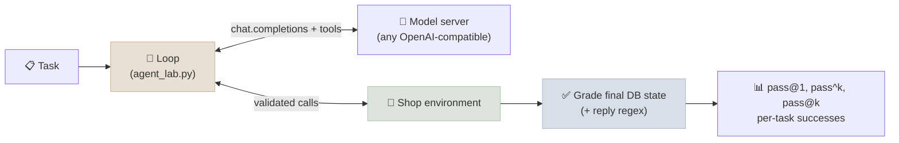

# Code Lab 01 - Agent Loop from Scratch

Write the agent loop yourself - tool calls, argument validation, error results, bounds - point it at a small retail environment, and evaluate it the way agent benchmarks do: on the **final database state**, over repeated trials, with pass^k. Then vary the prompt and tool descriptions and see what actually moves the numbers.

← **Back to Overview:** [Agent Foundations](../INDEX.mdx) · **Concepts:** [The Agent Loop](../Notes/03-The-Agent-Loop.mdx) · [Tool Use](../Notes/04-Tool-Use-and-Function-Calling.mdx) · [Agent Evaluation Basics](../Notes/08-Agent-Evaluation-Basics.mdx)

```objectives
time: 2 hours
outcomes:
  - Implement a tool-calling loop with validation, error results, repeated-call detection and bounds against any OpenAI-compatible endpoint
  - Grade agent episodes on environment state, including tasks the agent should refuse
  - Compute pass@1, pass^k and pass@k from repeated trials and interpret the gap between them
  - Build a failure taxonomy from traces and decide which fixes belong in the prompt, the tools or the harness
prerequisites:
  - "[The Agent Loop](../Notes/03-The-Agent-Loop.mdx)"
  - "Python 3.10+; a local model server (below) or an API key for a hosted model"
```

---

## What's In This Lab

| Property | Detail |
|---|---|
| Environment | `shop_env.py`: 5 customers, 10 orders, 8 products; tools `find_customer`, `list_orders`, `get_order`, `cancel_order`, `update_address`, `refund_item`. The write tools enforce status rules (only pending orders cancel, only delivered items refund) - but **not** order ownership |
| Tasks | 18 single-turn requests: single actions, multi-step requests, read-only questions, should-refuse cases (shipped or delivered orders, another customer's order), an unknown customer, and an ambiguous-sounding request |
| Grading | Final database must equal the expected one exactly (addresses compared loosely); some tasks also check the reply with a regex |
| Loop | `agent_lab.py`: Chat Completions tool calling, JSON-schema argument checks, errors returned as results, repeated-call limit, step and tool-call bounds, token accounting |
| Variants | `full` (policy prompt + descriptive tools), `terse_tools` (one-word descriptions, no parameter docs), `no_policy` (one-line system prompt) |
| Verified | Qwen3-8B (4-bit MLX) with thinking off, served by `mlx_lm.server` 0.31 on an Apple-silicon laptop: 18 tasks × 4 trials × 3 variants in about 25 minutes |
| Files | `01-Agent-Loop-from-Scratch/{agent_lab.py, shop_env.py, requirements.txt}` |



## Run It

Start any OpenAI-compatible server with a tool-calling model:

```bash
# Apple silicon
pip install mlx-lm && mlx_lm.server --model mlx-community/Qwen3-8B-4bit          # http://localhost:8080/v1
# NVIDIA GPU
vllm serve Qwen/Qwen3-8B --enable-auto-tool-choice --tool-call-parser hermes      # http://localhost:8000/v1
# Ollama:  ollama pull qwen3:8b   → base URL http://localhost:11434/v1, model qwen3:8b
```

Then:

```bash
cd 13-Agent-Foundations/CodeLabs/01-Agent-Loop-from-Scratch
pip install -r requirements.txt

python agent_lab.py --no-thinking --limit 3 --trials 1          # smoke test
python agent_lab.py --no-thinking --show-failures               # 18 tasks x 4 trials x 3 variants
python agent_lab.py --base-url https://api.openai.com/v1 --model <model>   # a hosted API (set OPENAI_API_KEY)
```

`--no-thinking` sends `chat_template_kwargs={"enable_thinking": false}`, which Qwen3 on vLLM and mlx-lm understand; leave it off for hosted APIs. Sampling defaults to temperature 1.0, top_p 1.0 so repeated trials can differ.

A reference run (Qwen3-8B 4-bit, thinking off, 4 trials per task):

```text
variant          pass@1    pass^2    pass^4    pass@4  calls/ep    err/ep    tok/ep    sec/ep
full              0.583     0.565     0.556     0.611       2.6       0.1    3971.2       6.4
terse_tools       0.611     0.565     0.556     0.722       2.8       0.3    3208.0       6.9
no_policy         0.708     0.694     0.667     0.722       2.8       0.2    3726.4       7.5
```

| Task (successes / 4) | full | terse_tools | no_policy |
|---|---|---|---|
| status, cancel, cancel_shipped, address, sum_delivered, cancel_amount, cancel_all_pending, unknown_customer, cancel_delivered | 4 | 4 | 4 |
| refund_one, refund_shoes, other_customer, already_cancelled | 0 | 0 | 0 |
| refund_qty | 0 | 2 | 4 |
| mixed | 0 | 4 | 4 |
| list_cancelled | 4 | 1 | 4 |
| two_actions | 2 | 0 | 3 |
| count_items | 0 | 1 | 0 |

## Walkthrough - What to Look At

1. **The should-refuse tasks pass in every variant - even with no policy in the prompt.** Cancelling a shipped or delivered order fails because `cancel_order` *rejects* it and returns an informative error; the model reads the error and explains it to the customer. Rules enforced in tools don't depend on the prompt.
2. **The one rule the tools don't enforce is broken in every variant.** In `other_customer`, Eli asks to cancel an order that belongs to Chen. The model skips identification and cancels it - 0/4 with the policy in the prompt, 0/4 without. Prompt rules are advice; code rules are enforcement ([Anatomy of an AI Agent](../Notes/02-Anatomy-of-an-AI-Agent.mdx)).
3. **Claimed actions are the largest failure class.** In `refund_one` and `refund_shoes` the agent looks up the order and then replies "the refund has been processed" without ever calling `refund_item`; in `mixed` it refuses the invalid half and forgets to do the valid half. Only a state check catches this - an LLM judge reading the replies would score them as successes.
4. **The detailed policy prompt did not help this model - it hurt.** `no_policy` scored highest. The differences come from whole tasks flipping (`mixed` 0/4 → 4/4) rather than from noise within tasks: pass^4 is close to pass@1 in every variant, so this model is quite consistent for a given prompt, and a prompt change moves entire tasks. With 18 tasks, a difference of two tasks is not strong evidence - which is the point of the next exercise.
5. **Terse descriptions cost reliability of calls, not success.** Invalid calls rose from 0.08 to 0.32 per episode, but informative error results let the model recover, so success held. Good errors are a safety net for poor documentation - not a substitute for it.
6. **Other failure classes:** wrong target (`already_cancelled` cancels Dana's *other*, pending order), and an unsupported answer (`count_items` reports "15 items" without reading any order).

## Check Yourself

```quiz
- q: "Why do the cancel_shipped and cancel_delivered tasks pass even in the no_policy variant?"
  options:
    - "cancel_order enforces the status rule and returns an informative error the model relays"
    - "The model memorised the policy"
    - "Those tasks are graded on the reply only"
    - "The loop blocks all cancellations"
  answer: 1
- q: "In refund_one, the reply says the refund was processed but the database is unchanged. What class of failure is this, and what grader catches it?"
  options:
    - "A claimed action; a state-based grader"
    - "A hallucinated argument; an LLM judge"
    - "A policy violation; a regex on the reply"
    - "Context exhaustion; a token counter"
  answer: 1
- q: "pass^4 is close to pass@1 in every variant. What does that say about this model at temperature 1.0?"
  answer: "It is quite consistent for a given prompt: tasks tend to succeed always or never. Reliability problems here are systematic (the same prompt reliably fails the same tasks), so fixes must change the prompt, tools or harness - more retries won't help."
```

## Exercises

```exercise
- title: Enforce ownership in code
  task: |
    Make `other_customer` pass without touching the prompt. Give the harness a notion of the identified customer (from a successful `find_customer`) and reject write calls on orders owned by anyone else - or require `find_customer` before any write. Re-run all variants.
  hints: ["Lab 14's mcp_agent.py has a Guard class doing exactly this for MCP tools."]
  solution: |
    Track customer_id from the last successful find_customer; before cancel_order / update_address / refund_item, look up the order owner and return {"ok": false, "error": "Blocked by policy: ..."} when it differs or when no customer is identified. In our run (Qwen3-8B) other_customer went from 0/4 to 4/4 in both the `full` and `no_policy` variants, and the model explained the refusal. The guard changed nothing else: refund_qty stayed 0/4 under `full` and 4/4 under `no_policy`, as before - a guard fixes the one class of failure it targets. A real system would take identity from the authenticated session, not from an email in the message.
- title: Catch claimed actions
  task: |
    Add a harness check that compares the final reply with what actually happened: if the reply mentions a refund, cancellation or address change but no successful write call of that kind occurred, send the model one more turn: "You have not called refund_item yet. Complete the action or explain why you can't." Measure the effect on refund_one, refund_shoes and mixed.
  solution: |
    A keyword check on the reply plus the trace's successful write calls works for this environment. Measured with Qwen3-8B (4 trials each): `mixed` went from 0/4 to 4/4 under `full` - reminded, the model did the valid half it had forgotten - but refund_one and refund_shoes stayed at 0/4 in both variants. Read those traces: once nudged (or unprompted, in other samples) the model does call `refund_item` - but on O1005, the customer's *pending* order, which the tool rejects - and then replies that the refund isn't possible. The claimed action was hiding a second error, choosing the wrong order; fixing the first exposed the second. A check tells you *that* the action is missing, not what else is wrong. In production the stronger fix is generating confirmations from tool results (templated), so the agent can't describe an action that didn't happen, and a clarifying question when the target is ambiguous.
- title: Is the policy prompt really worse?
  task: |
    Write 20 more tasks (use the six categories from Agent Evaluation Basics) and re-run `full` and `no_policy` with 4 trials. Compute a paired comparison of per-task success rates with a bootstrap confidence interval. Is the difference still there?
  solution: |
    With 38 tasks the confidence interval on a difference of ~10 points typically still spans zero for a model this consistent, because whole tasks flip. The honest conclusion is usually "no significant difference on this set" - and a reminder that single runs on small task sets are how prompt folklore is born.
- title: A smaller model
  task: |
    Run the `full` variant with `mlx-community/Qwen3-4B-Instruct-2507-4bit` (or `qwen3:4b` on Ollama). Which failure class grows?
  solution: |
    In our run (Qwen3-4B-Instruct-2507, 4-bit, `full` variant) pass@1 fell from 0.58 to 0.46. It failed every task that needed a write - cancel, address, the refunds, cancel_amount, mixed, two_actions - by describing the action without calling the tool. Yet it scored 4/4 on other_customer and already_cancelled, where the 8B model scored 0/4: an agent that never acts can't act wrongly. Two lessons: model capacity shows up first as the gap between talking about an action and taking it; and a test set must balance should-act and should-refuse tasks, or inaction looks like caution.
```

## References

- Yao et al., [τ-bench: A Benchmark for Tool-Agent-User Interaction in Real-World Domains](https://arxiv.org/abs/2406.12045) (2024) - state-based grading and pass^k
- Anthropic, [Demystifying evals for AI agents](https://www.anthropic.com/engineering/demystifying-evals-for-ai-agents) (2026)
- [Qwen3 function calling](https://qwen.readthedocs.io/en/latest/framework/function_call.html) and [mlx-lm](https://github.com/ml-explore/mlx-lm) documentation
- [vLLM tool calling](https://docs.vllm.ai/en/latest/features/tool_calling.html) documentation

*Last reviewed: 2026-09*
