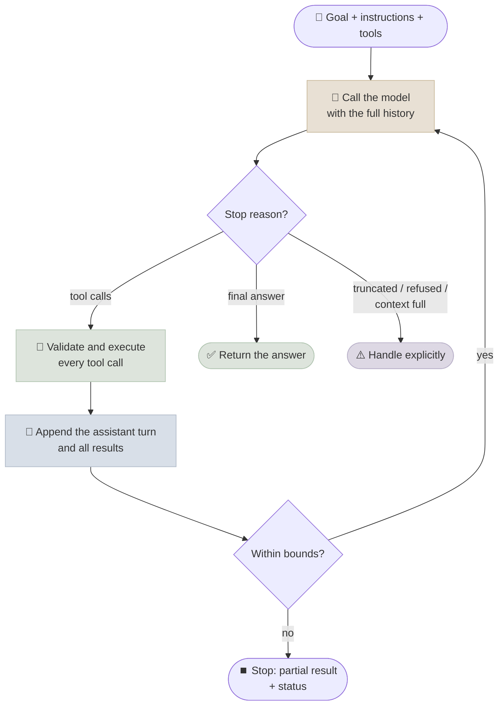

# The Agent Loop

The agent loop is the few dozen lines of code that turn a model into an agent: call the model, run the tools it asks for, send back the results, repeat until it answers. This chapter writes the loop correctly for the two main API shapes, lists the invariants that break it when violated, and adds the bounds and failure handling every production loop needs.

```objectives
time: 60 min
outcomes:
  - Write a working tool-use loop against the Claude Messages API and the OpenAI Responses API
  - State the loop invariants - every tool call answered, history kept unmodified, results in one turn - and what breaks when each is violated
  - Handle every stop reason, including truncation, refusal and paused server-side turns
  - Add bounds, repeated-call detection and error results, and run independent tool calls in parallel
prerequisites:
  - "[Anatomy of an AI Agent](02-Anatomy-of-an-AI-Agent.mdx)"
  - "Python; an API key for any provider, or a local OpenAI-compatible server (see the lab)"
```

## The Loop in One Picture



The model is **stateless**: between calls it remembers nothing. What looks like memory is the growing message list your loop sends on every call. That single fact explains most of agent engineering - context growth, cost growth, and why the order and integrity of the history matter.

---

## The Loop Against the Claude Messages API

```python
import json
import anthropic

client = anthropic.Anthropic()

TOOLS = [{
    "name": "get_weather",
    "description": "Get the current weather for a city. Call it whenever the user asks about weather.",
    "input_schema": {
        "type": "object",
        "properties": {"city": {"type": "string", "description": "City name, e.g. Paris"}},
        "required": ["city"],
    },
}]

def run_tool(name: str, args: dict) -> str:
    if name == "get_weather":
        return json.dumps({"city": args["city"], "temp_c": 21, "sky": "clear"})
    raise ValueError(f"unknown tool {name}")

def run_agent(user_msg: str, max_steps: int = 10) -> str:
    messages = [{"role": "user", "content": user_msg}]
    for _ in range(max_steps):
        resp = client.messages.create(
            model="claude-opus-5", max_tokens=16000, tools=TOOLS, messages=messages)

        if resp.stop_reason == "refusal":                      # check before reading content
            return "The request was declined."
        if resp.stop_reason == "max_tokens":                   # a tool_use block may be cut off
            raise RuntimeError("Output truncated - raise max_tokens; don't run partial tool calls")
        if resp.stop_reason == "model_context_window_exceeded":
            raise RuntimeError("Context full - compact the history and retry")

        # Keep the assistant turn exactly as returned (text, thinking and tool_use blocks).
        messages.append({"role": "assistant", "content": resp.content})

        if resp.stop_reason == "pause_turn":                   # a server-side tool loop paused
            continue                                           # resend as-is; the server resumes
        if resp.stop_reason != "tool_use":                     # end_turn / stop_sequence
            return "".join(b.text for b in resp.content if b.type == "text")

        results = []
        for block in resp.content:
            if block.type != "tool_use":
                continue
            try:
                out, is_error = run_tool(block.name, block.input), False
            except Exception as e:                             # report failures to the model
                out, is_error = f"Error: {e}", True
            results.append({"type": "tool_result", "tool_use_id": block.id,
                            "content": out, "is_error": is_error})
        messages.append({"role": "user", "content": results})  # all results in ONE user turn
    return "Stopped: step limit reached."
```

Anthropic's SDKs also provide a **tool runner** (`client.beta.messages.tool_runner`) that runs this loop for you from decorated Python functions, with hooks for approval and result modification. Write the loop by hand once anyway - it is what every framework wraps.

### Stop reasons and what to do

| `stop_reason` | Meaning | Loop action |
|---|---|---|
| `tool_use` | The model wants one or more tools run | Execute all, send all results back, call again |
| `end_turn` | The model has finished | Return the text |
| `max_tokens` | Output hit the limit - a tool call may be incomplete | Don't execute; retry with more tokens |
| `pause_turn` | A **server-side** tool loop (web search, code execution) reached its iteration limit | Append the assistant turn unchanged and call again - no extra "continue" message |
| `refusal` | Declined by the model or a safety classifier | Stop; surface it; optionally retry on a fallback model |
| `model_context_window_exceeded` | Input plus output filled the context window | Compact or trim history, then retry |
| `stop_sequence` | A custom stop sequence was produced | Application-specific |

---

## The Loop Against the OpenAI Responses API

The Responses API represents the conversation as a list of **items**. A tool call is a `function_call` item with a `call_id`; you answer it with a `function_call_output` item carrying the same `call_id`.

```python
import json, os
from openai import OpenAI

client = OpenAI()
MODEL = os.environ["OPENAI_MODEL"]           # pick a current model - see Model Landscape

TOOLS = [{
    "type": "function", "name": "get_weather",
    "description": "Get the current weather for a city.",
    "parameters": {"type": "object", "properties": {"city": {"type": "string"}},
                   "required": ["city"], "additionalProperties": False},
    "strict": True,
}]

def run_agent(user_msg: str, max_steps: int = 10) -> str:
    items = [{"role": "user", "content": user_msg}]
    for _ in range(max_steps):
        resp = client.responses.create(model=MODEL, input=items, tools=TOOLS)
        calls = [it for it in resp.output if it.type == "function_call"]
        if not calls:
            return resp.output_text
        items += resp.output                   # includes reasoning items - they must be passed back
        for call in calls:
            try:
                out = run_tool(call.name, json.loads(call.arguments))
            except Exception as e:
                out = json.dumps({"error": str(e)})
            items.append({"type": "function_call_output", "call_id": call.call_id, "output": out})
    return "Stopped: step limit reached."
```

Instead of resending the items, you can pass `previous_response_id=resp.id` and send only the new `function_call_output` items; the server keeps the history. Most open-source servers (vLLM, SGLang, Ollama, mlx-lm) expose the older **Chat Completions** shape, where tool calls arrive in `message.tool_calls` and results go back as `{"role": "tool", "tool_call_id": ..., "content": ...}` messages - that is the shape the [lab](../CodeLabs/01-Agent-Loop-from-Scratch.mdx) uses.

---

## Loop Invariants

These rules are where hand-written loops break. Violating the first three produces API errors; violating the rest produces subtle quality loss.

| Invariant | Why |
|---|---|
| **Every tool call gets exactly one result**, matched by id (`tool_use_id` / `call_id` / `tool_call_id`) | An unanswered call makes the next request invalid; a duplicated one confuses the model |
| **Send all results for one turn together** - in Claude's API, in a single user message with the `tool_result` blocks first | Split results break the call/result pairing the model was trained on |
| **Append the assistant turn unmodified** - including thinking blocks (Claude) and reasoning items (OpenAI) | Reasoning models continue their reasoning across tool calls; stripped or edited reasoning is rejected or degrades the next step |
| **Don't edit or reorder earlier turns** once sent | Breaks prompt caching, and on recent models invalidates preserved reasoning |
| **Return errors as results**, marked as errors (`is_error: true` on Claude) | The model can recover from an informative error; it can't recover from a crashed loop |
| **Never execute a truncated or refused turn's tool calls** | A cut-off argument often still parses as valid JSON |

---

## What the Model Sees at Each Step

For "What's the weather in Tokyo and Paris?", a capable model emits **two tool calls in one turn** (parallel tool use). The history after one iteration:

```text
user:       What's the weather in Tokyo and Paris?
assistant:  [tool_use id=t1 get_weather{city: Tokyo}] [tool_use id=t2 get_weather{city: Paris}]
user:       [tool_result t1: {"temp_c": 15, ...}]     [tool_result t2: {"temp_c": 22, ...}]
assistant:  Tokyo is 15 °C and overcast; Paris is 22 °C and sunny.      ← stop_reason end_turn
```

Each step adds the model's output, the tool calls and the tool results to the context, and the **whole history is re-sent (and re-billed) on every call**. A 20-step episode whose context grows by 3K tokens per step processes about 3K × (1 + 2 + … + 20) ≈ 630K input tokens in total, not 60K. Prompt caching makes the repeated prefix cheap ([Prompt Caching & Cost](../../11-Prompt-Engineering/Notes/07-Prompt-Caching-and-Cost.mdx)), which is why you never edit earlier turns.

### Running tool calls in parallel

When the model emits several independent calls, execute them concurrently - latency becomes the slowest call rather than the sum:

```python
import asyncio

async def execute_all(calls):
    async def one(c):
        try:
            return c.id, await run_tool_async(c.name, c.input), False
        except Exception as e:
            return c.id, f"Error: {e}", True
    return await asyncio.gather(*(one(c) for c in calls))
```

Only parallelise calls that are independent and read-only, or whose side effects commute. Both APIs let you switch parallel calls off (`parallel_tool_calls=False` on OpenAI; `disable_parallel_tool_use` in Claude's `tool_choice`) when order matters.

---

## Bounds and Termination

A loop without bounds will eventually burn money in a cycle. Every loop needs a success condition (the model answers) and escape hatches:

| Bound | Typical default | On breach |
|---|---|---|
| Model calls per episode | 10-50 (task-dependent) | Return partial result with `status="max_steps"` |
| Tool calls per episode | 2-3× model calls | Same |
| Identical calls (same tool + same arguments) | 2 | Return an error result telling the model to use the earlier result or change approach |
| Tokens or cost per episode | From your p95 on a test set, with headroom | Stop and escalate |
| Wall-clock time | Per product SLA | Stop; resume later if the loop is durable |

Return a **structured result**, not an exception: status, final or partial answer, steps, tool calls, tokens, and the trace. That record is what your evals and dashboards consume ([Agent Evaluation Basics](08-Agent-Evaluation-Basics.mdx)).

---

## Common Loop Failures

| Failure | Symptom | Fix in the loop |
|---|---|---|
| **Claimed action** | Final answer says "I've refunded it" but no write tool was called | Grade on environment state, not text; in high-stakes flows, generate the confirmation from tool results |
| **Repetition** | Same call with the same arguments again and again | Repeated-call detection; informative "no results" messages |
| **Hallucinated arguments** | Ids or values that appear nowhere in the context | Schema validation; lookup tools; "never guess ids" in descriptions |
| **Orphaned tool calls** | API error on the next request | Answer every call, including on exceptions and timeouts |
| **Context exhaustion** | Forgets the goal, contradicts earlier findings | Truncate large tool outputs; compact history; keep a task summary ([Agent Memory](05-Agent-Memory.mdx)) |
| **Premature stop** | Answers before finishing all parts of the request | Instructions defining "done"; a verification step before accepting the answer |

The first failure is the one the [lab](../CodeLabs/01-Agent-Loop-from-Scratch.mdx) catches most often on a small model: the reply describes an action the agent never took, which only an environment-state check detects.

---

## Check Yourself

```quiz
- q: "A Claude response has stop_reason 'max_tokens' and contains a tool_use block. What should the loop do?"
  options:
    - "Not execute the tool call; retry with a larger max_tokens"
    - "Execute the tool call - the JSON parsed"
    - "Append 'continue' and call again"
    - "Return the text so far as the final answer"
  answer: 1
  explain: "A truncated argument can still parse as valid (but wrong) JSON. Never run a truncated turn's tools."
- q: "What must you do with 'pause_turn'?"
  options:
    - "Append the assistant turn unchanged and call the API again, without adding a user message"
    - "Treat it as the final answer"
    - "Add a user message saying 'continue'"
    - "Drop the paused content and retry the original request"
  answer: 1
- q: "A reasoning model returns reasoning items alongside a function_call in the Responses API. What happens to them on the next request?"
  options:
    - "They are passed back with the function_call_output items (or kept server-side via previous_response_id)"
    - "They must be removed to save tokens"
    - "They are converted to a system message"
    - "They are only needed for streaming"
  answer: 1
- q: "An episode has 20 model calls and the context grows by about 2,000 tokens per step from a 4,000-token start. Roughly how many input tokens are processed in total?"
  answer: "Call i sees about 4,000 + 2,000 × (i − 1) tokens. Summed over 20 calls: 20 × 4,000 + 2,000 × (0 + 1 + … + 19) = 80,000 + 380,000 = 460,000 input tokens - quadratic growth, which is why caching and compaction matter."
- q: "Why is 'grade on environment state' the fix for claimed actions?"
  answer: "Because the model's text is not evidence that anything happened. Checking the database, file system or API state after the episode shows what the agent actually did."
```

## Exercises

```exercise
- title: Break the invariants
  task: |
    Using the lab's loop (or your own), deliberately (a) skip one tool result when the model makes two calls, (b) send two results in two separate messages, (c) drop the assistant turn's tool_calls before appending results. Record the error or behaviour you get from your server or API for each.
  solution: |
    Typical outcomes: (a) an API validation error that a tool call id has no response (OpenAI and Claude both reject this); local servers may accept it but the model then re-issues the call or hallucinates the missing result. (b) Claude requires tool_result blocks at the start of the next user message and rejects interleaving; Chat Completions accepts consecutive tool messages but not other messages in between. (c) The results reference ids that no longer exist - an error on hosted APIs, confusion on local servers. The lesson: history integrity is part of the contract, not a style choice.
- title: Add a cost bound
  task: |
    Extend the lab's `run_agent` with a `max_cost_usd` bound computed from `usage` and per-token prices you pass in. When exceeded, stop with status `max_cost` and return the partial trace. Test it by setting a bound lower than one episode's cost.
  solution: |
    After each call, cost += prompt_tokens × p_in + completion_tokens × p_out (use cached-token counts where the API reports them). Check the bound before the next model call, not after tool execution, so you never pay for a call you'll discard. Return Result(status="max_cost", ...) with the trace so far.
- title: Parallel versus sequential
  task: |
    Add a tool with an artificial 1-second delay and ask a question that needs it three times independently. Measure episode wall time with sequential execution and with asyncio.gather.
  solution: |
    Sequential ≈ 3 s of tool time plus model time; parallel ≈ 1 s plus model time. The model-call count is unchanged if the model emits the three calls in one turn; if it emits them one per turn, no executor-side parallelism helps - encourage parallel calls in the instructions.
```

## Study Notes

- The loop: call model → execute every tool call → append assistant turn + all results → repeat; stop on a final answer or a bound
- The model is stateless; the message list is its working memory and is re-sent (and re-billed) every call
- Invariants: one result per call id; all results in one turn; assistant turns (with reasoning) appended unmodified; never edit earlier turns
- Claude stop reasons: tool_use, end_turn, max_tokens, pause_turn, refusal, model_context_window_exceeded, stop_sequence
- OpenAI Responses: function_call / function_call_output matched by call_id; pass reasoning items back
- Return errors as results; bound steps, tool calls, repeats, tokens/cost and time; return a structured result
- Parallelise independent calls; grade agents on environment state, not on what they say they did

## References

- Anthropic, [Handling stop reasons](https://platform.claude.com/docs/en/build-with-claude/handling-stop-reasons) and [Tool use overview](https://platform.claude.com/docs/en/agents-and-tools/tool-use/overview) (docs, 2026)
- OpenAI, [Function calling guide](https://developers.openai.com/api/docs/guides/function-calling) (docs, 2026)
- Anthropic, [Building Effective Agents](https://www.anthropic.com/engineering/building-effective-agents) (2024)
- Yao et al., [ReAct: Synergizing Reasoning and Acting in Language Models](https://arxiv.org/abs/2210.03629) (ICLR 2023)
- Kim et al., [An LLM Compiler for Parallel Function Calling](https://arxiv.org/abs/2312.04511) (ICML 2024)

*Last reviewed: 2026-09*
