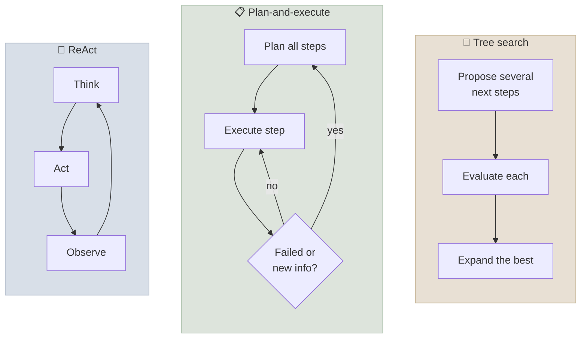

# Planning & Reasoning

Planning is how an agent turns a goal into a sequence of actions and revises that sequence as it learns more. With reasoning models, much of the step-by-step thinking now happens inside the model; the harness decides **where plans live, when to re-plan, and what feedback drives correction**. This chapter covers the classic strategies - ReAct, plan-and-execute, tree search, reflection - and when each is still worth its cost.

```objectives
time: 50 min
outcomes:
  - Explain how reasoning models change agent planning - interleaved thinking, effort control - and what the harness still has to provide
  - Compare ReAct, plan-and-execute (including ReWOO and LLMCompiler), tree search and reflection on cost, latency and robustness
  - Implement an explicit plan as agent state (a todo list) with re-planning on failure
  - Decide when self-reflection helps, using the evidence on self-correction
prerequisites:
  - "[The Agent Loop](03-The-Agent-Loop.mdx)"
  - "[Prompting Reasoning Models](../../11-Prompt-Engineering/Notes/05-Prompting-Reasoning-Models.mdx)"
```

## Reasoning Models Changed the Baseline

In 2023, agents got their reasoning from prompts: "Thought: … Action: … Observation: …" (ReAct), or "let's think step by step". Reasoning models ([Post-training & Reasoning](../../05-Post-Training/INDEX.mdx)) are trained with reinforcement learning to think before answering, and current APIs let them **think between tool calls** (interleaved thinking): read a tool result, reason about it, then act. Three consequences:

1. **Don't prompt for visible "Thought:" lines on a reasoning model.** It already reasons; forcing a visible scratchpad adds tokens and can conflict with its trained behaviour. Use the reasoning **effort** setting instead, and keep the reasoning items/thinking blocks in the history ([The Agent Loop](03-The-Agent-Loop.mdx)).
2. **Effort is a per-call dial.** High effort for planning and hard decisions; low effort for routine steps such as reformatting a tool result. Some systems route those steps to a smaller model.
3. **The harness still owns the plan.** Thinking is private and per call; a plan that must survive compaction, be shown to a user, be approved, or be resumed after a crash has to live in **state** the harness controls.

---

## The Strategies



### ReAct: interleave reasoning and acting

ReAct (Yao et al., 2023) alternates reasoning traces with actions and observations, so each step is chosen with the latest information. It is the default shape of every tool-calling loop: the model decides one step (or a few parallel calls), sees results, decides again. Strengths: adapts immediately to surprises. Weaknesses: myopic on long tasks - it can wander, repeat itself or lose the goal; and every step is a full model call over the whole history.

### Plan-and-execute

A planner produces an explicit multi-step plan; an executor carries out the steps (often with a cheaper model); the planner revises the plan when a step fails or reveals new information. Variants optimise the execution:

| Variant | Idea | Benefit |
|---|---|---|
| **Plan-and-Solve** (Wang et al., 2023) | Prompt the model to devise a plan, then carry it out | Fewer missed steps than plain chain-of-thought |
| **ReWOO** (Xu et al., 2023) | Plan all tool calls up front with placeholders for results (`#E1`, `#E2`), execute them, then solve | Far fewer tokens - observations aren't re-sent to the planner after every step |
| **LLMCompiler** (Kim et al., 2024) | Plan a dependency graph of tool calls and execute independent ones in parallel | Lower latency and cost on tasks with parallel structure |

Plan-and-execute suits tasks whose structure is knowable after a little investigation - multi-part research, data pipelines, migrations - and gives you a **plan artefact** a human can review before execution. It is brittle when early steps change what later steps should be, unless re-planning is cheap and frequent.

### Tree search

Tree of Thoughts (Yao et al., 2023) proposes several candidate next steps, evaluates them and searches (breadth- or depth-first) with backtracking. It helps on puzzle-like problems with a clear evaluation signal, at several times the cost of a single path. In agent settings, the practical descendants are **best-of-n with a verifier** (run several attempts, keep the one that passes tests) and parallel exploration by sub-agents. Reach for search only when you have a reliable evaluator.

### Reflection and self-correction

Reflexion (Shinn et al., 2023) has the agent write a verbal lesson after a failed attempt and retry with that lesson in context; it improved results on coding and decision tasks **where an external signal said the attempt failed** (unit tests, environment reward). That condition is the key. Huang et al. (2024) found that models asked to review and correct their own reasoning **without external feedback** do not reliably improve and sometimes get worse. So:

| Reflection setup | Evidence | Use it? |
|---|---|---|
| Retry after an **external** failure signal (test failure, validation error, tool error) | Consistently helps | Yes - make these signals available |
| A separate evaluator with **different information** (a rubric, a checklist, retrieved sources) | Often helps | Yes, for well-specified criteria ([evaluator-optimizer pattern](../../15-Agent-Patterns/INDEX.mdx)) |
| "Review your answer and fix any mistakes" with nothing new | Weak or negative | Mostly no - on reasoning models it duplicates thinking the model already did |

This is the course's consistent position on reflection; the patterns module applies it to evaluator-optimizer loops and multi-agent critique.

---

## Plans as State: The Todo List

The most widely used planning mechanism in production coding agents is simple: a **todo tool**. The agent writes a checklist at the start, marks items in progress and done, and adds items as it discovers them. The list lives in harness state, is re-shown to the model after compaction, and is visible to the user.

```python
PLAN: list[dict] = []   # harness state, persisted with the task checkpoint

def update_plan(items: list[dict]) -> str:
    """Replace the task plan. Each item: {"step": str, "status": "pending" | "in_progress" | "done"}.
    Call it at the start of a multi-step task and whenever a step finishes or the plan changes.
    Keep exactly one item in_progress."""
    PLAN[:] = items
    return render(PLAN)   # the rendered checklist goes back to the model and to the UI
```

Why it works: the plan survives context management, the model re-reads its own commitments each step (reducing forgotten sub-tasks), and a human can see and correct the plan early.

### Re-planning triggers

Re-plan when: a step fails with a non-retryable error; a result contradicts an assumption the plan relied on; the user changes the goal; or progress stalls (N steps with no plan item completed). Don't re-plan after every step - that is ReAct with extra overhead.

---

## Choosing a Strategy

| Situation | Strategy |
|---|---|
| Short tasks, a handful of tool calls | Plain tool loop (ReAct shape) on a reasoning model; set effort |
| Long tasks with sub-tasks you can list after some exploration | Todo-list plan in state + tool loop; re-plan on triggers |
| Many independent tool calls (fan-out lookups) | Parallel tool calls, or LLMCompiler-style dependency planning |
| Plan needs human approval before side effects | Plan-and-execute with an approval gate on the plan |
| Hard search problems with a reliable verifier (tests, a checker) | Best-of-n or tree search against the verifier |
| Repeated failures on the same kind of task | Reflection that uses the failure signal; if it recurs across tasks, update procedural memory |

---

## Check Yourself

```quiz
- q: "According to Huang et al. (2024), when does self-correction of reasoning reliably help?"
  options:
    - "When there is external feedback, such as a failing test or tool error"
    - "Whenever the model is asked to review its answer"
    - "Only for small models"
    - "Never"
  answer: 1
- q: "What is ReWOO's main efficiency gain over ReAct?"
  options:
    - "It plans tool calls up front with placeholders, so observations are not re-sent to the planner after every step"
    - "It uses a smaller model for everything"
    - "It removes tool calls"
    - "It caches all answers"
  answer: 1
- q: "Why keep a plan in harness state when the model already reasons internally?"
  options:
    - "Thinking is per call and private; a plan in state survives compaction, can be shown and approved, and can be resumed"
    - "Reasoning models cannot plan"
    - "It reduces the context window"
    - "APIs require it"
  answer: 1
- q: "Give two re-planning triggers that are better than 're-plan every step'."
  answer: "Any two of: a non-retryable step failure; a result that contradicts an assumption of the plan; a user changing the goal; stalled progress (several steps without completing a plan item)."
```

## Exercises

```exercise
- title: Add a todo tool to the lab
  task: |
    Add an `update_plan` tool to the lab's agent and require its use for requests with more than one action (the `two_actions` and `mixed` tasks). Compare success on those tasks with and without it over 8 trials.
  hints: ["Render the plan back to the model in the tool result so it sees its own checklist."]
  solution: |
    With a small model, the plan tool often helps multi-action tasks by reducing "did one of two actions" failures, at the cost of one or two extra calls per episode. If it doesn't help, check whether the model marks items done without calling the action tool - the same "claimed action" failure, now inside the plan - and grade on the database state.
- title: ReAct vs ReWOO on paper
  task: |
    A research task needs 6 independent searches and then a synthesis. The context grows by 1,500 tokens per search result; the base prompt is 3,000 tokens. Estimate input tokens for (a) a ReAct loop doing one search per step, (b) ReWOO (one planning call, 6 tool executions, one solving call).
  solution: |
    (a) ReAct: 7 model calls seeing 3,000, 4,500, 6,000, …, 12,000 tokens ≈ 7 × 3,000 + 1,500 × (0+1+…+6) = 21,000 + 31,500 = 52,500 input tokens. (b) ReWOO: planner ≈ 3,000; solver ≈ 3,000 + 6 × 1,500 = 12,000; total ≈ 15,000 - about 3.5× less, with the same final context. Parallel tool calls in one ReAct step would get close to ReWOO too.
```

## Study Notes

- Reasoning models think internally, including between tool calls; set effort instead of prompting "Thought:" lines; keep reasoning in the history
- The harness still owns durable plans: a todo list in state survives compaction and supports approval and resume
- ReAct = interleave think/act/observe (default loop shape; myopic on long tasks)
- Plan-and-execute: Plan-and-Solve, ReWOO (placeholders, fewer tokens), LLMCompiler (parallel DAG)
- Tree search / best-of-n only with a reliable evaluator
- Reflection helps with external feedback (tests, errors); intrinsic self-correction without new information is unreliable (Huang et al., 2024)
- Re-plan on failure, contradiction, goal change or stalled progress

## References

- Yao et al., [ReAct: Synergizing Reasoning and Acting in Language Models](https://arxiv.org/abs/2210.03629) (ICLR 2023)
- Wang et al., [Plan-and-Solve Prompting](https://arxiv.org/abs/2305.04091) (ACL 2023)
- Xu et al., [ReWOO: Decoupling Reasoning from Observations for Efficient Augmented Language Models](https://arxiv.org/abs/2305.18323) (2023)
- Kim et al., [An LLM Compiler for Parallel Function Calling](https://arxiv.org/abs/2312.04511) (ICML 2024)
- Yao et al., [Tree of Thoughts: Deliberate Problem Solving with Large Language Models](https://arxiv.org/abs/2305.10601) (NeurIPS 2023)
- Shinn et al., [Reflexion: Language Agents with Verbal Reinforcement Learning](https://arxiv.org/abs/2303.11366) (NeurIPS 2023)
- Huang et al., [Large Language Models Cannot Self-Correct Reasoning Yet](https://arxiv.org/abs/2310.01798) (ICLR 2024)

*Last reviewed: 2026-09*
