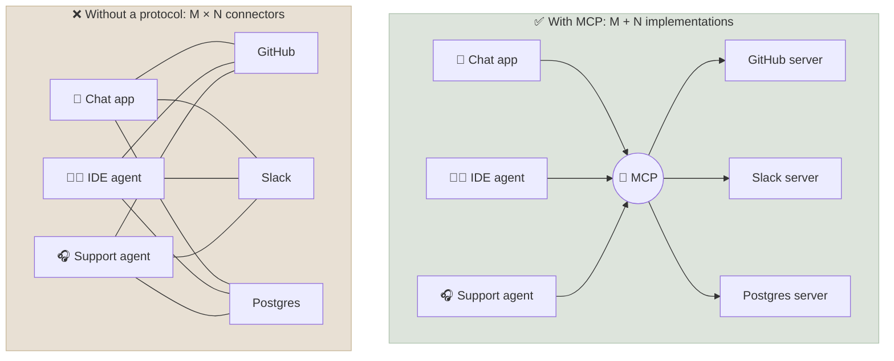
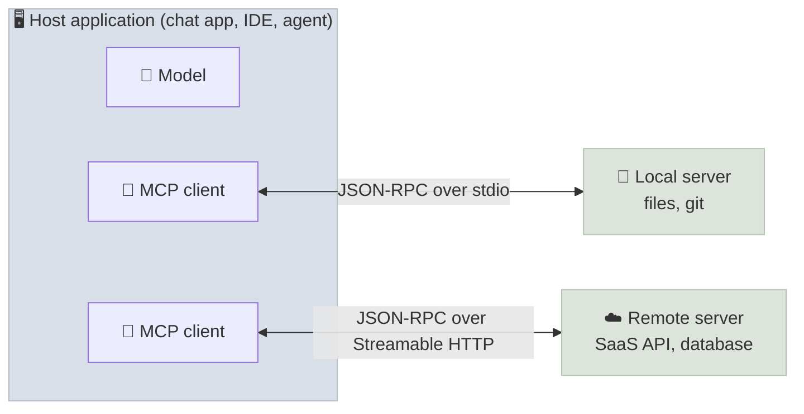

# Why MCP

The Model Context Protocol (MCP) is an open standard for connecting AI applications to the tools, data and prompts they need: a server exposes capabilities once, and any MCP-compatible application can use them. This chapter explains the integration problem MCP solves, what it standardises and what it deliberately doesn't, how it relates to function calling and to agent-to-agent protocols, and who governs it.

```objectives
time: 35 min
outcomes:
  - Explain the M×N integration problem and how a shared protocol reduces it to M + N
  - Name MCP's participants (host, client, server) and the three server primitives (tools, resources, prompts)
  - Distinguish MCP from function calling, from plugins and from A2A
  - Describe MCP's governance and version history, including the 2026-07-28 stateless revision
prerequisites:
  - "[Tool Use & Function Calling](../../12-Agent-Foundations/Notes/04-Tool-Use-and-Function-Calling.mdx)"
```

## The Integration Problem

Function calling lets a model ask for a tool, but it says nothing about **where tools come from**. Before MCP, every AI application wrote its own connector for every system: a GitHub integration for the IDE assistant, another for the chat app, another for the support agent - each with its own auth, schemas and bugs.



With M applications and N systems, bespoke integration needs M × N connectors. A shared protocol needs M client implementations and N servers - the same argument that made the Language Server Protocol successful for editors, which MCP explicitly borrowed from. For 5 applications and 6 systems that is 30 connectors versus 11 implementations; more importantly, a new server works with every existing application on day one.

---

## What MCP Standardises



| Participant | Role | Example |
|---|---|---|
| **Host** | The AI application the user interacts with; owns the model, the UI, consent and security policy | Claude Desktop, VS Code, ChatGPT, your agent |
| **Client** | A connector inside the host that talks to **one** server | One client per configured server |
| **Server** | A program exposing capabilities over MCP | A GitHub server, a Postgres server, your company's API wrapped as MCP |

A server can offer three kinds of capability, distinguished by **who decides to use them**:

| Primitive | Controlled by | What it is | Example |
|---|---|---|---|
| **Tools** | The **model** | Functions the model may call, with JSON Schema inputs (and optionally outputs) | `create_issue`, `query_orders` |
| **Resources** | The **application** | Read-only data addressed by URI that the host can attach to context | `file:///repo/README.md`, `shop://policy` |
| **Prompts** | The **user** | Reusable templates the user invokes, such as slash commands | `/summarise-pr` |

Around these, the protocol defines the message format (JSON-RPC 2.0), transports (stdio and Streamable HTTP), capability and version negotiation, how a server asks for more input mid-request (elicitation), change notifications, and OAuth-based authorization for remote servers. Details follow in [Architecture & Protocol](02-Architecture-and-Protocol.mdx) and [Server Features](03-Server-Features.mdx).

### What MCP does not do

- **It doesn't run your agent.** MCP moves tool definitions and results; the host's model and loop decide what to call ([The Agent Loop](../../12-Agent-Foundations/Notes/03-The-Agent-Loop.mdx)).
- **It doesn't make tools safe.** A server's tool descriptions and outputs flow into the model's context, so a malicious or compromised server can inject instructions. Trust decisions stay with the host ([MCP Security](06-MCP-Security.mdx)).
- **It isn't agent-to-agent communication.** For delegating work to another *agent* - opaque, long-running, with its own reasoning - see [A2A](07-A2A-Protocol.mdx).

---

## MCP, Function Calling, Plugins and A2A

| | Function calling | MCP | A2A |
|---|---|---|---|
| **Layer** | Model API feature | Protocol between an AI application and tool/data servers | Protocol between agents |
| **Question it answers** | "How does the model request a call?" | "How does an application discover and use tools and context from any provider?" | "How does one agent delegate a task to another agent?" |
| **The other side is** | Your own code | A server exposing tools, resources and prompts | An agent with its own model, tools and state |
| **Interaction** | One call, one result | Mostly request/response per tool call | Tasks with a lifecycle, streaming, push notifications |
| **Standardised by** | Each model provider (different shapes) | MCP specification (Agentic AI Foundation) | A2A specification (Agentic AI Foundation) |

They compose: a host converts MCP tool definitions into its model's function-calling format, the model emits a function call, and the host's MCP client executes it on the server. An agent reachable over A2A may itself use MCP servers internally. Earlier "plugin" systems (ChatGPT plugins, 2023) were vendor-specific; MCP is the vendor-neutral successor that most major AI applications now support as clients.

---

## Governance and Versions

| Date | Milestone |
|---|---|
| Nov 2024 | Anthropic open-sources MCP (spec, SDKs, reference servers) |
| Mar 2025 (`2025-03-26`) | Streamable HTTP transport replaces HTTP+SSE; OAuth 2.1 authorization; tool annotations |
| Jun 2025 (`2025-06-18`) | Structured tool output, elicitation, resource links; MCP servers classified as OAuth resource servers (RFC 9728) |
| Sep 2025 | MCP Registry launched in preview |
| Nov 2025 (`2025-11-25`) | Client ID Metadata Documents, URL-mode elicitation, sampling with tools, experimental Tasks, icons |
| Dec 2025 | MCP donated to the **Agentic AI Foundation** (AAIF) under the Linux Foundation, alongside goose and AGENTS.md |
| Jul 2026 (`2026-07-28`, current) | **Stateless core**: no initialize handshake or sessions; multi round-trip requests replace server-initiated requests; cacheable list results; extensions framework (Tasks, MCP Apps, enterprise-managed authorization); roots, sampling and logging deprecated; formal 12-month deprecation policy |

Version identifiers are dates marking the last backwards-incompatible change. Clients and servers can support several versions at once; 2026-07-28 servers remain reachable from older clients through a compatibility path. At the AAIF launch, MCP reported over 97 million monthly SDK downloads and more than 10,000 active servers, with client support in ChatGPT, Claude, Cursor, Gemini, Microsoft Copilot and VS Code.

---

## Check Yourself

```quiz
- q: "Which MCP primitive is controlled by the model rather than the application or user?"
  options: ["Tools", "Resources", "Prompts", "Roots"]
  answer: 1
- q: "In an MCP deployment, how many servers does one MCP client connect to?"
  options: ["One", "All servers configured in the host", "One per tool", "Any number, chosen per request"]
  answer: 1
  explain: "The host creates one client per server connection."
- q: "Which statement about MCP is true?"
  options:
    - "It standardises how applications discover and call tools, but trust and tool-use decisions stay with the host"
    - "It guarantees tools are safe to call"
    - "It replaces the agent loop"
    - "It is a Claude-only feature"
  answer: 1
- q: "Your support agent needs to delegate a fraud investigation to another team's agent, which works for hours and asks follow-up questions. MCP or A2A?"
  answer: "A2A: the other side is an autonomous agent with its own reasoning and a long-running task lifecycle (working, input-required, completed), not a tool. That agent may use MCP servers internally."
```

## Exercises

```exercise
- title: Count the connectors
  task: |
    Your company has 4 AI applications (chat assistant, IDE agent, support agent, analytics copilot) and 9 internal systems. Compute the integrations needed with and without MCP. Then list three costs that the count doesn't capture.
  solution: |
    4 × 9 = 36 bespoke connectors versus 4 + 9 = 13 implementations. Uncounted: maintaining auth for each connector; keeping schemas and descriptions consistent; security review of each integration - which MCP also concentrates, since one compromised server affects every connected application.
- title: Classify primitives
  task: |
    For a Jira integration, decide whether each should be a tool, a resource or a prompt: (a) create an issue; (b) the current sprint board; (c) "/write-bug-report"; (d) search issues by JQL; (e) the team's issue-writing guidelines.
  solution: |
    (a) Tool - model-initiated action. (b) Resource - data the application can attach (or a read-only tool if the model should fetch it on demand). (c) Prompt - user-invoked template. (d) Tool - model decides when to search. (e) Resource, or embedded in the prompt template.
```

## Study Notes

- M×N bespoke connectors → M + N with a shared protocol (the LSP idea)
- Host (app, owns model and consent) → one client per server → server
- Primitives by controller: tools (model), resources (application), prompts (user)
- MCP moves definitions and results; the host's loop decides; trust stays with the host
- Function calling = model API feature; MCP = app-to-tool protocol; A2A = agent-to-agent protocol
- Governed by the Agentic AI Foundation (Linux Foundation) since Dec 2025
- Current spec 2026-07-28: stateless core, multi round-trip requests, extensions; roots, sampling, logging deprecated

## References

- [Model Context Protocol specification 2026-07-28](https://modelcontextprotocol.io/specification/2026-07-28) and [changelog](https://modelcontextprotocol.io/specification/2026-07-28/changelog)
- Anthropic, [Introducing the Model Context Protocol](https://www.anthropic.com/news/model-context-protocol) (Nov 2024)
- MCP Blog, [The 2026-07-28 Specification](https://blog.modelcontextprotocol.io/posts/2026-07-28/) (Jul 2026)
- Linux Foundation, [Formation of the Agentic AI Foundation](https://www.linuxfoundation.org/press/linux-foundation-announces-the-formation-of-the-agentic-ai-foundation) (Dec 2025)
- MCP Blog, [Introducing the MCP Registry](https://blog.modelcontextprotocol.io/posts/2025-09-08-mcp-registry-preview/) (Sep 2025)

*Last reviewed: 2026-09*
