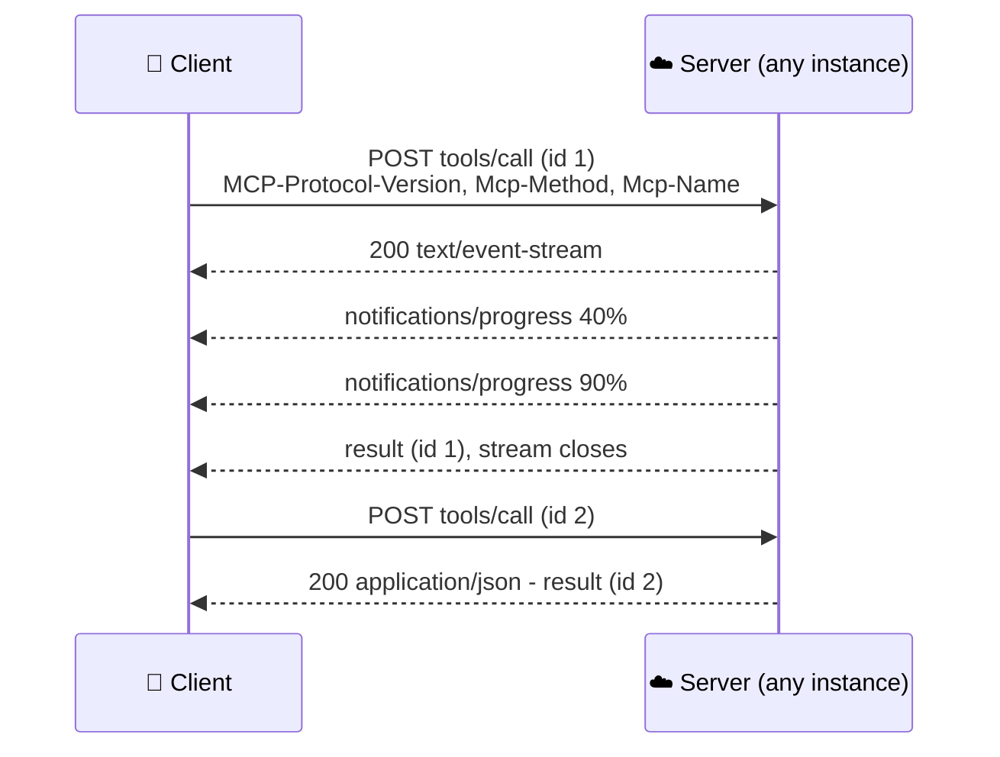
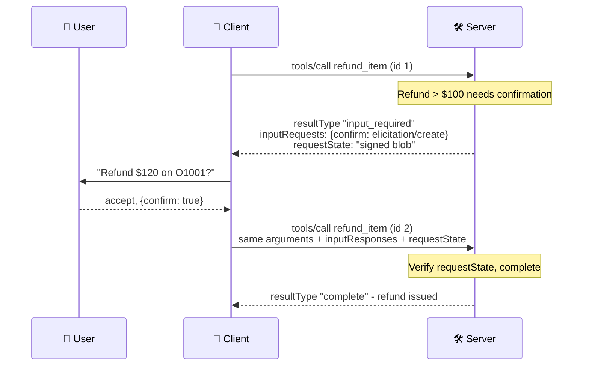

# MCP Architecture & Protocol

Under the hood, MCP is JSON-RPC 2.0 messages between a client and a server over stdio or HTTP. Since the **2026-07-28** revision the core is **stateless**: every request carries its own protocol version and client capabilities, there is no handshake or session, and when a server needs something from the client mid-request it returns the question instead of sending a request of its own. This chapter walks through the message layer, the transports, multi round-trip requests, notifications, caching, extensions and compatibility with older peers.

```objectives
time: 60 min
outcomes:
  - Read and write MCP JSON-RPC messages, including the per-request _meta fields of the 2026-07-28 revision
  - Choose between stdio and Streamable HTTP and state the security requirements of each
  - Trace a multi round-trip request (InputRequiredResult → retry with inputResponses and requestState) and secure its requestState
  - Explain subscriptions, cacheable list results and the extensions framework
  - Describe how modern (2026-07-28) and legacy (initialize-based) clients and servers interoperate
prerequisites:
  - "[Why MCP](01-Why-MCP.mdx)"
  - "Familiarity with HTTP and JSON"
```

## Messages: JSON-RPC 2.0

Every MCP message is a JSON-RPC 2.0 **request** (has `id` and `method`), **result** or **error** (echoes the `id`), or **notification** (a `method` with no `id`, no reply expected). A tool call:

```json
{
  "jsonrpc": "2.0",
  "id": 7,
  "method": "tools/call",
  "params": {
    "name": "get_order",
    "arguments": {"order_id": "O1002"},
    "_meta": {
      "io.modelcontextprotocol/protocolVersion": "2026-07-28",
      "io.modelcontextprotocol/clientInfo": {"name": "shop-agent", "version": "0.3.0"},
      "io.modelcontextprotocol/clientCapabilities": {"elicitation": {}}
    }
  }
}
```

```json
{
  "jsonrpc": "2.0",
  "id": 7,
  "result": {
    "resultType": "complete",
    "content": [{"type": "text", "text": "{\"order_id\": \"O1002\", \"status\": \"pending\"}"}],
    "structuredContent": {"order_id": "O1002", "status": "pending"},
    "isError": false
  }
}
```

The main methods:

| Area | Methods |
|---|---|
| Discovery | `server/discover` (versions, capabilities, identity) |
| Tools | `tools/list`, `tools/call` |
| Resources | `resources/list`, `resources/templates/list`, `resources/read` |
| Prompts | `prompts/list`, `prompts/get` |
| Utilities | `completion/complete` (argument autocompletion), `notifications/progress`, `notifications/cancelled` (stdio) |
| Change notifications | `subscriptions/listen`, then `notifications/tools/list_changed`, `…/prompts/list_changed`, `…/resources/list_changed`, `notifications/resources/updated` |

Two kinds of failure are distinguished. A **protocol error** (unknown tool, malformed arguments, unsupported version) is a JSON-RPC `error`. A **tool execution error** (the order doesn't exist, the API timed out) is a normal result with `isError: true` and a message in `content` - so the model sees it and can recover, exactly as in [The Agent Loop](../../12-Agent-Foundations/Notes/03-The-Agent-Loop.mdx).

---

## Stateless by Design (2026-07-28)

Earlier revisions opened a connection with an `initialize` / `notifications/initialized` handshake, negotiated a version and capabilities once, and (over HTTP) issued an `Mcp-Session-Id`. That made remote servers hard to scale: sessions pinned clients to one server instance and required shared session storage behind load balancers.

The 2026-07-28 revision removed all of it:

| Before (≤ 2025-11-25) | Now (2026-07-28) |
|---|---|
| `initialize` handshake negotiates version and capabilities once | Every request carries version, client info and capabilities in `_meta` |
| `Mcp-Session-Id` header; per-session state | No protocol sessions; servers that need state mint **explicit handles** (a cart id, a workflow id) passed as ordinary tool arguments |
| Server could send requests to the client (sampling, elicitation, roots) on an open stream | **Multi round-trip requests**: the server returns an `InputRequiredResult`; the client retries |
| GET endpoint for server-initiated messages; resumable SSE | `subscriptions/listen` for change notifications; no resumability - re-issue a broken request |
| `ping`, `logging/setLevel` | Removed; log level travels per request in `_meta` |

`server/discover` - which every server must implement - returns the supported versions, capabilities and server identity in one call. Clients may call it first, or just send a request and handle an `UnsupportedProtocolVersionError` (code `-32022`) that lists the versions the server supports.

Any request can now be routed to any server instance, which is what makes MCP servers deployable like ordinary stateless web services behind a load balancer.

---

## Transports

| | stdio | Streamable HTTP |
|---|---|---|
| **How** | The host launches the server as a subprocess; newline-delimited JSON-RPC over stdin/stdout | The server exposes one HTTP endpoint (e.g. `https://api.example.com/mcp`); each client message is its own POST |
| **Responses** | Lines on stdout | Per request: a single JSON body, or an SSE stream carrying progress notifications then the final result |
| **Auth** | Credentials from the environment; **not** OAuth | OAuth 2.1 ([Authorization](04-Authorization.mdx)) |
| **Typical use** | Local tools: files, git, a local database, dev tools | Remote and shared servers: SaaS APIs, company services |
| **Security essentials** | Runs with the user's privileges - sandbox it, show the exact command before first run | Validate `Origin` (DNS-rebinding defence, 403 if invalid); bind to 127.0.0.1 when local; authenticate every request |

Streamable HTTP requests carry routing headers that mirror the body, so gateways can route and rate-limit without parsing JSON: `MCP-Protocol-Version`, `Mcp-Method` and `Mcp-Name` (the tool, prompt or resource). A tool can also mark a parameter with `x-mcp-header` so its value is mirrored into an `Mcp-Param-{Name}` header - for example routing by region. Servers must reject requests whose headers and body disagree (`HeaderMismatch`, `-32020`), because a proxy routing on one while the server executes the other is a security hole. Closing a request's SSE stream cancels that request. The older HTTP+SSE transport (2024-11-05) is deprecated.



---

## Multi Round-Trip Requests (MRTR)

Sometimes a server needs more input to finish a request - the user's confirmation, a missing parameter, a sign-in. Under 2026-07-28 the server **returns** that need as a result, and the client **retries** the original request with the answers:



| Field | Where | Meaning |
|---|---|---|
| `resultType` | Every result | `"complete"`, or `"input_required"` for an interim result |
| `inputRequests` | `InputRequiredResult` | Map of key → request object: `elicitation/create` (form or URL mode), and the deprecated `sampling/createMessage` and `roots/list` |
| `requestState` | `InputRequiredResult` → echoed on retry | Opaque server state; clients must return it unmodified |
| `inputResponses` | Retry | Map of the same keys → the client's results |

MRTR is allowed only on `tools/call`, `resources/read` and `prompts/get`. The retry is a new request with a new id, and it can land on a different server instance - everything the server needs is in the retry itself. That is also why `requestState` is dangerous: it passes through the client, so the server **must treat it as attacker-controlled**. If it affects authorisation or business logic it must be integrity-protected (HMAC or AEAD), and it should bind the authenticated principal, a short expiry and the originating request so it can't be replayed elsewhere.

---

## Notifications and Caching

**Subscriptions.** A client that wants to hear about changes sends `subscriptions/listen` with the notification types it wants (`toolsListChanged`, `promptsListChanged`, `resourcesListChanged`, `resourceSubscriptions`); the response is a long-lived SSE stream carrying only those notifications. Request-scoped notifications (progress, log messages) travel on the stream of the request they belong to.

**Cacheable results.** `tools/list`, `prompts/list`, `resources/list`, `resources/templates/list` and `resources/read` results must include `ttlMs` (how long the client may reuse the result) and `cacheScope` (`"public"` - shared caches may store it - or `"private"`). Servers should return tools in a **deterministic order**: a stable tool list keeps the model's prompt prefix identical between calls, which preserves prompt caching ([Prompt Caching & Cost](../../10-Prompt-Engineering/Notes/07-Prompt-Caching-and-Cost.mdx)).

**Tracing.** Trace context (`traceparent`, `tracestate`, `baggage`) can be propagated in `_meta`, so a tool call shows up as a child span of the agent's trace in OpenTelemetry.

---

## Extensions

The core stays small; optional features are **extensions**, advertised in an `extensions` map inside client and server capabilities and identified by reverse-domain names. If only one side supports an extension, it must fall back to core behaviour or reject the request. Official extensions:

| Extension | Identifier | What it adds |
|---|---|---|
| **Tasks** | `io.modelcontextprotocol/tasks` | Long-running operations: a call returns a task handle; the client polls `tasks/get` and can send input with `tasks/update` |
| **MCP Apps** | `io.modelcontextprotocol/ui` | Servers ship interactive UI (sandboxed HTML) that hosts render alongside tool results |
| **Enterprise-managed authorization** | (auth extension) | Lets an organisation's identity provider govern which MCP servers users may connect and with what access |

---

## Talking to Older Peers

Versions up to 2025-11-25 are **legacy** (handshake-based); 2026-07-28 and later are **modern**. Implementations can be **dual-era**:

| Client | Server | Outcome |
|---|---|---|
| Modern | Modern | Works |
| Dual-era | Legacy | Works - the client probes (a modern request on HTTP, `server/discover` on stdio), sees a non-modern error, falls back to `initialize` |
| Legacy | Dual-era | Works - `initialize` selects legacy behaviour for that connection |
| Modern-only | Legacy | Fails - the client can only surface an error (on stdio, probing with `server/discover` first makes the failure deterministic) |
| Legacy | Modern-only | Fails - legacy clients have no fall-forward; the server should name its supported versions in the error |

The official Tier 1 SDKs (TypeScript, Python, Go, C#) support 2026-07-28 and can serve legacy clients, which is why most deployed servers will be dual-era for a while. Deprecated features (roots, sampling, logging, the HTTP+SSE transport, dynamic client registration) remain functional for at least twelve months under the deprecation policy.

---

## Check Yourself

```quiz
- q: "In the 2026-07-28 revision, where does a client declare its protocol version and capabilities?"
  options:
    - "In _meta on every request (and the MCP-Protocol-Version header on HTTP)"
    - "In an initialize request at connection start"
    - "In the Mcp-Session-Id header"
    - "In server/discover's response"
  answer: 1
- q: "A tool needs the user's confirmation before a large refund. What does a 2026-07-28 server do?"
  options:
    - "Return an InputRequiredResult with an elicitation request; the client retries the call with inputResponses"
    - "Send an elicitation/create request to the client over the open SSE stream"
    - "Return isError: true"
    - "Store the pending call in the session"
  answer: 1
- q: "Why must a server treat requestState as attacker-controlled?"
  options:
    - "It travels through the client, which could modify or replay it"
    - "It is encrypted by the client"
    - "It is visible to the model"
    - "JSON-RPC requires it"
  answer: 1
- q: "Why should tools/list return tools in a deterministic order?"
  options:
    - "So clients can cache it and the model's prompt prefix stays identical, preserving prompt caching"
    - "The model reads tools in order of importance"
    - "Alphabetical order is required by JSON-RPC"
    - "To make the list shorter"
  answer: 1
- q: "What is the difference between a JSON-RPC error and a result with isError: true?"
  answer: "A JSON-RPC error is a protocol failure (unknown method or tool, invalid params, unsupported version) handled by the client code. isError: true is a tool execution failure reported as a normal result so the model can read the message and adapt."
```

## Exercises

```exercise
- title: Write the wire messages
  task: |
    Write the JSON-RPC messages (with _meta) for: (1) a client listing tools; (2) the server's result with two tools and cache fields; (3) a tools/call that returns an InputRequiredResult asking the user to choose a delivery slot (an elicitation with an enum field); (4) the retry.
  solution: |
    (1) {"jsonrpc":"2.0","id":1,"method":"tools/list","params":{"_meta":{…protocolVersion, clientInfo, clientCapabilities with elicitation}}}. (2) result with "resultType":"complete","tools":[…],"ttlMs":300000,"cacheScope":"private". (3) result {"resultType":"input_required","inputRequests":{"slot":{"method":"elicitation/create","params":{"mode":"form","message":"Pick a slot","requestedSchema":{"type":"object","properties":{"slot":{"type":"string","enum":["am","pm"]}},"required":["slot"]}}}},"requestState":"<signed>"}. (4) a new id, same name and arguments, plus "inputResponses":{"slot":{"action":"accept","content":{"slot":"pm"}}} and the unchanged requestState.
- title: Design requestState
  task: |
    Your MRTR-based tool approves expense claims and stores the claim amount and approver in requestState between rounds. Specify the requestState format and the checks the server performs on the retry.
  solution: |
    Serialise {principal, method, digest(arguments), claim_id, amount, expires_at} and protect it with AEAD (encrypt + authenticate) using a server key. On retry: verify the tag; reject if expired; reject if the principal from the verified token differs; reject if the method or argument digest differs; and enforce single use server-side (a consumed-id record) because approval must not be replayable.
- title: Deploy statelessly
  task: |
    Sketch how you would run a Streamable HTTP MCP server on three instances behind a load balancer, with a tool that builds a shopping cart across several calls.
  solution: |
    Instances are identical and stateless; any request can hit any instance. The cart lives in a shared store keyed by a server-minted, unguessable cart_id returned by create_cart and passed as an argument to later calls; the server binds cart_id to the authenticated user and rejects it for anyone else. Route on Mcp-Method/Mcp-Name headers if needed; validate Origin and tokens on every request.
```

## Study Notes

- JSON-RPC 2.0: requests, results, errors, notifications; tool failures are results with isError, not protocol errors
- 2026-07-28 is stateless: per-request _meta (version, clientInfo, capabilities); no initialize, no sessions; server/discover is mandatory for servers
- State across calls = explicit server-minted handles bound to the user
- Transports: stdio (local, env credentials) and Streamable HTTP (one POST endpoint, JSON or per-request SSE, routing headers, Origin validation); HTTP+SSE deprecated
- MRTR: InputRequiredResult (inputRequests + requestState) → retry with inputResponses; only on tools/call, resources/read, prompts/get; requestState is attacker-controlled - sign/encrypt, bind principal, expiry and request
- subscriptions/listen for change notifications; list results carry ttlMs and cacheScope; deterministic tool order helps prompt caching
- Extensions: Tasks, MCP Apps, enterprise-managed authorization
- Modern vs legacy eras; dual-era implementations probe and fall back

## References

- [MCP specification 2026-07-28: Overview](https://modelcontextprotocol.io/specification/2026-07-28), [Streamable HTTP](https://modelcontextprotocol.io/specification/2026-07-28/basic/transports/streamable-http), [Multi Round-Trip Requests](https://modelcontextprotocol.io/specification/2026-07-28/basic/patterns/mrtr), [Versioning](https://modelcontextprotocol.io/specification/2026-07-28/basic/versioning)
- [MCP 2026-07-28 changelog](https://modelcontextprotocol.io/specification/2026-07-28/changelog)
- [JSON-RPC 2.0 Specification](https://www.jsonrpc.org/specification)
- MCP Blog, [The 2026-07-28 Specification](https://blog.modelcontextprotocol.io/posts/2026-07-28/) (Jul 2026)

*Last reviewed: 2026-09*
