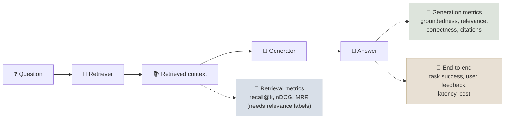

# RAG Evaluation

RAG evaluation measures the retriever and the generator separately - did we find the right evidence, and did the answer use it faithfully and correctly - so that a failure can be traced to the stage that caused it.

```objectives
time: 60 min
outcomes:
  - Compute recall@k, precision@k, MRR and nDCG@k by hand and explain what each rewards
  - Define groundedness (faithfulness), answer relevance, answer correctness and context recall, and how LLM-judged metrics compute them
  - Build a RAG test set from real queries and synthetic generation, including unanswerable questions
  - Diagnose a failing system from a pattern of retrieval and generation scores, and gate changes in CI
prerequisites:
  - "[Grounded Generation & Citations](05-Grounded-Generation-and-Citations.mdx)"
  - "[LLM-as-Judge](../../04-Evaluation/Notes/03-LLM-as-Judge.mdx)"
```

## Two Layers of Metrics



---

## Retrieval Metrics

Given, for each query, the set of relevant documents (from human labels or a benchmark's *qrels*) and the system's ranked list:

| Metric | Definition | Rewards |
|---|---|---|
| **Recall@k** | Relevant docs in the top k ÷ all relevant docs | Finding the evidence at all - the key metric for the stage *before* a reranker or the LLM |
| **Precision@k** | Relevant docs in the top k ÷ k | Not wasting context on noise |
| **Hit rate@k** | 1 if any relevant doc is in the top k | Single-answer questions |
| **MRR@k** | 1 ÷ rank of the first relevant doc (0 if none in top k), averaged | Putting one good answer first |
| **nDCG@k** | DCG ÷ ideal DCG, where DCG = Σ rel_i / log₂(i + 1) | Graded relevance and good ordering throughout the list; the standard for comparing rankers (BEIR, MTEB) |

**Worked example.** One relevant document; the system ranks it 3rd. MRR = 1/3. DCG@10 = 1/log₂(4) = 0.5; the ideal DCG = 1/log₂(2) = 1; nDCG@10 = 0.5. Recall@10 = 1, Recall@2 = 0.

```python
import math

def ndcg_at_k(ranked_ids, relevance: dict, k=10):
    dcg = sum(relevance.get(d, 0) / math.log2(i + 2) for i, d in enumerate(ranked_ids[:k]))
    ideal = sorted(relevance.values(), reverse=True)[:k]
    idcg = sum(r / math.log2(i + 2) for i, r in enumerate(ideal))
    return dcg / idcg if idcg else 0.0
```

The [code lab](../CodeLabs/01-Retrieval-Evaluation.mdx) implements all of these and compares five retrieval configurations on a public benchmark. For a fixed LLM, a pipeline's retrieval metrics are cheap, deterministic and fast to compute - run them on every change.

---

## Generation Metrics

| Metric | Question it answers | Needs | Typical computation |
|---|---|---|---|
| **Groundedness / faithfulness** | Is every claim in the answer supported by the retrieved context? | Answer + context | Split the answer into atomic claims; an LLM or NLI model checks each against the context; score = supported ÷ total |
| **Answer relevance** | Does the answer address the question? | Question + answer | LLM judge, or generate questions from the answer and compare them to the original |
| **Answer correctness** | Is it right? | A reference answer | LLM judge comparing claims to the reference, or exact/F1 match for short answers |
| **Context recall** | Does the retrieved context contain everything the reference answer needs? | Reference answer + context | Check each reference claim against the context |
| **Context precision** | Are the relevant chunks ranked high? | Relevance judgements (labelled or LLM-judged) | Precision@k weighted by rank |
| **Citation recall / precision** | Are statements supported by the passages they cite? | Answer with citations + passages | Entailment per statement-citation pair ([Grounded Generation](05-Grounded-Generation-and-Citations.mdx)) |

**Groundedness ≠ correctness.** A faithful answer built on an outdated document is grounded and wrong; an answer from the model's own correct knowledge is correct and ungrounded. Track both.

The "RAG triad" (TruLens) summarises the three core checks: context relevance (question ↔ context), groundedness (context ↔ answer), answer relevance (question ↔ answer).

### Tooling

RAGAS, TruLens, DeepEval, ARES, Arize Phoenix and LangSmith implement these metrics with LLM judges. RAGAS 0.4's metric API:

```python
from openai import AsyncOpenAI
from ragas.llms import llm_factory
from ragas.metrics.collections import Faithfulness, ContextRecall

judge = llm_factory("<judge-model>", client=AsyncOpenAI())

faithfulness = await Faithfulness(llm=judge).ascore(
    user_input="What is the refund window for Enterprise plans?",
    response="Enterprise customers can get a full refund within 30 days.",
    retrieved_contexts=["Enterprise customers can request a full refund within 30 days of purchase."],
)
recall = await ContextRecall(llm=judge).ascore(
    user_input="What is the refund window for Enterprise plans?",
    retrieved_contexts=["Enterprise customers can request a full refund within 30 days of purchase."],
    reference="A full refund is available within 30 days of purchase.",
)
print(faithfulness.value, recall.value)
```

Evaluation libraries change their APIs often and have heavy dependency trees - **pin their versions** in the eval environment. Whatever the tool, the judge is a model with biases: validate it against 50-100 human-labelled examples before trusting its scores, and keep the judge model fixed across comparisons (see [LLM-as-Judge](../../04-Evaluation/Notes/03-LLM-as-Judge.mdx)).

---

## Building the Test Set

| Source | Strength | Weakness |
|---|---|---|
| **Real user queries** with labelled relevant chunks and reference answers | Matches production | Needs labelling effort; early products have few queries |
| **Synthetic questions** generated from chunks by an LLM (RAGAS and others provide generators) | Fast, large, covers the corpus | Questions echo the chunk's wording (easy for retrieval), miss real user phrasing, and skew to single-hop |
| **Public benchmarks** (BEIR, MS MARCO, Natural Questions, HotpotQA, MultiHop-RAG, FRAMES, CRAG) | Comparable, well-studied | Not your domain; possible training contamination |

Practical recipe:

1. Start with 50-100 synthetic questions, **rewritten by people** to sound like users (vaguer, misspelled, multi-part).
2. Add real queries from logs as soon as you have them; label the relevant chunks and write short reference answers.
3. Include **unanswerable** questions (10-20%), **multi-hop** questions, questions with **exact identifiers**, and **conflict** cases (two versions of a policy).
4. Tag each item by category so you can report per-slice.
5. Every production failure becomes a new test item.

Size for the effect you need to detect: with 200 questions, a 95% interval on a proportion near 0.8 is about ±5.5 points; use paired comparisons across the same questions to detect smaller changes (see [Building Your Own Evals](../../04-Evaluation/Notes/04-Building-Your-Own-Evals.mdx)).

---

## Diagnosing from the Numbers

| Pattern | Likely cause | Next step |
|---|---|---|
| Low recall@k (dense and BM25) | Parsing or chunking lost the content, or it isn't indexed | Search the index for the answer text; inspect parsed output |
| Low recall@k for dense, fine for BM25 | Vocabulary or identifier queries | Hybrid retrieval, contextual chunks |
| Good recall@50, poor nDCG@10 | Ranking | Add or improve the reranker |
| Good context recall, low groundedness | Generation ignores or embellishes context | Prompt (quote-then-answer), fewer passages, stronger model |
| High groundedness, low correctness | Wrong or outdated sources | Source quality, versioning, recency filters |
| High answer relevance, many user complaints | Test set doesn't reflect real queries | Sample and label production traffic |

---

## Evaluation in the Lifecycle

- **Offline, in CI**: retrieval metrics on every index or retriever change; generation metrics on a fixed set when prompts or models change; block merges on paired regressions per slice.
- **Online**: sample live traffic for LLM-judged groundedness; track user feedback, "no answer" rate, citation clicks, and escalations; compare shadow pipelines on the same traffic before switching.
- **Periodically**: re-label a fresh sample of production queries to catch drift in what users ask.

These practices are wired into deployment in [RAG in Production](12-RAG-in-Production.mdx).

---

## Check Yourself

```quiz
- q: "A query has one relevant document, ranked 2nd. What are MRR@10 and nDCG@10?"
  options:
    - "MRR = 0.5, nDCG = 1/log2(3) ≈ 0.63"
    - "MRR = 0.5, nDCG = 0.5"
    - "MRR = 1, nDCG = 1"
    - "MRR = 2, nDCG = 0.63"
  answer: 1
- q: "Context recall is 0.92 but faithfulness is 0.55. Where is the problem?"
  options:
    - "Generation - the evidence is retrieved but the answer isn't sticking to it"
    - "Retrieval recall"
    - "Chunking"
    - "The embedding model"
  answer: 1
- q: "Why are LLM-generated synthetic test questions often too easy for retrieval?"
  options:
    - "They reuse the source chunk's wording, so lexical and semantic overlap with the target chunk is unrealistically high"
    - "They are too long"
    - "They are always multi-hop"
    - "They have no reference answers"
  answer: 1
- q: "Can an answer be perfectly grounded and still wrong? Give an example."
  answer: "Yes - if the retrieved source is wrong or outdated. E.g. the index still contains last year's pricing page; the answer faithfully quotes the old price. Groundedness scores it 1.0; correctness scores it 0. Track both, and fix with source versioning and recency filters."
```

## Exercises

```exercise
- title: Metrics by hand
  task: |
    A query has relevant documents A (relevance 2) and B (relevance 1). The system returns [C, A, D, B, E]. Compute Recall@3, Precision@3, MRR@5 and nDCG@5.
  solution: |
    Recall@3 = 1/2 (only A in the top 3). Precision@3 = 1/3. MRR@5 = 1/2 (first relevant at rank 2).
    DCG@5 = 2/log2(3) + 1/log2(5) = 1.262 + 0.431 = 1.693. Ideal order [A, B]: IDCG = 2/log2(2) + 1/log2(3) = 2 + 0.631 = 2.631. nDCG@5 = 0.643.
- title: Validate a judge
  task: |
    Take 60 (question, context, answer) triples from your system. Label groundedness yourself (supported / not supported per answer). Score them with an LLM-judged faithfulness metric. Compute agreement (accuracy and Cohen's kappa) at a threshold of 0.8, and inspect disagreements.
  solution: |
    Expect good agreement on clear cases and disagreements on partial support and on claims that paraphrase or combine passages. If kappa is low, tighten the judge prompt or claim-splitting, or switch judge models, before using the metric as a CI gate.
```

## Study Notes

**Must-know:**
- Evaluate retrieval (recall@k, precision@k, MRR, nDCG) and generation (groundedness, answer relevance, correctness, context recall, citations) separately
- nDCG@k = DCG/IDCG with log₂(rank + 1) discount; recall@k at the candidate depth bounds everything downstream
- Groundedness ≠ correctness
- LLM-judged metrics need validation against human labels, a fixed judge, and pinned library versions
- Test sets: real queries + humanised synthetic + unanswerable, multi-hop, identifier and conflict cases, tagged by slice
- Diagnose by pattern; gate changes in CI with paired comparisons; monitor online

## References

- Järvelin & Kekäläinen, [Cumulated Gain-Based Evaluation of IR Techniques](https://dl.acm.org/doi/10.1145/582415.582418) (TOIS 2002) - nDCG
- Thakur et al., [BEIR](https://arxiv.org/abs/2104.08663) (NeurIPS 2021)
- Es et al., [RAGAS: Automated Evaluation of Retrieval Augmented Generation](https://arxiv.org/abs/2309.15217) (EACL 2024 Demo)
- Saad-Falcon et al., [ARES: An Automated Evaluation Framework for RAG Systems](https://arxiv.org/abs/2311.09476) (NAACL 2024)
- Yang et al., [CRAG - Comprehensive RAG Benchmark](https://arxiv.org/abs/2406.04744) (NeurIPS 2024 Datasets and Benchmarks)
- Krishna et al., [Fact, Fetch, and Reason: A Unified Evaluation of Retrieval-Augmented Generation (FRAMES)](https://arxiv.org/abs/2409.12941) (2024)
- [RAGAS documentation](https://docs.ragas.io/), [TruLens RAG triad](https://www.trulens.org/getting_started/core_concepts/rag_triad/)

*Last reviewed: 2026-09*
