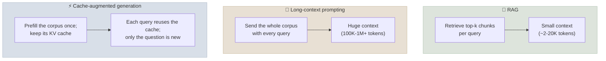
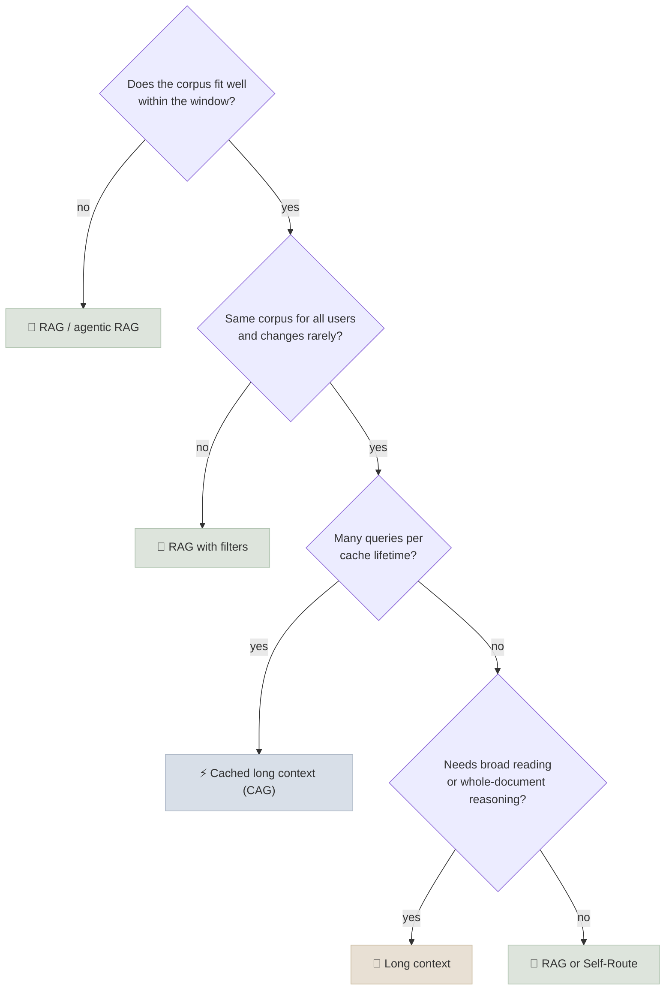

# Long Context vs RAG vs CAG

With context windows of hundreds of thousands to millions of tokens, you can often skip retrieval and put the whole corpus in the prompt - either on every call (long-context prompting) or once, with its KV cache reused across queries (cache-augmented generation, CAG). This chapter is the decision guide.

```objectives
time: 40 min
outcomes:
  - Describe long-context prompting, RAG and cache-augmented generation and what each costs per query
  - Summarise the evidence comparing long context and RAG on quality and cost
  - Compute the per-query cost and, for self-hosting, the KV-cache memory of putting a corpus in context
  - Choose an approach - or a hybrid such as routing or retrieve-then-read-long - for a given corpus and workload
prerequisites:
  - "[RAG Fundamentals](01-RAG-Fundamentals.mdx)"
  - "[Prompt Caching & Cost](../../05-Prompt-Engineering/Notes/07-Prompt-Caching-and-Cost.mdx)"
  - "Optional, later in the course: [KV Cache & Inference Optimization](../../16-Inference-and-Serving/Notes/01-KV-Cache-and-Inference-Optimization.mdx)"
```

## Three Ways to Put Knowledge in Context



- **RAG** pays for retrieval infrastructure and risks missing evidence, but each call is small and cheap and the corpus can be any size.
- **Long-context prompting** gives the model everything - no retrieval misses, and whole-document reasoning - but every call pays to process the full corpus, and quality degrades as context grows (see [Context Engineering](../../05-Prompt-Engineering/Notes/06-Context-Engineering.mdx)).
- **CAG** (Chan et al., 2024) keeps long context's completeness while avoiding repeated prefill: the corpus's KV cache is computed once and reused. With hosted APIs, CAG is simply **prompt caching** of a corpus-sized prefix; self-hosted, it means keeping (or offloading and reloading) a large KV cache.

---

## What the Evidence Says

| Study | Finding |
|---|---|
| Xu et al. (ICLR 2024) | Retrieval helped even long-context models; a 4K-context model with retrieval matched a 16K long-context fine-tune on long-document QA, at lower cost |
| Li et al. (EMNLP 2024 Industry) | With sufficient resources, long-context models outperformed RAG on average across long-context benchmarks, while RAG was far cheaper. Their **Self-Route** method - try RAG first and let the model declare whether the retrieved chunks suffice, falling back to long context only when they don't - kept quality close to long context at a fraction of the cost |
| Chan et al. (2024) | CAG matched or beat RAG on HotpotQA and SQuAD when the whole knowledge source fit in context, and removed retrieval latency |
| RULER, NoLiMa, Context Rot (2024-25) | Effective context is well below advertised windows for hard tasks, and reliability declines with length |

The consistent picture: **long context wins on completeness when the corpus fits and the task needs broad reading; RAG wins on cost and scale; hybrids capture most of both.**

---

## The Cost Arithmetic

Example: a 400K-token corpus, 20,000 questions per day. Prices: $3/M input, $0.30/M cached input, $15/M output; 500 output tokens per answer.

| Approach | Input per query | Cost per query | Per day |
|---|---|---|---|
| Long context, uncached | 400K × $3/M = $1.20 | ≈ $1.21 | ≈ $24,150 |
| Long context with prompt caching (CAG, warm cache) | 400K × $0.30/M = $0.12 | ≈ $0.13 | ≈ $2,550 |
| RAG with 8K tokens of context | 8K × $3/M = $0.024 | ≈ $0.032 | ≈ $630 |

Caching cuts long-context cost by about 10×, and RAG is still about 4× cheaper here - plus faster (prefill for 8K tokens vs reading a 400K cache) and not limited by corpus size. But if the corpus were 40K tokens, cached long context would cost about $0.02 per query - the same as RAG, with no retrieval to build or maintain.

### Self-hosted CAG: KV memory

KV-cache size per token = 2 (K and V) × layers × KV heads × head dimension × bytes per value. For a model with 64 layers, 8 KV heads (GQA), head dimension 128, in bf16:

```text
2 × 64 × 8 × 128 × 2 bytes = 262,144 bytes ≈ 256 KB per token
400K-token corpus → ~105 GB of KV cache
```

That is more than one H100's memory for a single cached corpus - before the model weights. Self-hosted CAG needs FP8 KV caches, KV offloading to CPU or SSD (e.g. LMCache), or a smaller corpus (see [The Modern Serving Stack](../../16-Inference-and-Serving/Notes/07-Modern-Serving-Stack.mdx)).

---

## Decision Guide

| Situation | Recommendation |
|---|---|
| Corpus fits comfortably (under about 10-20% of the window), stable, many queries | **Cached long context (CAG)** - simplest, no retrieval misses |
| Corpus fits, but questions are narrow lookups at high volume | **RAG** or Self-Route - cheaper and faster per query |
| Corpus far larger than the window, or growing | **RAG** (optionally agentic) |
| Questions need whole-document reasoning (a contract, a codebase module) | **Retrieve documents, then read them whole**: retrieve at document level and pass complete documents, not chunks |
| Per-user or per-tenant document sets | **RAG** with access filters - a shared cached prefix can't vary by user |
| Content changes hourly | **RAG** - a changed corpus invalidates the cache |
| Strict citation requirements | Either, with quote extraction or API-native citations; RAG gives passage-level provenance for free |



Whatever you choose, **measure on your questions**: build the eval once ([RAG Evaluation](06-RAG-Evaluation.mdx)) and run both approaches at your real corpus size.

---

## Check Yourself

```quiz
- q: "With hosted APIs, what is cache-augmented generation in practice?"
  options:
    - "Prompt caching of a prefix containing the whole corpus, reused across questions"
    - "Caching previous answers to identical questions"
    - "Caching embeddings of the corpus"
    - "Fine-tuning the model on the corpus"
  answer: 1
- q: "What did Li et al.'s Self-Route do?"
  options:
    - "Tried RAG first and fell back to long context only when the model judged the retrieved chunks insufficient"
    - "Routed queries between two embedding models"
    - "Used long context for all queries"
    - "Trained a retriever end to end"
  answer: 1
- q: "Why is CAG a poor fit for a multi-tenant assistant where each customer sees only their own documents?"
  options:
    - "The cached prefix would differ per tenant, so it can't be shared, and per-user access filtering is what RAG provides"
    - "CAG can't handle PDFs"
    - "CAG requires fine-tuning"
    - "CAG only works with small models"
  answer: 1
- q: "A 64-layer model with 8 KV heads of dimension 128 caches in bf16. Roughly how much KV memory does a 100K-token cached corpus need?"
  answer: "2 × 64 × 8 × 128 × 2 bytes = 256 KB per token; × 100K ≈ 26 GB (about 25 GiB)."
```

## Exercises

```exercise
- title: Price your own case
  task: |
    Pick a real corpus (or assume one) and fill in: corpus tokens, queries per day, cache hit rate, prices for your provider. Compute daily cost for uncached long context, cached long context and RAG with your expected context size. At what corpus size do cached long context and RAG cost the same per query?
  solution: |
    Break-even (ignoring output): corpus_tokens × p_cached = rag_tokens × p_input. With p_cached = 0.1 × p_input, break-even corpus size ≈ 10 × RAG context size - e.g. an 8K-token RAG context breaks even with an ~80K-token cached corpus. Below that, cached long context is not more expensive than RAG and avoids retrieval misses.
- title: Compare quality
  task: |
    For a 50-100K-token document set that fits in context, write 40 questions (half narrow lookups, half requiring synthesis across documents). Compare RAG (top 8 chunks) with full long context on accuracy and cost.
  solution: |
    Expect similar accuracy on narrow lookups and a long-context advantage on synthesis questions, with RAG far cheaper unless the corpus is cached. The split by question type is the practical output - it tells you whether routing (Self-Route style) is worthwhile.
```

## Study Notes

**Must-know:**
- RAG: small cheap calls, any corpus size, risk of retrieval misses
- Long context: completeness and whole-document reasoning; cost scales with corpus; quality degrades with length
- CAG: precompute and reuse the corpus's KV cache = prompt caching for hosted APIs
- Evidence: long context often wins on quality when it fits; RAG wins on cost; Self-Route hybrids get most of both
- Cost: corpus × cached price vs RAG context × input price; break-even corpus ≈ 10× the RAG context at a 0.1× cache price
- KV memory = 2 × layers × KV heads × head dim × bytes per token - large corpora need FP8 KV or offloading
- Per-tenant data, frequent changes and huge corpora point to RAG

## References

- Chan et al., [Don't Do RAG: When Cache-Augmented Generation is All You Need for Knowledge Tasks](https://arxiv.org/abs/2412.15605) (2024)
- Li et al., [Retrieval Augmented Generation or Long-Context LLMs? A Comprehensive Study and Hybrid Approach](https://arxiv.org/abs/2407.16833) (EMNLP 2024 Industry)
- Xu et al., [Retrieval meets Long Context Large Language Models](https://arxiv.org/abs/2310.03025) (ICLR 2024)
- Hsieh et al., [RULER](https://arxiv.org/abs/2404.06654) (COLM 2024)
- [LMCache](https://github.com/LMCache/LMCache) - KV cache storage and reuse for vLLM

*Last reviewed: 2026-09*
