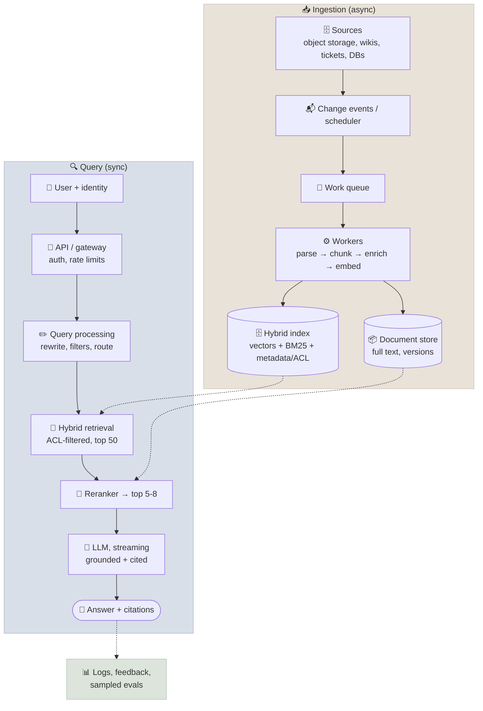
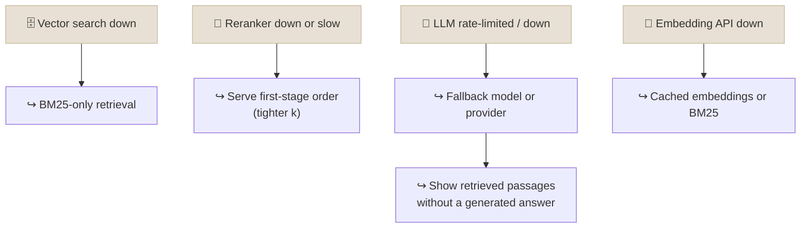

# RAG System Design

Designing a production RAG system means turning requirements - corpus size, query volume, latency, freshness, access control and quality targets - into concrete choices for ingestion, indexing, retrieval, generation, caching and failure handling, with the numbers to justify them.

```objectives
time: 60 min
outcomes:
  - Run a structured RAG design discussion from requirements to trade-offs
  - Build a per-stage latency budget and identify which stages to optimise
  - Size an index and choose sharding, replication and freshness strategies for 10M-100M+ chunks
  - Design multi-tenancy and access control that fail closed
  - Specify caching layers and graceful degradation, including the risks of semantic caching
prerequisites:
  - "[Retrieval & Reranking](04-Retrieval-and-Reranking.mdx)"
  - "[Grounded Generation & Citations](05-Grounded-Generation-and-Citations.mdx)"
```

## A Framework for the Design Discussion

| Step | Questions to settle |
|---|---|
| **1. Requirements** | Corpus size and growth? Document types? QPS (average, peak)? Latency SLO (p95 TTFT and total)? Freshness (minutes, hours, daily)? Who may see what? Quality bar and cost per query? |
| **2. Two pipelines** | Ingest (offline, event-driven or batch) and query (online) - draw both |
| **3. Components** | Parsing and chunking; embedding model; index and store; retrieval (hybrid?), reranker; generator; citations |
| **4. Numbers** | Index size, latency budget, cost per query, throughput per component |
| **5. Trade-offs** | Latency vs quality (reranker, query rewriting), cost vs quality (model size, context size), freshness vs complexity |
| **6. Operations** | Evaluation gates, monitoring, failure modes, security ([RAG in Production](12-RAG-in-Production.mdx)) |

---

## Reference Architecture



---

## Latency Budget

A p95 target of about 3 seconds end to end, with streaming so the user sees text in about 1 second:

| Stage | Typical p95 | Levers |
|---|---|---|
| Auth, routing, filters | 10-30 ms | - |
| Query rewrite (LLM) | 200-800 ms | Skip for standalone queries; use a small model |
| Query embedding | 10-50 ms | Self-host or cache |
| Hybrid retrieval (ANN + BM25) | 10-80 ms | Index tuning, replicas, filter selectivity |
| Reranking 50 candidates | 30-300 ms | Smaller or GPU-hosted reranker; fewer candidates |
| LLM time to first token | 300-1,500 ms | Smaller model, shorter context, prompt caching, lower reasoning effort |
| LLM generation | 1-5 s | Stream it; concise answers |

Rules of thumb: the **LLM dominates**, so context size, model choice and caching matter more than shaving milliseconds from the vector search; run retrieval branches **in parallel**; and every optional LLM step (rewrite, grading, reranking with an LLM) needs to earn its latency on the eval.

---

## Scaling the Index

**Sizing.** 100M documents × 1.2 chunks × 768 dimensions × 4 bytes ≈ 369 GB of float32 vectors - more than a single machine's RAM for an in-memory HNSW index. Options, from [Embeddings & Vector Search](02-Embeddings-and-Vector-Search.mdx): int8 (≈92 GB) or binary with rescoring (≈12 GB in RAM), IVF-PQ or DiskANN, or a distributed managed service.

| Concern | Approach |
|---|---|
| **Throughput** | Replicate the index; queries are read-only and scale horizontally |
| **Size** | Shard; each shard searched in parallel, results merged (top-k per shard, then global top-k) |
| **Shard key** | Hash sharding spreads load evenly but every query fans out to all shards; sharding by tenant or domain lets filtered queries hit one shard |
| **Freshness** | Event-driven upserts: on change, delete the document's chunks by `doc_id`, then insert new ones; idempotent workers; a dead-letter queue for failures |
| **Big rebuilds** (new embedding model, new chunking) | Build a new index alongside, evaluate, switch traffic with an alias (blue/green), keep the old one for rollback |
| **Ingestion throughput** | Batch embedding calls, parallel workers behind a queue, back-pressure on API rate limits |

---

## Multi-Tenancy and Access Control

Retrieval must never return a chunk the user isn't allowed to see - once a chunk is in the prompt, the model may repeat it.

| Isolation model | How | Use when |
|---|---|---|
| **Index per tenant** | Separate collections/indexes | Strict contractual or regulatory isolation; few, large tenants |
| **Namespace / partition per tenant** | Engine-level partitions in a shared cluster | Many tenants of varied size - the common SaaS default |
| **Shared index + mandatory filter** | `tenant_id` and ACL fields on every chunk | Internal tools; many tiny tenants |

Principles:

- **Enforce at retrieval, server-side, from the authenticated identity** - never from a parameter the client or the model can set.
- **Fail closed**: if the user's permissions can't be resolved, return nothing.
- **Mirror source permissions** (document ACLs, groups) into chunk metadata at ingest, and re-sync when permissions change - stale ACLs are a leak. How connectors, nested groups, ACL lag and late binding work is covered in [Enterprise Data Integration](10-Enterprise-Data-Integration.mdx).
- **Test it**: include cross-tenant probes in the eval set and alert on any hit.
- **Cache keys must include the tenant and the permission set** (see below).

---

## Caching

| Layer | Key → value | Hit rate | Risks |
|---|---|---|---|
| **Query embedding cache** | normalised query text → vector | Moderate | Negligible |
| **Retrieval cache** | (query, filters, index version) → candidate ids | Moderate | Stale after index updates - include index version in key |
| **Exact answer cache** | (normalised query, tenant, permissions, index version, prompt version) → answer | Low-moderate; high for FAQ-like traffic | Staleness - invalidate on document change |
| **Semantic answer cache** | nearest cached query above a similarity threshold → answer | Higher | **False hits**: "refund policy for Enterprise" and "for Starter" may be 0.95 similar but need different answers; cross-tenant leaks if the key omits the tenant |
| **Prompt cache (provider)** | Stable prompt prefix → KV state | Automatic | See [Prompt Caching & Cost](../../05-Prompt-Engineering/Notes/07-Prompt-Caching-and-Cost.mdx) |

Implement a semantic cache with a real vector index (not a scan over cache keys), partition it by tenant and permissions, use a conservative threshold tuned on labelled near-duplicate pairs, and keep TTLs short. For many products, an exact cache plus prompt caching delivers most of the savings with none of the false-hit risk.

---

## Graceful Degradation



Wrap each dependency with timeouts and circuit breakers, and make the degraded mode explicit to users ("showing matching documents; answer generation is temporarily unavailable") rather than silently answering from the model's own knowledge.

---

## Worked Design: Enterprise Knowledge Assistant

**Prompt:** 10M documents across HR, Legal and Engineering; 5,000 employees; answers with citations; p95 under 3 s; daily updates; department-level access control.

| Decision | Choice and reason |
|---|---|
| Load | 5,000 users × 20 queries/day ≈ 100K/day ≈ 3.5 QPS average over 8 working hours, ~20 QPS peak |
| Chunks and index | ~12M chunks × 768 dims ≈ 37 GB float32 → int8 HNSW (~9 GB) with rescoring; hybrid BM25 in the same engine |
| Access control | `department` and document ACL groups on every chunk; filter from the SSO identity; fail closed |
| Retrieval | Hybrid top 50 → reranker top 6 → mid-size LLM with prompt caching of the instructions |
| Freshness | Nightly batch plus event-driven updates for high-churn spaces; blue/green rebuild for model changes |
| Quality gates | 300-question golden set per department (incl. unanswerable and cross-department probes); retrieval metrics on every index change; groundedness sampled in production |
| Degradation | BM25-only fallback; passages-only mode if the LLM is unavailable |
| Estimated latency | ~40 ms retrieval + ~150 ms rerank + ~800 ms TTFT → first token ≈ 1 s; full answer ≈ 2.5 s |

---

## Check Yourself

```quiz
- q: "Where should the tenant/ACL filter be applied in a multi-tenant RAG system?"
  options:
    - "In the retrieval query, server-side, derived from the authenticated identity"
    - "In the system prompt, telling the model not to reveal other tenants' data"
    - "After generation, by redacting the answer"
    - "In the client application"
  answer: 1
- q: "A semantic answer cache with a 0.95 threshold returns Enterprise refund terms to a Starter-plan question. What is the root problem?"
  options:
    - "Embedding similarity doesn't capture the one attribute that changes the answer; the cache threshold/key design is unsafe for this query class"
    - "The TTL is too long"
    - "The embedding model is too small"
    - "The LLM hallucinated"
  answer: 1
- q: "In a typical RAG request, which stage usually dominates latency?"
  options: ["LLM prefill and generation", "ANN search", "BM25", "Auth"]
  answer: 1
- q: "How do you switch to a new embedding model without downtime?"
  answer: "Build a new index with the new model alongside the old one, evaluate it on the golden set, then switch query traffic (and the query-embedding model) together via an alias - blue/green - keeping the old index for rollback. Never mix models in one index."
```

## Exercises

```exercise
- title: Size and cost a design
  task: |
    Design RAG for 50M support articles and tickets (≈80M chunks, 1,024-dim embeddings), 200 QPS peak, p95 first token under 1.5 s, per-customer isolation for 3,000 customers. Specify index technology and memory, sharding and replication, the isolation model, the caching layers and the latency budget.
  solution: |
    Vectors: 80M × 1,024 × 4 ≈ 328 GB float32 → binary in RAM (~10 GB) + int8 or float on SSD for rescoring, or a managed/distributed engine; shard by customer group so filtered queries hit few shards; replicas sized for 200 QPS with headroom. Isolation: namespaces per customer (or per group of small customers) plus mandatory ACL filters. Caching: embedding and exact-answer caches keyed by customer; provider prompt caching; semantic cache only for curated FAQ intents. Budget: ~50 ms retrieval, ~100 ms GPU rerank, ~800 ms TTFT with a mid-size model and short context.
- title: Failure drill
  task: |
    For the worked design above, write the runbook entries for (a) reranker latency doubling, (b) the vector index returning stale results after a failed nightly job, (c) a cross-department probe in the eval set returning a restricted chunk.
  solution: |
    (a) Circuit breaker trips to first-stage order with smaller k; alert; investigate GPU capacity. (b) Index-freshness metric (newest indexed timestamp) alerts; rerun ingestion from the queue; if needed serve with a visible freshness warning. (c) Sev-1: disable the assistant for that department or all, audit the ACL sync for affected documents, fix, re-run the full cross-tenant probe suite before re-enabling.
```

## Study Notes

**Must-know:**
- Design flow: requirements → two pipelines → components → numbers → trade-offs → operations
- Latency is dominated by the LLM; budget each stage; parallelise retrieval branches; stream
- Index sizing: N × d × 4 bytes float32; compress, shard, replicate; blue/green rebuilds for model changes
- Freshness: event-driven delete-then-insert with idempotent workers, or batch
- Multi-tenancy: per-tenant index, namespaces, or shared + mandatory filters; enforce server-side from identity; fail closed; test with probes
- Caches: embedding, retrieval, exact answer, semantic answer (false hits - key by tenant/permissions, conservative thresholds), provider prompt cache
- Degrade explicitly: BM25 fallback, skip reranker, fallback model, passages-only mode

## References

- Gao et al., [Retrieval-Augmented Generation for Large Language Models: A Survey](https://arxiv.org/abs/2312.10997) (2023)
- Barnett et al., [Seven Failure Points When Engineering a Retrieval Augmented Generation System](https://arxiv.org/abs/2401.05856) (CAIN 2024)
- Google Cloud, [RAG infrastructure for generative AI using Agent Platform and Vector Search](https://docs.cloud.google.com/architecture/gen-ai-rag-vertex-ai-vector-search)
- AWS, [Amazon Bedrock Knowledge Bases](https://docs.aws.amazon.com/bedrock/latest/userguide/knowledge-base.html)

*Last reviewed: 2026-09*
