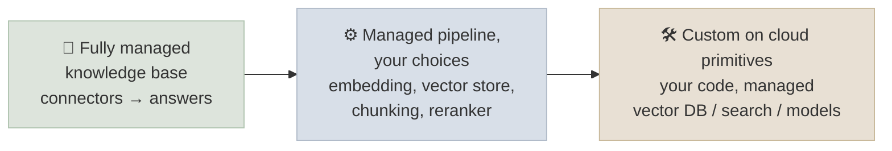

# Managed RAG on Cloud Platforms

Each major cloud offers managed RAG - services that parse, chunk, embed, index and retrieve your documents and ground a model's answers in them - trading control over each stage for less infrastructure to build and run.

```objectives
time: 50 min
outcomes:
  - Map Google's, AWS's and Azure's managed RAG services onto the RAG pipeline stages
  - Choose between a fully managed knowledge base, a configurable managed pipeline and a custom build for a given set of requirements
  - Call each platform's retrieval API and connect it to a model for grounded answers
  - Identify the lock-in, control and cost trade-offs of managed RAG
prerequisites:
  - "[RAG System Design](11-RAG-System-Design.mdx)"
  - "Optional, later in the course: [Cloud Platforms](../../18-Cloud-Platforms/INDEX.mdx) - Bedrock, Microsoft Foundry and Google's Agent Platform"
```

## The Spectrum



| | Fully managed | Configurable managed | Custom |
|---|---|---|---|
| Time to first answer | Hours | Days | Weeks |
| Control over parsing, chunking, retrieval | Little | Moderate | Full |
| Evaluation and tuning | Limited knobs | Most knobs | Everything |
| Lock-in | Highest | Medium | Lowest (but still cloud primitives) |
| Best for | Internal assistants over SaaS content | Most production RAG on one cloud | Differentiated products, strict requirements, multi-cloud |

All three clouds now offer "agentic retrieval" modes that plan sub-queries, retrieve in parallel and rerank - the managed version of [Agentic RAG](08-Agentic-and-Deep-Research-RAG.mdx).

---

## Google Cloud: Gemini Enterprise Agent Platform

Google renamed Vertex AI to the **Gemini Enterprise Agent Platform** in April 2026 (see [Google Cloud Agent Platform](../../18-Cloud-Platforms/Notes/04-Google-Cloud-Agent-Platform.mdx)). Its retrieval offerings:

| Service | What it is | Choose when |
|---|---|---|
| **Vertex AI Search** (Agent Platform Search) | Google-quality search over websites, structured and unstructured data, with connectors, its own ranking and grounded answers | You want search and answers with little pipeline work |
| **RAG Engine** | A managed RAG pipeline: corpora, file import from Cloud Storage, Drive and SaaS connectors, layout or LLM parsing, chunking, a choice of embedding model and vector store (managed store, Vector Search 2.0, Feature Store, Pinecone, Weaviate or Vertex AI Search), retrieval with reranking and hybrid search | You want control of chunking, embeddings and store without writing the pipeline |
| **Vector Search** (2.0) | A managed vector database built on ScaNN, with filtering and hybrid search | You're building a custom pipeline on Google Cloud |
| **AlloyDB / Cloud SQL with pgvector, Spanner** | Vectors inside your operational database | SQL filters and joins with vector search |
| **Grounding with Google Search** | Gemini answers grounded in live web results with source metadata | Public, current information |

**SDK change to know.** Google removed the old `vertexai.generative_models` and `vertexai.language_models` modules in June 2026. Model calls now use the `google-genai` SDK, and platform services such as RAG Engine are moving to the `agentplatform` client, which deprecates `vertexai.rag`:

```python
import agentplatform
from google import genai
from google.genai import types

client = agentplatform.Client(project=PROJECT_ID, location="us-central1")

corpus = client.rag.create_corpus(rag_corpus={"display_name": "hr-policies"})
client.rag.import_files(
    name=corpus.name,
    import_config={
        "gcs_source": {"uris": ["gs://my-bucket/hr-policies/"]},
        "rag_file_transformation_config": {
            "rag_file_chunking_config": {"fixed_length_chunking": {"chunk_size": 512, "chunk_overlap": 64}}
        },
    },
)

# Retrieval only - feed the contexts to any model
hits = client.rag.retrieve_contexts(
    vertex_rag_store={"rag_resources": [{"rag_corpus": corpus.name}]},
    query={"text": "How many days of parental leave do we offer?", "similarity_top_k": 8},
)

# Or let Gemini call the corpus as a retrieval tool
gemini = genai.Client(vertexai=True, project=PROJECT_ID, location="us-central1")
rag_tool = types.Tool(retrieval=types.Retrieval(vertex_rag_store=types.VertexRagStore(
    rag_resources=[types.VertexRagStoreRagResource(rag_corpus=corpus.name)])))
answer = gemini.models.generate_content(
    model=MODEL, contents="How many days of parental leave do we offer?",
    config=types.GenerateContentConfig(tools=[rag_tool]),
)
```

Grounding responses carry grounding metadata linking answer segments to source chunks - use it for citations (see [Grounded Generation & Citations](05-Grounded-Generation-and-Citations.mdx)).

---

## AWS: Amazon Bedrock Knowledge Bases

| Service | What it is | Choose when |
|---|---|---|
| **Bedrock Managed Knowledge Base** (GA June 2026) | Fully managed: native connectors (S3, SharePoint, Confluence, Google Drive, OneDrive, web crawler, ServiceNow), managed vector storage, hybrid search, reranking, agentic retrieval for multi-hop queries, document-level access control | An internal knowledge assistant with minimal infrastructure |
| **Bedrock Knowledge Bases** (customer-managed) | You choose the embedding model, chunking (fixed, hierarchical, semantic, or a custom Lambda), parser (including foundation-model parsing) and vector store: OpenSearch Serverless, Aurora PostgreSQL, Neptune Analytics (for GraphRAG), S3 Vectors, Pinecone, MongoDB Atlas, Redis | Most production RAG on AWS |
| **Amazon S3 Vectors** | Low-cost, durable vector storage in S3 with sub-second queries | Large, infrequently queried corpora |
| **OpenSearch Service** | Search engine with BM25, vectors and hybrid queries | Custom pipelines needing full search control |

```python
import boto3

runtime = boto3.client("bedrock-agent-runtime")
resp = runtime.retrieve_and_generate(
    input={"text": "How many days of parental leave do we offer?"},
    retrieveAndGenerateConfiguration={
        "type": "KNOWLEDGE_BASE",
        "knowledgeBaseConfiguration": {
            "knowledgeBaseId": KB_ID,
            "modelArn": MODEL_ARN,
            "retrievalConfiguration": {"vectorSearchConfiguration": {
                "numberOfResults": 8,
                "overrideSearchType": "HYBRID",          # where the vector store supports it
                "filter": {"equals": {"key": "department", "value": "hr"}},
            }},
        },
    },
)
print(resp["output"]["text"])
for c in resp["citations"]:                                   # citations map answer spans to retrieved chunks
    print([r["location"] for r in c["retrievedReferences"]])
```

Use `retrieve` instead of `retrieve_and_generate` to get the chunks and call any model yourself. GraphRAG with Neptune Analytics has been generally available since March 2025.

---

## Azure: Azure AI Search and Foundry IQ

| Service | What it is | Choose when |
|---|---|---|
| **Azure AI Search** | Search engine with BM25, vectors, hybrid (RRF) and a semantic ranker (cross-encoder), integrated vectorisation and skillsets for parsing | Custom or configurable RAG on Azure |
| **Agentic retrieval / knowledge bases** | An LLM plans sub-queries, runs them in parallel, reranks each with the semantic ranker and merges results; knowledge bases group sources | Complex, multi-part questions; agents |
| **Foundry IQ** | The managed knowledge layer in Microsoft Foundry: permission-aware knowledge bases over enterprise content, built on Azure AI Search, reusable by agents | Agents built in Microsoft Foundry |

Some agentic retrieval capabilities are GA in recent REST API versions while others remain in preview - check the API version before depending on a feature.

---

## Choosing - and Avoiding Lock-in Traps

| Requirement | Points to |
|---|---|
| Content lives in SharePoint/Confluence/Drive, internal users, fast delivery | Fully managed knowledge base (Bedrock Managed KB, Foundry IQ, Vertex AI Search) |
| Need to tune chunking, embeddings and retrieval on an eval | Configurable pipeline (RAG Engine, Bedrock KB customer-managed, Azure AI Search) |
| Retrieval quality is the product; custom rankers, domain models | Custom build on managed primitives |
| Strict per-document permissions | Check each service's document-level ACL support and test it with probes |
| Multi-cloud or on-premises | Custom build with portable components (pgvector, OpenSearch, open models) |

Questions to ask before committing:

1. **Can I evaluate it?** Get retrieved chunks with scores and ids (not just answers) so you can compute recall@k and nDCG on your golden set.
2. **Can I export?** Parsed text, chunks and embeddings - or will leaving mean re-ingesting everything?
3. **What does it cost at my scale?** Ingestion (parsing, embedding), storage, per-query retrieval and reranking, and model tokens are usually billed separately.
4. **Which knobs exist?** Chunking, parser, embedding model, hybrid, reranker, filters, top-k.
5. **How are permissions enforced and synced?**

---

## Check Yourself

```quiz
- q: "Your team's Gemini RAG code imports vertexai.generative_models and now fails. What changed?"
  options:
    - "Google removed the vertexai.generative_models module in June 2026; model calls moved to the google-genai SDK"
    - "Gemini no longer supports RAG"
    - "RAG Engine was discontinued"
    - "The code needs a newer Python version"
  answer: 1
- q: "Which requirement most strongly argues for a custom build over a fully managed knowledge base?"
  options:
    - "Retrieval quality is a product differentiator that needs custom ranking and domain models"
    - "Documents live in SharePoint"
    - "Users are internal employees"
    - "You need answers with citations"
  answer: 1
- q: "In Bedrock's retrieve_and_generate, where do you control hybrid vs semantic search?"
  options:
    - "vectorSearchConfiguration.overrideSearchType (HYBRID or SEMANTIC)"
    - "The modelArn"
    - "The knowledge base name"
    - "The input text"
  answer: 1
- q: "Why insist on access to retrieved chunks and scores from a managed RAG service?"
  answer: "Without them you can only evaluate end-to-end answers. Chunk ids and scores let you compute retrieval metrics (recall@k, nDCG) on your golden set, diagnose whether failures come from retrieval or generation, tune top-k and thresholds, and compare the service against alternatives."
```

## Exercises

```exercise
- title: Compare a managed service to your pipeline
  task: |
    Load the same 200 documents into one managed RAG service and into the code lab's hybrid pipeline. Using 50 labelled questions, compare recall@8 and answer correctness, and record ingestion time, cost and the knobs you could tune.
  solution: |
    Managed services usually reach a solid baseline quickly; differences appear on identifier-heavy queries (hybrid support), tables (parser quality) and domain vocabulary (embedding choice). The comparison should end with a decision table: quality gap, cost per 1,000 queries, and effort to close the gap in each option.
- title: Migration plan
  task: |
    An application uses `vertexai.generative_models` for generation and `vertexai.language_models.TextEmbeddingModel` for embeddings over a custom Vector Search index. Write the migration plan.
  solution: |
    Replace generation calls with the google-genai client (`genai.Client(vertexai=True, ...)` and `client.models.generate_content`), and embeddings with the client's embedding call using a current embedding model. If the embedding model changes, re-embed the corpus into a new index and switch with an alias after evaluating it - never mix models in one index. Move any RAG Engine calls from `vertexai.rag` to the `agentplatform` client. Pin SDK versions and add a CI smoke test for each call path.
```

## Study Notes

**Must-know:**
- Spectrum: fully managed knowledge base → configurable managed pipeline → custom on cloud primitives
- Google: Vertex AI Search, RAG Engine (choice of embeddings, stores, parsers, reranking), Vector Search 2.0 (ScaNN), pgvector databases, Google Search grounding; `google-genai` for models, `agentplatform` for RAG Engine; old `vertexai.generative_models` removed June 2026
- AWS: Bedrock Managed Knowledge Base (fully managed, agentic retrieval), Knowledge Bases (choose store incl. S3 Vectors, Neptune GraphRAG), `retrieve` / `retrieve_and_generate` with hybrid search and filters
- Azure: AI Search (hybrid + semantic ranker), agentic retrieval and knowledge bases, Foundry IQ
- Before committing: evaluability (chunks + scores), export, cost at scale, knobs, permission enforcement

## References

- Google Cloud, [RAG Engine overview](https://docs.cloud.google.com/gemini-enterprise-agent-platform/build/rag-engine/rag-overview); [Vertex AI SDK migration guide](https://cloud.google.com/vertex-ai/generative-ai/docs/deprecations/genai-vertexai-sdk)
- AWS, [Introducing Amazon Bedrock Managed Knowledge Base](https://aws.amazon.com/blogs/aws/introducing-amazon-bedrock-managed-knowledge-base-for-faster-more-accurate-enterprise-ai-applications/) (2026); [Bedrock Knowledge Bases GraphRAG GA](https://aws.amazon.com/about-aws/whats-new/2025/03/amazon-bedrock-knowledge-bases-graphrag-generally-available) (2025)
- Microsoft, [Agentic retrieval in Azure AI Search](https://learn.microsoft.com/en-us/azure/search/agentic-retrieval-overview); [What is Foundry IQ?](https://learn.microsoft.com/en-us/azure/foundry/agents/concepts/what-is-foundry-iq)

*Last reviewed: 2026-09*
