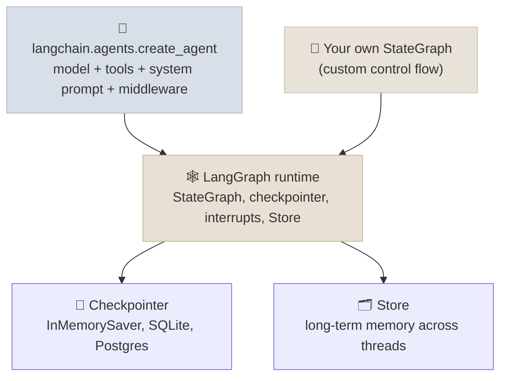
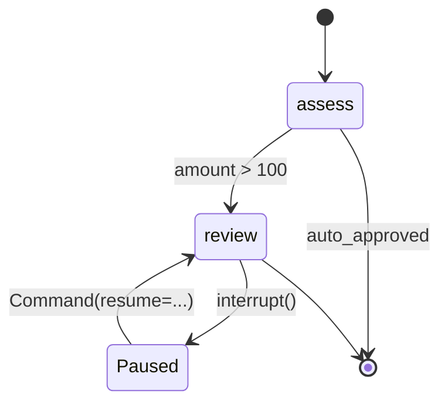

# LangChain and LangGraph

LangGraph is a low-level runtime for stateful agents: you define a graph of nodes over a typed state, and it checkpoints that state after every step so runs can pause, resume, branch and survive restarts. LangChain 1.x is the high-level layer on top - `create_agent` builds a standard tool-calling agent on LangGraph, and **middleware** customises it.

```objectives
time: 50 min
outcomes:
  - Build a tool-calling agent with create_agent and add behaviour with middleware (human approval, call limits, summarization)
  - Build a LangGraph StateGraph with conditional edges, a checkpointer and a thread id
  - Pause a graph with interrupt() and resume it with Command(resume=...)
  - Choose between create_agent, a custom graph and the functional API for a task
prerequisites:
  - "[Choosing an Agent Framework](01-Choosing-an-Agent-Framework.mdx)"
```

## Two Layers



LangChain 1.0 (October 2025) cut the package down to agents, models, messages and tools; the old chains, `AgentExecutor` and `initialize_agent` moved to `langchain-classic`. If you meet `AgentExecutor` in older code, the replacement is `create_agent`.

## create_agent and Middleware

This is the lab's agent, with approval before every refund and a cap on tool calls:

```python
from langchain.agents import create_agent
from langchain.agents.middleware import HumanInTheLoopMiddleware, ToolCallLimitMiddleware
from langgraph.checkpoint.memory import InMemorySaver
from langgraph.types import Command

agent = create_agent(
    "openai:gpt-5-mini",                      # or a ChatOpenAI/ChatAnthropic instance
    tools=[find_customer, list_orders, get_order, cancel_order, update_address, refund_item],
    system_prompt=POLICY,
    middleware=[
        HumanInTheLoopMiddleware(interrupt_on={"refund_item": {"allowed_decisions": ["approve", "reject"]}}),
        ToolCallLimitMiddleware(run_limit=20),
    ],
    checkpointer=InMemorySaver(),             # interrupts need a checkpointer
)

config = {"configurable": {"thread_id": "ticket-1234"}}
result = agent.invoke({"messages": [{"role": "user", "content": request}]}, config)
while "__interrupt__" in result:              # paused before a refund
    n = len(result["__interrupt__"][0].value["action_requests"])
    result = agent.invoke(Command(resume={"decisions": [{"type": "approve"}] * n}), config)
```

Middleware hooks into the loop at `before_model`, `after_model`, `wrap_model_call` and `wrap_tool_call`. The built-ins cover the common needs:

| Middleware | Does |
|---|---|
| `HumanInTheLoopMiddleware` | Interrupts before selected tools; approve, edit or reject |
| `ToolCallLimitMiddleware`, `ModelCallLimitMiddleware` | Bounds per run or per thread |
| `SummarizationMiddleware`, `ContextEditingMiddleware` | Compress or clear old context near the limit |
| `ModelRetryMiddleware`, `ToolRetryMiddleware`, `ModelFallbackMiddleware` | Retries and fallback models |
| `PIIMiddleware` | Redact or block PII in inputs and outputs |
| `LLMToolSelectorMiddleware` | A small model picks relevant tools before the main call |
| `TodoListMiddleware` | Gives the agent a planning to-do tool |

Write your own by subclassing `AgentMiddleware` - for example, the ownership guard from Lab 14 as a `wrap_tool_call`.

## LangGraph: State, Nodes, Edges, Checkpoints

When the flow is yours rather than the model's, write the graph. Nodes are functions from state to a partial update; edges (fixed or conditional) decide what runs next; the checkpointer saves state after each step, keyed by `thread_id`.

```python
from typing import TypedDict
from langgraph.graph import StateGraph, START, END
from langgraph.checkpoint.memory import InMemorySaver
from langgraph.types import interrupt, Command

class Refund(TypedDict):
    order_id: str
    amount: float
    status: str

def assess(state: Refund) -> dict:
    return {"status": "needs_review" if state["amount"] > 100 else "auto_approved"}

def review(state: Refund) -> dict:
    decision = interrupt({"question": f"Approve refund of {state['amount']} on {state['order_id']}?"})
    return {"status": "approved" if decision == "yes" else "rejected"}

def route(state: Refund) -> str:
    return "review" if state["status"] == "needs_review" else END

builder = StateGraph(Refund)
builder.add_node("assess", assess)
builder.add_node("review", review)
builder.add_edge(START, "assess")
builder.add_conditional_edges("assess", route, ["review", END])
builder.add_edge("review", END)
graph = builder.compile(checkpointer=InMemorySaver())

config = {"configurable": {"thread_id": "refund-42"}}
result = graph.invoke({"order_id": "O1001", "amount": 120.0, "status": "new"}, config)
print(result["__interrupt__"][0].value)      # {'question': 'Approve refund of 120.0 on O1001?'}
result = graph.invoke(Command(resume="yes"), config)
print(result["status"])                        # approved
```

(Output verified with langgraph 1.2.)



Things to know about interrupts:

- **The node re-runs from its start on resume.** `interrupt()` returns the resume value the second time through, so code before it runs twice - keep side effects after the interrupt, or make them idempotent.
- **State lives in the checkpointer.** Swap `InMemorySaver` for the SQLite or Postgres savers (`langgraph-checkpoint-sqlite`, `langgraph-checkpoint-postgres`) and the pause can last days and survive a restart.
- **Durability modes** (`"exit"`, `"async"`, `"sync"`) trade write overhead against how much progress a crash can lose.

Other primitives: `Send` for map-reduce fan-out to dynamic numbers of workers, subgraphs for encapsulation, `RetryPolicy` per node, streaming modes (`values`, `updates`, `messages`, `custom`), and the **Store** - a key-value store with optional semantic search that persists across threads, used for long-term memory (see [Agent Memory](../../10-Agent-Building-Blocks/Notes/02-Agent-Memory.mdx)). A functional API (`@entrypoint`, `@task`) gives the same checkpointing to plain Python control flow.

## When to Use Which

| Use | When |
|---|---|
| `create_agent` | A standard tool-calling agent; customise with middleware |
| A `StateGraph` | You own the control flow: fixed stages, branches, parallel fan-out, human review steps, long-running processes |
| Functional API | Checkpointing for code that is naturally a sequence of function calls |
| Neither | A single call or a short fixed chain |

Deployment and observability come from the same company: LangSmith for tracing and evaluation, and LangSmith Deployment (formerly LangGraph Platform) to host graphs with persistence and task queues. Both are optional; the libraries are MIT-licensed.

## Check Yourself

```quiz
- q: "What must a LangGraph graph have for interrupt() to work?"
  options:
    - "A checkpointer, and a thread_id in the config"
    - "A Store"
    - "A conditional edge after the node"
    - "Streaming enabled"
  answer: 1
  explain: "An interrupt saves the state and stops; resuming loads it by thread_id. Without a checkpointer there's nothing to resume from."
- q: "A node sends an email and then calls interrupt(). What goes wrong on resume?"
  options:
    - "The node re-runs from its start, so the email is sent twice"
    - "The resume value is lost"
    - "The graph restarts from START"
    - "Nothing"
  answer: 1
- q: "Which LangChain 1.x piece replaces AgentExecutor?"
  options: ["create_agent", "initialize_agent", "RunnableSequence", "StateGraph"]
  answer: 1
- q: "Where would you enforce 'refunds only on the customer's own orders' in a create_agent agent, other than inside the tool?"
  answer: "In a custom middleware using wrap_tool_call, which sees each call's name and arguments before execution and can block it - policy in code rather than in the prompt."
```

## Exercises

```exercise
- title: Guard middleware
  task: |
    Write an AgentMiddleware with wrap_tool_call that blocks cancel_order, update_address and refund_item on orders not owned by the customer that find_customer returned in this run. Add it to the lab's agent_langchain.py and run the other_customer task five times.
  hints: ["Keep the identified customer in the middleware instance or in graph state", "Return a ToolMessage with an error instead of calling the handler"]
  solution: |
    In wrap_tool_call(request, handler): if request.tool_call["name"] == "find_customer", call handler, parse the result and store customer_id; for write tools, look up the order's owner via the shop and, if it differs, return ToolMessage(content="Blocked: order belongs to another customer", tool_call_id=request.tool_call["id"]). Otherwise return handler(request). The other_customer task then passes every time, because the rule no longer depends on the model.
- title: A two-day approval
  task: |
    Change the Refund graph to use SqliteSaver, run it until the interrupt, stop the Python process, start a new one and resume with Command(resume="no"). What persisted?
  solution: |
    The full state and the pending interrupt, keyed by thread_id, in the SQLite file. The new process builds the same graph with the same saver and invokes Command(resume="no") with the same config; review re-runs, interrupt() returns "no", and status becomes rejected.
```

## Study Notes

- LangChain 1.x `create_agent` = standard agent on the LangGraph runtime; middleware (`before_model`, `after_model`, `wrap_model_call`, `wrap_tool_call`) customises it; `AgentExecutor` is legacy (`langchain-classic`)
- LangGraph: typed state, nodes return partial updates, conditional edges, checkpointer + `thread_id`
- `interrupt()` pauses; `Command(resume=...)` resumes; the node re-runs from its start
- Store = cross-thread long-term memory; `Send` = dynamic fan-out; durability modes; functional API
- Use `create_agent` for standard agents, a graph when you own the control flow

## References

- LangChain, [LangChain and LangGraph 1.0](https://blog.langchain.com/langchain-langgraph-1dot0/) (Oct 2025)
- [LangChain agents and middleware](https://docs.langchain.com/oss/python/langchain/middleware) (2026)
- [LangGraph interrupts](https://docs.langchain.com/oss/python/langgraph/interrupts) and [persistence](https://docs.langchain.com/oss/python/langgraph/persistence) (2026)

*Last reviewed: 2026-09*
