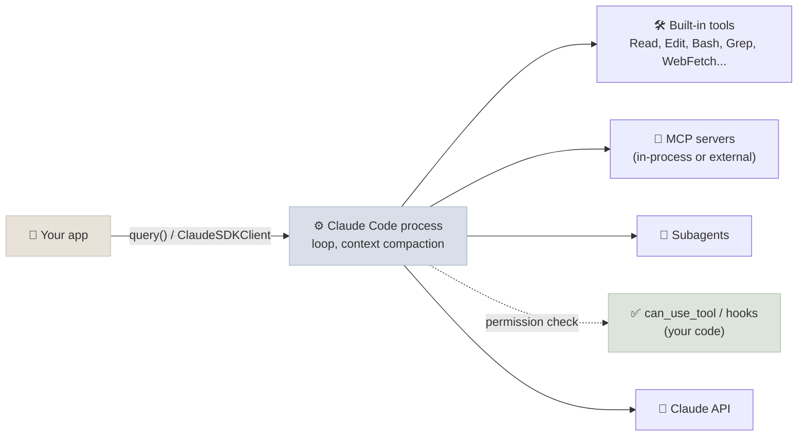

# Claude Agent SDK

The Claude Agent SDK exposes the harness behind Claude Code - its loop, built-in tools, context management, permissions, hooks, subagents and skills - as a Python and TypeScript library. Where other agent SDKs give you a loop to fill with your own tools, this one starts with a working agent that can read and edit files, run commands and search the web, and you restrict and extend it. It was renamed from the Claude Code SDK in September 2025.

```objectives
time: 40 min
outcomes:
  - Explain how the Claude Agent SDK differs from a Messages API tool loop, the Tool Runner and Managed Agents
  - Configure built-in tools, permission modes, allowed and disallowed tools, and a can_use_tool callback
  - Add custom tools through an in-process MCP server, and hooks that block or audit tool calls
  - Define subagents and load skills and project settings
prerequisites:
  - "[Choosing an Agent Framework](01-Choosing-an-Agent-Framework.mdx)"
  - "[MCP & A2A](../../11-MCP-and-A2A/INDEX.mdx) - MCP servers and tools"
```

## Where It Sits

| Option | You write | Loop and tools | Hosting |
|---|---|---|---|
| Messages API, manual loop | The loop and every tool | Yours | Yours |
| Messages API Tool Runner | Tool functions | SDK loop, your tools | Yours |
| **Claude Agent SDK** | A prompt and options | Claude Code harness; built-in Read, Write, Edit, Bash, Glob, Grep, WebSearch, WebFetch, plus MCP and your tools | Yours (the SDK drives a local Claude Code process) |
| Claude Managed Agents | Agent configuration | Anthropic's harness | Anthropic runs the loop and a per-session sandbox |

Choose the Agent SDK when the agent's work looks like Claude Code's - files, shells, codebases, research across documents - and you want context compaction, permissions and subagents already solved. It runs only Claude models, and each session drives a Claude Code CLI process, so it needs the CLI installed and an Anthropic API key (or a Bedrock, Vertex AI or Foundry configuration).



## Custom Tools, Permissions and Approval

The lab's version serves the shop tools from an **in-process MCP server** and removes every built-in tool:

```python
from claude_agent_sdk import (ClaudeAgentOptions, ClaudeSDKClient, PermissionResultAllow,
                              PermissionResultDeny, ResultMessage, create_sdk_mcp_server, tool)

@tool("refund_item", "Refund one line item of a delivered order.", {"order_id": str, "item_id": int})
async def refund_item(args):
    result = shop.refund_item(args["order_id"], args["item_id"])
    return {"content": [{"type": "text", "text": json.dumps(result)}]}

async def approve(tool_name, tool_input, context):
    if tool_name == "mcp__shop__refund_item" and not human_says_yes(tool_input):
        return PermissionResultDeny(message="A reviewer declined this refund.")
    return PermissionResultAllow()

options = ClaudeAgentOptions(
    system_prompt=POLICY,
    mcp_servers={"shop": create_sdk_mcp_server("shop", tools=[find_customer, ..., refund_item])},
    tools=[],                                              # no built-in tools at all
    allowed_tools=["mcp__shop__find_customer", "mcp__shop__list_orders", "mcp__shop__get_order"],
    can_use_tool=approve,                                  # everything not pre-allowed asks here
    max_turns=20,
)
async with ClaudeSDKClient(options=options) as client:    # can_use_tool needs a streaming session
    await client.query("I'm ana.silva@example.com. Refund the trekking poles, please.")
    async for message in client.receive_response():
        if isinstance(message, ResultMessage):
            print(message.result, message.total_cost_usd)
```

MCP tool names are namespaced `mcp__<server>__<tool>`. Permission evaluation runs in layers: hooks first, then deny rules (`disallowed_tools`), the **permission mode** and allow rules (`allowed_tools`), and finally `can_use_tool` for anything still undecided.

| Permission mode | Behaviour |
|---|---|
| `default` | Unmatched tools go to `can_use_tool` |
| `acceptEdits` | File edits are auto-approved |
| `plan` | Read-only planning: no edits or commands run |
| `dontAsk` | Anything not pre-approved is denied instead of asking |
| `auto` | A classifier approves or denies each call |
| `bypassPermissions` | Everything runs - only inside a sandbox you trust |

## Hooks

Hooks are callbacks at points in the loop: `PreToolUse`, `PostToolUse`, `PostToolUseFailure`, `UserPromptSubmit`, `Stop`, `SubagentStart`, `SubagentStop`, `PreCompact`, `PermissionRequest`, `Notification`. A `PreToolUse` hook can deny a call before permissions are even considered - policy in code:

```python
from claude_agent_sdk import HookMatcher

async def no_force_push(input_data, tool_use_id, context):
    command = input_data["tool_input"].get("command", "")
    if "git push" in command and ("--force" in command or " -f" in command):
        return {"hookSpecificOutput": {"hookEventName": "PreToolUse",
                                       "permissionDecision": "deny",
                                       "permissionDecisionReason": "Force-push is not allowed."}}
    return {}

options = ClaudeAgentOptions(hooks={"PreToolUse": [HookMatcher(matcher="Bash", hooks=[no_force_push])]})
```

Use `PostToolUse` for audit logs, `Stop` to run a verification step before the agent may finish, and `PreCompact` to save the transcript before context is compacted.

## Subagents, Skills and Settings

- **Subagents** (`agents={"reviewer": AgentDefinition(description=..., prompt=..., tools=["Read", "Grep"], model=...)}`) run in their own context window with their own tools, and return a summary to the main agent - the context-isolation pattern from [Multi-Agent Engineering](../../12-Agentic-Workflows/Notes/04-Multi-Agent-Engineering.mdx).
- **Skills** are folders with a `SKILL.md` (instructions, scripts, resources) that the agent loads on demand; see [Agent Engineering](../../19-Agent-Engineering/INDEX.mdx).
- **Settings**: `setting_sources=["project"]` loads `CLAUDE.md`, `.claude/settings.json`, project skills and slash commands, so an SDK agent behaves like Claude Code in that repository. Omit it for a fully programmatic agent.
- **Sessions** can be resumed (`resume=session_id`) or forked; `max_budget_usd` caps spend; `sandbox` settings restrict commands' file-system and network access.

## Check Yourself

```quiz
- q: "What does the Claude Agent SDK provide that the Messages API Tool Runner does not?"
  options:
    - "Claude Code's built-in tools, permissions, hooks, subagents, skills and context compaction"
    - "A hosted sandbox run by Anthropic"
    - "Support for non-Claude models"
    - "Tool calling"
  answer: 1
  explain: "The Tool Runner runs a loop over your tools; the Agent SDK brings the whole Claude Code harness. Hosting a sandbox is Managed Agents."
- q: "What name does the model see for tool refund_item on in-process MCP server 'shop'?"
  options: ["mcp__shop__refund_item", "shop.refund_item", "refund_item", "shop/refund_item"]
  answer: 1
- q: "Which runs first when the agent tries to run a Bash command?"
  options:
    - "PreToolUse hooks"
    - "can_use_tool"
    - "The permission mode"
    - "allowed_tools"
  answer: 1
- q: "Why is bypassPermissions acceptable only in a sandbox?"
  answer: "It approves every tool call, including shell commands and file writes, so an injected instruction or a model mistake executes with the process's full privileges; a container or VM with restricted filesystem and network limits the blast radius."
```

## Exercises

```exercise
- title: A read-only code reviewer
  task: |
    Configure a Claude Agent SDK agent that reviews the current repository's diff and writes nothing: only Read, Grep, Glob and a Bash hook that allows `git diff` and `git log` but denies everything else. Test it by asking it to fix a bug.
  solution: |
    tools=["Read", "Grep", "Glob", "Bash"], permission_mode="dontAsk", allowed_tools=["Read", "Grep", "Glob"], and a PreToolUse hook on Bash that returns permissionDecision "allow" only when the command starts with "git diff" or "git log" and "deny" otherwise. Asked to fix a bug, it can explain the fix but every write or other command is denied.
- title: Verify before stopping
  task: |
    Add a Stop hook that runs the project's tests when the agent tries to finish and, if they fail, blocks the stop with the failing output as the reason. Why is this stronger than telling the agent "always run the tests"?
  solution: |
    The Stop hook runs the tests itself; on failure it returns a decision to block with the test output as the reason, so the agent continues with real feedback. A prompt instruction can be skipped or claimed without being done (the claimed-action failure from Lab 13); the hook makes verification a property of the harness.
```

## Study Notes

- The Claude Code harness as a library: built-in tools, compaction, permissions, hooks, subagents, skills, sessions; Claude models only; drives a local Claude Code process
- Custom tools via in-process MCP (`@tool`, `create_sdk_mcp_server`); names `mcp__server__tool`
- Permission order: hooks -> deny rules -> permission mode and allow rules -> `can_use_tool`
- Hooks for policy (`PreToolUse` deny), audit (`PostToolUse`), verification (`Stop`)
- `setting_sources` loads `CLAUDE.md` and project settings; `max_budget_usd`, `sandbox`, session resume/fork

## References

- Anthropic, [Building agents with the Claude Agent SDK](https://www.anthropic.com/engineering/building-agents-with-the-claude-agent-sdk) (Sep 2025)
- [Claude Agent SDK overview](https://docs.claude.com/en/api/agent-sdk/overview), [permissions](https://docs.claude.com/en/api/agent-sdk/permissions) and [hooks](https://docs.claude.com/en/api/agent-sdk/hooks) (2026)
- [claude-agent-sdk-python](https://github.com/anthropics/claude-agent-sdk-python) (2026)

*Last reviewed: 2026-09*
