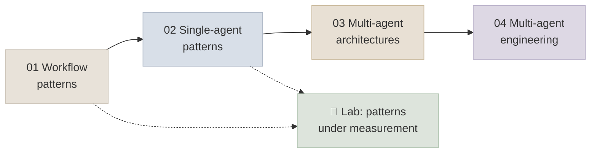

# 14 - Agent Patterns & Multi-Agent

How to compose model calls, tools and agents into systems: the workflow patterns most production systems are made of, the patterns that make a single agent safe and reliable, when multiple agents genuinely help (and the evidence on when they don't), and the engineering that makes multi-agent systems work. A lab puts the central claim - feedback must add information - to a measured test.

```objectives
scope: module
time: 7-9 hours (notes + lab)
outcomes:
  - Choose and combine workflow patterns (chaining, routing, parallelization, orchestrator-workers, evaluator-optimizer) for a task, with cost and latency estimates
  - Wrap a single agent in guardrails, gates, human handoffs, sub-agents and verification loops that use real feedback
  - Decide, citing evidence, whether a task warrants multiple agents, and pick a topology
  - Engineer multi-agent context, state, communication, budgets, tracing and evaluation
  - Measure whether a pattern helps on your task rather than assuming it does
prerequisites:
  - "[Agent Foundations](../12-Agent-Foundations/INDEX.mdx) - the loop, tools, memory, planning"
  - "[MCP & A2A](../13-MCP-and-A2A/INDEX.mdx) - for agents across boundaries"
```

## Where This Module Fits



Frameworks that implement these patterns are compared in [Agent Frameworks](../15-Agent-Frameworks/INDEX.mdx); running them in production is [Production Agents](../16-Production-Agents/INDEX.mdx).

## Chapter Map

| # | Chapter | You will learn | Time |
|---|---|---|---|
| 1 | [Workflow Patterns](Notes/01-Workflow-Patterns.mdx) | Chaining, routing, parallelization, orchestrator-workers, evaluator-optimizer; combining; cost and latency | 50 min |
| 2 | [Single-Agent Patterns](Notes/02-Single-Agent-Patterns.mdx) | The single-agent default, guardrails, gates and HITL, sub-agents as tools, verification loops | 45 min |
| 3 | [Multi-Agent Architectures](Notes/03-Multi-Agent-Architectures.mdx) | The evidence, topologies (orchestrator, hierarchical, handoffs, network, blackboard, debate), MAST failure modes | 55 min |
| 4 | [Multi-Agent Engineering](Notes/04-Multi-Agent-Engineering.mdx) | Delegation and artifacts, communication, state and ledgers, budgets, tracing and evaluation | 55 min |
| 5 | [Q&A Review Bank](Notes/05-Interview-QA-Bank.mdx) | 40 questions across the module | 45 min |

## Code Lab

| Lab | What you build | Runs on |
|---|---|---|
| [Patterns Under Measurement](CodeLabs/01-Patterns-Under-Measurement.mdx) | Single attempt vs self-review vs test-feedback loop vs best-of-n on HumanEval problems, graded on hidden tests with confidence intervals | A local OpenAI-compatible model (laptop) or any hosted API; ~1 hour for the full run |

## Mini-Project

Take a task from your work that someone proposed a multi-agent system for, and **settle it with measurements**:

1. A test set of 30+ real inputs with an outcome check (state, tests, or a rubric validated against 20 human labels).
2. A strong single-agent baseline (good tools, clear prompt, a verification loop with external feedback).
3. The proposed multi-agent design, with precise delegation schemas, an artifact store and budgets.
4. A comparison of quality with confidence intervals, tokens, cost and latency per input - including a single-agent variant given the same token budget.
5. A one-page recommendation, citing your numbers and the evidence in this module.

## Review

- [Q&A Review Bank](Notes/05-Interview-QA-Bank.mdx) - consolidated questions for this module
- [Module quiz](/quiz/agentic-ai) - every *Check Yourself* question in this module, in course order

---

Previous: [13 - MCP & A2A](../13-MCP-and-A2A/INDEX.mdx) · Next: [15 - Agent Frameworks](../15-Agent-Frameworks/INDEX.mdx)
