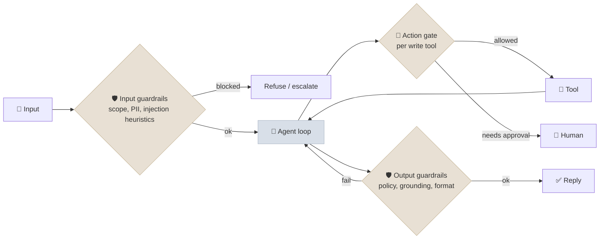
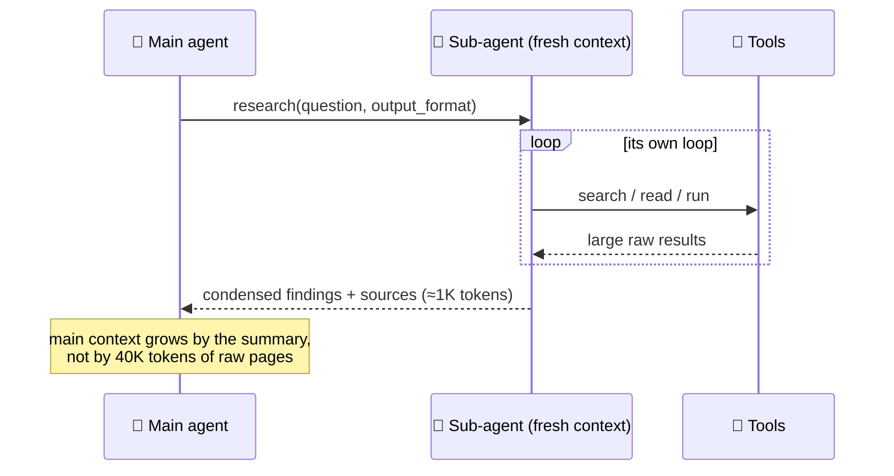

# Single-Agent Patterns

Before reaching for several agents, most problems are better served by **one well-equipped agent** plus a few structural patterns around it: guardrails running alongside, gates before risky actions, sub-agents used as tools for context isolation, handoffs to humans, and verification loops driven by real feedback. This chapter collects those patterns and states when each is worth its cost.

```objectives
time: 45 min
outcomes:
  - Explain why a single agent with good tools is the default architecture and what signals justify more
  - Apply guardrail, gating and human-in-the-loop patterns around an agent loop
  - Use sub-agents as tools for context isolation, and know how they differ from multi-agent collaboration
  - Design verification loops that use external feedback, and escalation paths that hand off cleanly to humans
prerequisites:
  - "[Workflow Patterns](01-Workflow-Patterns.mdx)"
  - "[Planning & Reasoning](../../12-Agent-Foundations/Notes/06-Planning-and-Reasoning.mdx) - ReAct, plan-and-execute, reflection"
```

## The Default: One Agent, Good Tools

A single agent loop with a well-designed tool set, a clear system prompt and a capable model is the right starting point for most tasks. It has one context (no information lost between agents), one trace to debug, and the lowest token cost. Planning strategies (ReAct, plan-and-execute, todo lists) are variations *within* this agent ([Planning & Reasoning](../../12-Agent-Foundations/Notes/06-Planning-and-Reasoning.mdx)).

Move beyond it only when you observe a specific limit:

| Symptom | Likely remedy |
|---|---|
| Context fills with tool output the agent no longer needs | Sub-agents as tools; compaction ([Agent Memory](../../12-Agent-Foundations/Notes/05-Agent-Memory.mdx)) |
| Too many tools, wrong ones chosen | Tool search, routing to specialised agents |
| Independent sub-tasks are slow in sequence | Parallel tool calls, or parallel sub-agents |
| Quality varies and can be checked | A verification loop with external feedback |
| Some actions are too risky to automate | Gates and human approval |

---

## Guardrails Around the Loop

Guardrails are checks outside the model, running before, during or after it:



- **Run cheap checks in parallel** with the main call (a small classifier for off-topic or abusive input) and cancel the main call if they trip - the parallelization pattern applied to safety.
- **Enforce action rules in code at the tool boundary** - ownership, amount limits, allowed recipients - not only in the prompt. [Lab 12](../../12-Agent-Foundations/CodeLabs/01-Agent-Loop-from-Scratch.mdx) found rules enforced by tools held in every prompt variant, while the one rule stated only in the prompt was broken in all of them.
- **Validate outputs** that matter: schemas, citations present and valid, no internal data leaked.

Guardrail design and prompt-injection defences are covered in depth in [Production Agents](../../16-Production-Agents/INDEX.mdx).

## Gates and Human-in-the-Loop

| Gate | Trigger | Example |
|---|---|---|
| **Action approval** | Specific tools, or arguments over a threshold | Refunds over $500; any external email |
| **Plan approval** | Before executing a multi-step plan | A migration touching 40 files |
| **Confidence gate** | A calibrated signal - verifier score, retrieval coverage, classifier probability | Low grounding score → human review |
| **Escalation** | Policy ambiguity, user request, repeated failure | "Speak to a person" |

Two cautions. Model **self-reported confidence** ("I am 90% sure") is poorly calibrated; base gates on external signals - a verifier, test results, agreement between samples, or a trained classifier. And approval gates need the loop to **pause and resume** with persisted state; frameworks provide interrupts on top of checkpointing ([Agents in Practice](../../12-Agent-Foundations/Notes/07-Agents-in-Practice.mdx)).

**Clean handoff to a human** means passing a summary, not a transcript: the customer's goal, what was verified, what was done, what failed and why, and the suggested next step.

---

## Sub-Agents as Tools

An agent can call another model invocation *as a tool*: "research this question and return a 200-word summary with sources". The sub-agent runs its own loop in a fresh context, uses whatever tools it needs, and returns only a condensed result.



- **Why:** context isolation. The main agent's context stays focused; exploration noise stays in the sub-agent. Coding agents use this for codebase searches; research agents for each line of inquiry.
- **Cost:** the sub-agent re-reads whatever you pass it, and anything it doesn't return is lost to the main agent. Specify the task, the output format and the boundaries precisely - vague delegation is the most common failure (Anthropic, 2025).
- **Difference from multi-agent collaboration:** a sub-agent-as-tool is a function call with a return value; the main agent stays in control and the sub-agent doesn't talk to peers. That keeps most of the single-agent simplicity.

---

## Verification Loops That Work

The evaluator-optimizer pattern ([Workflow Patterns](01-Workflow-Patterns.mdx)) inside an agent: after producing a result, the agent (or harness) checks it and revises.

| Feedback source | Strength | Examples |
|---|---|---|
| **Execution** | Strongest - objective and specific | Unit tests, type checkers, linters, running a query, schema validation |
| **Environment state** | Strong | Re-reading the record after an update; checking a file exists |
| **Independent evaluator with new information** | Moderate - depends on the rubric | Citation checker against sources; policy checklist |
| **The same model re-reading its own output** | Weak for reasoning errors (Huang et al., 2024) | "Review your answer for mistakes" |

Design for the strong end: give agents tools that produce feedback (a `run_tests` tool, a `validate` tool), and make "done" mean "verified". The module [lab](../CodeLabs/01-Patterns-Under-Measurement.mdx) compares a no-feedback self-review loop with a test-feedback loop and best-of-n selection on the same problems.

---

## Check Yourself

```quiz
- q: "Why is model self-reported confidence a poor basis for a confidence gate?"
  options:
    - "It is poorly calibrated; external signals such as verifiers or tests are more reliable"
    - "Models can't output numbers"
    - "It is too slow"
    - "It is always too low"
  answer: 1
- q: "What does using a sub-agent as a tool mainly buy you?"
  options:
    - "Context isolation - exploration noise stays out of the main agent's context"
    - "Lower total token cost"
    - "Guaranteed correctness"
    - "Peer-to-peer negotiation between agents"
  answer: 1
  explain: "It usually costs more tokens in total; the benefit is a focused main context."
- q: "Which verification loop is most likely to fix a bug in generated code?"
  options:
    - "Running the tests and feeding the failures back"
    - "Asking the model to re-read its code"
    - "Asking a second model whether the code looks right"
    - "Increasing temperature and regenerating"
  answer: 1
- q: "What should a handoff to a human agent contain?"
  answer: "A structured summary: the user's goal, identity/verification status, actions taken and their results, what failed and why, relevant ids, and a suggested next step - not the raw transcript."
```

## Exercises

```exercise
- title: Guard an agent
  task: |
    For an agent that manages a user's calendar and email, list the guardrails you would add at input, action and output, and which actions need human approval. Justify each by the harm it prevents.
  solution: |
    Input: scope check (calendar/email only), injection heuristics on email bodies. Action: sending email to external domains needs approval; bulk deletes blocked; invites to more than N people need approval; all writes scoped to the user's account. Output: no content from other users' threads; summaries cite message ids. Approval covers the irreversible, externally visible actions - sending and deleting - where a manipulated agent would do the most damage.
- title: Delegate precisely
  task: |
    Rewrite this delegation for a research sub-agent so its output is useful to the main agent: "Look into competitor pricing."
  solution: |
    "Find the current list prices (monthly, per seat) for the team plans of Competitors A, B and C from their official pricing pages. Return a JSON array of {competitor, plan, price_usd, billing_period, source_url, retrieved_date}. If a price isn't public, set price_usd to null and say so. Don't include blog posts or third-party estimates. Stop after the three official pages."
```

## Study Notes

- Default: one agent, good tools, clear prompt; add structure only for observed limits
- Guardrails: input, action (at the tool boundary, in code), output; run cheap checks in parallel
- Gates: action approval, plan approval, confidence (external signals, not self-report), escalation; need pause/resume
- Handoffs to humans: structured summaries
- Sub-agents as tools: context isolation, precise delegation, higher total tokens; main agent stays in control
- Verification: execution > environment state > independent evaluator with new info > self-review

## References

- Anthropic, [Building Effective Agents](https://www.anthropic.com/engineering/building-effective-agents) (Dec 2024)
- Anthropic, [How we built our multi-agent research system](https://www.anthropic.com/engineering/multi-agent-research-system) (Jun 2025)
- OpenAI, [A Practical Guide to Building Agents](https://cdn.openai.com/business-guides-and-resources/a-practical-guide-to-building-agents.pdf) (2025)
- Huang et al., [Large Language Models Cannot Self-Correct Reasoning Yet](https://arxiv.org/abs/2310.01798) (ICLR 2024)

*Last reviewed: 2026-09*
