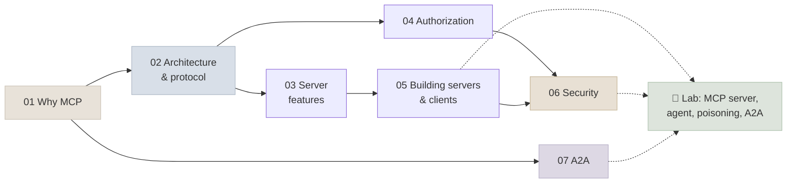

# 14 - MCP & A2A

The two open protocols that connect agents to the world. The **Model Context Protocol (MCP)** standardises how AI applications discover and use tools, data and prompts from any provider; **Agent2Agent (A2A)** standardises how one agent delegates tasks to another. This module teaches both at their current versions - MCP **2026-07-28** (the stateless revision) and A2A **v1.0** - from the wire format to authorization, security and working code.

```objectives
scope: module
time: 8-10 hours (notes + lab)
outcomes:
  - Explain what MCP and A2A standardise, how they differ from function calling and from each other, and when each is the right tool
  - Read and write MCP messages under the stateless 2026-07-28 protocol, including multi round-trip requests and elicitation
  - Build, test and deploy an MCP server and connect its tools to an agent loop
  - Secure MCP deployments - OAuth 2.1 resource servers, audience-bound tokens, least-privilege scopes - and defend against tool poisoning, rug pulls and prompt injection
  - Publish an agent over A2A and follow its tasks from a client agent
prerequisites:
  - "[Agent Foundations](../13-Agent-Foundations/INDEX.mdx) - the agent loop and tool use"
  - "Basic HTTP, JSON and OAuth concepts"
```

## Where This Module Fits



## Chapter Map

| # | Chapter | You will learn | Time |
|---|---|---|---|
| 1 | [Why MCP](Notes/01-Why-MCP.mdx) | The M×N problem, hosts/clients/servers, tools/resources/prompts, MCP vs function calling vs A2A, governance and versions | 35 min |
| 2 | [Architecture & Protocol](Notes/02-Architecture-and-Protocol.mdx) | JSON-RPC, the stateless 2026-07-28 core, stdio and Streamable HTTP, multi round-trip requests, caching, extensions, compatibility | 60 min |
| 3 | [Server Features](Notes/03-Server-Features.mdx) | Tools, annotations, structured output, handles, resources, prompts, elicitation; deprecated roots/sampling/logging | 55 min |
| 4 | [Authorization](Notes/04-Authorization.mdx) | OAuth 2.1 flow, RFC 9728/8707/9207, Client ID Metadata Documents, scopes and step-up, no token passthrough | 50 min |
| 5 | [Building Servers & Clients](Notes/05-Building-Servers-and-Clients.mdx) | Python SDK v2, FastMCP, Inspector, connecting tools to agents, hosted connectors, deployment | 55 min |
| 6 | [MCP Security](Notes/06-MCP-Security.mdx) | Tool poisoning, rug pulls, shadowing, prompt injection, the lethal trifecta, supply chain, defences | 50 min |
| 7 | [The A2A Protocol](Notes/07-A2A-Protocol.mdx) | Agent Cards, tasks and states, update delivery, bindings, security, A2A in code | 45 min |
| 8 | [Q&A Review Bank](Notes/08-Interview-QA-Bank.mdx) | 41 questions across the module | 50 min |

## Code Lab

| Lab | What you build | Runs on |
|---|---|---|
| [MCP Server & Agent](CodeLabs/01-MCP-Server-and-Agent.mdx) | The Lab 13 shop as an MCP server (stdio and HTTP); a client tour of every feature; an agent using its tools; a measured tool-poisoning attack and a harness guard; the agent published over A2A | Laptop; a local OpenAI-compatible model (or any hosted API) for the agent parts |

## Mini-Project

Expose **a real system you use** (a ticket tracker, a wiki, a database) as an MCP server and put an agent on it:

1. 4-8 task-shaped tools with strict schemas, honest annotations and structured output; one resource and one prompt.
2. Elicitation (form mode) before every destructive action; URL mode if a secret or third-party authorization is needed.
3. Streamable HTTP deployment with OAuth as a resource server (a local Keycloak or your identity provider), least-privilege scopes and a scope-filtered tool list.
4. An evaluation of an agent using the server (20+ tasks, state-based checks) and a security test: a poisoned description and an injected instruction inside data the tools return - with your defence and before/after attack success rates.
5. A short threat model covering the lethal trifecta for your server.

## Review

- [Q&A Review Bank](Notes/08-Interview-QA-Bank.mdx) - consolidated questions for this module
- [Module quiz](/quiz/mcp) - every *Check Yourself* question in this module, in course order

---

Previous: [13 - Agent Foundations](../13-Agent-Foundations/INDEX.mdx) · Next: [15 - Agent Patterns & Multi-Agent](../15-Agent-Patterns/INDEX.mdx)

## Section Appendix

[Summary & Key Terms](APPENDIX.mdx) - a quick recap of this section and its essential vocabulary.
