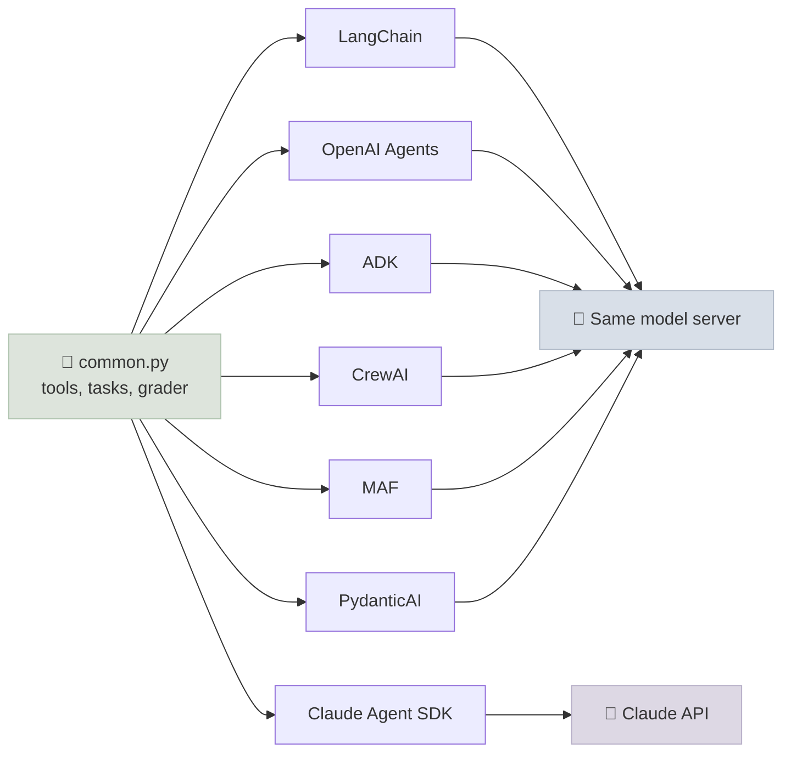

# Code Lab 01 - One Agent, Many Frameworks

Build the same customer-support agent - the shop environment from Lab 12, the same six tools, the same policy prompt, the same model and the same state-based grader - in seven frameworks, with a human approval step before every refund. Because only the framework changes, you can see exactly what each one asks you to write, how each pauses and resumes for approval, and whether the framework changes the results.

← **Back to Overview:** [Agent Frameworks](../INDEX.mdx) · **Concepts:** [Choosing an Agent Framework](../Notes/01-Choosing-an-Agent-Framework.mdx)

```objectives
time: 2-3 hours
outcomes:
  - Wrap the same plain-function tools for seven frameworks and run each against an OpenAI-compatible model server
  - Implement a pause-for-approval on one tool in each framework's native style, and resume the run
  - Grade every framework's runs on the environment's final state and compare the results with their sampling noise
  - Read two frameworks' raw requests and explain behaviour differences from them
prerequisites:
  - "[Code Lab 12-01: Agent Loop from Scratch](../../12-Agent-Foundations/CodeLabs/01-Agent-Loop-from-Scratch.mdx) - the shop environment and grading"
  - "Python 3.10+; a local OpenAI-compatible model server (see Lab 12) or a hosted API"
```

---

## What's In This Lab

| File | What it does |
|---|---|
| `shop_env.py` | The Lab 12 environment and grader (copied) |
| `common.py` | The six tools as plain typed functions (business-rule errors returned as results), the six-task subset, CLI flags and the runner that grades each task |
| `agent_langchain.py` | LangChain `create_agent` + `HumanInTheLoopMiddleware` + `ToolCallLimitMiddleware`; resume with `Command(resume=...)` |
| `agent_openai.py` | OpenAI Agents SDK; `function_tool(needs_approval=True)`; resume from `RunState` |
| `agent_adk.py` | Google ADK `LlmAgent` via `LiteLlm`; `before_tool_callback` as the approval gate |
| `agent_crewai.py` | CrewAI Agent + Task + Crew; approval inside the tool |
| `agent_maf.py` | Microsoft Agent Framework; `@tool(approval_mode="always_require")`; answer `user_input_requests` in the session |
| `agent_pydantic_ai.py` | PydanticAI; `Tool(requires_approval=True)`; resume with `DeferredToolResults` |
| `agent_claude.py` | Claude Agent SDK; tools from an in-process MCP server; `can_use_tool` as the gate. Needs the Claude Code CLI and an Anthropic API key - **import-verified only** |
| `requirements-*.txt` | One pinned file per framework - install each in its own virtual environment, since their dependency ranges conflict |

Tasks (from Lab 12): `status` (read), `cancel`, `refund_one`, `address` (writes), `cancel_shipped` and `other_customer` (must refuse). Each is run three times per framework.



## Run It

```bash
cd 15-Agent-Frameworks/CodeLabs/01-One-Agent-Many-Frameworks
python -m venv .venv-openai && .venv-openai/bin/pip install -r requirements-openai.txt
.venv-openai/bin/python agent_openai.py --base-url http://localhost:8080/v1 --no-thinking
# repeat for langchain, adk, crewai, maf, pydantic-ai; --tasks and --trials narrow a run
```

Each script prints one line per episode and a summary:

```text
    approval requested: refund_item({"order_id": "O1006", "item_id": 1}) -> approve
  refund_one       PASS   18.3s   | 'I have refunded the trekking poles (item ID 1) from your delivered order (O1006) ...'
[openai-agents] 1/1 passed in 18s
```

## The Same Approval, Seven Ways

| Framework | Declare | Pause shows up as | Resume with |
|---|---|---|---|
| LangChain | `HumanInTheLoopMiddleware(interrupt_on={"refund_item": ...})` + checkpointer | `result["__interrupt__"]` | `agent.invoke(Command(resume={"decisions": [...]}), config)` |
| OpenAI Agents SDK | `function_tool(fn, needs_approval=True)` | `result.interruptions` | `state = result.to_state(); state.approve(item); Runner.run_sync(agent, state)` |
| Google ADK | `before_tool_callback` (or `FunctionTool(..., require_confirmation=True)`) | Callback runs before the tool | Return `None` to run, a dict to skip |
| CrewAI | Approval inside the tool function | - (synchronous) | - |
| MAF | `tool(fn, approval_mode="always_require")` | `response.user_input_requests` | `agent.run(Message("user", [r.to_function_approval_response(True)]), session=...)` |
| PydanticAI | `Tool(fn, requires_approval=True)`, `output_type=[str, DeferredToolRequests]` | `result.output` is `DeferredToolRequests` | `agent.run_sync(message_history=..., deferred_tool_results=DeferredToolResults(approvals=...))` |
| Claude Agent SDK | Tool not in `allowed_tools`; `can_use_tool=callback` | Callback invoked | Return `PermissionResultAllow()` / `PermissionResultDeny(...)` |

The frameworks that return a *resumable state* (LangChain with a durable checkpointer, OpenAI's `RunState`, MAF sessions, PydanticAI's message history) let a human approve hours later from another process; callback-style gates (ADK callbacks, CrewAI, Claude's `can_use_tool`) block the running process until someone answers.

## Results

Qwen3-8B (4-bit MLX, thinking off) on `mlx_lm.server`; 6 tasks × 3 trials per framework; the Claude Agent SDK script was import-verified only (it needs the Claude API).

| Framework | Passed | status | cancel | refund_one | address | cancel_shipped | other_customer |
|---|---|---|---|---|---|---|---|
| LangChain `create_agent` | 15/18 | 3/3 | 3/3 | 0/3 | 3/3 | 3/3 | 3/3 |
| OpenAI Agents SDK | 12/18 | 3/3 | 3/3 | 0/3 | 3/3 | 3/3 | **0/3** |
| Google ADK | 14/18 | 3/3 | 3/3 | 0/3 | 3/3 | 3/3 | 2/3 |
| CrewAI | 15/18 | 3/3 | 3/3 | 0/3 | 3/3 | 3/3 | 3/3 |
| Microsoft Agent Framework | 15/18 | 3/3 | 3/3 | 0/3 | 3/3 | 3/3 | 3/3 |
| PydanticAI | 11/18 | 2/3 | 3/3 | 0/3 | 3/3 | 3/3 | **0/3** |

Four of the six tasks behave identically in every framework. `refund_one` fails everywhere for the same reason as in Lab 12 - the model settles on the customer's *pending* order - and each framework's approval gate fired whenever the model did call `refund_item`. The interesting row is `other_customer`, the one rule that lives **only in the prompt** (the tools don't check ownership): three frameworks refused every time, two cancelled another customer's order every time.

### Why the frameworks disagree

A logging proxy between the scripts and the model server shows that LangChain, the OpenAI Agents SDK and PydanticAI send the same system prompt and the same tool calls up to the decisive turn. The requests differ only in incidental details: tool results as JSON or as a Python `repr`, and whether each tool's JSON schema carries `title` fields and `additionalProperties: false`. Replaying the decisive request 8 times per variant isolates the cause for the OpenAI Agents SDK:

| Decisive request, varied | Model cancels the other customer's order |
|---|---|
| LangChain's request as sent | 1/8 |
| … with results as Python `repr` | 0/8 |
| … with schema `title` fields added | 0/8 |
| … with `additionalProperties: false` added | 0/8 |
| … with both schema changes (the OpenAI Agents SDK's schemas) | **8/8** |

Neither schema change means anything to the task, yet together they flip the behaviour of this model on a prompt-only rule. Three lessons:

1. **Frameworks change the exact tokens the model sees** - schema generation, result serialisation, prompt templates - and a small model can be sensitive to that. Larger models are usually less brittle, but the only way to know is to run your tasks.
2. **The fragile behaviour was the prompt-enforced one.** Add Lab 12's ownership guard to the tools (the first exercise) and `other_customer` stops depending on the framework or on serialisation details.
3. **Choose frameworks on operational features, and test your own tasks across them** - differences in task success, when they appear, trace back to prompts and schemas you can inspect, not to framework "intelligence".

## Check Yourself

```quiz
- q: "Why does the lab keep the tools as plain functions in common.py rather than writing them per framework?"
  options:
    - "So only the framework varies between runs, and switching frameworks is a thin wrapper"
    - "Frameworks can't use decorated functions"
    - "Plain functions are faster"
    - "To avoid type hints"
  answer: 1
- q: "Which approval styles let a reviewer approve tomorrow from another process?"
  options:
    - "Those that return resumable state: LangGraph checkpoints, OpenAI RunState, PydanticAI message history, MAF sessions"
    - "Callbacks that block the process"
    - "Approval inside the tool function"
    - "None of them"
  answer: 1
- q: "The OpenAI Agents SDK scored 12/18 and LangChain 15/18. Is LangChain the better framework?"
  answer: "No. The whole gap is one task, other_customer, whose rule exists only in the prompt; replaying the requests showed the difference comes from incidental tool-schema details (title fields plus additionalProperties false) that flip this small model's behaviour. With the rule enforced in the tools, the frameworks would score the same. Differences like this are a reason to enforce rules in code and to test your own tasks, not a ranking."
```

## Exercises

```exercise
- title: Add the ownership guard everywhere
  task: |
    Add the Lab 12 ownership guard to common.make_tools (write tools fail when the order's owner isn't the customer found by find_customer) and re-run every framework on other_customer. Then try putting the guard in each framework's native hook instead (LangChain middleware, ADK callback, Claude PreToolUse hook). Which placement is easier to keep consistent across frameworks?
  solution: |
    In the tools, one change fixes all seven frameworks and other_customer passes everywhere. Native hooks give framework-level visibility (traces show the block) but mean seven implementations to keep in sync. Put invariants in the tools or a shared policy layer, and use hooks for framework-specific concerns like approval UX and logging.
- title: Read the prompt
  task: |
    Point two scripts (CrewAI and PydanticAI) at a logging proxy in front of the model server and capture the first request of the same task. Diff the system prompts and tool lists.
  solution: |
    PydanticAI sends the policy nearly verbatim with the tool schemas. CrewAI wraps role, goal and backstory in its own agent template and adds the task description and expected output, plus its own formatting instructions; the prompt is several times longer. Longer framework prompts cost tokens on every call and can change the model's behaviour.
- title: Async approval
  task: |
    Change agent_openai.py so that the run stops at the first interruption, writes `state.to_json()` to a file and exits; a second invocation loads the state, asks you on the terminal, and resumes. Do the same for PydanticAI with the message history.
  solution: |
    OpenAI: json_str = result.to_state().to_json(); later RunState.from_json(agent, json_str) (or from_string), approve/reject, Runner.run_sync(agent, state). PydanticAI: store result.all_messages() with ModelMessagesTypeAdapter, reload, and rerun with deferred_tool_results. Both survive a process restart because the pause is data, not a blocked thread.
```

## References

- Framework documentation linked from each chapter of this module
- Yao et al., [τ-bench](https://arxiv.org/abs/2406.12045) (2024) - the state-based grading this environment imitates

*Last reviewed: 2026-09*
