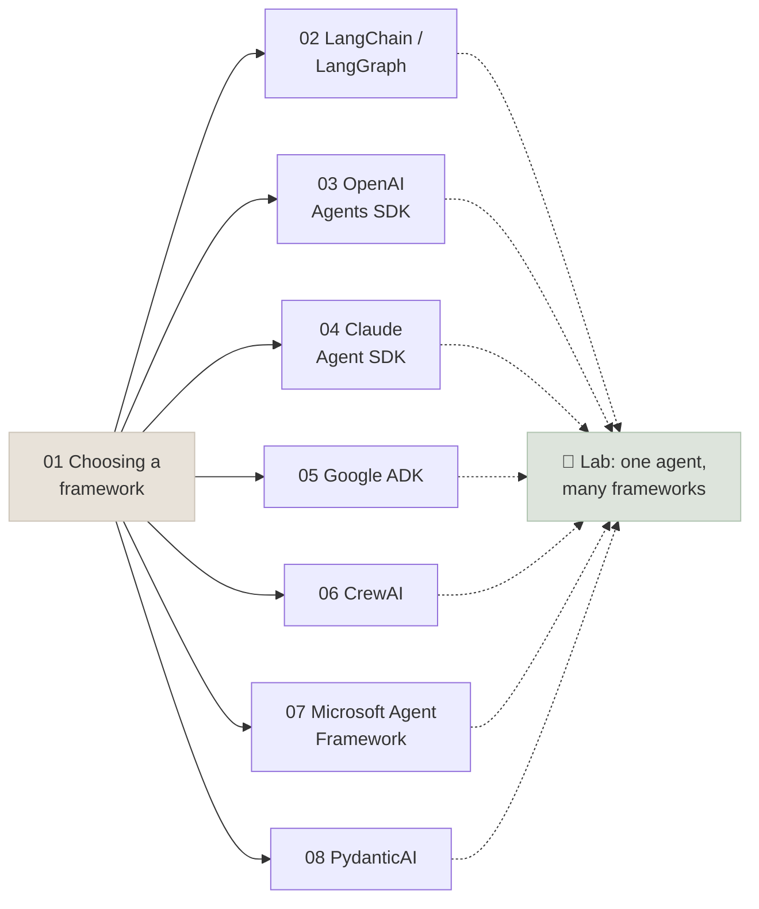

# 15 - Agent Frameworks

Frameworks package the agent loop, tool schemas, state, approvals, multi-agent wiring and tracing so you don't rebuild them for every project - and they hide those mechanics, which is why this module comes after you built the loop by hand. You learn what each major framework is built around, how to choose one (or none), and build the same agent in seven of them.

```objectives
scope: module
time: 8-10 hours (notes + lab)
outcomes:
  - Explain what an agent framework adds to a raw model API loop and what it hides, and place frameworks on the layer map
  - Compare LangChain/LangGraph, OpenAI Agents SDK, Claude Agent SDK, Google ADK, CrewAI, Microsoft Agent Framework and PydanticAI by abstraction, state, human-in-the-loop, durability and model neutrality
  - Implement human approval and resumable runs in each framework's native style
  - Choose a framework for a project with a written rationale backed by measurements
prerequisites:
  - "[Agent Foundations](../12-Agent-Foundations/INDEX.mdx) - the loop, tools, evaluation"
  - "[Agent Patterns & Multi-Agent](../14-Agent-Patterns/INDEX.mdx) - the patterns frameworks implement"
  - "Python 3.10+; a local OpenAI-compatible model server or a hosted API"
```

## Where This Module Fits



Chapters 2-8 are independent: read chapter 1, then the frameworks you are considering. Running agents in production - durable execution, security, observability, cost - is [Production Agents](../16-Production-Agents/INDEX.mdx).

## Chapter Map

| # | Chapter | You will learn | Time |
|---|---|---|---|
| 1 | [Choosing an Agent Framework](Notes/01-Choosing-an-Agent-Framework.mdx) | What frameworks add and hide, the layer map, comparison, decision guide, when to use none | 45 min |
| 2 | [LangChain and LangGraph](Notes/02-LangChain-and-LangGraph.mdx) | `create_agent` and middleware; state graphs, checkpoints, `interrupt()`/`Command`, Store | 50 min |
| 3 | [OpenAI Agents SDK](Notes/03-OpenAI-Agents-SDK.mdx) | Agents, handoffs, guardrails, sessions, approvals with `RunState`, tracing | 40 min |
| 4 | [Claude Agent SDK](Notes/04-Claude-Agent-SDK.mdx) | The Claude Code harness as a library: built-in tools, permissions, hooks, subagents, skills | 40 min |
| 5 | [Google ADK](Notes/05-Google-ADK.mdx) | `LlmAgent`, Runner and sessions, graph Workflows, callbacks, confirmation, deploy | 45 min |
| 6 | [CrewAI](Notes/06-CrewAI.mdx) | Crews of role-playing agents, processes, Flows with typed state | 40 min |
| 7 | [Microsoft Agent Framework](Notes/07-Microsoft-Agent-Framework.mdx) | Agents, graph workflows with checkpoints, orchestrations, migration from AutoGen/Semantic Kernel | 40 min |
| 8 | [PydanticAI](Notes/08-PydanticAI.mdx) | Typed agents, dependency injection, deferred tools, testing, durable execution | 35 min |
| 9 | [Q&A Review Bank](Notes/09-Interview-QA-Bank.mdx) | 31 questions across the module | 45 min |

## Code Lab

| Lab | What you build | Runs on |
|---|---|---|
| [One Agent, Many Frameworks](CodeLabs/01-One-Agent-Many-Frameworks.mdx) | The Lab 12 shop agent with a refund approval step in LangChain, OpenAI Agents SDK, ADK, CrewAI, MAF and PydanticAI (graded on state), plus a Claude Agent SDK version | A local OpenAI-compatible model (laptop) or any hosted API; Claude Agent SDK needs an Anthropic key |

## Mini-Project

Choose a framework for a real agent at your work, **with evidence**:

1. A task set of 20+ inputs with state-based or rubric checks.
2. Two candidate frameworks, the tools shared as plain functions, one approval step in each.
3. Task success (with confidence intervals), tokens, latency and lines of framework-specific code for each.
4. A one-page decision covering deployment, durability, observability, lock-in and upgrade risk - not just the numbers.

## Review

- [Q&A Review Bank](Notes/09-Interview-QA-Bank.mdx) - consolidated questions for this module
- [Knowledge Check: Agents](../Interview-Questions/09-Agents.mdx) - short-form review

---

Previous: [14 - Agent Patterns & Multi-Agent](../14-Agent-Patterns/INDEX.mdx) · Next: [16 - Production Agents](../16-Production-Agents/INDEX.mdx)
