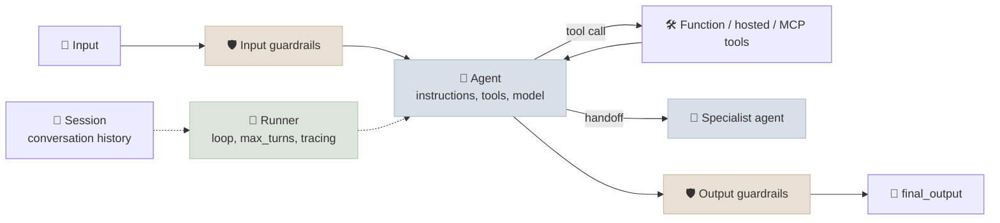

# OpenAI Agents SDK

The OpenAI Agents SDK is a small, Python-first agent library with a handful of primitives - **agents**, **tools**, **handoffs**, **guardrails**, **sessions** - and a `Runner` that runs the loop, with tracing built in. It is the production successor to OpenAI's experimental Swarm, released in March 2025 alongside the Responses API.

```objectives
time: 40 min
outcomes:
  - Build an agent with function tools and run it with Runner, synchronously or asynchronously
  - Compose agents with handoffs and agents-as-tools, and explain the difference
  - Add input and output guardrails, tool approvals with resumable RunState, and sessions
  - Run the SDK against a non-OpenAI model and know what you lose
prerequisites:
  - "[Choosing an Agent Framework](01-Choosing-an-Agent-Framework.mdx)"
  - "[Tool Use](../../12-Agent-Foundations/Notes/04-Tool-Use-and-Function-Calling.mdx)"
```

## Primitives



| Primitive | What it is |
|---|---|
| `Agent` | Instructions, tools, handoffs, guardrails, optional `output_type` (a Pydantic model for structured output), model and `ModelSettings` |
| `function_tool` | A decorator turning a typed Python function into a tool; the schema comes from type hints and the docstring, strict by default |
| Hosted tools | `WebSearchTool`, `FileSearchTool`, code interpreter, `HostedMCPTool` - run by OpenAI with the Responses API |
| MCP | `MCPServerStdio`, `MCPServerStreamableHttp` to use any MCP server's tools |
| Handoff | Transfer the conversation to another agent, which then owns the reply |
| Guardrails | Input guardrails run on the user input (in parallel with the agent by default); output guardrails check the final output; a tripwire raises an exception |
| `Runner` | `run` (async), `run_sync`, `run_streamed`; `max_turns` bounds the loop |
| Session | Stores history across runs: `SQLiteSession`, Redis, `OpenAIConversationsSession` |

## An Agent with Handoffs, a Guardrail and an Approval

```python
from pydantic import BaseModel
from agents import (Agent, GuardrailFunctionOutput, Runner, SQLiteSession, function_tool,
                    input_guardrail)

@function_tool(needs_approval=True)
def refund_item(order_id: str, item_id: int) -> dict:
    """Refund one line item of a delivered order."""
    ...

class Topic(BaseModel):
    off_topic: bool

classifier = Agent(name="classifier", instructions="Is this message unrelated to orders?",
                   output_type=Topic)

@input_guardrail
async def on_topic(ctx, agent, user_input):
    result = await Runner.run(classifier, user_input, context=ctx.context)
    return GuardrailFunctionOutput(output_info=result.final_output,
                                   tripwire_triggered=result.final_output.off_topic)

billing = Agent(name="billing", instructions="Handle refunds.", tools=[refund_item])
triage = Agent(name="triage", instructions="Route the customer to the right specialist.",
               handoffs=[billing], input_guardrails=[on_topic])

session = SQLiteSession("customer-42", "conversations.db")
result = Runner.run_sync(triage, "Refund the trekking poles on O1006, please.", session=session)
while result.interruptions:                      # refund_item paused for approval
    state = result.to_state()                    # serialisable: state.to_json() survives a restart
    for item in result.interruptions:
        state.approve(item)                      # or state.reject(item)
    result = Runner.run_sync(triage, state, session=session)
print(result.final_output, result.last_agent.name)
```

**Handoffs vs agents as tools.** A handoff passes control: the specialist sees the conversation and answers the user directly (`result.last_agent` tells you who finished). `agent.as_tool(...)` keeps control with the caller: the specialist runs on a generated input and returns a result the caller uses. Use handoffs for triage into departments; agents-as-tools for an orchestrator that combines specialists' outputs (the manager pattern from [Multi-Agent Architectures](../../14-Agent-Patterns/Notes/03-Multi-Agent-Architectures.mdx)).

**Approvals.** `needs_approval` accepts `True` or an async function of the call's arguments, so you can require approval only above an amount. The run stops with `result.interruptions`; `to_state()` gives a `RunState` you can serialise, store and resume later - a human can approve tomorrow.

## Tracing

Every run records a trace: spans for agent runs, model calls, tool calls, handoffs and guardrails. By default traces are uploaded to the OpenAI dashboard; add processors to export them elsewhere (many observability vendors integrate), or call `set_tracing_disabled(True)` - the lab does, because it runs against a local server. Traces are the first thing to open when an agent misbehaves.

## Other Models

The SDK defaults to the OpenAI Responses API. To use any OpenAI-compatible server (vLLM, `mlx_lm.server`, Ollama) wrap an `AsyncOpenAI` client in `OpenAIChatCompletionsModel`, as the lab does; a LiteLLM extension covers other providers. Hosted tools (web search, file search, hosted MCP) and some tracing detail depend on the Responses API, so they don't work through Chat Completions models.

## When to Use It

Good fit: OpenAI-centred stacks; triage-and-specialist designs; teams that want few concepts and built-in tracing. Less good: long-running processes with explicit branching and multi-day waits (combine with a durable-execution engine, or use a graph runtime), or teams that must stay model-neutral and want hosted tools.

## Check Yourself

```quiz
- q: "The triage agent hands off to billing. Who writes the reply the user sees?"
  options:
    - "The billing agent"
    - "The triage agent, using billing's output"
    - "Both, concatenated"
    - "The Runner"
  answer: 1
  explain: "A handoff transfers the conversation; the receiving agent answers. With agent.as_tool the caller keeps control and composes the reply."
- q: "How does a run requiring approval survive a process restart?"
  options:
    - "result.to_state() gives a RunState that can be serialised (to_json) and resumed later"
    - "The Runner blocks until approval arrives"
    - "The session stores the pending tool call automatically"
    - "It can't"
  answer: 1
- q: "Why does the lab call set_tracing_disabled(True)?"
  options:
    - "Traces upload to the OpenAI dashboard by default, which fails without an OpenAI key"
    - "Tracing changes the model's output"
    - "Tracing is incompatible with approvals"
    - "Tracing doubles token cost"
  answer: 1
- q: "An input guardrail classifies every message with a second model call. What does it cost, and how does the SDK hide the latency?"
  answer: "An extra model call per input. Input guardrails run concurrently with the agent by default, and a tripwire cancels the run if it fires; you pay the tokens either way."
```

## Exercises

```exercise
- title: Approval above a threshold
  task: |
    In the lab's agent_openai.py, replace needs_approval=True with an async function that requires approval only when the refunded item is worth more than 50.00. Log which refunds were approved automatically.
  hints: ["The function receives (run_context, args_dict, call_id)", "Look the item up in the shop to get its price"]
  solution: |
    async def over_50(ctx, args, call_id): order = shop.get_order(args["order_id"]); item = next(i for i in order["items"] if i["item_id"] == args["item_id"]); return item["qty"] * item["unit_price"] > 50. Pass needs_approval=over_50 for refund_item. Small refunds run straight through; large ones appear in result.interruptions.
- title: Split into triage and specialists
  task: |
    Rebuild the shop agent as a triage agent with handoffs to an orders agent (status, cancel, address) and a refunds agent (refund_item). Run the lab's six tasks three times each and compare with the single agent. Did the split help?
  solution: |
    Typically not on tasks this small: the handoff adds a turn and a chance to route wrongly, and each specialist sees fewer tools but the same difficulty. Report task success and tokens per task; the single agent usually matches or beats the split, consistent with the evidence in Module 14.
```

## Study Notes

- Primitives: Agent, function tools (+ hosted and MCP tools), handoffs, guardrails, sessions, Runner, tracing
- Handoff = transfer control; `as_tool` = call and return
- `needs_approval` -> `result.interruptions` -> `to_state()` -> `approve/reject` -> resume (serialisable)
- Tracing on by default to the OpenAI dashboard; disable or re-route for other backends
- Non-OpenAI models via `OpenAIChatCompletionsModel` or LiteLLM; hosted tools need the Responses API

## References

- OpenAI, [New tools for building agents](https://openai.com/index/new-tools-for-building-agents/) (Mar 2025)
- [OpenAI Agents SDK documentation](https://openai.github.io/openai-agents-python/) - agents, handoffs, guardrails, human-in-the-loop, tracing (2026)

*Last reviewed: 2026-09*
