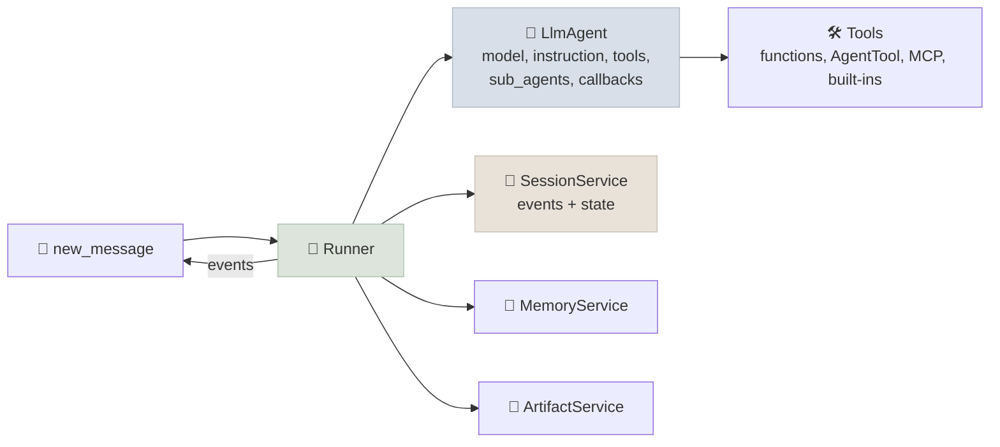

# Google Agent Development Kit (ADK)

Google's Agent Development Kit is an open-source framework for building agents and multi-agent systems, optimised for Gemini and Google Cloud but usable with other models through LiteLLM. Its pieces are **LLM agents** with tools, **graph workflows** for deterministic orchestration, a **Runner** with pluggable session, memory and artifact services, **callbacks** for control, and tooling for local testing, evaluation and deployment. ADK was released at Google Cloud Next in April 2025; version 2 added graph workflows.

```objectives
time: 45 min
outcomes:
  - Build an LlmAgent with function tools and run it with a Runner and a session service
  - Compose agents with sub-agents (LLM-driven transfer), AgentTool and graph Workflows (code-driven)
  - Control agents with callbacks and tool confirmation, and pass data through session state
  - Test, evaluate and deploy an ADK agent with the adk CLI
prerequisites:
  - "[Choosing an Agent Framework](01-Choosing-an-Agent-Framework.mdx)"
```

## Agents, Runner, Sessions



The lab's agent (tools are plain functions; ADK builds schemas from signatures and docstrings):

```python
from google.adk.agents import LlmAgent
from google.adk.runners import InMemoryRunner
from google.genai import types

agent = LlmAgent(name="shop_support", model="gemini-2.5-flash", instruction=POLICY,
                 tools=[find_customer, list_orders, get_order, cancel_order, update_address, refund_item])

runner = InMemoryRunner(agent=agent, app_name="shop")
session = await runner.session_service.create_session(app_name="shop", user_id="customer")
async for event in runner.run_async(user_id="customer", session_id=session.id,
                                    new_message=types.Content(role="user", parts=[types.Part(text=request)])):
    if event.is_final_response():
        print(event.content.parts[0].text)
```

The Runner streams **events** - model responses, tool calls, tool results, state changes - and appends them to the session. `InMemoryRunner` bundles in-memory services; in production use `Runner` with `DatabaseSessionService` or the Agent Platform session service (`VertexAiSessionService` - the class keeps the Vertex name). For a non-Gemini model pass `LiteLlm(model="openai/...")`, as the lab does.

**State.** `session.state` is a key-value store shared by everything in a session. An agent's `output_key` saves its final answer into state, and `{key}` placeholders in instructions read from it. Prefixes scope keys: none (this session), `user:` (all of a user's sessions), `app:` (all users), `temp:` (this invocation only).

## Multi-Agent Composition

| Mechanism | Who decides the next step | Use for |
|---|---|---|
| `sub_agents=[...]` on an `LlmAgent` | The model, by transferring to a sub-agent (by its `description`) | Triage into specialists that then talk to the user |
| `AgentTool(agent=...)` | The model, calling the agent like a tool and getting its result back | An orchestrator that combines specialists' outputs |
| `Workflow` (ADK 2) | Your code: a graph of nodes and edges, with routes, fan-out and joins | Fixed pipelines, branching, loops, parallel steps |
| A2A (`RemoteA2aAgent`, `to_a2a`) | Across processes and teams | Agents owned by other teams ([A2A](../../13-MCP-and-A2A/Notes/07-A2A-Protocol.mdx)) |

ADK 2 deprecates the older workflow agents (`SequentialAgent`, `ParallelAgent`, `LoopAgent`) in favour of `Workflow`, a graph whose nodes can be functions, agents or tools. A node returns an `Event` that can update state and choose a route:

```python
from google.adk.events import Event
from google.adk.workflow import START, Workflow

def assess(node_input: types.Content) -> Event:
    amount = float(node_input.parts[0].text.split()[-1])
    return Event(state={"amount": amount}, route="review" if amount > 100 else "auto")

def auto_approve(amount: float) -> str:          # parameters are bound from state by name
    return f"auto-approved {amount}"

def needs_review(amount: float) -> str:
    return f"sent {amount} to a reviewer"

refund_flow = Workflow(name="refund_flow", edges=[
    (START, assess, {"review": needs_review, "auto": auto_approve}),   # chain with a routing map
])
runner = InMemoryRunner(node=refund_flow, app_name="demo")
# "refund 120" -> "sent 120.0 to a reviewer"   (verified with google-adk 2.10)
```

Edges are tuples forming chains; a tuple of nodes fans out, a dict maps routes to nodes, and join nodes wait for parallel branches. Graphs support retries and timeouts per node. At the time of writing a `Workflow` cannot itself be an `LlmAgent` sub-agent; wrap LLM-driven delegation around it with `AgentTool` or run it at the top level.

## Control: Callbacks and Confirmation

Callbacks run before and after the agent, each model call and each tool call (`before_tool_callback`, `after_model_callback`, and so on). Returning a value from a `before_*` callback **replaces** the step - a dict from `before_tool_callback` is used as the tool's result without running it - which makes callbacks the place for guards:

```python
def ownership_guard(tool, args, tool_context):
    if tool.name in {"cancel_order", "update_address", "refund_item"}:
        owner = shop.db[args["order_id"]]["customer_id"]
        if owner != tool_context.state.get("customer_id"):
            return {"ok": False, "error": "Blocked: order belongs to another customer."}
    return None                                     # run the tool

agent = LlmAgent(..., before_tool_callback=ownership_guard)
```

For human approval, wrap a tool as `FunctionTool(refund_item, require_confirmation=True)` (or pass a function deciding per call): the run emits a confirmation request event, and resumes when the client sends back the user's decision. Plugins apply callbacks across every agent in an app (logging, policy, caching).

## Test, Evaluate, Deploy

- `adk web` - local dev UI with an event trace for each run; `adk run` - terminal; `adk api_server` - a FastAPI server.
- `adk eval` - run eval sets that check the final response and the **tool trajectory** against expected calls; `adk optimize` tunes an agent's instructions with GEPA.
- `adk deploy agent_engine | cloud_run | gke` - deploy to Agent Runtime (the managed runtime in Google Cloud's Gemini Enterprise Agent Platform, formerly Vertex AI Agent Engine - the CLI keeps the old name), Cloud Run or GKE. Agent Runtime adds managed sessions, Memory Bank and observability.

## Check Yourself

```quiz
- q: "A support agent should let the model pick a specialist who then talks to the user directly. Which mechanism?"
  options:
    - "sub_agents on the LlmAgent (transfer)"
    - "AgentTool"
    - "A Workflow"
    - "A callback"
  answer: 1
- q: "What happens when before_tool_callback returns a dict?"
  options:
    - "The tool is skipped and the dict is used as its result"
    - "The dict is merged into the tool's arguments"
    - "The run stops with an error"
    - "The dict is stored in session state"
  answer: 1
- q: "Which state key prefix persists across all sessions of the same user?"
  options: ["user:", "app:", "temp:", "no prefix"]
  answer: 1
- q: "Why does ADK 2 deprecate SequentialAgent and LoopAgent?"
  answer: "Graph Workflows express the same fixed pipelines and loops plus routing, fan-out, joins, retries and timeouts in one model, with function, agent and tool nodes - so the special-purpose workflow agents are redundant."
```

## Exercises

```exercise
- title: Guard with state
  task: |
    Extend the lab's agent_adk.py: an after_tool_callback on find_customer stores customer_id in tool_context.state, and the ownership_guard above blocks write tools on other customers' orders. Run the other_customer task five times with and without the guard.
  solution: |
    after_tool_callback(tool, args, tool_context, tool_response): if tool.name == "find_customer" and "customer_id" in tool_response: tool_context.state["customer_id"] = tool_response["customer_id"]. With the guard the task passes every time, because refusing the other customer's order no longer depends on the model following the policy prompt.
- title: A review loop as a graph
  task: |
    Build a Workflow that drafts a customer reply with an LlmAgent, checks it with a function node (for example: mentions the order id, under 80 words), and routes back to the drafting agent with the failure reason until it passes or three attempts are used.
  solution: |
    Nodes: draft (LlmAgent with output_key="draft"), check (function returning Event(state={"attempts": n+1, "feedback": reason}, route="ok" | "retry" | "give_up")). Edges: (START, draft, check, {"ok": send, "retry": draft, "give_up": escalate}). The check is external feedback, so the loop improves drafts; a model critic alone would add less (Module 14).
```

## Study Notes

- `LlmAgent` + tools; `Runner` streams events; session, memory and artifact services; `InMemoryRunner` for dev
- State with `output_key`, `{key}` templating, `user:`/`app:`/`temp:` prefixes
- Delegation: `sub_agents` (transfer), `AgentTool` (call and return), `Workflow` graphs (code-driven, ADK 2; replaces Sequential/Parallel/Loop agents), A2A
- Callbacks replace steps when they return a value - guards and caching; `require_confirmation` for approvals; plugins for app-wide policy
- `adk web/run/eval/optimize/deploy`; Agent Runtime (formerly Agent Engine) on Agent Platform for managed hosting

## References

- Google, [Agent Development Kit: making it easy to build multi-agent applications](https://developers.googleblog.com/en/agent-development-kit-easy-to-build-multi-agent-applications/) (Apr 2025)
- [ADK documentation](https://google.github.io/adk-docs/) - agents, workflows, callbacks, sessions and state, evaluation, deployment (2026)
- [adk-python](https://github.com/google/adk-python) (2026)

*Last reviewed: 2026-09*
