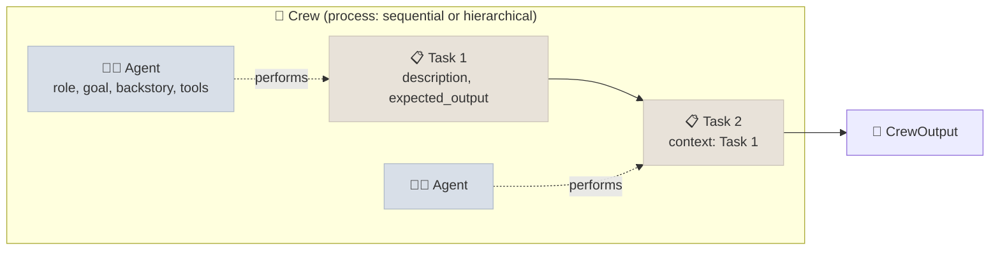

# CrewAI

CrewAI builds multi-agent systems from **role-playing agents** (a role, a goal, a backstory, tools) that work through **tasks** in a **crew**, and - for production control flow - **Flows**: event-driven Python classes with typed state, where each step can be plain code, a single LLM call or a whole crew. It is independent of LangChain and reaches models through LiteLLM.

```objectives
time: 40 min
outcomes:
  - Build a crew of agents and tasks with sequential or hierarchical process
  - Build a Flow with start, listen and router steps over typed state, and persist it
  - Decide when a crew's autonomy helps and when a Flow's explicit control is needed
  - Identify what CrewAI adds to prompts and how that affects tuning and cost
prerequisites:
  - "[Choosing an Agent Framework](01-Choosing-an-Agent-Framework.mdx)"
  - "[Multi-Agent Architectures](../../14-Agent-Patterns/Notes/03-Multi-Agent-Architectures.mdx)"
```

## Crews: Agents, Tasks, Process



The lab's single-agent crew:

```python
from crewai import LLM, Agent, Crew, Task
from crewai.tools import tool

llm = LLM(model="openai/gpt-5-mini", temperature=1.0)       # any LiteLLM model string
tools = [tool(fn.__name__)(fn) for fn in shop_functions]      # the decorator wraps plain functions

agent = Agent(role="Customer support agent", goal="Resolve the customer's request correctly",
              backstory=POLICY, tools=tools, llm=llm, max_iter=20)
task = Task(description=request, expected_output="The reply to send to the customer", agent=agent)
print(Crew(agents=[agent], tasks=[task]).kickoff())
```

- **Tasks** carry a description, an `expected_output`, optional `context` (other tasks whose outputs it needs), `output_pydantic` for structured output, `guardrail` functions that validate the output and retry, and `human_input=True` to ask a person to review the result.
- **Process**: `sequential` runs tasks in order; `hierarchical` adds a manager agent (`manager_llm` or `manager_agent`) that plans, delegates tasks to agents and checks results.
- **Agent options**: `allow_delegation`, `reasoning` (plan before acting), `max_iter`, `max_execution_time`, `max_rpm`, `respect_context_window`.
- **Crew options**: `memory=True` enables short-term, long-term and entity memory; `planning=True` adds a planning step; `cache` caches tool results.

CrewAI turns role, goal, backstory, task description and expected output into its own prompt template. That makes a first version quick to write, and it also means the prompt the model sees is not the one you wrote - log it before tuning.

## Flows: Explicit Control

A crew decides its own path; a Flow is code you control, which is what production processes usually need:

```python
from pydantic import BaseModel
from crewai.flow.flow import Flow, listen, router, start

class RefundState(BaseModel):
    order_id: str = ""
    amount: float = 0.0
    outcome: str = ""

class RefundFlow(Flow[RefundState]):
    @start()
    def load(self):
        self.state.order_id, self.state.amount = "O1001", 120.0

    @router(load)
    def assess(self):
        return "review" if self.state.amount > 100 else "auto"

    @listen("auto")
    def auto_approve(self):
        self.state.outcome = "auto-approved"

    @listen("review")
    def send_to_reviewer(self):
        self.state.outcome = "sent to reviewer"     # a Crew could draft the reviewer's summary here
        return self.state.outcome

flow = RefundFlow()
print(flow.kickoff())                               # sent to reviewer   (verified with crewai 1.15)
```

`@start` marks entry points, `@listen(step_or_route)` runs when a step finishes or a route is emitted, `@router` returns a route label, and `and_(...)`/`or_(...)` combine triggers. State is a Pydantic model (or a dict). `@persist` saves state after each step (SQLite by default) so a flow can resume, and `@human_feedback` pauses a step for a person's input. The recommended structure for a production app is a Flow as the backbone, calling crews only for the steps that genuinely need several collaborating agents.

## When to Use It

| Situation | Choice |
|---|---|
| Content or research pipelines with clearly separable roles | A sequential crew |
| A fixed business process with some LLM steps | A Flow, with single calls or small crews inside steps |
| Tight control over prompts, tokens or latency | A thinner framework, or a Flow with direct LLM calls |
| A single tool-using agent | Any agent SDK - a one-agent crew adds prompt overhead for little benefit |

The evidence in Module 14 applies: role-based crews add tokens and failure modes (MAST's inter-agent misalignment category), so measure a crew against a single strong agent before adopting it.

## Check Yourself

```quiz
- q: "In a hierarchical process, who assigns tasks to agents?"
  options:
    - "A manager agent (from manager_llm or manager_agent)"
    - "The order of the tasks list"
    - "The user"
    - "A router step"
  answer: 1
- q: "In a Flow, what triggers a method decorated with @listen('review')?"
  options:
    - "A @router step returning the label 'review'"
    - "A task named review finishing"
    - "The user typing review"
    - "Any step raising an error"
  answer: 1
- q: "Why log the actual prompt before tuning a CrewAI agent?"
  options:
    - "CrewAI builds its own prompt from role, goal, backstory, task and expected output, so the model sees more than you wrote"
    - "CrewAI encrypts prompts"
    - "The backstory is ignored"
    - "Tools are sent as plain text"
  answer: 1
- q: "Why is a Flow the recommended backbone for a production CrewAI app?"
  answer: "It makes the control flow explicit, testable and persistent (typed state, routes, @persist, human feedback), while crews are used only where autonomous collaboration adds value."
```

## Exercises

```exercise
- title: Persist and resume
  task: |
    Add @persist to RefundFlow and a @human_feedback step for the reviewer. Kill the process during the review and resume the flow with the same state id. Which state survived?
  solution: |
    With @persist the state is written after each method, keyed by the flow's state id (SQLite by default). On restart, kickoff with that id restores order_id, amount and outcome up to the last completed step, and the flow continues from the pending feedback step.
- title: Crew or single agent
  task: |
    Build a two-agent crew (researcher, writer) that answers a product question from a small document set, and a single agent with the same tools. Run 20 questions through both. Compare answer quality (a rubric), tokens and latency.
  solution: |
    Expect the crew to use substantially more tokens (two role prompts, task hand-off text) and more time; quality is usually similar on single-hop questions and can be better on questions needing separate research and writing. Report the numbers with confidence intervals before choosing.
```

## Study Notes

- Crew = agents (role, goal, backstory, tools, llm) + tasks (description, expected_output, context, guardrail, human_input) + process (sequential or hierarchical)
- CrewAI templates your fields into its own prompt: log it before tuning
- Flows: `@start`, `@listen`, `@router`, `and_`/`or_`, typed state, `@persist`, `@human_feedback`
- Production shape: Flow backbone, crews only where collaboration helps; measure against a single agent

## References

- [CrewAI documentation](https://docs.crewai.com/) - agents, tasks, crews, processes, Flows, memory (2026)
- [crewAI on GitHub](https://github.com/crewAIInc/crewAI) (2026)
- Cemri et al., [Why Do Multi-Agent LLM Systems Fail?](https://arxiv.org/abs/2503.13657) (2025)

*Last reviewed: 2026-09*
