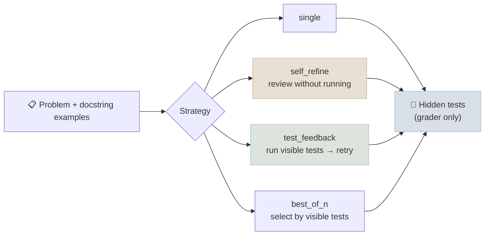

# Code Lab 01 - Patterns Under Measurement

Patterns are claims: "add a reflection step", "retry with feedback", "sample several and pick the best". This lab tests those claims the way you should test them on your own task - same problems, same model, a grader the strategies can't see, repeated per problem with paired confidence intervals - and reports cost alongside quality.

← **Back to Overview:** [Agent Patterns & Multi-Agent](../INDEX.mdx) · **Concepts:** [Workflow Patterns](../Notes/01-Workflow-Patterns.mdx) · [Single-Agent Patterns](../Notes/02-Single-Agent-Patterns.mdx)

```objectives
time: 1.5 hours
outcomes:
  - Implement four strategies - single attempt, self-review, test-feedback loop, best-of-n with a visible-test selector - over any OpenAI-compatible model
  - Grade on hidden tests while strategies use only visible tests, and explain why the separation matters
  - Compare strategies with paired bootstrap confidence intervals and count fixes and breakages
  - Weigh quality gains against tokens and latency, and recognise a ceiling effect
prerequisites:
  - "[Workflow Patterns](../Notes/01-Workflow-Patterns.mdx) - evaluator-optimizer"
  - "Python 3.10+; a local OpenAI-compatible model server (see Lab 13) or a hosted API"
```

---

## What's In This Lab

| Property | Detail |
|---|---|
| Problems | HumanEval problems whose docstrings contain `>>>` examples, minus the few whose own reference solution fails its examples - 68 problems; a seeded sample of 40 by default |
| Visible tests | The docstring examples - information a developer really has, available to every strategy |
| Hidden tests | HumanEval's test suite - used only for grading |
| Strategies | `single` (one attempt); `self_refine` (the model reviews its own code without running it, then revises); `test_feedback` (run the visible tests, feed failures back, up to 2 retries); `best_of_n` (3 samples, keep the first that passes the visible tests) |
| Statistics | Pass rate with a bootstrap CI; for each strategy vs `single`, a **paired** bootstrap CI over problems and counts of problems fixed and broken |
| Files | `01-Patterns-Under-Measurement/{patterns_lab.py, requirements.txt}` |



**Warning:** the lab executes model-generated code in a subprocess with a timeout. Run it in a container or VM if that isn't acceptable.

## Run It

```bash
cd 15-Agent-Patterns/CodeLabs/01-Patterns-Under-Measurement
pip install -r requirements.txt
python patterns_lab.py --no-thinking --limit 5                    # smoke test
python patterns_lab.py --no-thinking                              # 40 problems, all strategies
python patterns_lab.py --no-thinking --strategies single,test_feedback --limit 68    # all 68 eligible problems
```

## Results

Qwen3-8B (4-bit MLX, thinking off) on `mlx_lm.server`, 40 problems, temperature 1.0:

| Strategy | Pass (95% CI) | Paired Δ vs single (95% CI) | Fixed / broke | Model calls | Tokens / problem |
|---|---|---|---|---|---|
| `single` | 0.950 [0.875, 1.000] | - | - | 1.00 | 299 |
| `self_refine` | 0.925 [0.825, 1.000] | −0.025 [−0.100, +0.050] | 1 / 2 | 2.00 | 874 |
| `test_feedback` | 0.975 [0.925, 1.000] | +0.025 [0.000, +0.075] | 1 / 0 | 1.05 | 358 |
| `best_of_n` | 0.975 [0.925, 1.000] | +0.025 [−0.050, +0.125] | 2 / 1 | 3.00 | 884 |

(Wall-clock time isn't comparable across strategies in this run, because other jobs shared the model server during `best_of_n`; tokens and calls are the reliable cost measures.)

What to take from it:

1. **Ceiling effect.** A single attempt already solves 95% of these problems, so no strategy can gain more than two problems. Every confidence interval includes zero or touches it. The honest conclusion from 40 easy problems is "no strategy is clearly better" - and the lab's first lesson is to check headroom before testing a pattern.
2. **Self-review without new information broke more than it fixed** (1 fixed, 2 broken) at 2.9× the tokens. The model re-reading its own code has nothing new to go on and sometimes "fixes" correct code - consistent with Huang et al. (2023).
3. **Test feedback fixed without breaking**, for only 20% more tokens, because it only acts when a visible test fails - and a failure is real information. It is the cheapest strategy that moved in the right direction.
4. **Best-of-n** helped on two problems and hurt one, at 3× the calls. Its selector is the same visible tests; when all three samples pass the visible tests but differ on hidden behaviour, it keeps the first.

To get decisive numbers, raise the difficulty (a harder benchmark, or HumanEval with a smaller model) or the sample size - the exercises do both.

## Check Yourself

```quiz
- q: "Why do strategies use the docstring examples but grading uses HumanEval's hidden tests?"
  options:
    - "So strategies aren't scored on the same checks they optimised against"
    - "The hidden tests are faster"
    - "The docstring examples are wrong"
    - "To use fewer tokens"
  answer: 1
- q: "Why report a paired difference rather than two separate pass rates?"
  options:
    - "Both strategies ran on the same problems, so pairing removes between-problem variance and gives a much tighter interval"
    - "Paired CIs are always positive"
    - "It is required by HumanEval"
    - "It hides ceiling effects"
  answer: 1
- q: "self_refine scored lower than single. Does that prove self-review hurts?"
  answer: "No - the paired CI (−0.10 to +0.05) includes zero. It shows self-review didn't help here and broke two correct solutions, which is consistent with prior evidence, but proving harm needs more problems or harder ones."
- q: "Why did test_feedback cost only 5% more model calls than single?"
  answer: "It only retries when a visible test fails; most first attempts pass, so most problems need one call."
```

## Exercises

```exercise
- title: Find the headroom
  task: |
    Re-run with a smaller model (for example Qwen3-1.7B or a 4B model) or on all 68 eligible problems (--limit 68). Does the gap between test_feedback and self_refine become significant?
  solution: |
    With a weaker model, single-attempt pass rate falls and there is room for feedback to work; test_feedback typically gains several points with a paired CI above zero, while self_refine stays near single. Report the table and the fixed/broken counts, not only the means.
- title: Give self-review information
  task: |
    Add a variant self_refine_exec: the model reviews its code together with the output of running the visible tests. How does it compare with test_feedback and plain self_refine?
  solution: |
    It behaves like test_feedback: the execution output is the new information. This isolates the claim - review helps when it adds information, not because a second call happens.
- title: Budget-matched comparison
  task: |
    Compare best_of_n (3 calls) with test_feedback allowed up to 3 calls, on the same problems. Which gives more per token?
  solution: |
    Report pass rate per 1,000 tokens. test_feedback spends extra calls only on failing problems, so it usually dominates best-of-n at equal budget when a verifier (visible tests) exists; best-of-n's advantage is parallelism (lower latency) and diversity when feedback can't be computed.
```

## References

- Chen et al., [Evaluating Large Language Models Trained on Code (HumanEval)](https://arxiv.org/abs/2107.03374) (2021)
- Madaan et al., [Self-Refine: Iterative Refinement with Self-Feedback](https://arxiv.org/abs/2303.17651) (2023)
- Huang et al., [Large Language Models Cannot Self-Correct Reasoning Yet](https://arxiv.org/abs/2310.01798) (2023)
- Anthropic, [Building Effective Agents](https://www.anthropic.com/engineering/building-effective-agents) (Dec 2024) - evaluator-optimizer

*Last reviewed: 2026-09*
