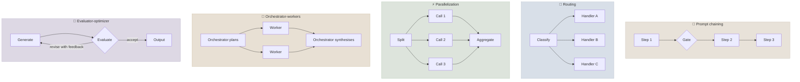

# Workflow Patterns

Workflow patterns are the reusable shapes for composing model calls and tools **when your code controls the sequence**: chaining, routing, parallelization, orchestrator-workers and evaluator-optimizer. Most production "agentic" systems are built mainly from these, with a true agent loop only where the path can't be predicted. This chapter gives each pattern's structure, when it pays off, its costs and its failure modes.

```objectives
time: 50 min
outcomes:
  - Describe the five workflow patterns - prompt chaining, routing, parallelization, orchestrator-workers, evaluator-optimizer - and draw each
  - Choose a pattern (or combination) for a task from its structure, latency budget and verification options
  - Add gates and checks between steps so errors don't propagate
  - Estimate the cost and latency of a composed workflow before building it
prerequisites:
  - "[What Are AI Agents](../../13-Agent-Foundations/Notes/01-What-Are-AI-Agents.mdx) - workflows vs agents"
  - "[The Agent Loop](../../13-Agent-Foundations/Notes/03-The-Agent-Loop.mdx)"
```

## The Building Block: an Augmented Model Call

Every pattern composes one unit - a model call that may use retrieval, tools and memory. Anthropic's taxonomy (*Building Effective Agents*, 2024) names five compositions of that unit; each trades extra calls for accuracy, speed or control.



---

## 1. Prompt Chaining

A fixed sequence of calls, each consuming the previous output: outline → draft → edit; extract → validate → transform. Between steps you can insert **programmatic gates** - schema validation, a length check, a test - that stop or repair bad intermediate output before it propagates.

- **Use when** the task decomposes cleanly into fixed steps, and each step is easier for the model than the whole.
- **Gains** accuracy per step, debuggability (inspect every intermediate), and the ability to use a cheaper model for easy steps.
- **Costs** latency adds up linearly; errors compound if gates are weak.

## 2. Routing

A classifier (a model call, a small fine-tuned model, or rules) sends each input to a specialised handler: refunds to the refund flow, technical questions to the docs-RAG flow, easy questions to a small model and hard ones to a large model.

- **Use when** inputs fall into distinct categories that are better handled separately, or when cost varies a lot by difficulty.
- **Gains** specialised prompts that don't interfere, and cost savings from sending easy traffic to cheap models.
- **Costs** misroutes are silent errors - evaluate the router as its own component (a confusion matrix on labelled inputs) and give it a fallback route.

## 3. Parallelization

Run calls concurrently and aggregate, in two flavours:

| Flavour | How | Example |
|---|---|---|
| **Sectioning** | Split a task into independent parts handled in parallel | Review a contract clause by clause; run a guardrail check alongside the main response |
| **Voting** | Run the *same* task several times and aggregate | Majority vote on a classification (self-consistency, Wang et al. 2023); best-of-n with a verifier |

Latency is the slowest branch rather than the sum. Voting improves reliability when errors are independent and there is a good aggregation rule; it is weak when all samples share the same misconception. **Best-of-n is only as good as its selector**: with an executable verifier (tests, a schema, a checker) it is powerful; with the same model picking its favourite it helps much less.

## 4. Orchestrator-Workers

An orchestrator model decides at run time how to split the task, dispatches sub-tasks to workers, and synthesises their results. Unlike sectioning, the sub-tasks aren't known in advance - which files to change, which sources to research.

- **Use when** the decomposition depends on the input (multi-file code changes, open research questions).
- **Gains** parallel exploration and focused worker contexts.
- **Costs** more tokens (each worker re-reads context), and the orchestrator's plan quality caps the result. This is the step from workflows toward multi-agent systems ([Multi-Agent Architectures](03-Multi-Agent-Architectures.mdx)).

## 5. Evaluator-Optimizer

One call generates, another evaluates against criteria and returns feedback, and the loop repeats until the evaluator accepts or a round limit is hit.

- **Use when** there are clear evaluation criteria and iteration measurably helps: code against tests, translation against a glossary, output against a schema or rubric.
- **The evaluator must add information.** Feedback from execution (tests, validators, a compiler) or from a rubric the generator didn't see works. A second call of the same model re-reading the same material with nothing new - "review your answer" - is weak on reasoning tasks (Huang et al., 2024), and on modern reasoning models it mostly repeats thinking already done. The module's [lab](../CodeLabs/01-Patterns-Under-Measurement.mdx) measures the difference on coding problems.
- **Always bound the loop** (2-3 rounds is typical) and keep the best-scoring output, not just the last.

---

## Choosing and Combining

| Task shape | Pattern |
|---|---|
| Known, ordered steps | Chaining, with gates |
| Distinct input categories, or wide difficulty range | Routing |
| Independent parts, or reliability by redundancy | Parallelization (sectioning / voting) |
| Unknown decomposition | Orchestrator-workers |
| Checkable quality criteria | Evaluator-optimizer |
| Unknown path *and* many dependent steps | An agent loop ([Agent Foundations](../../13-Agent-Foundations/INDEX.mdx)) |

Real systems combine them: a support bot **routes** by intent; the refund route **chains** extraction → policy check → action; a guardrail runs **in parallel**; the research route is an **orchestrator-workers** flow whose report goes through an **evaluator-optimizer** citation check.

### Estimating cost and latency

Write the call graph down before building. For each node: expected input and output tokens, model, and whether it is on the critical path. Cost is the sum over all nodes (times the expected number of loop iterations); latency is the longest path. Example: route (small model, 0.3 s) → three parallel section reviews (large model, 6 s each) → synthesis (4 s) → evaluator-optimizer with up to 2 rounds (2 × 5 s): latency ≈ 0.3 + 6 + 4 + 10 ≈ 20 s worst case; cost ≈ 1 + 3 + 1 + 2 × 2 = 9 calls' worth of tokens.

---

## Check Yourself

```quiz
- q: "What distinguishes orchestrator-workers from parallelization by sectioning?"
  options:
    - "In orchestrator-workers the sub-tasks are decided at run time by a model; in sectioning they are fixed in advance"
    - "Orchestrator-workers always uses more models"
    - "Sectioning can't run in parallel"
    - "There is no difference"
  answer: 1
- q: "When is an evaluator-optimizer loop most likely to improve results?"
  options:
    - "When the evaluator has information the generator lacked, such as test results or a rubric"
    - "Whenever the same model re-reads its answer"
    - "When the loop runs at least ten rounds"
    - "Only with a larger evaluator model"
  answer: 1
- q: "A router sends 5% of refund requests to the general-FAQ handler. How would you find and fix this?"
  answer: "Evaluate the router on its own with labelled inputs and a confusion matrix; inspect misroutes; improve the routing prompt or examples, add a confidence threshold with a fallback (ask a clarifying question or use a broader handler), and monitor route distribution in production."
- q: "Best-of-5 with the same model choosing its favourite gives little gain; best-of-5 selected by unit tests gives a large one. Why?"
  answer: "Selection needs a signal correlated with correctness. Tests are an external verifier; the model's own preference largely shares the generator's blind spots."
```

## Exercises

```exercise
- title: Design a pipeline
  task: |
    Design the workflow for turning 200-page supplier contracts into a risk summary: identify the patterns you'd use, draw the call graph, add gates, and estimate calls and latency per contract.
  solution: |
    Chunk by clause headings; parallel sectioning: one call per clause group extracts obligations, liabilities and termination terms into a schema (gate: schema validation, retry once); routing: clauses flagged high-risk go to a larger model for detailed analysis; synthesis call writes the summary with clause citations; evaluator-optimizer: a checker verifies every claim cites a clause id (programmatic) and a rubric call checks coverage of the risk checklist (max 2 rounds). With ~40 clause groups at 3 s in parallel batches of 10: ~12 s; high-risk analysis ~8 s; synthesis ~10 s; evaluation up to 2 × 6 s - roughly 40-45 s and ~50 calls per contract.
- title: Voting arithmetic
  task: |
    A classifier is right 80% of the time and its errors are independent across samples. What is the accuracy of a majority vote of 3? Of 5? Why is the real gain usually smaller?
  solution: |
    3 votes: P(at least 2 right) = 0.8³ + 3 × 0.8² × 0.2 = 0.512 + 0.384 = 0.896. 5 votes: Σ_{k≥3} C(5,k) 0.8^k 0.2^(5-k) = 0.328 + 0.410 + 0.205 = 0.942. Real samples from one model share systematic errors (the same misreading of an ambiguous input), so errors are correlated and the gain is smaller - sometimes near zero on the hard cases that matter.
```

## Study Notes

- Unit: an augmented model call (retrieval, tools, memory)
- Chaining: fixed steps + programmatic gates between them
- Routing: classify then specialise; evaluate the router; fallback route
- Parallelization: sectioning (independent parts) and voting (redundancy); best-of-n needs a real verifier
- Orchestrator-workers: run-time decomposition; bridge to multi-agent
- Evaluator-optimizer: works when the evaluator adds information (tests, rubric); bound rounds; keep the best output
- Combine patterns; estimate cost (sum of calls) and latency (longest path) before building

## References

- Anthropic, [Building Effective Agents](https://www.anthropic.com/engineering/building-effective-agents) (Dec 2024)
- Wang et al., [Self-Consistency Improves Chain of Thought Reasoning in Language Models](https://arxiv.org/abs/2203.11171) (ICLR 2023)
- Madaan et al., [Self-Refine: Iterative Refinement with Self-Feedback](https://arxiv.org/abs/2303.17651) (NeurIPS 2023)
- Huang et al., [Large Language Models Cannot Self-Correct Reasoning Yet](https://arxiv.org/abs/2310.01798) (ICLR 2024)
- Chen et al., [Evaluating Large Language Models Trained on Code](https://arxiv.org/abs/2107.03374) (2021) - pass@k and sampling with verification

*Last reviewed: 2026-09*
