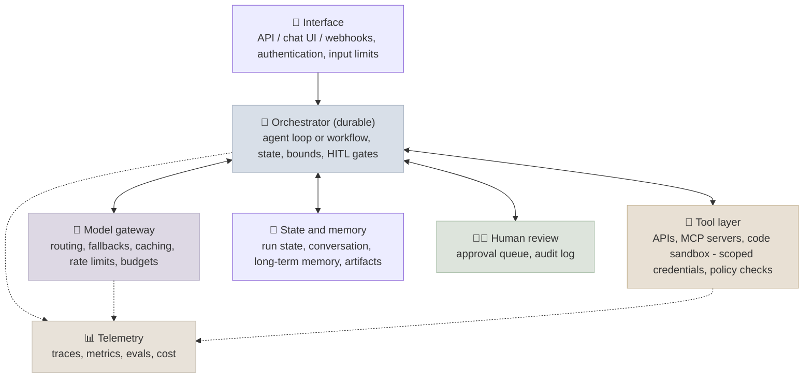

# Production Agent Architecture

A production agent is a distributed system with a model in the middle: requests arrive through an interface, a durable orchestrator runs the loop, tools reach real systems under least privilege, humans approve what matters, and everything is traced and budgeted. This chapter lays out that architecture and the reliability engineering that makes it survive real traffic; the following chapters go deep on security, durability, cost, evaluation and observability.

```objectives
time: 50 min
outcomes:
  - Draw the layers of a production agent system and assign each responsibility (auth, orchestration, tools, state, approvals, telemetry) to a layer
  - Set bounds, timeouts, retries, idempotency keys and circuit breakers for an agent's model and tool calls
  - Design human-in-the-loop gates - what triggers them, what the reviewer sees, what happens on timeout - and their audit trail
  - Choose synchronous, streaming or asynchronous execution for an agent workload and scale it with queues
prerequisites:
  - "[Anatomy of an AI Agent](../../09-Agent-Fundamentals/Notes/02-Anatomy-of-an-AI-Agent.mdx)"
  - "[Choosing an Agent Framework](../../14-Agent-Frameworks/Notes/01-Choosing-an-Agent-Framework.mdx)"
```

## The Layers



| Layer | Responsibilities | Chapter |
|---|---|---|
| Interface | Authenticate the user and carry their identity into the run; size limits; accept a task and return an id for long runs | - |
| Orchestrator | Run the loop or workflow; persist state after every step so a crash doesn't lose progress; enforce bounds; pause for approvals | [Durable Execution](03-Durable-Execution.mdx) |
| Model gateway | One place for provider keys, routing between models, fallbacks, prompt caching, rate limits and per-tenant budgets | [Cost & Latency](04-Cost-and-Latency.mdx) |
| Tool layer | Execute tool calls with the *user's* scoped credentials; policy checks in code; sandbox for code and browsing | [Agent Security](02-Agent-Security.mdx) |
| State and memory | Run checkpoints, conversation history, long-term memory, artifacts (files the agent produced) | [Agent Memory](../../10-Agent-Building-Blocks/Notes/02-Agent-Memory.mdx) |
| Human review | Approval queue with full context; decisions recorded | Below |
| Telemetry | A trace per run, spans per model and tool call, cost and outcome metrics, online evals | [Observability](06-Agent-Observability.mdx), [Evaluation](05-Agent-Evaluation-and-Benchmarks.mdx) |

Two principles cut across the layers. **Enforce policy outside the model**: the model proposes actions, code decides whether they're allowed (Lab 13 and Lab 14 measured why). **Make every step recoverable**: persisted state, idempotent writes and replayable steps turn a crash or a timeout into a retry instead of an incident.

## Reliability Engineering

### Bounds on everything

An agent loop without limits runs until it exhausts a quota. Bound each run:

```python
@dataclass
class RunLimits:
    max_model_calls: int = 25
    max_tool_calls: int = 40
    max_wall_seconds: int = 300
    max_cost_usd: float = 1.00
    max_repeated_call: int = 3          # same tool + same arguments
    max_context_tokens: int = 150_000   # compact or summarise above this
```

When a bound trips, stop cleanly: persist what was done, return a partial result with an explicit status (`"limit_reached"`), and emit a metric - a rising rate of limit hits is an early signal that a model, prompt or tool changed.

### Timeouts, retries and idempotency

Classify failures before retrying:

| Failure | Action |
|---|---|
| Transient (timeout, 429, 5xx, overloaded) | Retry with exponential backoff and jitter; honour `retry-after` |
| Invalid request or arguments | Don't retry blindly - return the error to the model as a tool result so it can correct |
| Permanent (not found, forbidden) | Don't retry; return the error or escalate |
| Model refusal or content filter | Don't retry the same request; route to a human or a safe fallback |

Retries are only safe if writes are **idempotent**: send an idempotency key (run id + step id) with every external write, and make the tool check whether that key was already applied. Durable-execution engines give you the step ids for free.

**Circuit breakers** stop hammering a failing dependency: after N consecutive failures, fail fast for a cool-down period, then let a probe request through. For model providers, the fallback is usually another model or region behind the gateway.

### Graceful degradation

Decide in advance what the agent does when a dependency is down: answer from cache, switch to read-only mode, queue the write for later, or hand off to a human with the context gathered so far. "The agent errors" is the worst option; "the agent claims success" is worse still.

## Human-in-the-Loop Design

Human review is a design element with its own requirements, not a fallback.

**When to require approval** - rules in code, not the model's judgement:

```python
def needs_approval(call: ToolCall, ctx: RunContext) -> bool:
    return (
        call.name in IRREVERSIBLE                   # payments, deletions, external messages
        or call.amount_usd > ctx.tenant.approval_threshold
        or call.affects_records > 10                # bulk operations
        or call.recipient_domain not in ctx.tenant.trusted_domains
    )
```

**What the reviewer sees:** the exact action and arguments (the email as it will be sent, not a summary), why the agent wants it (the relevant part of the trace), what happens on approve and on reject, and an edit option. Reviewers approve what they are shown; showing a summary invites rubber-stamping.

**Timeouts:** a pending approval needs a policy - remind, escalate, then cancel the run (not approve by default). The orchestrator must be able to wait hours or days without holding a process, which is why approvals and durable execution go together.

**Audit:** record who decided, what they saw, when, and what happened next. Regulated domains require it; debugging does too.

**Rubber-stamping** is the failure mode: if 99% of requests are approved unread, the gate provides no safety. Keep the approval rate meaningful by narrowing what needs approval, and sample approved actions for review.

## Execution Modes and Scaling

| Mode | Use when | Mechanism |
|---|---|---|
| Synchronous | Answers in a few seconds | Request/response |
| Streaming | Interactive chat; long answers | SSE or WebSocket; stream tokens and progress events (tool started, tool finished) |
| Asynchronous | Minutes to days; approvals; batch | Accept, return a task id, run on workers from a queue, notify by webhook or poll (A2A tasks and MCP Tasks use the same shape) |

Agent workers are mostly waiting on model and tool I/O, so scale them on **queue depth and concurrent runs**, not CPU. Put rate limits at the gateway per provider and per tenant; the provider's tokens-per-minute limit is usually the real ceiling. Keep workers stateless - all run state in the durable store - so any worker can pick up any step.

## Check Yourself

```quiz
- q: "An agent's refund tool is retried after a network timeout and the customer is refunded twice. What was missing?"
  options:
    - "An idempotency key on the write, so the retry is recognised as a duplicate"
    - "A larger timeout"
    - "A circuit breaker"
    - "A better system prompt"
  answer: 1
- q: "A tool call fails with a validation error on its arguments. What should the harness do?"
  options:
    - "Return the error to the model as the tool result so it can correct the call"
    - "Retry the same call with backoff"
    - "Abort the run"
    - "Open the circuit breaker"
  answer: 1
- q: "What should happen when an approval request gets no answer for 24 hours?"
  options:
    - "Escalate and eventually cancel the action - never approve by default"
    - "Approve automatically"
    - "Keep the worker process blocked until someone answers"
    - "Let the model decide"
  answer: 1
- q: "Why scale agent workers on queue depth rather than CPU?"
  answer: "Agent runs spend most of their time waiting on model and tool I/O, so CPU stays low even when the system is saturated; queue depth and concurrent runs reflect the real backlog."
```

## Exercises

```exercise
- title: Design the layers
  task: |
    An agent handles expense reports: it reads receipts, checks them against policy, files the report in the finance system and emails the employee. Assign every responsibility to a layer, list the bounds you'd set, the actions needing approval, and what happens when the finance API is down.
  solution: |
    Interface: SSO identity, file-size limits, async task id. Orchestrator: durable workflow (extract -> check -> file -> notify) with bounds (e.g. 15 model calls, $0.50, 10 min). Tools: receipt OCR, policy lookup, finance API with the employee's scoped token, email limited to the employee's address. Approvals: reports over the threshold or with policy exceptions go to the manager with the receipts and the flagged rule. Finance API down: circuit breaker opens, the workflow waits and retries the idempotent file step later, the employee is told it is queued - never "filed".
- title: Failure classes
  task: |
    Take ten failed runs from Lab 13 or your own agent and classify each failure as transient, invalid arguments, permanent, refusal, or model behaviour (wrong tool, claimed action). Which are fixed by retries, and which need a different fix?
  solution: |
    Retries fix only the transient class. Invalid arguments need the error returned to the model (and better schemas); permanent errors need escalation; model-behaviour failures need tool or harness changes (guards, state checks) and evaluation - retrying a claimed action produces the same claim.
```

## Study Notes

- Layers: interface, durable orchestrator, model gateway, tool layer, state and memory, human review, telemetry
- Policy outside the model; every step recoverable
- Bound model calls, tool calls, time, cost, repeats, context; stop with an explicit partial status
- Classify failures; retry only transient ones; idempotency keys on writes; circuit breakers; planned degradation
- HITL: rules in code, exact actions shown, timeout policy (never auto-approve), audit, watch for rubber-stamping
- Sync / streaming / async; scale on queue depth; rate limits at the gateway

## References

- Anthropic, [Building Effective Agents](https://www.anthropic.com/engineering/building-effective-agents) (Dec 2024)
- OpenAI, [A Practical Guide to Building Agents](https://openai.com/business/guides-and-resources/a-practical-guide-to-building-ai-agents/) (2025)
- Google SRE Book, [Handling Overload](https://sre.google/sre-book/handling-overload/) and [Addressing Cascading Failures](https://sre.google/sre-book/addressing-cascading-failures/) (2016)

*Last reviewed: 2026-09*
