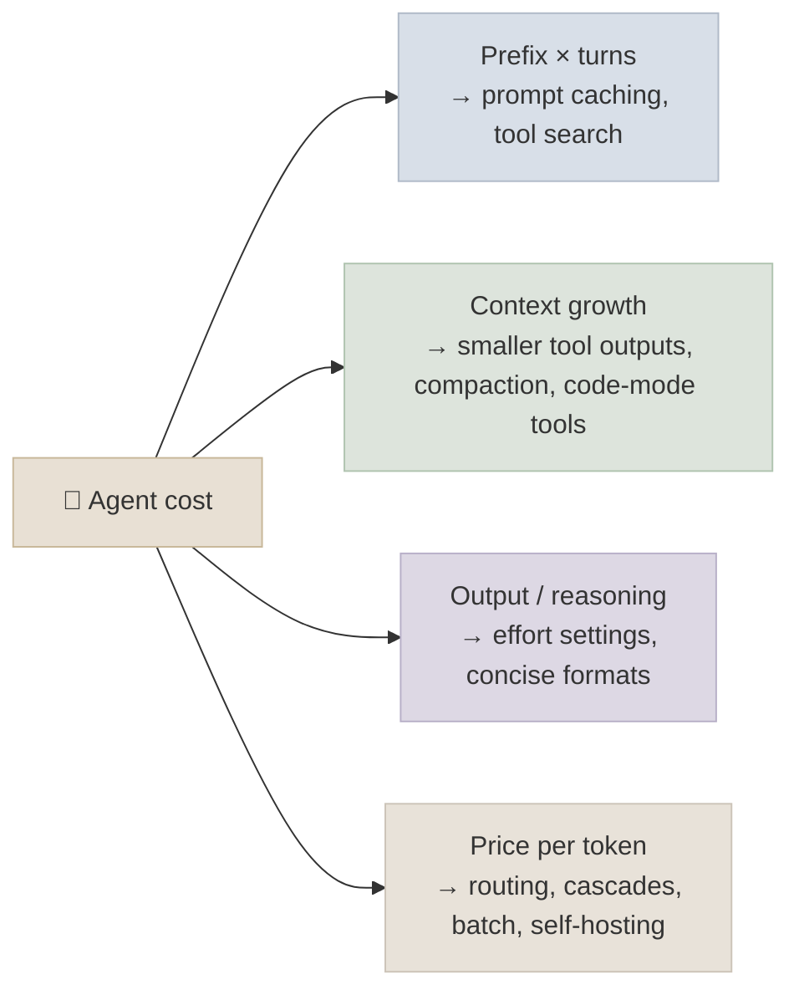

# Cost and Latency Engineering for Agents

An agent re-sends its growing context on every turn, calls tools whose outputs land back in that context, and sometimes spawns sub-agents that do the same. Its cost and latency therefore scale with *turns x context*, not with the size of the user's question. This chapter shows how to model an agent's cost, and the levers - caching, context hygiene, model routing, effort control, batching and parallelism - that cut it without cutting quality.

```objectives
time: 45 min
outcomes:
  - Estimate the token cost of an agent run from turns, context growth and tool-output sizes, and identify the dominant term
  - Apply prompt caching correctly to an agent loop and estimate the saving
  - Reduce context with tool-output limits, compaction, tool search and programmatic tool calling
  - Choose between model routing, cascades, effort settings and batch processing for a workload, measuring quality before and after
  - Cut wall-clock latency with parallel tool calls, streaming and speculative work
prerequisites:
  - "[Prompt Caching & Cost](../../05-Prompt-Engineering/Notes/07-Prompt-Caching-and-Cost.mdx)"
  - "[Production Agent Architecture](01-Production-Agent-Architecture.mdx)"
```

## Where the Tokens Go

Each turn sends the whole conversation so far. With a fixed prefix `P` (system prompt and tool definitions), an average of `g` new tokens per turn (the model's tool call plus the tool result) and `T` turns, input tokens are roughly

`input ≈ T·P + g·T(T-1)/2`

- quadratic in the number of turns. Worked example: `P` = 6,000 tokens (policy and 20 tool schemas), `g` = 1,500 tokens (a verbose tool result), `T` = 20 turns:

- prefix: 20 × 6,000 = 120,000 tokens
- growth: 1,500 × 20 × 19 / 2 = 285,000 tokens
- total ≈ 405,000 input tokens for one task, plus output tokens (tool calls, reasoning, the answer).

The growth term dominates, and it is made of tool outputs. Multi-agent systems multiply this again: Anthropic reported that its multi-agent research system used about 15× the tokens of a chat interaction, and that token usage alone explained 80% of the variance in performance on its browsing evaluation - more tokens bought more quality, at a price.



## Lever 1: Prompt Caching

In an agent loop, every turn's prompt is the previous turn's prompt plus a suffix - the ideal case for prefix caching. With Anthropic's API, cache reads cost 10% of the base input price (writes cost more: 1.25× for the 5-minute cache, 2× for the 1-hour cache); OpenAI caches long prefixes automatically at a discount that depends on the model; Gemini offers implicit and explicit caching. Rules for agents:

- Keep the prefix **stable**: tools and system prompt first, no timestamps or per-request ids in them, deterministic tool ordering.
- Mark the cache breakpoint at the **end of the conversation** each turn (or use automatic caching), so each turn reads everything before it from cache.
- Don't add or reorder tools mid-conversation - that invalidates everything after the tool definitions.

In the worked example, caching turns most of the 405,000 input tokens into cache reads, cutting input cost several-fold. Details and break-even arithmetic are in [Prompt Caching & Cost](../../05-Prompt-Engineering/Notes/07-Prompt-Caching-and-Cost.mdx).

## Lever 2: Context Hygiene

Shrink `g`, the per-turn growth:

- **Design tools to return less**: summaries, the fields that matter, pagination and filters. Claude Code caps tool responses at 25,000 tokens by default for this reason (Anthropic, *Writing effective tools for agents*, 2025).
- **Clear or compact old tool results** once they have been used; summarise long histories (LangChain `SummarizationMiddleware`, provider-side compaction and context editing).
- **Tool search / deferred loading**: instead of sending 100 tool definitions every turn, let the model search for the few it needs. Anthropic reported an 85% reduction in tokens for tool definitions with its tool search tool.
- **Programmatic tool calling ("code mode")**: the model writes code that calls tools and only the final result enters the context, instead of every intermediate result. Anthropic reported 37% fewer tokens on complex research tasks.
- **Sub-agents as context firewalls**: a sub-agent explores in its own context and returns a summary - more total tokens, but a smaller main context.

## Lever 3: Pay Less per Token

| Technique | How | Evidence and caveats |
|---|---|---|
| **Routing** | A classifier or small model picks a model per request | RouteLLM (2024) reported cost reductions of over 2× without quality loss on its benchmarks; train and validate the router on your own traffic |
| **Cascades** | Try a cheap model, check the result (tests, a verifier, confidence), escalate on failure | FrugalGPT (2023) matched GPT-4 with up to 98% lower cost on its tasks; the check must be reliable or errors pass through |
| **Different models per role** | Small models for classification, extraction and summarising sub-steps; a strong model for planning | Measure each role; weak sub-agents are a common multi-agent failure |
| **Effort / thinking settings** | Lower reasoning effort or thinking budgets for easy steps | Reasoning tokens are output tokens - the most expensive kind |
| **Batch APIs** | Non-interactive work (evals, nightly jobs) through batch endpoints | 50% discount at OpenAI and Anthropic, results within 24 hours |
| **Self-hosting** | Open-weight models on your own GPUs ([Inference & Serving](../../16-Inference-and-Serving/INDEX.mdx)) | Pays off at high, steady utilisation; you take on operations |

Every lever that changes the model or the prompt can change quality. Run the evaluation suite before and after, and track cost per *successful* task, not per request - a cheaper model that fails more often can cost more per resolved task.

## Latency

- **Parallel tool calls**: let the model request independent calls in one turn and execute them concurrently.
- **Streaming**: stream the final answer and progress events ("searching orders...") so perceived latency drops even when total time doesn't.
- **Fewer turns**: coarser tools (one `get_order_with_items` instead of three calls), workflows for predictable parts, and a plan-then-execute structure that batches work.
- **Time to first token**: prompt caching also cuts prefill time for long prefixes; keep the prefix cached with steady traffic or longer cache lifetimes.
- **Speculation**: start likely-needed tool calls (a customer lookup) before the model asks, and discard them if unused.
- **Report percentiles**: agent latency is long-tailed (a few runs take many more turns); track p50, p95 and p99 per task type, and set bounds that cap the tail.

## Budgets

Attach a budget to every run (tokens and dollars) and every tenant (per day), enforced at the model gateway: warn at 80%, stop cleanly at 100% with a partial result. Log cost per run with the trace so an expensive run can be opened and read - the usual culprits are a loop repeating the same tool call, a tool returning a whole document, or a sub-agent fan-out larger than the task needed.

## Check Yourself

```quiz
- q: "An agent's input tokens per task grow much faster than its number of turns. Why?"
  options:
    - "Each turn re-sends the whole growing context, so input grows roughly quadratically with turns"
    - "Tool definitions change every turn"
    - "Output tokens are counted twice"
    - "Caching is disabled by default"
  answer: 1
- q: "Which change breaks prompt caching for the rest of an agent conversation?"
  options:
    - "Adding a tool to the tool list mid-conversation"
    - "Appending a tool result"
    - "Asking a follow-up question"
    - "Streaming the response"
  answer: 1
- q: "A cheaper model cuts cost per request by 60% but drops task success from 90% to 70%. What happened to cost per successful task?"
  options:
    - "It fell by about 49% - cheaper per success, but the failures still need handling"
    - "It rose"
    - "It fell by 60%"
    - "It is unchanged"
  answer: 1
  explain: "Cost per success = cost per request / success rate: 0.4/0.7 = 0.57 of the original 1/0.9 = 1.11, i.e. 0.57/1.11 ≈ 0.51 - about 49% lower. The 20 extra failures per 100 tasks may still cost more in escalations or user harm than the saving."
- q: "Name two ways to shrink the per-turn context growth from tool outputs."
  answer: "Return less from tools (fields, summaries, pagination, caps); clear or compact old tool results; programmatic tool calling so intermediate results stay out of context; sub-agents that return summaries."
```

## Exercises

```exercise
- title: Cost a run
  task: |
    An agent has a 4,000-token prefix, averages 12 turns per task, and each turn adds 800 tokens. Input costs $3 per million tokens, cache reads 10% of that, and each turn's prompt (except the first) is read from cache up to the previous turn. Estimate the input cost per task with and without caching (ignore cache-write premiums).
  solution: |
    Without caching: input = 12×4,000 + 800×12×11/2 = 48,000 + 52,800 = 100,800 tokens → $0.302. With caching: each turn pays full price only for its new tokens (first turn 4,000; later turns 800 new) ≈ 4,000 + 11×800 = 12,800 full-price tokens, and the remaining 88,000 as cache reads at $0.30/M → 12,800×$3/M + 88,000×$0.30/M ≈ $0.038 + $0.026 = $0.065 - about 4.6× cheaper.
- title: Cascade with a verifier
  task: |
    Using the Agentic Workflows lab (HumanEval, hidden tests), build a cascade: a small model first; if its code fails the visible tests, retry with a larger model. Measure pass rate and cost against always using the larger model.
  solution: |
    The visible tests are the verifier: most problems pass with the small model and never reach the large one. Report pass rate with confidence intervals and cost per solved problem; the cascade usually matches the large model's pass rate at a fraction of the cost, and the misses are problems where visible tests passed but hidden tests failed - the verifier's blind spot.
```

## Study Notes

- Agent input ≈ turns × prefix + quadratic growth from tool outputs; multi-agent ≈ many times more (about 15× chat in Anthropic's research system)
- Caching: stable prefix, breakpoint at conversation end, don't change tools mid-run; cache reads ~10% of input price (Anthropic)
- Context hygiene: small tool outputs, compaction, tool search, programmatic tool calling, sub-agents as firewalls
- Price levers: routing, cascades, per-role models, effort, batch (50%), self-hosting - always re-evaluate quality; track cost per successful task
- Latency: parallel tools, streaming, fewer turns, cached prefill, speculation, percentiles; budgets per run and tenant

## References

- Anthropic, [How we built our multi-agent research system](https://www.anthropic.com/engineering/multi-agent-research-system) (Jun 2025)
- Anthropic, [Writing effective tools for agents](https://www.anthropic.com/engineering/writing-tools-for-agents) (Sep 2025) and [Introducing advanced tool use](https://www.anthropic.com/engineering/advanced-tool-use) (Nov 2025)
- Anthropic, [Prompt caching](https://docs.claude.com/en/docs/build-with-claude/prompt-caching) (2026); OpenAI, [Prompt caching](https://platform.openai.com/docs/guides/prompt-caching) (2026)
- Chen et al., [FrugalGPT](https://arxiv.org/abs/2305.05176) (2023)
- Ong et al., [RouteLLM](https://arxiv.org/abs/2406.18665) (2024)

*Last reviewed: 2026-09*
