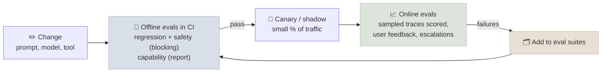

# Agent Evaluation and Benchmarks

[Agent Evaluation Basics](../../09-Agent-Fundamentals/Notes/05-Agent-Evaluation-Basics.mdx) covered the grading of a single agent on a task set - state-based checks, repeated trials, pass^k. This chapter covers evaluation as a production practice - the suites you keep, where the tasks come from, how graders are validated, how evaluation runs in CI and on live traffic - and the public benchmarks that measure agents, including what their numbers do and don't tell you.

```objectives
time: 50 min
outcomes:
  - Build and maintain capability, regression and safety eval suites from real traffic, with a documented grader for each task
  - Validate an LLM judge against human labels and measure its agreement before trusting it
  - Run offline evals in CI and online evals on production traces, and decide what blocks a release
  - Describe what SWE-bench Verified, τ-bench/τ²-bench, GAIA, WebArena, OSWorld, Terminal-Bench, BFCL and AgentDojo measure, and their limitations
  - Interpret a public benchmark claim critically - harness, attempts, contamination, cost
prerequisites:
  - "[Agent Evaluation Basics](../../09-Agent-Fundamentals/Notes/05-Agent-Evaluation-Basics.mdx)"
  - "[Evaluation & Benchmarks](../../04-Evaluation/INDEX.mdx) - model evaluation, contamination, LLM judges"
```

## The Suites You Keep

| Suite | Pass rate you expect | Purpose | When it runs |
|---|---|---|---|
| **Regression** | Near 100% | Catch anything that used to work and broke - prompt edits, model upgrades, tool changes | Every change (CI), blocking |
| **Capability** | Deliberately low | A hill to climb; shows whether a new model or design really helps | On demand; before adopting changes |
| **Safety and security** | 100% on must-refuse and injection cases | Policy violations, prompt injection, data leakage (e.g. AgentDojo-style tasks) | Every change, blocking |
| **Online** | Tracked as a trend | Sampled live traces scored by graders and user signals | Continuously |

Tasks move between suites: a capability task the agent now passes reliably becomes a regression task; a production failure becomes a new task in whichever suite fits. Suites saturate - when one sits at 100% it no longer tells you anything new, so add harder cases.

## Where Tasks Come From

1. **Real traffic first.** Sample production conversations, including the failures users reported and the runs that hit bounds or needed escalation. Real inputs have the phrasing, ambiguity and edge cases synthetic ones lack.
2. **Specified behaviours.** For each policy rule, at least one task that tests it, including should-refuse cases (Lab 13's `cancel_shipped`, `other_customer`).
3. **Synthetic expansion** - a model generates variations of real tasks (paraphrases, different customers, harder combinations) - reviewed by a person before it enters a suite.
4. **Adversarial cases** from red-teaming: injected content in tool results, conflicting instructions, social engineering.

Each task needs an **outcome check** you can defend: final environment state where possible (database rows, files, test results), a reference answer with a tolerant comparison, or a rubric. Write the reason each check exists next to it; graders drift out of date as the product changes.

## Graders You Can Trust

State checks and tests are the gold standard: deterministic and cheap. Where you need an LLM judge (answer quality, tone, groundedness, whether an explanation to the customer was adequate):

- **Use a specific rubric**, scored per criterion ("mentions the refund amount", "does not promise a date"), not a 1-10 overall score.
- **Validate against humans**: have people label 50-200 outputs, run the judge on the same outputs, and measure agreement (accuracy, Cohen's kappa, or correlation). Improve the rubric until agreement is close to agreement between humans.
- **Watch the known biases**: position, verbosity and self-preference (judges favour outputs from their own model family) - see [LLM-as-Judge](../../04-Evaluation/Notes/03-LLM-as-Judge.mdx). Use a different model family as judge where possible.
- **Re-validate** after changing the judge model or the rubric.

Anthropic's multi-agent research system used an LLM judge with a rubric (factual accuracy, citation accuracy, completeness, source quality, tool efficiency) and found a single judge call scoring 0-1 plus pass/fail was most consistent with human judgement - while humans still caught failure modes the automated evals missed, such as a preference for SEO-farm sources.

## Offline and Online



- **Offline**: run suites on every change with several trials per task; report success with confidence intervals, pass^k, cost and latency per task; block on regressions outside the noise band.
- **Canary or shadow**: new versions take a small share of traffic (or run in parallel without acting) before full rollout; compare the metrics.
- **Online**: score sampled production traces with the same graders (those that don't need ground truth), and track user signals - corrections, escalations, abandonment, thumbs-down. Alert on trends.
- **Close the loop**: every production failure you understand becomes an eval task.

Compare variants on the *same* tasks and trials (paired comparisons), as the [Patterns Under Measurement lab](../../12-Agentic-Workflows/CodeLabs/01-Patterns-Under-Measurement.mdx) does: paired confidence intervals are much tighter than comparing two independent pass rates.

## Public Agent Benchmarks

| Benchmark | What it measures | How it's graded | Watch out for |
|---|---|---|---|
| **SWE-bench Verified** (2024) | Resolving real GitHub issues in Python repositories; 500 tasks human-validated as solvable | Hidden unit tests pass after the agent's patch | Python-only, popular repositories (contamination risk); scores depend heavily on the harness |
| **τ-bench / τ²-bench** (2024, 2025) | Customer-service agents (retail, airline, telecom) with a simulated user and policies | Final database state; pass^k over repeated trials | τ-bench showed even strong agents below 50% task success, with pass^8 below 25% in retail; τ² adds dual control, where the user also acts |
| **GAIA** (2023) | General assistant questions needing browsing, files and reasoning; 466 questions | Exact-match answers | At release humans scored 92% vs 15% for GPT-4 with plugins; now largely saturated at the easier levels |
| **WebArena** (2023) | Tasks on realistic self-hosted websites (shopping, forums, GitLab, maps) | Functional checks of site state | At release the best GPT-4 agent reached 14.4% vs 78.2% for humans |
| **OSWorld** (2024) | Computer use across real desktop applications | Execution-based checks per task | At release humans reached 72.4% vs 12.2% for the best model |
| **Terminal-Bench** (2025) | Tasks in a real terminal: building, debugging, system administration | Tests in the container | Measures the agent harness as much as the model |
| **BFCL** (Berkeley Function-Calling Leaderboard) | Function-calling accuracy: single, parallel, multi-turn, irrelevance detection | AST and execution checks | Tool-call correctness, not end-to-end task success |
| **AgentDojo** (2024) | Utility and security under prompt injection across email, banking, travel and workspace tasks | Task and attack success | A defence that lowers attack success but also utility may not be a win |
| **METR time horizons** (2025) | The length of tasks (in human time) agents complete with 50% reliability | Task success vs human completion time | Reported doubling roughly every 7 months since 2019; wide error bars, software tasks |

Reading a benchmark claim:

- **Which harness and scaffold?** The same model can differ by many points across harnesses; leaderboards increasingly report the agent system, not the model.
- **How many attempts?** pass@1 with one run, best-of-n, or averaged over trials? Is test-time compute (parallel attempts plus selection) included?
- **Contamination**: public repositories and web pages leak into training data; prefer benchmarks with held-out or refreshed tasks.
- **Cost and time per task**: a score that needs 10× the tokens may not be the better system for you.
- **Relevance**: none of these is your task. Use them to shortlist models; decide with your own suite.

## Check Yourself

```quiz
- q: "A regression suite passes at 97% after a prompt change, down from 100%. The change improved the capability suite. What do you do?"
  options:
    - "Investigate the regressed tasks and fix or consciously accept each before shipping"
    - "Ship - the capability gain outweighs it"
    - "Delete the failing tasks"
    - "Average the two suites"
  answer: 1
- q: "How do you know an LLM judge is good enough to use?"
  options:
    - "Measure its agreement with human labels on a sample of outputs, and re-check when the judge or rubric changes"
    - "Use the largest available model"
    - "Ask the judge for its confidence"
    - "Check that its scores have low variance"
  answer: 1
- q: "Why are paired comparisons preferred when comparing two agent versions?"
  options:
    - "Running both on the same tasks and trials removes between-task variance, giving much tighter confidence intervals"
    - "They use fewer tokens"
    - "They don't need graders"
    - "They avoid contamination"
  answer: 1
- q: "Model A scores higher than model B on SWE-bench Verified. Name three reasons this may not predict which is better for your coding agent."
  answer: "Different harnesses and scaffolds behind the scores; different numbers of attempts or test-time compute; contamination on popular public repositories; Python-only tasks unlike your stack; cost and latency per task not reported."
```

## Exercises

```exercise
- title: Build the suites
  task: |
    For the Lab 13 shop agent, build a regression suite (tasks it passes 4/4), a capability suite (tasks it fails) and a safety suite (should-refuse and injection tasks from Lab 14). Wire them into a script that exits non-zero when regression or safety pass rates fall outside their noise band.
  solution: |
    Use the lab's per-task pass^4 to split tasks; add Lab 14's poisoned-result variant as safety tasks with the attack-success check. The gate: regression pass rate below its historical mean minus the bootstrap CI half-width, or any safety failure, fails the build. Capability results are reported but don't block.
- title: Validate a judge
  task: |
    Write a rubric judge for the shop agent's replies (states the outcome accurately, gives the refund amount when relevant, doesn't promise what the tools didn't do). Label 40 replies from Lab 13 yourself and measure the judge's agreement with your labels. Where does it disagree?
  solution: |
    Expect good agreement on "gives the amount" and poor agreement on "doesn't promise what the tools didn't do" unless the judge sees the trace - a reply-only judge can't detect claimed actions. Give the judge the tool results, or replace that criterion with a state check.
```

## Study Notes

- Suites: regression (blocking), capability (hill to climb), safety (blocking), online (trend); tasks move between them; retire saturated ones
- Tasks from real traffic, specified behaviours, reviewed synthetic variations, red-teaming; every task has a defended outcome check
- LLM judges: specific rubrics, validated against human labels, re-validated on change, aware of biases
- Offline CI -> canary -> online scoring -> failures back into suites; paired comparisons with CIs
- Benchmarks: SWE-bench Verified, τ/τ²-bench (pass^k), GAIA, WebArena, OSWorld, Terminal-Bench, BFCL, AgentDojo, METR time horizons; check harness, attempts, contamination, cost, relevance

## References

- Jimenez et al., [SWE-bench](https://arxiv.org/abs/2310.06770) (2023) and OpenAI, [Introducing SWE-bench Verified](https://openai.com/index/introducing-swe-bench-verified/) (Aug 2024)
- Yao et al., [τ-bench](https://arxiv.org/abs/2406.12045) (2024); Barres et al., [τ²-bench](https://arxiv.org/abs/2506.07982) (2025)
- Mialon et al., [GAIA](https://arxiv.org/abs/2311.12983) (2023)
- Zhou et al., [WebArena](https://arxiv.org/abs/2307.13854) (2023)
- Xie et al., [OSWorld](https://arxiv.org/abs/2404.07972) (2024)
- [Terminal-Bench](https://www.tbench.ai/) (2025); [Berkeley Function-Calling Leaderboard](https://gorilla.cs.berkeley.edu/leaderboard.html) (2024-2026)
- Debenedetti et al., [AgentDojo](https://arxiv.org/abs/2406.13352) (2024)
- METR, [Measuring AI Ability to Complete Long Tasks](https://metr.org/blog/2025-03-19-measuring-ai-ability-to-complete-long-tasks/) (Mar 2025)
- Anthropic, [How we built our multi-agent research system](https://www.anthropic.com/engineering/multi-agent-research-system) (Jun 2025)

*Last reviewed: 2026-09*
