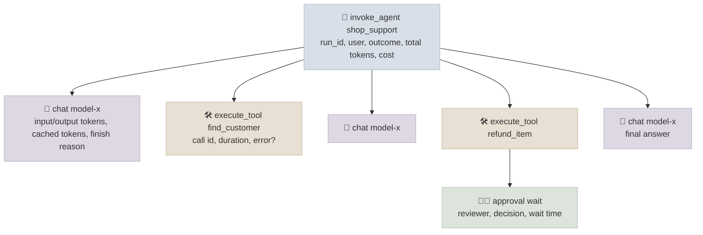

# Agent Observability

Observability for an agent means being able to answer, for any run, *what did it do and why* - which model calls it made with what context, which tools it called with what arguments and results, how long each step took, what it cost, and how the run ended - and, across runs, how those numbers are trending. The unit is the **trace**: one tree of spans per run, following the OpenTelemetry GenAI semantic conventions so any backend can read it.

```objectives
time: 40 min
outcomes:
  - Instrument an agent so each run produces a trace with invoke_agent, chat and execute_tool spans and the GenAI attributes that matter
  - Decide what content to capture (prompts, tool arguments, results) and how to handle PII and size
  - Define the dashboards and alerts for an agent in production - outcomes, bounds, cost, latency, tool errors
  - Debug a failed run from its trace, and turn it into an eval task
prerequisites:
  - "[Production Agent Architecture](01-Production-Agent-Architecture.mdx)"
  - "[Agent Evaluation and Benchmarks](05-Agent-Evaluation-and-Benchmarks.mdx)"
```

## A Trace per Run



The OpenTelemetry GenAI semantic conventions name the operations - `chat` (a model call), `invoke_agent`, `execute_tool`, `create_agent`, `embeddings` and others - and the attributes: `gen_ai.operation.name`, `gen_ai.provider.name`, `gen_ai.request.model`, `gen_ai.response.model`, `gen_ai.usage.input_tokens`, `gen_ai.usage.output_tokens`, `gen_ai.response.finish_reasons`, `gen_ai.agent.name`, `gen_ai.tool.name`, `gen_ai.tool.call.id`, `gen_ai.conversation.id`. The conventions are still marked in development and evolve release by release, but most frameworks (OpenAI Agents SDK processors, LangChain/LangGraph, ADK, Microsoft Agent Framework, PydanticAI via Logfire) and observability vendors emit or ingest them. Using them means you can change backends without re-instrumenting.

Hand-instrumenting a loop is a few lines:

```python
from opentelemetry import trace

tracer = trace.get_tracer("shop-agent")

def run_agent(request, user):
    with tracer.start_as_current_span("invoke_agent shop_support") as run:
        run.set_attribute("gen_ai.operation.name", "invoke_agent")
        run.set_attribute("gen_ai.agent.name", "shop_support")
        run.set_attribute("app.user.tenant", user.tenant)            # your own attributes, namespaced
        for step in range(MAX_STEPS):
            with tracer.start_as_current_span(f"chat {MODEL}") as span:
                span.set_attribute("gen_ai.operation.name", "chat")
                reply = client.chat.completions.create(model=MODEL, messages=messages, tools=TOOLS)
                span.set_attribute("gen_ai.usage.input_tokens", reply.usage.prompt_tokens)
                span.set_attribute("gen_ai.usage.output_tokens", reply.usage.completion_tokens)
            ...
            for call in reply.choices[0].message.tool_calls or []:
                with tracer.start_as_current_span(f"execute_tool {call.function.name}") as span:
                    span.set_attribute("gen_ai.operation.name", "execute_tool")
                    span.set_attribute("gen_ai.tool.name", call.function.name)
                    span.set_attribute("gen_ai.tool.call.id", call.id)
                    result = dispatch(call)
                    if not result["ok"]:
                        span.set_status(trace.StatusCode.ERROR, result["error"])
        run.set_attribute("app.run.outcome", outcome)                 # done / limit_reached / escalated
```

Propagate the trace context into tools and sub-agents (HTTP headers for MCP servers and A2A calls) so one run is one trace across services.

## Content: Capture, Protect, Bound

Token counts and timings are not enough to debug an agent - you need the prompts, tool arguments and results. The conventions keep content **opt-in** (in span events or separate log records) because it is large and sensitive. Practical policy:

- Capture full content in development and for sampled production traffic; always capture it for failed and escalated runs.
- Redact or tokenise PII and secrets before export; restrict who can read content; set retention to what debugging and audit need.
- Store large payloads (documents, long tool results) by reference, not inline.
- Record the **prompt version, model version, tool-set version** and framework version on every run, so a regression can be tied to a change.

## Metrics, Dashboards and Alerts

| Signal | Why | Alert on |
|---|---|---|
| Outcome rate: done / limit reached / escalated / error | The headline health metric | A shift from baseline for a task type |
| Online eval scores and user feedback | Quality on real traffic | Sustained drop |
| Tool error rate per tool | Broken integrations, schema drift, bad arguments | Spike on any tool |
| Steps, tokens and cost per run (p50/p95/p99) | Loops, context bloat, runaway fan-out | p95 jump; budget breaches |
| Latency per run and per step (TTFT, tool duration) | User experience, provider slowness | p95 over the SLO |
| Approval rate and wait time | Rubber-stamping (near 100% approvals) or blocked queues | Queue age |
| Security signals: blocked policy checks, injection classifier hits, new egress destinations | Attacks in progress | Any unusual increase |

Most of these are aggregations of span attributes, so the trace is the single source; dashboards are views over it.

## Debugging from a Trace

A typical investigation: a customer says the agent confirmed a refund that never happened.

1. Find the run by conversation or user id; open its trace.
2. Look at the `execute_tool` spans: no `refund_item` span, or a `refund_item` span with an error status?
3. Open the last `chat` span's content: the model saw the error (or never called the tool) and still wrote "refunded" - a claimed action.
4. Check the versions on the run: did this start with a prompt or model change?
5. Fix in the right layer (a harness check, templated confirmations - see Lab 13), then **add the conversation as a regression task** so it stays fixed.

## Tools

Tracing backends that understand agent traces include Langfuse and Arize Phoenix (open source, self-hostable), LangSmith, Braintrust, W&B Weave, Pydantic Logfire, and the cloud platforms' own tracing (Google Cloud Trace for Agent Runtime, AWS CloudWatch for Bedrock AgentCore, Azure Monitor for Foundry). Most combine tracing with dataset management and online evaluation. Choose on data residency and self-hosting needs, OpenTelemetry support, and whether the evaluation features fit your workflow - the instrumentation should stay vendor-neutral either way.

## Check Yourself

```quiz
- q: "Which OpenTelemetry GenAI operation name marks a tool invocation span?"
  options: ["execute_tool", "chat", "invoke_agent", "tool_call"]
  answer: 1
- q: "Why is prompt and tool content opt-in in the GenAI conventions?"
  options:
    - "It is large and may contain sensitive data, so capture is a deliberate policy decision"
    - "It can't be represented in OpenTelemetry"
    - "It is never useful for debugging"
    - "Vendors charge extra for it"
  answer: 1
- q: "Approvals for an agent's refunds run at 99.7% with a median review time of 4 seconds. What does the dashboard suggest?"
  answer: "Rubber-stamping: reviewers aren't really checking. Narrow what needs approval (so each request deserves attention), show exact consequences, and sample approved actions for audit."
- q: "What should you record on every run so a regression can be traced to a change?"
  answer: "The prompt version, model (and response model) version, tool-set version and framework version, alongside the run's outcome and cost."
```

## Exercises

```exercise
- title: Instrument Lab 13
  task: |
    Add OpenTelemetry spans to the Lab 13 agent loop following the GenAI conventions, export them to a local Phoenix or Langfuse instance (or the console exporter), and run the full task set. Find a failing run and diagnose it from the trace alone.
  solution: |
    One invoke_agent span per episode with chat and execute_tool children; tokens on chat spans, errors as span status on tool spans, the task id and outcome as attributes. A failed refund_one run shows get_order followed by a final chat span with no refund_item span - the claimed-action pattern - without reading logs.
- title: Design the dashboard
  task: |
    For the Lab 14 MCP shop agent in production, specify six dashboard panels and four alerts with thresholds, including one security alert. Justify each threshold.
  solution: |
    Panels: outcome rate by task type; tool error rate by tool; tokens and cost per run (p50/p95); latency per run (p95); approval rate and queue age; guard blocks per hour. Alerts: outcome success drops by more than 3 standard errors from the weekly baseline; any tool's error rate above 5% for 10 minutes; p95 cost per run above twice baseline; guard blocks on write tools above their normal rate (a possible injection campaign - Lab 14's result attack would trip it).
```

## Study Notes

- One trace per run: `invoke_agent` -> `chat` and `execute_tool` spans; GenAI attributes for model, tokens, finish reasons, agent and tool names, call ids, conversation id
- Conventions are evolving but widely supported; stay vendor-neutral; propagate context to tools and sub-agents
- Content capture is opt-in: sample, always keep failures, redact, bound, reference large payloads; record versions
- Dashboards from span data: outcomes, online evals, tool errors, steps/tokens/cost percentiles, latency, approvals, security signals
- Debug from the trace, fix in the right layer, add a regression task

## References

- OpenTelemetry, [Semantic conventions for generative AI systems](https://opentelemetry.io/docs/specs/semconv/gen-ai/) and [GenAI agent spans](https://github.com/open-telemetry/semantic-conventions-genai/blob/main/docs/gen-ai/gen-ai-agent-spans.md) (2026)
- OpenTelemetry blog, [Inside the LLM Call: GenAI Observability with OpenTelemetry](https://opentelemetry.io/blog/2026/genai-observability/) (2026)
- OpenAI Agents SDK, [Tracing](https://openai.github.io/openai-agents-python/tracing/) (2026)

*Last reviewed: 2026-09*
