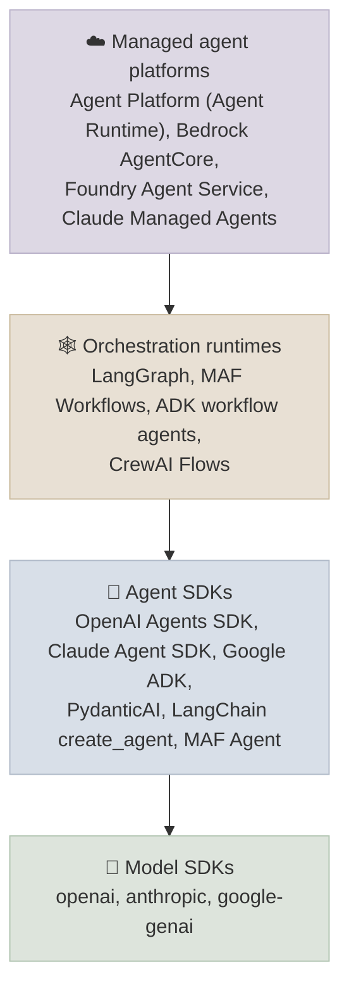
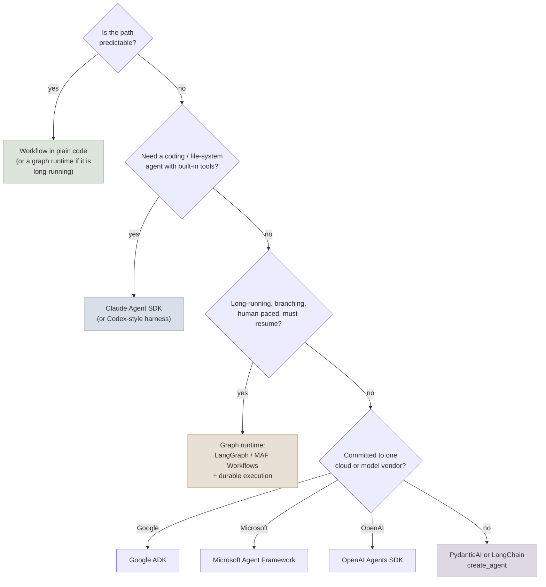

# Choosing an Agent Framework

An agent framework packages the pieces you built by hand in [Code Lab 13-01](../../13-Agent-Foundations/CodeLabs/01-Agent-Loop-from-Scratch.mdx) - the loop, tool schemas, state, approvals, tracing and multi-agent wiring - behind an API. This chapter maps what frameworks provide, how the major ones differ in their core abstraction, and how to choose one (or none) for a project.

```objectives
time: 45 min
outcomes:
  - List what an agent framework adds to a raw model API loop, and what it hides from you
  - Place a framework on the layer map - model SDK, agent SDK, orchestration runtime, managed platform
  - Compare LangGraph, OpenAI Agents SDK, Claude Agent SDK, Google ADK, CrewAI, Microsoft Agent Framework and PydanticAI by abstraction, state, human-in-the-loop, durability and model neutrality
  - Choose a framework for a given project with a written rationale, including when to use none
prerequisites:
  - "[The Agent Loop](../../13-Agent-Foundations/Notes/03-The-Agent-Loop.mdx)"
  - "[Workflow Patterns](../../15-Agent-Patterns/Notes/01-Workflow-Patterns.mdx)"
```

## What a Framework Adds

Strip any framework down and you find the same loop: call the model with tools, execute the tool calls it returns, append the results, repeat until it answers or a bound trips. What frameworks add is everything around that loop:

| Concern | Hand-written loop | What frameworks provide |
|---|---|---|
| Tool schemas | Write JSON schemas by hand | Generated from type hints and docstrings; validation of arguments |
| The loop | ~50 lines you own | A runner with turn limits, error handling and retries |
| State | A list of messages | Sessions, threads, checkpoints you can resume from |
| Human approval | Your own pause logic | Interrupt-and-resume primitives (`interrupt()`, `needs_approval`, `approval_mode`, deferred tools) |
| Multi-agent | Your own routing | Handoffs, agents-as-tools, sequential/parallel/loop agents, graphs, group chat |
| Tracing | print statements | Spans per model call and tool call, often OpenTelemetry-compatible |
| Integrations | Your own clients | Model providers, MCP clients, vector stores, deployment targets |

What they **hide** is exactly what you debug: the prompt actually sent, how tool errors are turned into messages, how history is truncated, and when retries happen. Build the loop by hand once (Module 13) before you adopt a framework, so that you can read its traces.

## The Layer Map



- **Model SDKs** give you a single call with tool definitions; you write the loop.
- **Agent SDKs** give you the loop, tools, sessions and approvals for one agent, plus light multi-agent composition (handoffs, agents as tools).
- **Orchestration runtimes** give you explicit graphs or workflows with checkpointed state - for long-running, branching or human-paced processes.
- **Managed platforms** host and scale the agent, and supply sessions, memory, identity and observability as services.

Most frameworks span two layers: LangChain's `create_agent` is an agent SDK built on the LangGraph runtime; Google ADK and Microsoft Agent Framework have both agents and workflows.

## The Frameworks at a Glance

Versions are those verified for this module's lab (September 2026).

| | Core abstraction | State and durability | Human-in-the-loop | Multi-agent | Model neutrality |
|---|---|---|---|---|---|
| [LangChain + LangGraph](02-LangChain-and-LangGraph.mdx) (1.4 / 1.2) | Agent with middleware, on a state graph | Checkpointers (memory, SQLite, Postgres); durability modes; long-term Store | `interrupt()` + `Command(resume=...)`; `HumanInTheLoopMiddleware` | Graphs, subgraphs, `Send` fan-out, supervisor/swarm libraries | Any provider via integrations |
| [OpenAI Agents SDK](03-OpenAI-Agents-SDK.mdx) (0.22) | Agent + Runner | Sessions (SQLite, Redis, OpenAI Conversations); serialisable `RunState` | `needs_approval` on tools; interruptions; `RunState.approve/reject` | Handoffs, agents as tools | OpenAI-first; other providers via Chat Completions or LiteLLM |
| [Claude Agent SDK](04-Claude-Agent-SDK.mdx) (0.2) | The Claude Code harness as a library | Sessions resumed by id, file checkpointing | Permission modes, `can_use_tool`, hooks | Subagents | Claude only |
| [Google ADK](05-Google-ADK.mdx) (2.10) | `LlmAgent` + workflow agents + Runner | Session services (memory, database, Agent Platform) | Tool confirmation; callbacks | Sub-agents, `Sequential/Parallel/LoopAgent`, `AgentTool`, A2A | Gemini-first; others via LiteLLM |
| [CrewAI](06-CrewAI.mdx) (1.15) | Role-playing agents in a crew; event-driven Flows | Flow state persistence; crew memory | `human_input` on tasks; Flow steps | Sequential or hierarchical crews; Flows | Any provider via LiteLLM |
| [Microsoft Agent Framework](07-Microsoft-Agent-Framework.mdx) (1.19) | Agent + graph-based Workflows | Sessions; workflow checkpoints | `approval_mode` on tools; request/response in workflows | Sequential, concurrent, handoff, group chat, Magentic orchestrations | Azure/OpenAI-first; many connectors |
| [PydanticAI](08-PydanticAI.mdx) (2.51) | Typed agent with dependency injection | Message history; durable execution via Temporal, DBOS or Prefect | Deferred tools (`requires_approval`) | Agents as tools, delegation, pydantic-graph | Any provider |

## How to Choose



Questions that decide it in practice:

1. **Does the team already run on one cloud?** The vendor framework gets you deployment, identity, observability and support in one place - ADK on Google Cloud's Agent Platform, Microsoft Agent Framework on Foundry, the OpenAI Agents SDK with OpenAI's hosted tools.
2. **How long does one run live?** Seconds: any agent SDK. Hours to weeks with human steps: a checkpointed graph plus durable execution ([Production Agents](../../17-Production-Agents/INDEX.mdx)).
3. **How much control over the prompt and loop do you need?** Frameworks that generate large hidden prompts (role/backstory templates, planning prompts) are harder to tune than thin ones; read the prompt a framework sends before committing.
4. **Can you swap the model?** Keep tools as plain functions and business rules in the tools (as the lab does), and a framework change becomes a day's work.
5. **Is it maintained, and how fast is it changing?** Most of these are pre-1.0 or recently past 1.0 and ship weekly. Pin versions and keep a small end-to-end test suite.

### When to use no framework

A single model call with tools and a 50-line loop is often the better choice: fewer dependencies, a prompt you fully control, and nothing to upgrade. Anthropic's guidance is to start with the model API directly and add abstraction only when it demonstrably helps (*Building Effective Agents*, 2024). Use a framework when you need its durable state, approvals, tracing or integrations - not for the loop itself.

## What the Lab Shows

[Code Lab 16-01](../CodeLabs/01-One-Agent-Many-Frameworks.mdx) builds the same shop agent - same tools, same policy prompt, same model, same grader - in seven frameworks. The plumbing differs (how tools are declared, how a refund pauses for approval and resumes, sync vs async runners). Most tasks behaved identically everywhere; the exception was a rule enforced only by the prompt, which three frameworks' agents followed every time and two never did. Replaying the requests traced the split to incidental tool-schema details the frameworks generate (JSON-schema `title` fields combined with `additionalProperties: false`), not to anything the framework does on purpose. Frameworks change the exact tokens the model sees, so test your tasks in the framework you pick - and enforce rules in code, where serialisation details can't move them.

## Check Yourself

```quiz
- q: "Which concern does an agent framework NOT remove from your responsibility?"
  options:
    - "Enforcing business rules such as order ownership"
    - "Generating tool schemas from function signatures"
    - "Looping until the model stops calling tools"
    - "Pausing a run for human approval and resuming it"
  answer: 1
  explain: "Frameworks give you the loop, schemas and pause/resume. Which actions are allowed is your domain logic, and it belongs in the tools or the harness policy, whatever framework you use."
- q: "A process runs for three days with two human review steps and must survive restarts. Which layer do you need?"
  options:
    - "An orchestration runtime with checkpointed state (plus durable execution)"
    - "A model SDK"
    - "An agent SDK with in-memory sessions"
    - "A bigger context window"
  answer: 1
- q: "Why build an agent loop by hand before adopting a framework?"
  answer: "So you understand what the framework hides - the actual prompt, how tool errors become messages, truncation and retries - and can read its traces and debug it when behaviour is wrong."
- q: "In the lab, two frameworks' agents cancelled another customer's order that three others refused. What caused it?"
  options:
    - "Incidental tool-schema details the frameworks generate, acting on a rule that existed only in the prompt"
    - "The frameworks' approval gates"
    - "Different models"
    - "Async vs sync runners"
  answer: 1
  explain: "Replaying the request showed that adding title fields plus additionalProperties false to the schemas flipped the behaviour 0/8 to 8/8. Enforcing the ownership rule in the tools removes the dependence."
```

## Exercises

```exercise
- title: Choose and justify
  task: |
    For each project, choose a framework (or none) and write three sentences of rationale: (a) a support bot on Google Cloud that must hand off to a billing agent owned by another team; (b) a nightly job that summarises 200 documents into a report; (c) a loan-approval process with an underwriter review step that can take two days; (d) an internal coding assistant that edits repositories.
  solution: |
    (a) Google ADK on Agent Platform; the billing agent exposed over A2A so the other team can use any framework. (b) No agent framework: a map-reduce workflow in plain code with batch API calls. (c) A graph runtime with checkpoints (LangGraph or MAF Workflows) on durable execution; the review is an interrupt that can wait days. (d) Claude Agent SDK (or another coding harness): built-in file and shell tools, permissions and hooks already exist.
- title: Read the hidden prompt
  task: |
    Pick two frameworks from the lab. Log the exact request body each sends to the model server for the same task (a logging proxy, or the framework's debug logging). Compare the system prompts and tool schemas. What did each framework add?
  hints: ["mlx_lm.server and vLLM can log requests; or put a small HTTP proxy between the script and the server"]
  solution: |
    Thin SDKs (OpenAI Agents, PydanticAI, LangChain create_agent) send your instructions nearly verbatim plus the tool schemas. CrewAI wraps the backstory, role and goal in its own template with task and expected-output text; ADK adds agent name and transfer instructions when sub-agents exist. Schema details differ too (strict mode, additionalProperties). These differences are why the same model can behave differently across frameworks.
```

## Study Notes

- A framework = loop + schemas + state + approvals + multi-agent + tracing + integrations; it hides the prompt, error handling, truncation and retries
- Layers: model SDK -> agent SDK -> orchestration runtime -> managed platform
- Choose on cloud alignment, run length and durability, prompt control, model neutrality, and maintenance - not on accuracy claims
- Keep tools as plain functions with business rules inside; pin versions; keep an end-to-end test suite
- No framework is a legitimate choice for a simple loop

## References

- Anthropic, [Building Effective Agents](https://www.anthropic.com/engineering/building-effective-agents) (Dec 2024)
- [LangChain docs](https://docs.langchain.com/oss/python/langchain/overview) and [LangGraph docs](https://docs.langchain.com/oss/python/langgraph/overview) (2026)
- [OpenAI Agents SDK](https://openai.github.io/openai-agents-python/) (2026)
- [Claude Agent SDK](https://docs.claude.com/en/api/agent-sdk/overview) (2026)
- [Google Agent Development Kit](https://google.github.io/adk-docs/) (2026)
- [CrewAI docs](https://docs.crewai.com/) (2026)
- [Microsoft Agent Framework](https://learn.microsoft.com/en-us/agent-framework/) (2026)
- [PydanticAI](https://ai.pydantic.dev/) (2026)

*Last reviewed: 2026-09*
