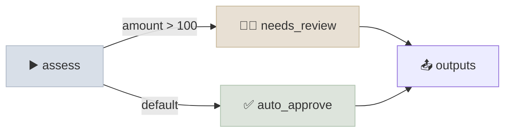

# Microsoft Agent Framework

Microsoft Agent Framework (MAF) is Microsoft's open-source SDK for agents and multi-agent workflows in Python and .NET. It unifies its two earlier projects: the simple agent abstractions and multi-agent patterns of **AutoGen** and the enterprise features of **Semantic Kernel** (sessions, middleware, telemetry, connectors), adding **graph-based workflows** with checkpointing. Announced in October 2025, it is Microsoft's recommended path for new projects; AutoGen and Semantic Kernel code is migrated to it.

```objectives
time: 40 min
outcomes:
  - Build an Agent from a chat client, tools and instructions, with sessions and tool approval
  - Build a graph workflow of executors with conditional edges and checkpointing
  - Pick a built-in multi-agent orchestration (sequential, concurrent, handoff, group chat, Magentic)
  - Explain what MAF inherited from AutoGen and Semantic Kernel, and how to migrate
prerequisites:
  - "[Choosing an Agent Framework](01-Choosing-an-Agent-Framework.mdx)"
```

## Agents

An agent wraps a **chat client** (OpenAI, Azure OpenAI, Foundry, Anthropic, Bedrock, Gemini, Ollama and others ship as connector packages) with instructions, tools, middleware and context providers:

```python
from agent_framework import Agent, Message, tool
from agent_framework.openai import OpenAIChatCompletionClient

client = OpenAIChatCompletionClient("gpt-5-mini")                 # or base_url=... for any compatible server
tools = [tool(fn, approval_mode="always_require" if fn.__name__ == "refund_item" else "never_require")
         for fn in shop_functions]
agent = Agent(client, POLICY, name="shop_support", tools=tools)

session = agent.create_session()                                   # conversation state across runs
response = await agent.run(request, session=session)
while response.user_input_requests:                                # paused before a refund
    answers = [r.to_function_approval_response(True) for r in response.user_input_requests]
    response = await agent.run(Message("user", answers), session=session)
print(response.text)
```

- **Tools**: plain functions (schema from type hints), `@tool` with `approval_mode` and `max_invocations`, hosted tools of the provider, and MCP (`MCPStdioTool`, `MCPStreamableHTTPTool`).
- **Middleware** intercepts agent runs, chat calls and function calls - for logging, policy checks, or rewriting arguments and results.
- **Context providers** inject memory or retrieved context before each run (Mem0, Redis and Azure AI Search integrations exist).
- **Telemetry** follows the OpenTelemetry GenAI conventions.

## Workflows

Workflows are typed graphs of **executors** (functions, classes or agents) connected by edges. Messages flow along edges; an executor sends messages onward or yields workflow outputs.

```python
from typing_extensions import Never
from agent_framework import Case, Default, WorkflowBuilder, WorkflowContext, executor

@executor(id="assess")
async def assess(amount: float, ctx: WorkflowContext[float]) -> None:
    await ctx.send_message(amount)

@executor(id="auto_approve")
async def auto_approve(amount: float, ctx: WorkflowContext[Never, str]) -> None:
    await ctx.yield_output(f"auto-approved {amount}")

@executor(id="needs_review")
async def needs_review(amount: float, ctx: WorkflowContext[Never, str]) -> None:
    await ctx.yield_output(f"sent {amount} to a reviewer")

workflow = (WorkflowBuilder(start_executor=assess)
            .add_switch_case_edge_group(assess, [Case(condition=lambda a: a > 100, target=needs_review),
                                                 Default(target=auto_approve)])
            .build())
print((await workflow.run(120.0)).get_outputs())     # ['sent 120.0 to a reviewer']  (verified, MAF 1.19)
```



The builder has chains, fan-out and fan-in edges, switch-case and multi-selection edge groups. Execution proceeds in supersteps; with a `checkpoint_storage` (in-memory or file, among others) state is saved at superstep boundaries so a workflow can pause - for example on `ctx.request_info(...)`, which asks a human or external system for input - and resume later, even in another process. Workflows can also be declared in YAML (`agent-framework-declarative`) and wrapped as an agent.

## Multi-Agent Orchestrations

Pre-built patterns in `agent_framework.orchestrations`, all built on workflows:

| Builder | Pattern |
|---|---|
| `SequentialBuilder` | Agents in a pipeline, each seeing the conversation so far |
| `ConcurrentBuilder` | Agents in parallel on the same input, results aggregated |
| `HandoffBuilder` | Agents transfer control to each other (triage to specialists) |
| `GroupChatBuilder` | A manager selects the next speaker in a shared conversation |
| `MagenticBuilder` | A Magentic-One style orchestrator with a task ledger and progress ledger, re-planning when stuck; optional plan review by a human |

These map directly onto the topologies in [Multi-Agent Architectures](../../15-Agent-Patterns/Notes/03-Multi-Agent-Architectures.mdx); the evidence there on when multiple agents help applies unchanged.

## From AutoGen and Semantic Kernel

| Earlier | In MAF |
|---|---|
| AutoGen `AssistantAgent` | `Agent` |
| AutoGen team patterns (RoundRobin, Selector, Swarm, Magentic-One) | Orchestration builders |
| Semantic Kernel plugins and functions | Tools (functions, `@tool`) and MCP |
| Semantic Kernel filters | Middleware |
| Semantic Kernel process framework | Workflows |

Deployment targets include Azure Functions (durable agents), Foundry Agent Service, and any container; `agent-framework-devui` gives a local UI for runs and traces, and AG-UI and A2A adapters expose agents to front ends and other agents.

## Check Yourself

```quiz
- q: "Which two projects does Microsoft Agent Framework succeed?"
  options:
    - "AutoGen and Semantic Kernel"
    - "LangChain and LlamaIndex"
    - "Bot Framework and Power Virtual Agents"
    - "DeepSpeed and ONNX Runtime"
  answer: 1
- q: "Where does a MAF workflow save checkpoints?"
  options:
    - "At superstep boundaries, into the configured checkpoint storage"
    - "After every token"
    - "Only when the workflow finishes"
    - "In the chat client"
  answer: 1
- q: "Which orchestration keeps a task ledger and re-plans when progress stalls?"
  options: ["Magentic", "Sequential", "Concurrent", "Handoff"]
  answer: 1
- q: "How does a run with a tool marked approval_mode='always_require' continue?"
  answer: "The response carries user_input_requests (function approval requests); the caller converts each with to_function_approval_response(True or False) and runs the agent again in the same session with those responses."
```

## Exercises

```exercise
- title: Human review in a workflow
  task: |
    Replace needs_review with an executor that calls ctx.request_info to ask a reviewer to approve, run the workflow with file checkpoint storage, stop after the request, and resume from the checkpoint with a response.
  solution: |
    Build with checkpoint_storage=FileCheckpointStorage(path). The request pauses the run and emits a request event; the checkpoint holds the pending request and state. Restart, load the latest checkpoint, and run the workflow with the checkpoint id and the response for the request id; the executor's response handler continues to yield the output.
- title: Magentic vs a single agent
  task: |
    Give a Magentic orchestration three agents (researcher, coder, writer) and a single agent with the union of their tools. Run five research-and-summarise tasks through both and record tokens, latency and quality.
  solution: |
    Expect the Magentic run to use several times the tokens and time for the ledger updates and agent turns. On tasks that decompose into independent research threads it can match or beat the single agent; on sequential tasks it usually doesn't - consistent with the multi-agent evidence in Module 15.
```

## Study Notes

- MAF = AutoGen's agents and orchestration patterns + Semantic Kernel's enterprise features + graph workflows; Python and .NET
- `Agent(client, instructions, tools=...)`, sessions, middleware, context providers, OpenTelemetry
- Tool approval: `approval_mode="always_require"` -> `user_input_requests` -> `to_function_approval_response`
- Workflows: executors + edges (switch-case, fan-out/in), supersteps, checkpoints, `request_info` for human input
- Orchestrations: sequential, concurrent, handoff, group chat, Magentic

## References

- Microsoft, [Introducing Microsoft Agent Framework](https://azure.microsoft.com/en-us/blog/introducing-microsoft-agent-framework/) (Oct 2025)
- [Microsoft Agent Framework documentation](https://learn.microsoft.com/en-us/agent-framework/) - agents, tools, workflows, orchestrations, migration guides (2026)
- Fourney et al., [Magentic-One: A Generalist Multi-Agent System](https://arxiv.org/abs/2411.04468) (2024)

*Last reviewed: 2026-09*
