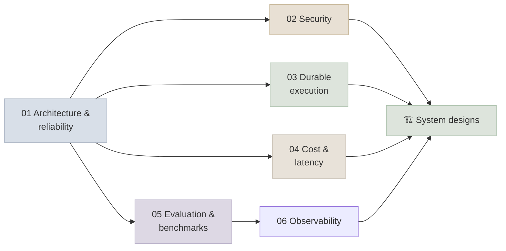

# 16 - Production Agents

A demo agent needs to work once; a production agent needs to work reliably, safely and affordably on inputs nobody anticipated, for users who can be attacked through it. This module covers the engineering around the agent - architecture and reliability, security, durable execution, cost and latency, evaluation and benchmarks, and observability - and applies it in four worked system designs.

```objectives
scope: module
time: 9-11 hours
outcomes:
  - Design a production agent system end to end - layers, bounds, retries, idempotency, human approval and execution mode
  - Threat-model an agent with the lethal trifecta and the OWASP Agentic Top 10, and choose structural defences
  - Make long-running agents durable and safe to retry with a workflow engine or checkpoints
  - Model and reduce an agent's cost and latency without losing quality
  - Run evaluation as a practice (suites, validated judges, CI and online) and read public agent benchmarks critically
  - Instrument agents with OpenTelemetry GenAI traces and debug from them
prerequisites:
  - "[Agent Foundations](../12-Agent-Foundations/INDEX.mdx)"
  - "[MCP & A2A](../13-MCP-and-A2A/INDEX.mdx)"
  - "[Agent Frameworks](../15-Agent-Frameworks/INDEX.mdx)"
```

## Where This Module Fits



## Chapter Map

| # | Chapter | You will learn | Time |
|---|---|---|---|
| 1 | [Production Agent Architecture](Notes/01-Production-Agent-Architecture.mdx) | Layers, bounds, failure classes and retries, idempotency, circuit breakers, HITL design, execution modes and scaling | 50 min |
| 2 | [Agent Security](Notes/02-Agent-Security.mdx) | Prompt injection, lethal trifecta, OWASP Agentic Top 10, injection-resistant patterns and CaMeL, sandboxing and credentials | 55 min |
| 3 | [Durable Execution](Notes/03-Durable-Execution.mdx) | Replay and determinism, Temporal/Restate/DBOS vs checkpoints, durable approvals, an agent loop as a workflow | 45 min |
| 4 | [Cost and Latency](Notes/04-Cost-and-Latency.mdx) | Token cost model, caching, context hygiene, routing and cascades, batch, latency levers, budgets | 45 min |
| 5 | [Evaluation and Benchmarks](Notes/05-Agent-Evaluation-and-Benchmarks.mdx) | Eval suites, task sourcing, validated judges, CI and online evals; SWE-bench Verified, τ-bench, GAIA, WebArena, OSWorld, Terminal-Bench, BFCL, AgentDojo | 50 min |
| 6 | [Agent Observability](Notes/06-Agent-Observability.mdx) | OpenTelemetry GenAI traces, content capture policy, dashboards and alerts, debugging from traces | 40 min |
| 7 | [Q&A Review Bank](Notes/07-Interview-QA-Bank.mdx) | 32 questions across the module | 45 min |

## System Designs

Interview-style designs, each ending with a *Production Controls* section that maps it onto the chapters above.

| # | Case study | Domain |
|---|---|---|
| 1 | [Insurance Claims Processor](SystemDesigns/01-Insurance-Claims-Processor.mdx) | Multimodal evidence, fraud checks, adjuster approval |
| 2 | [Prior Authorization](SystemDesigns/02-Prior-Authorization.mdx) | Healthcare workflow with policy retrieval and SLAs |
| 3 | [Smart Diagnostic Assistant 1](SystemDesigns/03-Smart-Diagnostic-Assistant-1.mdx) | Field-service assistant with offline and safety constraints |
| 4 | [Smart Diagnostic Assistant 2](SystemDesigns/04-Smart-Diagnostic-Assistant-2.mdx) | Orchestrator-subagent alternative with a latency budget |

## Mini-Project

Take the MCP shop agent from [Lab 13](../13-MCP-and-A2A/CodeLabs/01-MCP-Server-and-Agent.mdx) to production readiness:

1. Run it as a durable workflow with a refund approval that can wait a day, and idempotent writes.
2. Add bounds, budgets, and OpenTelemetry traces exported to a local backend.
3. Build regression, capability and safety suites (including Lab 13's result injection) and a CI gate.
4. Write a one-page threat model (trifecta, OWASP ASI mapping) and a cost model per resolved ticket.

## Review

- [Q&A Review Bank](Notes/07-Interview-QA-Bank.mdx) - consolidated questions for this module
- [Module quiz](/quiz/production-agents) - every *Check Yourself* question in this module, in course order

---

Previous: [15 - Agent Frameworks](../15-Agent-Frameworks/INDEX.mdx) · Next: [17 - Agent Engineering](../17-Agent-Engineering/INDEX.mdx)
