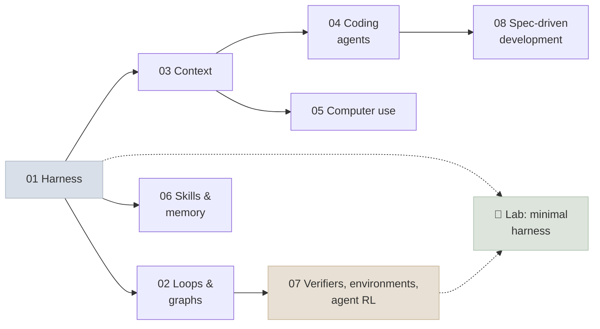

# 17 - Agent Engineering

Agent engineering is designing the system *around* the model: the harness it runs in, the loops and graphs that structure its work, the context it sees, the verifiers that decide whether it succeeded, the skills and memory that let it reuse know-how, and the specifications it works from. This module draws on the published practice of teams building coding and long-running agents, examines coding and computer-use agents as case studies, and ends with a lab where you build a harness and measure one of its components.

```objectives
scope: module
time: 8-10 hours (notes + lab)
outcomes:
  - Design an agent harness - state across context windows, verification in the harness, context management - and ablate it as models improve
  - Decide when to build a loop, when to split it into a graph, and what it must iterate against
  - Explain how coding and computer-use agents work, set a repository up for agents, and read the productivity evidence critically
  - Package procedures as SKILL.md skills and design memory policies
  - Build verifiers and environments that resist reward hacking, and relate them to agent RL
  - Run spec-driven development with review at the points that matter
prerequisites:
  - "[Agent Foundations](../12-Agent-Foundations/INDEX.mdx)"
  - "[Agent Frameworks](../15-Agent-Frameworks/INDEX.mdx)"
  - "[Production Agents](../16-Production-Agents/INDEX.mdx)"
```

## Where This Module Fits



## Chapter Map

| # | Chapter | You will learn | Time |
|---|---|---|---|
| 1 | [Harness Engineering](Notes/01-Harness-Engineering.mdx) | Agent = model + harness; state across context windows; verification in the harness; ablation | 50 min |
| 2 | [Loops and Graphs](Notes/02-Loops-and-Graphs.mdx) | When a loop pays off; the verifier as bottleneck; graph signals; the "dies halfway" test | 45 min |
| 3 | [Context Engineering for Agents](Notes/03-Context-Engineering-for-Agents.mdx) | Context rot; just-in-time context; clearing, compaction, offloading, notes, sub-agents | 45 min |
| 4 | [Coding Agents](Notes/04-Coding-Agents.mdx) | Anatomy, modes of use, agent-ready repositories, benchmark and productivity evidence | 45 min |
| 5 | [Computer-Use and Browser Agents](Notes/05-Computer-Use-and-Browser-Agents.mdx) | Perceive-act loop, API vs DOM vs pixels, environment safeguards, injection risk | 40 min |
| 6 | [Skills and Memory](Notes/06-Skills-and-Memory.mdx) | SKILL.md and progressive disclosure; where knowledge belongs; memory policies | 45 min |
| 7 | [Verifiers, Environments and Agent RL](Notes/07-Verifiers-Environments-and-Agent-RL.mdx) | Verifier types and rubrics; environments; RLVR for agents; reward hacking | 50 min |
| 8 | [Spec-Driven Development](Notes/08-Spec-Driven-Development.mdx) | Vibe coding vs vibe engineering; specify → plan → tasks; where humans review | 35 min |
| 9 | [Q&A Review Bank](Notes/09-Interview-QA-Bank.mdx) | 30 questions across the module | 45 min |

## Code Lab

| Lab | What you build | Runs on |
|---|---|---|
| [A Minimal Coding Harness](CodeLabs/01-Minimal-Harness.mdx) | A coding-agent harness with file/edit/shell tools on eight repository tasks graded by hidden tests; measures a verification stop hook | A local OpenAI-compatible model (laptop) or any hosted API |

## Mini-Project

Take one repository you work in and make it **agent-ready, with evidence**:

1. Write its `AGENTS.md` and one skill for a recurring procedure.
2. Build ten tasks from real past issues, each with hidden tests.
3. Run a coding agent (the lab harness or a product) on them before and after your changes, three trials each.
4. Report pass rate, claimed-but-failed rate and cost, and which change mattered - with the traces that show why.

## Review

- [Q&A Review Bank](Notes/09-Interview-QA-Bank.mdx) - consolidated questions for this module
- [Module quiz](/quiz/agent-engineering) - every *Check Yourself* question in this module, in course order

---

Previous: [16 - Production Agents](../16-Production-Agents/INDEX.mdx) · Next: [Knowledge Check](../Interview-Questions/INDEX.mdx)
